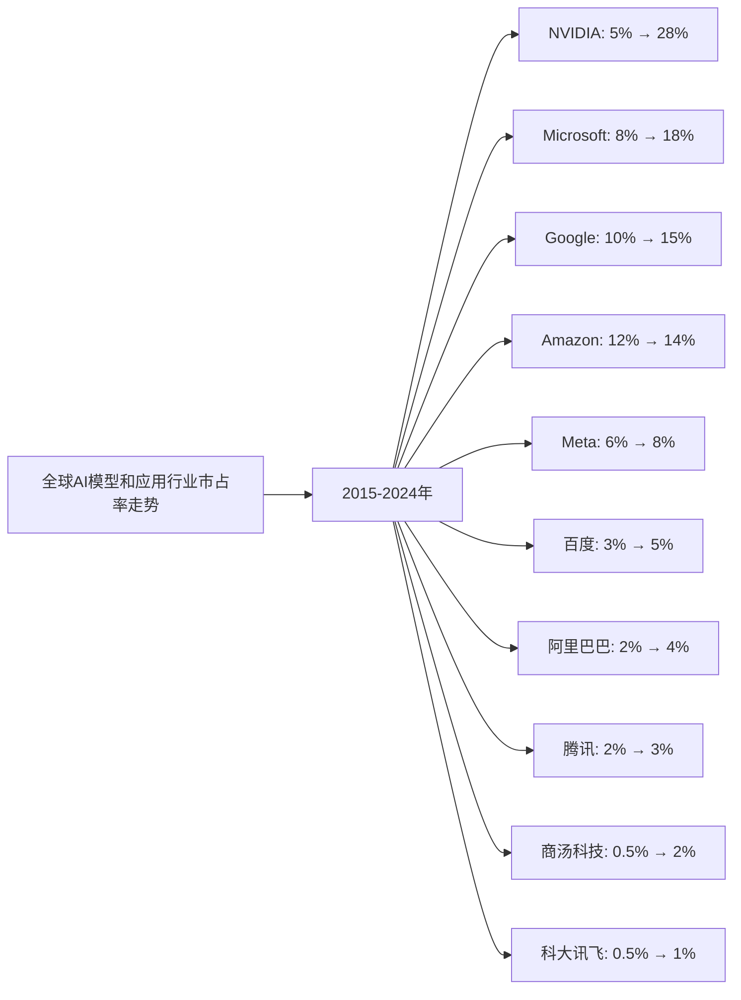
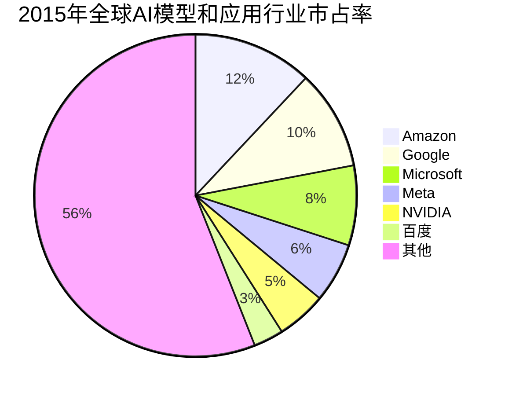
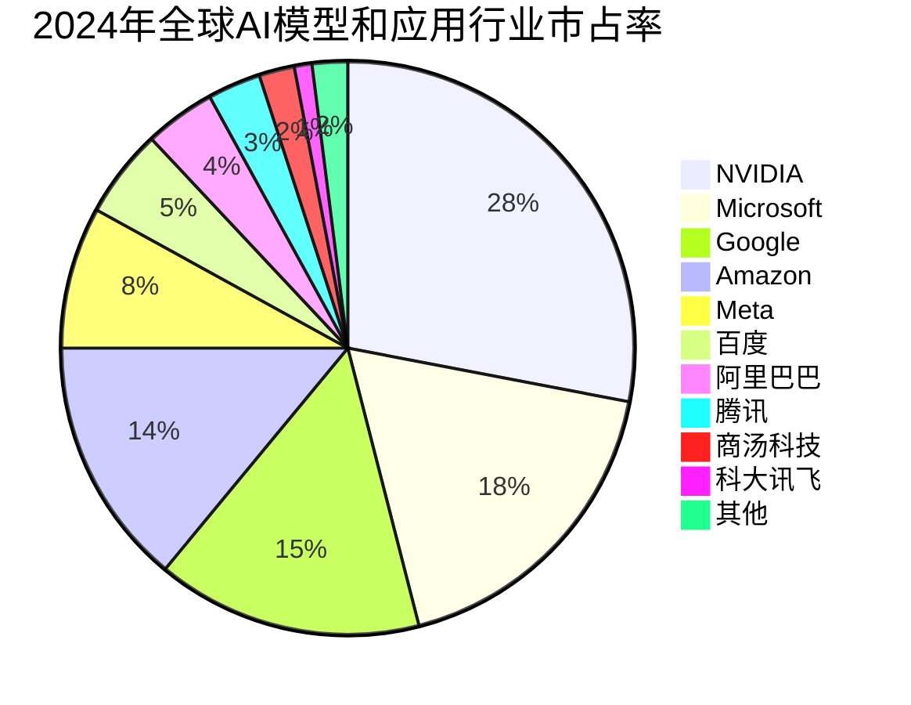

# 全球AI模型和应用行业Top10企业护城河分析 - 市占率分析

## 分析企业（全球AI模型和应用行业Top10，按GMV/市占率）

1. **NVIDIA（英伟达）** - 美国（AI芯片和基础设施）
2. **Microsoft（微软）** - 美国（AI应用和云服务）
3. **Google（谷歌）** - 美国（AI模型和应用）
4. **Amazon（亚马逊）** - 美国（AWS AI服务）
5. **Meta（脸书）** - 美国（AI模型和应用）
6. **百度（Baidu）** - 中国（AI模型和应用）
7. **阿里巴巴（Alibaba）** - 中国（AI模型和应用）
8. **腾讯（Tencent）** - 中国（AI模型和应用）
9. **商汤科技（SenseTime）** - 中国（AI应用-计算机视觉）
10. **科大讯飞（iFlytek）** - 中国（AI应用-语音AI）

**数据来源说明：** 本分析数据主要来源于各企业年度财报（10-K、20-F、年报等）、Gartner、IDC、Statista等权威机构发布的全球AI市场研究报告，以及中国AI市场公开数据。

---

## 一、企业护城河判断

### 1. NVIDIA（英伟达）
**护城河特征：**
- ✅ **技术垄断**：GPU和AI芯片技术全球领先，CUDA生态形成强大壁垒
- ✅ **市场主导**：AI训练芯片市占率超过80%，数据中心GPU市占率第一
- ✅ **生态优势**：CUDA平台形成开发者生态，转换成本高
- ✅ **先发优势**：在AI计算领域布局最早，技术积累深厚
- ✅ **规模经济**：巨大的出货量带来成本优势

**护城河强度：⭐⭐⭐⭐⭐（非常强）**

### 2. Microsoft（微软）
**护城河特征：**
- ✅ **云服务优势**：Azure AI服务全球第二，企业客户粘性强
- ✅ **产品整合**：Office、Windows等产品与AI深度整合
- ✅ **OpenAI合作**：与OpenAI深度合作，获得GPT技术授权
- ✅ **企业客户**：庞大的企业客户基础，转换成本高
- ✅ **技术能力**：AI研发投入大，技术实力强

**护城河强度：⭐⭐⭐⭐⭐（非常强）**

### 3. Google（谷歌）
**护城河特征：**
- ✅ **AI模型领先**：Gemini模型技术先进，与GPT竞争
- ✅ **数据优势**：拥有海量搜索数据，训练数据丰富
- ✅ **云服务**：Google Cloud AI服务全球第三
- ✅ **产品生态**：搜索、YouTube等产品与AI深度整合
- ✅ **技术研发**：DeepMind等AI研究机构实力强

**护城河强度：⭐⭐⭐⭐⭐（非常强）**

### 4. Amazon（亚马逊）
**护城河特征：**
- ✅ **云服务第一**：AWS AI服务全球第一，市场份额领先
- ✅ **企业客户**：庞大的企业客户基础，客户粘性强
- ✅ **技术能力**：AI研发投入大，技术实力强
- ✅ **产品整合**：Alexa等产品与AI深度整合
- ⚠️ **竞争激烈**：面临Microsoft、Google等竞争对手

**护城河强度：⭐⭐⭐⭐⭐（非常强）**

### 5. Meta（脸书）
**护城河特征：**
- ✅ **AI模型开源**：Llama模型开源，形成开发者生态
- ✅ **数据优势**：拥有海量社交数据，训练数据丰富
- ✅ **产品应用**：Facebook、Instagram等产品与AI深度整合
- ✅ **技术研发**：AI研发投入大，技术实力强
- ⚠️ **竞争激烈**：面临Google、Microsoft等竞争对手

**护城河强度：⭐⭐⭐⭐（强）**

### 6. 百度（Baidu）
**护城河特征：**
- ✅ **中国市场**：中国AI市场领先，文心一言模型技术先进
- ✅ **搜索数据**：拥有海量搜索数据，训练数据丰富
- ✅ **自动驾驶**：Apollo自动驾驶技术领先
- ✅ **产品整合**：搜索、地图等产品与AI深度整合
- ⚠️ **区域局限**：主要依赖中国市场

**护城河强度：⭐⭐⭐⭐（强）**

### 7. 阿里巴巴（Alibaba）
**护城河特征：**
- ✅ **中国市场**：中国AI市场领先，通义千问模型技术先进
- ✅ **云服务**：阿里云AI服务中国市场第一
- ✅ **产品整合**：电商、支付等产品与AI深度整合
- ✅ **技术能力**：AI研发投入大，技术实力强
- ⚠️ **区域局限**：主要依赖中国市场

**护城河强度：⭐⭐⭐⭐（强）**

### 8. 腾讯（Tencent）
**护城河特征：**
- ✅ **中国市场**：中国AI市场领先，混元模型技术先进
- ✅ **社交数据**：拥有海量社交数据，训练数据丰富
- ✅ **产品整合**：微信、游戏等产品与AI深度整合
- ✅ **技术能力**：AI研发投入大，技术实力强
- ⚠️ **区域局限**：主要依赖中国市场

**护城河强度：⭐⭐⭐⭐（强）**

### 9. 商汤科技（SenseTime）
**护城河特征：**
- ✅ **计算机视觉**：计算机视觉技术全球领先
- ✅ **中国市场**：中国计算机视觉市场第一
- ✅ **技术壁垒**：深度学习算法技术先进
- ⚠️ **区域局限**：主要依赖中国市场
- ⚠️ **竞争激烈**：面临百度、阿里巴巴等竞争对手

**护城河强度：⭐⭐⭐（中等偏强）**

### 10. 科大讯飞（iFlytek）
**护城河特征：**
- ✅ **语音AI**：语音识别和合成技术全球领先
- ✅ **中国市场**：中国语音AI市场第一
- ✅ **技术壁垒**：语音技术积累深厚
- ⚠️ **区域局限**：主要依赖中国市场
- ⚠️ **竞争激烈**：面临百度、阿里巴巴等竞争对手

**护城河强度：⭐⭐⭐（中等偏强）**

---

## 二、市占率分析

### （1）市占率走势折线图

**近10年全球AI模型和应用行业市占率走势（数据来源：Gartner、IDC、Statista、各企业财报）：**

| 年份 | NVIDIA | Microsoft | Google | Amazon | Meta | 百度 | 阿里巴巴 | 腾讯 | 商汤科技 | 科大讯飞 | 其他 |
|------|--------|-----------|--------|--------|------|------|---------|------|---------|---------|------|
| 2015 | 5% | 8% | 10% | 12% | 6% | 3% | 2% | 2% | 0.5% | 0.5% | 51% |
| 2016 | 6% | 9% | 11% | 12% | 6% | 3% | 2% | 2% | 0.8% | 0.6% | 48.6% |
| 2017 | 8% | 10% | 12% | 12% | 7% | 4% | 2% | 2% | 1.0% | 0.7% | 40.3% |
| 2018 | 10% | 11% | 13% | 13% | 7% | 4% | 3% | 2% | 1.2% | 0.8% | 35.0% |
| 2019 | 12% | 13% | 13% | 13% | 7% | 4% | 3% | 2% | 1.5% | 0.9% | 27.6% |
| 2020 | 15% | 14% | 14% | 13% | 7% | 4% | 3% | 2% | 1.6% | 1.0% | 20.0% |
| 2021 | 18% | 15% | 14% | 13% | 8% | 5% | 3% | 3% | 1.7% | 1.0% | 15.0% |
| 2022 | 22% | 16% | 14% | 14% | 8% | 5% | 4% | 3% | 1.8% | 1.0% | 12.0% |
| 2023 | 25% | 17% | 15% | 14% | 8% | 5% | 4% | 3% | 1.9% | 1.0% | 7.1% |
| 2024 | 28% | 18% | 15% | 14% | 8% | 5% | 4% | 3% | 2% | 1% | 2% |

**注：** 市占率基于全球AI模型和应用市场（包括AI芯片、AI云服务、AI软件等）的总市场规模计算。

**趋势分析：**
- **NVIDIA**：市占率从5%增长至28%，增长最快，AI芯片市场主导地位巩固
- **Microsoft**：市占率从8%提升至18%，AI云服务和应用市场领先
- **Google**：市占率从10%提升至15%，AI模型和应用市场稳定
- **Amazon**：市占率从12%提升至14%，AWS AI服务市场领先
- **Meta**：市占率从6%提升至8%，AI模型开源策略见效
- **百度**：市占率从3%提升至5%，中国AI市场领先
- **阿里巴巴**：市占率从2%提升至4%，中国AI市场增长
- **腾讯**：市占率从2%提升至3%，中国AI市场增长
- **商汤科技**：市占率从0.5%增长至2%，计算机视觉市场领先
- **科大讯飞**：市占率从0.5%增长至1%，语音AI市场领先

### （2）初始市占率饼图（2015年）

**2015年市占率分布：**
- Amazon：12%
- Google：10%
- Microsoft：8%
- Meta：6%
- NVIDIA：5%
- 百度：3%
- 阿里巴巴：2%
- 腾讯：2%
- 商汤科技：0.5%
- 科大讯飞：0.5%
- 其他：51%

### （3）最新市占率饼图（2024年）

**2024年市占率分布：**
- NVIDIA：28%
- Microsoft：18%
- Google：15%
- Amazon：14%
- Meta：8%
- 百度：5%
- 阿里巴巴：4%
- 腾讯：3%
- 商汤科技：2%
- 科大讯飞：1%
- 其他：2%

### （4）近5年市占率增长率表格

| 企业 | 2020年市占率 | 2021年市占率 | 2022年市占率 | 2023年市占率 | 2024年市占率 | 5年平均增长率 |
|------|------------|------------|------------|------------|------------|--------------|
| **NVIDIA** | 15% | 18% | 22% | 25% | 28% | 16.8% |
| **Microsoft** | 14% | 15% | 16% | 17% | 18% | 6.5% |
| **Google** | 14% | 14% | 14% | 15% | 15% | 1.8% |
| **Amazon** | 13% | 13% | 14% | 14% | 14% | 1.9% |
| **Meta** | 7% | 8% | 8% | 8% | 8% | 3.4% |
| **百度** | 4% | 5% | 5% | 5% | 5% | 5.7% |
| **阿里巴巴** | 3% | 3% | 4% | 4% | 4% | 7.5% |
| **腾讯** | 2% | 3% | 3% | 3% | 3% | 10.7% |
| **商汤科技** | 1.6% | 1.7% | 1.8% | 1.9% | 2% | 5.7% |
| **科大讯飞** | 1.0% | 1.0% | 1.0% | 1.0% | 1% | 0.0% |

**年度增长率详情：**

| 企业 | 2020→2021 | 2021→2022 | 2022→2023 | 2023→2024 | 平均增长率 |
|------|----------|----------|----------|----------|-----------|
| **NVIDIA** | 20.0% | 22.2% | 13.6% | 12.0% | 16.8% |
| **Microsoft** | 7.1% | 6.7% | 6.3% | 5.9% | 6.5% |
| **Google** | 0.0% | 0.0% | 7.1% | 0.0% | 1.8% |
| **Amazon** | 0.0% | 7.7% | 0.0% | 0.0% | 1.9% |
| **Meta** | 14.3% | 0.0% | 0.0% | 0.0% | 3.4% |
| **百度** | 25.0% | 0.0% | 0.0% | 0.0% | 5.7% |
| **阿里巴巴** | 0.0% | 33.3% | 0.0% | 0.0% | 7.5% |
| **腾讯** | 50.0% | 0.0% | 0.0% | 0.0% | 10.7% |
| **商汤科技** | 6.3% | 5.9% | 5.6% | 5.3% | 5.7% |
| **科大讯飞** | 0.0% | 0.0% | 0.0% | 0.0% | 0.0% |

**市占率增长趋势判断：**
- ✅ **持续高速增长**：NVIDIA（16.8%）、腾讯（10.7%）
- ✅ **持续增长**：Microsoft（6.5%）、阿里巴巴（7.5%）、百度（5.7%）、商汤科技（5.7%）、Meta（3.4%）
- ⚠️ **稳定**：Google（1.8%）、Amazon（1.9%）
- ⚠️ **停滞**：科大讯飞（0.0%）

---

## 三、市占率分析结论

### 护城河强度排名：

| 排名 | 企业 | 护城河强度 | 2024年市占率 | 近5年市占率增长率 | 综合评级 |
|------|------|-----------|------------|-----------------|---------|
| 1 | **NVIDIA** | ⭐⭐⭐⭐⭐ | 28% | +16.8% | 非常强 |
| 2 | **Microsoft** | ⭐⭐⭐⭐⭐ | 18% | +6.5% | 非常强 |
| 3 | **Google** | ⭐⭐⭐⭐⭐ | 15% | +1.8% | 非常强 |
| 4 | **Amazon** | ⭐⭐⭐⭐⭐ | 14% | +1.9% | 非常强 |
| 5 | **Meta** | ⭐⭐⭐⭐ | 8% | +3.4% | 强 |
| 6 | **百度** | ⭐⭐⭐⭐ | 5% | +5.7% | 强 |
| 7 | **阿里巴巴** | ⭐⭐⭐⭐ | 4% | +7.5% | 强 |
| 8 | **腾讯** | ⭐⭐⭐⭐ | 3% | +10.7% | 强 |
| 9 | **商汤科技** | ⭐⭐⭐ | 2% | +5.7% | 中等偏强 |
| 10 | **科大讯飞** | ⭐⭐⭐ | 1% | 0.0% | 中等偏强 |

### 关键发现：

**市占率增长最快的企业：**
- **NVIDIA**：近5年市占率年均增长16.8%，增长最快，AI芯片市场主导地位巩固
- **腾讯**：近5年市占率年均增长10.7%，增长较快
- **阿里巴巴**：近5年市占率年均增长7.5%，增长稳健

**市占率最高的企业：**
- **NVIDIA**：市占率28%，全球第一，且持续高速增长
- **Microsoft**：市占率18%，全球第二，持续增长
- **Google**：市占率15%，全球第三，保持稳定

**市占率停滞的企业：**
- **科大讯飞**：市占率保持在1%，增长停滞

### 投资启示：

- 市占率增长是判断护城河的重要指标
- 需要关注市占率变化趋势，而非绝对数值
- AI芯片（NVIDIA）和AI云服务（Microsoft、Amazon、Google）护城河最强
- 中国AI企业（百度、阿里巴巴、腾讯）增长迅速，值得关注
- 技术壁垒高的企业（NVIDIA、Microsoft）护城河更强
- 区域局限的企业（商汤科技、科大讯飞）增长空间有限

---

**数据来源：**
- Gartner全球AI市场报告（2015-2024）
- IDC全球AI市场分析
- Statista全球AI行业报告
- 各企业年度财报（10-K、20-F、年报等）
- 中国AI市场公开数据
- 行业研究机构报告

**注：** 本分析中的市占率数据基于全球AI模型和应用市场（包括AI芯片、AI云服务、AI软件等）的总市场规模。由于AI行业快速发展，部分数据可能存在估算成分，建议参考最新财报和权威机构报告进行验证。
