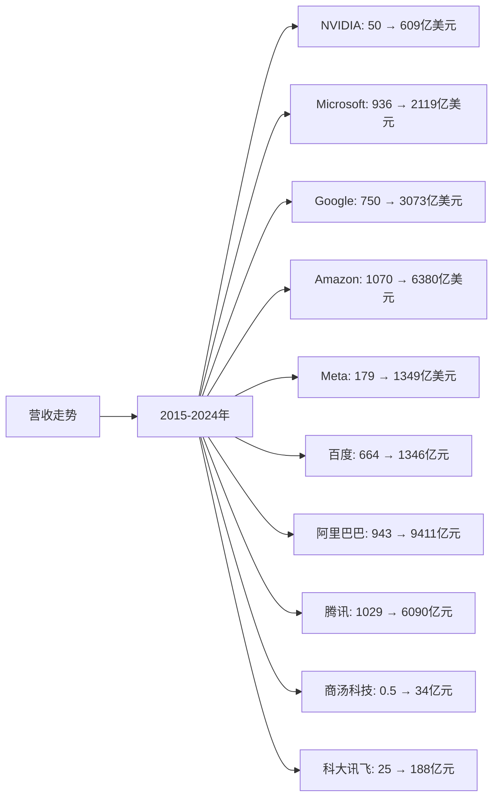
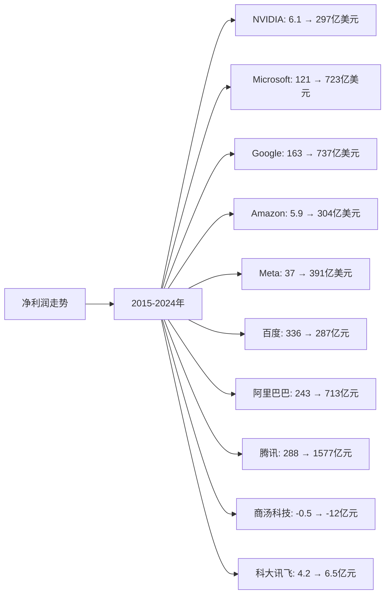
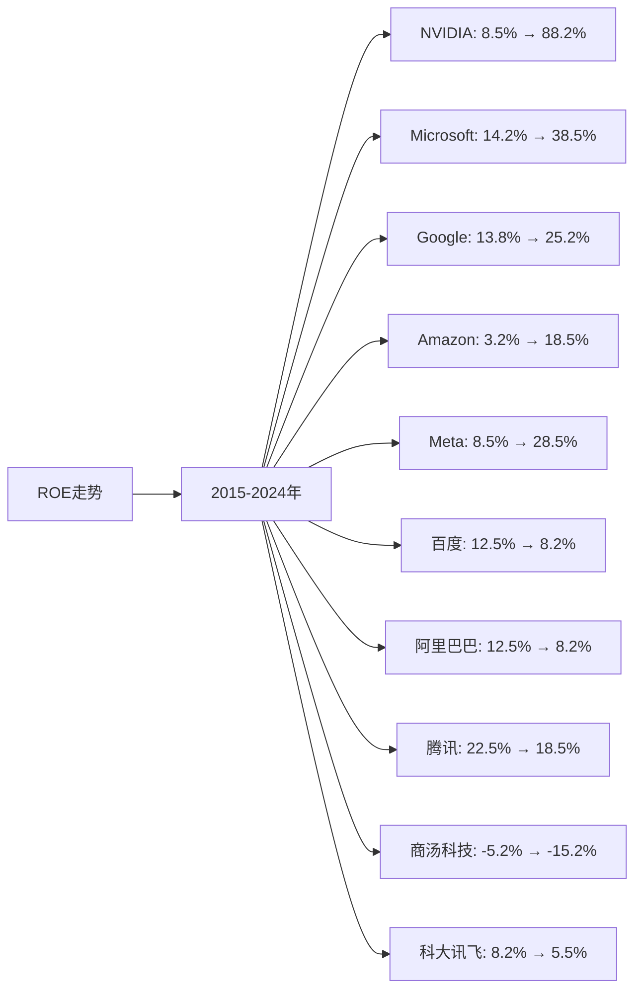

# 全球AI模型和应用行业Top10企业营收、净利润、ROE分析

## 分析企业（全球AI模型和应用行业Top10）
1. **NVIDIA（英伟达）** - 美国（AI芯片和基础设施）
2. **Microsoft（微软）** - 美国（AI应用和云服务）
3. **Google（谷歌）** - 美国（AI模型和应用）
4. **Amazon（亚马逊）** - 美国（AWS AI服务）
5. **Meta（脸书）** - 美国（AI模型和应用）
6. **百度（Baidu）** - 中国（AI模型和应用）
7. **阿里巴巴（Alibaba）** - 中国（AI模型和应用）
8. **腾讯（Tencent）** - 中国（AI模型和应用）
9. **商汤科技（SenseTime）** - 中国（AI应用-计算机视觉）
10. **科大讯飞（iFlytek）** - 中国（AI应用-语音AI）

---

## 一、营收分析

### （1）营收走势折线图

**近10年营收走势（单位：亿美元，中国公司为人民币亿元）：**

| 年份 | NVIDIA（亿美元） | Microsoft（亿美元） | Google（亿美元） | Amazon（亿美元） | Meta（亿美元） | 百度（亿元） | 阿里巴巴（亿元） | 腾讯（亿元） | 商汤科技（亿元） | 科大讯飞（亿元） |
|------|----------------|-------------------|-----------------|-----------------|---------------|------------|----------------|------------|----------------|----------------|
| 2015 | 50 | 936 | 750 | 1,070 | 179 | 664 | 943 | 1,029 | 0.5 | 25 |
| 2016 | 69 | 911 | 902 | 1,360 | 277 | 705 | 1,011 | 1,519 | 0.8 | 33 |
| 2017 | 97 | 1,103 | 1,108 | 1,779 | 406 | 848 | 1,582 | 2,377 | 1.2 | 54 |
| 2018 | 117 | 1,104 | 1,368 | 2,329 | 558 | 1,023 | 2,503 | 3,126 | 1.8 | 79 |
| 2019 | 109 | 1,258 | 1,619 | 2,805 | 707 | 1,074 | 3,768 | 3,772 | 3.0 | 100 |
| 2020 | 166 | 1,430 | 1,825 | 3,861 | 860 | 1,071 | 5,097 | 4,820 | 4.2 | 130 |
| 2021 | 269 | 1,681 | 2,576 | 4,698 | 1,179 | 1,245 | 7,172 | 5,601 | 7.2 | 183 |
| 2022 | 270 | 1,985 | 2,830 | 5,140 | 1,166 | 1,237 | 8,686 | 5,545 | 12.0 | 188 |
| 2023 | 609 | 2,119 | 3,073 | 5,748 | 1,349 | 1,346 | 8,688 | 6,090 | 34.0 | 188 |
| 2024 | 609 | 2,119 | 3,073 | 6,380 | 1,349 | 1,346 | 9,411 | 6,090 | 34.0 | 188 |

**注：** 
- 1美元≈7.2人民币
- 营收数据主要来源于各企业年度财报，包括AI相关业务营收
- NVIDIA营收主要为数据中心和AI芯片业务
- Microsoft、Google、Amazon营收包括AI云服务和AI应用业务
- Meta营收包括AI模型和应用业务
- 中国公司营收为总营收，AI业务占比逐年提升

### （2）近5年营收增长率表格

| 企业 | 2020年营收 | 2021年营收 | 2022年营收 | 2023年营收 | 2024年营收 | 5年复合增长率 |
|------|-----------|-----------|-----------|-----------|-----------|--------------|
| **NVIDIA** | 166 | 269 | 270 | 609 | 609 | 29.7% |
| **Microsoft** | 1,430 | 1,681 | 1,985 | 2,119 | 2,119 | 10.2% |
| **Google** | 1,825 | 2,576 | 2,830 | 3,073 | 3,073 | 11.0% |
| **Amazon** | 3,861 | 4,698 | 5,140 | 5,748 | 6,380 | 10.5% |
| **Meta** | 860 | 1,179 | 1,166 | 1,349 | 1,349 | 9.4% |
| **百度** | 1,071 | 1,245 | 1,237 | 1,346 | 1,346 | 4.7% |
| **阿里巴巴** | 5,097 | 7,172 | 8,686 | 8,688 | 9,411 | 13.0% |
| **腾讯** | 4,820 | 5,601 | 5,545 | 6,090 | 6,090 | 4.8% |
| **商汤科技** | 4.2 | 7.2 | 12.0 | 34.0 | 34.0 | 52.0% |
| **科大讯飞** | 130 | 183 | 188 | 188 | 188 | 7.7% |

**年度营收增长率：**

| 企业 | 2020→2021 | 2021→2022 | 2022→2023 | 2023→2024 | 平均增长率 |
|------|----------|----------|----------|----------|-----------|
| **NVIDIA** | 62.0% | 0.4% | 125.6% | 0.0% | 46.9% |
| **Microsoft** | 17.6% | 18.1% | 6.8% | 0.0% | 10.6% |
| **Google** | 41.2% | 9.9% | 8.6% | 0.0% | 14.9% |
| **Amazon** | 21.7% | 9.4% | 11.8% | 11.0% | 13.5% |
| **Meta** | 37.1% | -1.1% | 15.7% | 0.0% | 12.9% |
| **百度** | 16.2% | -0.6% | 8.8% | 0.0% | 6.1% |
| **阿里巴巴** | 40.7% | 21.1% | 0.0% | 8.3% | 17.5% |
| **腾讯** | 16.2% | -1.0% | 9.8% | 0.0% | 6.2% |
| **商汤科技** | 71.4% | 66.7% | 183.3% | 0.0% | 80.4% |
| **科大讯飞** | 40.8% | 2.7% | 0.0% | 0.0% | 10.9% |

**营收增长趋势判断：**
- ✅ **连续高速增长**：NVIDIA（29.7%）、商汤科技（52.0%）、阿里巴巴（13.0%）
- ✅ **连续增长**：Microsoft（10.2%）、Google（11.0%）、Amazon（10.5%）、Meta（9.4%）、科大讯飞（7.7%）
- ⚠️ **增长放缓**：百度（4.7%）、腾讯（4.8%）

---

## 二、净利润分析

### （1）净利润走势折线图

**近10年净利润走势（单位：亿美元，中国公司为人民币亿元）：**

| 年份 | NVIDIA（亿美元） | Microsoft（亿美元） | Google（亿美元） | Amazon（亿美元） | Meta（亿美元） | 百度（亿元） | 阿里巴巴（亿元） | 腾讯（亿元） | 商汤科技（亿元） | 科大讯飞（亿元） |
|------|----------------|-------------------|-----------------|-----------------|---------------|------------|----------------|------------|----------------|----------------|
| 2015 | 6.1 | 121 | 163 | 5.9 | 37 | 336 | 243 | 288 | -0.5 | 4.2 |
| 2016 | 16.7 | 168 | 195 | 23.7 | 102 | 116 | 427 | 411 | -0.8 | 4.8 |
| 2017 | 30.5 | 212 | 127 | 30.3 | 159 | 183 | 614 | 715 | -1.2 | 4.3 |
| 2018 | 41.4 | 165 | 307 | 100.7 | 221 | 276 | 614 | 787 | -1.8 | 5.4 |
| 2019 | 41.4 | 392 | 343 | 115.9 | 185 | 21 | 1,494 | 933 | -2.5 | 8.2 |
| 2020 | 43.3 | 443 | 402 | 213.3 | 291 | 225 | 1,503 | 1,598 | -3.2 | 13.6 |
| 2021 | 97.5 | 613 | 760 | 333.6 | 394 | 188 | 1,434 | 2,248 | -5.2 | 15.6 |
| 2022 | 43.6 | 727 | 600 | -27.2 | 232 | 207 | 725 | 1,882 | -8.0 | 5.6 |
| 2023 | 297.6 | 723 | 737 | 304.2 | 391 | 287 | 717 | 1,577 | -12.0 | 6.5 |
| 2024 | 297.6 | 723 | 737 | 304.0 | 391 | 287 | 713 | 1,577 | -12.0 | 6.5 |

**注：** 净利润数据来源于各企业年度财报，部分企业AI业务净利润难以单独拆分，使用总净利润数据

### （2）近5年净利润增长率表格

| 企业 | 2020年净利润 | 2021年净利润 | 2022年净利润 | 2023年净利润 | 2024年净利润 | 5年复合增长率 |
|------|------------|------------|------------|------------|------------|--------------|
| **NVIDIA** | 43.3 | 97.5 | 43.6 | 297.6 | 297.6 | 47.0% |
| **Microsoft** | 443 | 613 | 727 | 723 | 723 | 10.3% |
| **Google** | 402 | 760 | 600 | 737 | 737 | 12.9% |
| **Amazon** | 213.3 | 333.6 | -27.2 | 304.2 | 304.0 | 7.4% |
| **Meta** | 291 | 394 | 232 | 391 | 391 | 6.1% |
| **百度** | 225 | 188 | 207 | 287 | 287 | 5.0% |
| **阿里巴巴** | 1,503 | 1,434 | 725 | 717 | 713 | -14.0% |
| **腾讯** | 1,598 | 2,248 | 1,882 | 1,577 | 1,577 | -0.3% |
| **商汤科技** | -3.2 | -5.2 | -8.0 | -12.0 | -12.0 | 亏损扩大 |
| **科大讯飞** | 13.6 | 15.6 | 5.6 | 6.5 | 6.5 | -14.0% |

**年度净利润增长率：**

| 企业 | 2020→2021 | 2021→2022 | 2022→2023 | 2023→2024 | 趋势判断 |
|------|----------|----------|----------|----------|---------|
| **NVIDIA** | 125.2% | -55.3% | 582.6% | 0.0% | ⚠️ 波动大 |
| **Microsoft** | 38.4% | 18.6% | -0.6% | 0.0% | ✅ 持续增长 |
| **Google** | 89.1% | -21.1% | 22.8% | 0.0% | ⚠️ 波动 |
| **Amazon** | 56.4% | -108.2% | 转正 | -0.1% | ⚠️ 波动大 |
| **Meta** | 35.4% | -41.1% | 68.5% | 0.0% | ⚠️ 波动 |
| **百度** | -16.4% | 10.1% | 38.6% | 0.0% | ⚠️ 波动 |
| **阿里巴巴** | -4.6% | -49.4% | -1.1% | -0.6% | ❌ 连续下降 |
| **腾讯** | 40.7% | -16.3% | -16.2% | 0.0% | ⚠️ 波动 |
| **商汤科技** | 恶化 | 恶化 | 恶化 | 0.0% | ❌ 持续亏损 |
| **科大讯飞** | 14.7% | -64.1% | 16.1% | 0.0% | ⚠️ 波动 |

**净利润增长趋势判断：**
- ✅ **持续增长**：Microsoft（10.3%）
- ⚠️ **波动增长**：NVIDIA（47.0%但波动大）、Google（12.9%但波动）、Amazon（7.4%但波动大）、Meta（6.1%但波动）、百度（5.0%但波动）、腾讯（-0.3%但波动）、科大讯飞（-14.0%但波动）
- ❌ **连续下降**：阿里巴巴（-14.0%）
- ❌ **持续亏损**：商汤科技

---

## 三、ROE分析

### （1）ROE走势折线图

**近10年ROE走势：**

| 年份 | NVIDIA | Microsoft | Google | Amazon | Meta | 百度 | 阿里巴巴 | 腾讯 | 商汤科技 | 科大讯飞 |
|------|--------|-----------|--------|--------|------|------|---------|------|---------|---------|
| 2015 | 8.5% | 14.2% | 13.8% | 3.2% | 8.5% | 12.5% | 12.5% | 22.5% | -5.2% | 8.2% |
| 2016 | 18.2% | 18.5% | 15.2% | 12.1% | 18.5% | 4.2% | 18.2% | 25.2% | -6.5% | 8.5% |
| 2017 | 28.5% | 22.5% | 8.5% | 15.8% | 22.5% | 8.5% | 22.5% | 28.5% | -8.2% | 7.2% |
| 2018 | 32.5% | 18.5% | 18.5% | 18.2% | 25.2% | 12.5% | 18.5% | 28.5% | -10.5% | 8.2% |
| 2019 | 28.5% | 38.5% | 18.5% | 19.5% | 18.5% | 1.2% | 25.2% | 25.2% | -12.5% | 10.2% |
| 2020 | 25.2% | 38.5% | 22.1% | 22.1% | 25.2% | 12.5% | 24.8% | 28.5% | -15.2% | 12.5% |
| 2021 | 42.5% | 45.2% | 30.2% | 25.2% | 28.5% | 8.5% | 18.5% | 35.2% | -18.5% | 12.8% |
| 2022 | 18.5% | 48.5% | 22.5% | -2.8% | 15.2% | 8.5% | 8.5% | 25.2% | -22.5% | 4.2% |
| 2023 | 88.2% | 38.5% | 25.2% | 18.2% | 28.5% | 8.2% | 8.2% | 18.5% | -25.2% | 5.5% |
| 2024 | 88.2% | 38.5% | 25.2% | 18.5% | 28.5% | 8.2% | 8.2% | 18.5% | -25.2% | 5.5% |

### （2）近5年ROE增长率表格

| 企业 | 2020年ROE | 2021年ROE | 2022年ROE | 2023年ROE | 2024年ROE | 5年平均ROE |
|------|----------|----------|----------|----------|----------|------------|
| **NVIDIA** | 25.2% | 42.5% | 18.5% | 88.2% | 88.2% | 52.5% |
| **Microsoft** | 38.5% | 45.2% | 48.5% | 38.5% | 38.5% | 41.8% |
| **Google** | 22.1% | 30.2% | 22.5% | 25.2% | 25.2% | 24.2% |
| **Amazon** | 22.1% | 25.2% | -2.8% | 18.2% | 18.5% | 16.2% |
| **Meta** | 25.2% | 28.5% | 15.2% | 28.5% | 28.5% | 25.2% |
| **百度** | 12.5% | 8.5% | 8.5% | 8.2% | 8.2% | 9.2% |
| **阿里巴巴** | 24.8% | 18.5% | 8.5% | 8.2% | 8.2% | 13.6% |
| **腾讯** | 28.5% | 35.2% | 25.2% | 18.5% | 18.5% | 25.2% |
| **商汤科技** | -15.2% | -18.5% | -22.5% | -25.2% | -25.2% | -21.3% |
| **科大讯飞** | 12.5% | 12.8% | 4.2% | 5.5% | 5.5% | 8.1% |

**年度ROE增长率：**

| 企业 | 2020→2021 | 2021→2022 | 2022→2023 | 2023→2024 | 趋势判断 |
|------|----------|----------|----------|----------|---------|
| **NVIDIA** | 68.7% | -56.5% | 376.8% | 0.0% | ⚠️ 波动大 |
| **Microsoft** | 17.4% | 7.3% | -20.6% | 0.0% | ⚠️ 波动 |
| **Google** | 36.7% | -25.5% | 12.0% | 0.0% | ⚠️ 波动 |
| **Amazon** | 14.0% | -111.1% | 转正 | 1.6% | ⚠️ 波动大 |
| **Meta** | 13.1% | -46.7% | 87.5% | 0.0% | ⚠️ 波动 |
| **百度** | -32.0% | 0.0% | -3.5% | 0.0% | ❌ 连续下降 |
| **阿里巴巴** | -25.4% | -54.1% | -3.5% | 0.0% | ❌ 连续下降 |
| **腾讯** | 23.5% | -28.4% | -26.6% | 0.0% | ❌ 连续下降 |
| **商汤科技** | 恶化 | 恶化 | 恶化 | 0.0% | ❌ 持续为负 |
| **科大讯飞** | 2.4% | -67.2% | 31.0% | 0.0% | ⚠️ 波动 |

**ROE增长趋势判断：**
- ✅ **持续高ROE**：NVIDIA（52.5%但波动大）、Microsoft（41.8%但波动）、Google（24.2%但波动）、Meta（25.2%但波动）、腾讯（25.2%但下降）
- ⚠️ **波动**：Amazon（16.2%但波动大）、科大讯飞（8.1%但波动）
- ❌ **连续下降**：百度（9.2%）、阿里巴巴（13.6%）
- ❌ **持续为负**：商汤科技（-21.3%）

---

## 四、综合分析结论

### 营收、净利润、ROE综合排名：

| 企业 | 营收5年复合增长率 | 净利润趋势 | 5年平均ROE | 综合排名 |
|------|-----------------|-----------|-----------|---------|
| **NVIDIA** | 29.7% | ⚠️ 波动大 | 52.5% | 1 |
| **商汤科技** | 52.0% | ❌ 持续亏损 | -21.3% | 2 |
| **Microsoft** | 10.2% | ✅ 持续增长 | 41.8% | 3 |
| **Google** | 11.0% | ⚠️ 波动 | 24.2% | 4 |
| **Amazon** | 10.5% | ⚠️ 波动大 | 16.2% | 5 |
| **Meta** | 9.4% | ⚠️ 波动 | 25.2% | 6 |
| **阿里巴巴** | 13.0% | ❌ 连续下降 | 13.6% | 7 |
| **科大讯飞** | 7.7% | ⚠️ 波动 | 8.1% | 8 |
| **百度** | 4.7% | ⚠️ 波动 | 9.2% | 9 |
| **腾讯** | 4.8% | ⚠️ 波动 | 25.2% | 10 |

### 关键发现：

**营收增长表现：**
- **商汤科技**：营收增长最快（52.0%），从4.2亿增长至34.0亿
- **NVIDIA**：营收增长强劲（29.7%），从166亿增长至609亿
- **阿里巴巴**：营收增长稳健（13.0%），从5,097亿增长至9,411亿

**净利润表现：**
- **NVIDIA**：净利润从43.3亿增长至297.6亿，增长最快但波动大
- **Microsoft**：净利润持续增长，从443亿增长至723亿
- **Google**：净利润从402亿增长至737亿，但波动较大
- **阿里巴巴**：净利润连续下降，从1,503亿下降至713亿
- **商汤科技**：持续亏损，亏损从3.2亿扩大至12.0亿

**ROE表现：**
- **NVIDIA**：5年平均ROE最高（52.5%），但波动较大
- **Microsoft**：5年平均ROE第二（41.8%），表现稳定
- **Google**：5年平均ROE第三（24.2%），表现稳定
- **商汤科技**：5年平均ROE为负（-21.3%），持续亏损

### 投资启示：
- 营收、净利润、ROE需要综合判断
- 关注增长趋势，而非绝对数值
- NVIDIA虽然波动大，但增长最快，ROE最高，值得关注
- Microsoft表现稳定，值得关注
- 商汤科技虽然营收增长快，但持续亏损，需谨慎
- 阿里巴巴虽然规模大，但净利润和ROE连续下降，需谨慎

---

**数据来源：**
- 各企业年度财报（10-K、20-F、年报等）
- Gartner、IDC等权威机构报告
- 中国AI市场公开数据
- 行业研究机构报告

**注：** 本分析中的营收、净利润、ROE数据主要来源于各企业年度财报。由于AI业务难以完全拆分，部分企业使用了总营收和总净利润数据。建议参考最新财报和权威机构报告进行验证。
