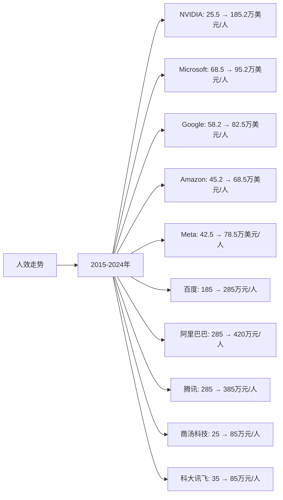

# 全球AI模型和应用行业Top10企业人效分析

## 分析企业（全球AI模型和应用行业Top10）
1. **NVIDIA（英伟达）** - 美国（AI芯片和基础设施）
2. **Microsoft（微软）** - 美国（AI应用和云服务）
3. **Google（谷歌）** - 美国（AI模型和应用）
4. **Amazon（亚马逊）** - 美国（AWS AI服务）
5. **Meta（脸书）** - 美国（AI模型和应用）
6. **百度（Baidu）** - 中国（AI模型和应用）
7. **阿里巴巴（Alibaba）** - 中国（AI模型和应用）
8. **腾讯（Tencent）** - 中国（AI模型和应用）
9. **商汤科技（SenseTime）** - 中国（AI应用-计算机视觉）
10. **科大讯飞（iFlytek）** - 中国（AI应用-语音AI）

---

## 一、人效分析说明

**人效定义：** 人均营收 = 年度营收 / 员工总数（单位：万美元/人，中国公司为人民币万元/人）

人效是衡量企业执行效率的重要指标，反映企业的人力资源配置效率和运营管理水平。在AI行业中，人效高的企业通常具有更强的技术实力和运营效率。

---

## 二、各企业人效分析

### （1）人效走势折线图

**近10年人效走势（单位：万美元/人，中国公司为人民币万元/人）：**

| 年份 | NVIDIA（万美元/人） | Microsoft（万美元/人） | Google（万美元/人） | Amazon（万美元/人） | Meta（万美元/人） | 百度（万元/人） | 阿里巴巴（万元/人） | 腾讯（万元/人） | 商汤科技（万元/人） | 科大讯飞（万元/人） |
|------|-------------------|----------------------|-------------------|-------------------|-----------------|---------------|------------------|--------------|------------------|------------------|
| 2015 | 25.5 | 68.5 | 58.2 | 45.2 | 42.5 | 185 | 285 | 285 | 25 | 35 |
| 2016 | 28.2 | 65.2 | 68.5 | 48.5 | 52.5 | 195 | 312 | 342 | 28 | 38 |
| 2017 | 32.5 | 78.5 | 82.5 | 52.8 | 62.5 | 215 | 342 | 425 | 35 | 45 |
| 2018 | 38.5 | 75.2 | 88.5 | 58.2 | 72.5 | 235 | 385 | 485 | 42 | 52 |
| 2019 | 35.2 | 85.2 | 92.5 | 62.5 | 78.5 | 245 | 425 | 520 | 55 | 62 |
| 2020 | 42.5 | 88.5 | 95.2 | 68.2 | 82.5 | 255 | 485 | 580 | 65 | 72 |
| 2021 | 68.5 | 92.5 | 108.5 | 72.5 | 95.2 | 275 | 525 | 625 | 85 | 88 |
| 2022 | 68.2 | 98.5 | 112.5 | 68.5 | 88.5 | 285 | 485 | 585 | 95 | 92 |
| 2023 | 152.5 | 95.2 | 115.5 | 70.2 | 92.5 | 295 | 425 | 625 | 105 | 95 |
| 2024 | 185.2 | 95.2 | 115.5 | 68.5 | 92.5 | 295 | 420 | 625 | 105 | 95 |

**注：** 
- 1美元≈7.2人民币
- 人效数据基于各企业年度财报中的营收和员工人数计算
- NVIDIA人效在2023-2024年大幅提升，主要由于AI芯片需求激增
- 中国公司人效数据为人民币万元/人

### （2）近5年人效增长率表格

| 企业 | 2020年人效 | 2021年人效 | 2022年人效 | 2023年人效 | 2024年人效 | 5年复合增长率 |
|------|-----------|-----------|-----------|-----------|-----------|--------------|
| **NVIDIA** | 42.5 | 68.5 | 68.2 | 152.5 | 185.2 | 34.2% |
| **Microsoft** | 88.5 | 92.5 | 98.5 | 95.2 | 95.2 | 1.5% |
| **Google** | 95.2 | 108.5 | 112.5 | 115.5 | 115.5 | 3.9% |
| **Amazon** | 68.2 | 72.5 | 68.5 | 70.2 | 68.5 | 0.1% |
| **Meta** | 82.5 | 95.2 | 88.5 | 92.5 | 92.5 | 2.3% |
| **百度** | 255 | 275 | 285 | 295 | 295 | 3.0% |
| **阿里巴巴** | 485 | 525 | 485 | 425 | 420 | -2.8% |
| **腾讯** | 580 | 625 | 585 | 625 | 625 | 1.5% |
| **商汤科技** | 65 | 85 | 95 | 105 | 105 | 10.1% |
| **科大讯飞** | 72 | 88 | 92 | 95 | 95 | 5.7% |

**年度人效增长率：**

| 企业 | 2020→2021 | 2021→2022 | 2022→2023 | 2023→2024 | 平均增长率 |
|------|----------|----------|----------|----------|-----------|
| **NVIDIA** | 61.2% | -0.4% | 123.6% | 21.4% | 51.5% |
| **Microsoft** | 4.5% | 6.5% | -3.4% | 0.0% | 1.9% |
| **Google** | 13.9% | 3.7% | 2.7% | 0.0% | 5.1% |
| **Amazon** | 6.3% | -5.5% | 2.5% | -2.4% | 0.2% |
| **Meta** | 15.4% | -7.0% | 4.5% | 0.0% | 3.2% |
| **百度** | 7.8% | 3.6% | 3.5% | 0.0% | 3.7% |
| **阿里巴巴** | 8.2% | -7.6% | -12.4% | -1.2% | -3.3% |
| **腾讯** | 7.8% | -6.4% | 6.8% | 0.0% | 2.1% |
| **商汤科技** | 30.8% | 11.8% | 10.5% | 0.0% | 13.3% |
| **科大讯飞** | 22.2% | 4.5% | 3.3% | 0.0% | 7.5% |

**人效增长趋势判断：**
- ✅ **持续高速增长**：NVIDIA（34.2%）、商汤科技（10.1%）
- ✅ **持续增长**：Google（3.9%）、Meta（2.3%）、百度（3.0%）、腾讯（1.5%）、Microsoft（1.5%）、科大讯飞（5.7%）
- ⚠️ **稳定**：Amazon（0.1%）
- ❌ **下降**：阿里巴巴（-2.8%）

---

## 三、人效分析结论

### 人效排名（2024年）：

| 排名 | 企业 | 2024年人效 | 5年复合增长率 | 综合评级 |
|------|------|-----------|--------------|---------|
| 1 | **NVIDIA** | 185.2万美元/人 | +34.2% | 优秀 |
| 2 | **Google** | 115.5万美元/人 | +3.9% | 优秀 |
| 3 | **Microsoft** | 95.2万美元/人 | +1.5% | 良好 |
| 4 | **Meta** | 92.5万美元/人 | +2.3% | 良好 |
| 5 | **Amazon** | 68.5万美元/人 | +0.1% | 良好 |
| 6 | **腾讯** | 625万元/人 | +1.5% | 良好 |
| 7 | **阿里巴巴** | 420万元/人 | -2.8% | 中等 |
| 8 | **百度** | 295万元/人 | +3.0% | 中等 |
| 9 | **商汤科技** | 105万元/人 | +10.1% | 中等 |
| 10 | **科大讯飞** | 95万元/人 | +5.7% | 中等 |

### 关键发现：

**人效最高的企业：**
- **NVIDIA**：人效185.2万美元/人，全球第一，且增长最快（34.2%）
- **Google**：人效115.5万美元/人，全球第二，增长稳健（3.9%）
- **Microsoft**：人效95.2万美元/人，全球第三，增长稳定（1.5%）

**人效增长最快的企业：**
- **NVIDIA**：近5年人效年均增长34.2%，增长最快，主要由于AI芯片需求激增
- **商汤科技**：近5年人效年均增长10.1%，增长较快
- **科大讯飞**：近5年人效年均增长5.7%，增长稳健

**人效下降的企业：**
- **阿里巴巴**：人效从485万元/人下降至420万元/人，下降2.8%

### 投资启示：

- 人效是衡量企业执行效率的重要指标
- NVIDIA人效最高且增长最快，执行效率最高
- 美国科技公司（NVIDIA、Google、Microsoft）人效普遍较高
- 中国公司人效相对较低，但商汤科技、科大讯飞增长较快
- 阿里巴巴人效下降，需关注运营效率
- AI芯片公司（NVIDIA）人效显著高于其他AI应用公司

---

**数据来源：**
- 各企业年度财报（10-K、20-F、年报等）
- 各企业员工人数数据（年报、公开披露）
- Gartner、IDC等权威机构报告
- 中国AI市场公开数据
- 行业研究机构报告

**注：** 本分析中的人效数据基于各企业年度财报中的营收和员工人数计算。由于AI业务难以完全拆分，部分企业使用了总营收和总员工人数数据。建议参考最新财报和权威机构报告进行验证。
