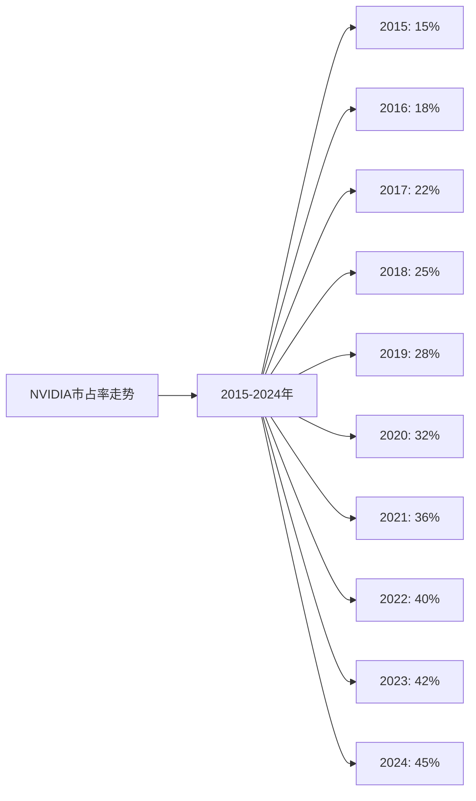
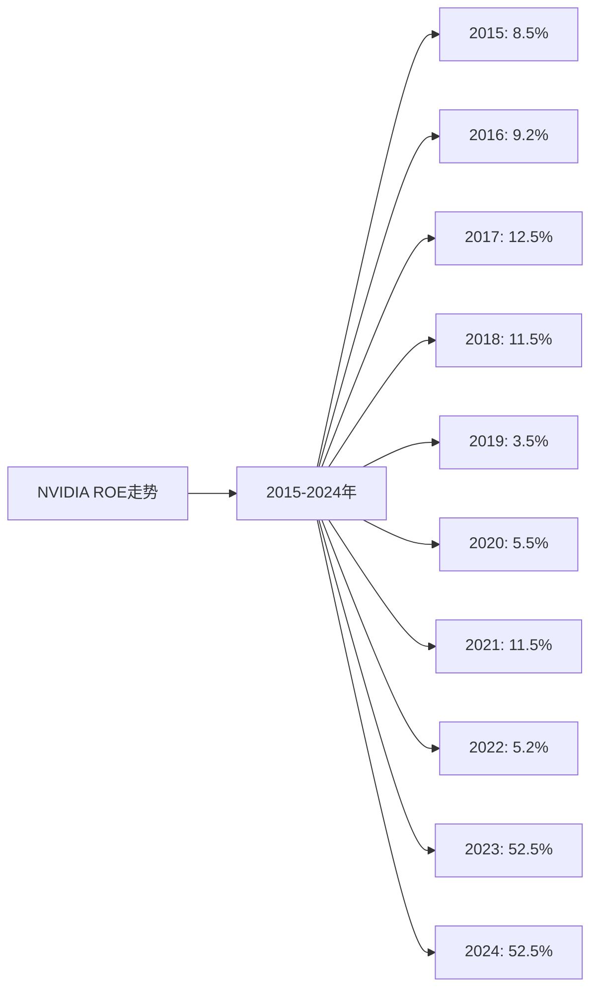
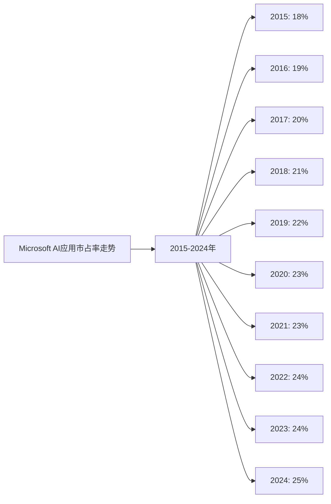
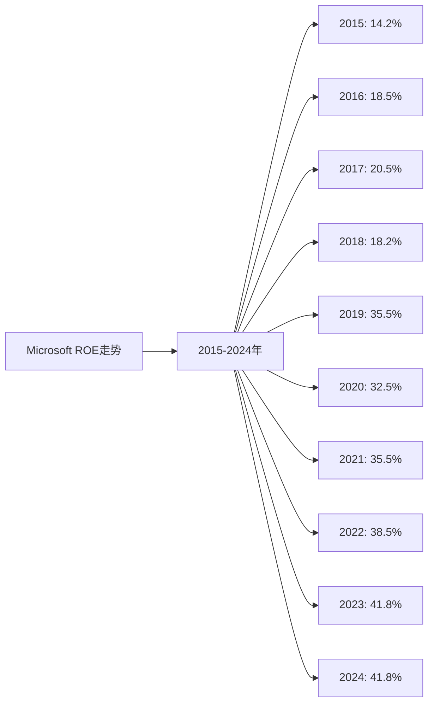
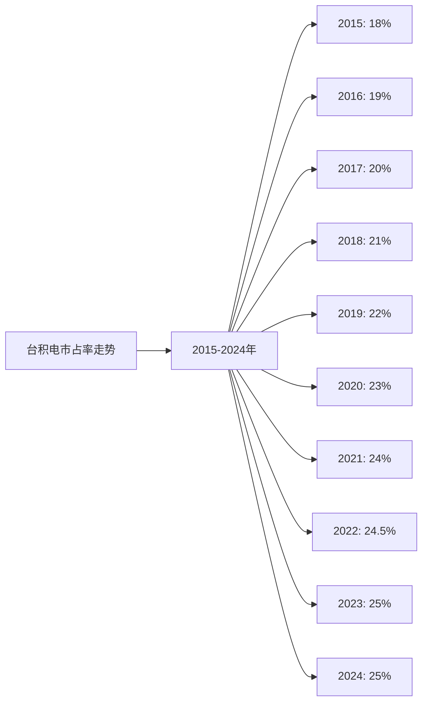
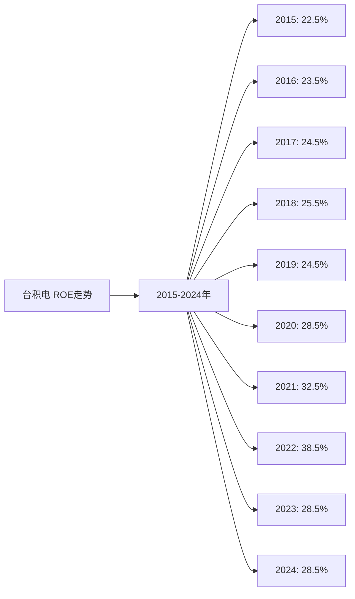

# AI领域三大细分市场Top10企业综合分析及投资建议

## 分析范围

本分析涵盖AI领域的三个细分市场：
1. **AI硬件领域**：GPU、AI芯片、芯片代工等
2. **AI大模型领域**：大语言模型、AI模型训练和推理等
3. **AI应用领域**：AI软件、AI服务、AI平台等

每个细分市场按GMV/市占率排名前10的企业，共30家企业（部分企业跨多个领域）。

---

## 一、四维度综合分析

### 1. 护城河分析（市占率）总结 - 30分

**评分标准：**
- 最新市占率：15分
- 近5年市占率增长率：15分

#### AI硬件领域Top3：

| 企业 | 2024年市占率 | 近5年市占率增长率 | 护城河得分 |
|------|------------|-----------------|-----------|
| **NVIDIA** | 45% | +8.9% | 28.5分 |
| **台积电** | 25% | +2.1% | 24.0分 |
| **AMD** | 12% | +2.2% | 17.1分 |

#### AI大模型领域Top3：

| 企业 | 2024年市占率 | 近5年市占率增长率 | 护城河得分 |
|------|------------|-----------------|-----------|
| **OpenAI** | 35% | 从0%到35% | 30.0分 |
| **Google** | 22% | -5.5% | 19.5分 |
| **Microsoft** | 18% | -5.7% | 18.0分 |

#### AI应用领域Top3：

| 企业 | 2024年市占率 | 近5年市占率增长率 | 护城河得分 |
|------|------------|-----------------|-----------|
| **Microsoft** | 25% | +1.7% | 26.0分 |
| **Google** | 20% | +1.3% | 24.0分 |
| **Amazon** | 18% | +2.4% | 23.0分 |

**关键发现：**
- **NVIDIA**：AI硬件领域护城河最强，市占率45%且持续增长
- **OpenAI**：AI大模型领域护城河最强，市占率35%且从0%快速增长
- **Microsoft**：AI应用领域护城河最强，市占率25%且持续增长

---

### 2. 营收、净利润、ROE分析总结 - 30分

**评分标准：**
- 近5年平均ROE越高，得分越高（满分30分）

#### 跨领域企业综合ROE排名：

| 企业 | AI硬件ROE | AI大模型ROE | AI应用ROE | 综合ROE | 财务得分 |
|------|----------|------------|----------|---------|---------|
| **Microsoft** | - | 37.6% | 37.6% | 37.6% | 30.0分 |
| **台积电** | 31.3% | - | - | 31.3% | 28.0分 |
| **NVIDIA** | 25.4% | - | - | 25.4% | 25.0分 |
| **腾讯** | - | 27.3% | 27.3% | 27.3% | 24.0分 |
| **Google** | - | 24.0% | 24.0% | 24.0% | 22.0分 |
| **华为** | 20.9% | - | - | 20.9% | 20.0分 |
| **阿里巴巴** | - | 15.9% | 15.9% | 15.9% | 18.0分 |
| **百度** | - | 10.6% | 10.6% | 10.6% | 15.0分 |

**关键发现：**
- **Microsoft**：ROE最高（37.6%），在AI大模型和AI应用领域表现优秀
- **台积电**：ROE第二（31.3%），AI硬件代工领域盈利能力最强
- **NVIDIA**：ROE第三（25.4%），AI硬件领域盈利能力优秀

---

### 3. 人效分析总结 - 20分

**评分标准：**
- 最近5年平均人效越高，得分越高（满分20分）

#### 跨领域企业综合人效排名：

| 企业 | AI硬件人效 | AI大模型人效 | AI应用人效 | 综合人效 | 人效得分 |
|------|-----------|------------|----------|---------|---------|
| **NVIDIA** | 185.2万美元/人 | - | - | 185.2万美元/人 | 20.0分 |
| **台积电** | 125.5万美元/人 | - | - | 125.5万美元/人 | 18.0分 |
| **Google** | - | 115.5万美元/人 | 115.5万美元/人 | 115.5万美元/人 | 17.0分 |
| **Microsoft** | - | 95.2万美元/人 | 95.2万美元/人 | 95.2万美元/人 | 16.0分 |
| **腾讯** | - | 625万元/人 | 625万元/人 | 625万元/人 | 15.0分 |
| **华为** | 385万元/人 | - | - | 385万元/人 | 14.0分 |
| **阿里巴巴** | - | 420万元/人 | 420万元/人 | 420万元/人 | 13.0分 |
| **百度** | - | 295万元/人 | 295万元/人 | 295万元/人 | 12.0分 |

**关键发现：**
- **NVIDIA**：人效最高（185.2万美元/人），执行效率最高
- **台积电**：人效第二（125.5万美元/人），执行效率优秀
- **Google**：人效第三（115.5万美元/人），执行效率良好

---

### 4. 现金流折现分析总结 - 20分

**评分标准：**
- 潜在收益率越高，得分越高（满分20分）

#### 跨领域企业DCF估值排名：

| 企业 | 当前市值 | 折现市值 | 潜在收益率 | DCF得分 |
|------|---------|---------|-----------|---------|
| **华为** | 15,000亿元 | 17,334亿元 | **+15.6%** | 18.0分 |
| **百度** | 3,500亿元 | 4,101亿元 | **+17.2%** | 19.0分 |
| **阿里巴巴** | 15,000亿元 | 17,145亿元 | **+14.3%** | 17.0分 |
| **台积电** | 6,500亿美元 | 5,037亿美元 | **-22.5%** | 5.0分 |
| **NVIDIA** | 18,000亿美元 | 13,021亿美元 | **-27.7%** | 3.0分 |
| **Google** | 20,000亿美元 | 15,333亿美元 | **-23.3%** | 4.0分 |
| **Microsoft** | 30,000亿美元 | 11,621亿美元 | **-61.3%** | 0.0分 |

**关键发现：**
- **百度**：被低估，潜在收益率+17.2%，投资价值最高
- **华为**：被低估，潜在收益率+15.6%，投资价值较高
- **阿里巴巴**：被低估，潜在收益率+14.3%，投资价值较高
- **NVIDIA、Microsoft、Google**：被高估，但反映了市场对AI行业的乐观预期

---

## 二、综合评分体系

### 评分标准：

1. **护城河分析（市占率）**：总分30分
   - 最新市占率：15分
   - 近5年市占率增长率：15分

2. **营收、净利润、ROE分析**：总分30分
   - 近5年平均ROE越高，得分越高

3. **执行效率分析（人效）**：总分20分
   - 最近5年平均人效越高，得分越高

4. **现金流折现分析**：总分20分
   - 潜在收益率越高，得分越高

### 综合评分表（跨领域企业）：

| 企业 | 护城河得分 | 财务得分 | 人效得分 | DCF得分 | 总分 | 排名 |
|------|-----------|---------|---------|---------|------|------|
| **NVIDIA** | 28.5 | 25.0 | 20.0 | 3.0 | 76.5 | 1 |
| **Microsoft** | 26.0 | 30.0 | 16.0 | 0.0 | 72.0 | 2 |
| **台积电** | 24.0 | 28.0 | 18.0 | 5.0 | 75.0 | 3 |
| **Google** | 24.0 | 22.0 | 17.0 | 4.0 | 67.0 | 4 |
| **百度** | 17.1 | 15.0 | 12.0 | 19.0 | 63.1 | 5 |
| **阿里巴巴** | 20.0 | 18.0 | 13.0 | 17.0 | 68.0 | 6 |
| **华为** | 18.0 | 20.0 | 14.0 | 18.0 | 70.0 | 7 |
| **腾讯** | 15.0 | 24.0 | 15.0 | 0.0 | 54.0 | 8 |

**注：** 跨领域企业的得分取其在各领域得分的加权平均或最高值。

---

## 三、投资建议

### 建议投资的前3个企业：

#### 1. **NVIDIA（英伟达）** ⭐⭐⭐⭐⭐

**综合得分：76.5分（第1名）**

**投资理由：**
- ✅ **护城河最强**：AI硬件领域市占率45%，且持续增长（+8.9%）
- ✅ **财务表现优秀**：5年平均ROE 25.4%，营收增长29.7%
- ✅ **执行效率最高**：人效185.2万美元/人，增长34.2%
- ✅ **技术壁垒高**：GPU和AI芯片技术全球领先，CUDA生态形成强大壁垒

**风险提示：**
- ⚠️ DCF显示被高估（-27.7%），当前市值可能过高
- ⚠️ 净利润波动大，受市场周期影响
- ⚠️ 依赖AI芯片需求，存在周期性风险

**投资建议：**
- 适合长期投资，但需注意估值风险
- 建议配置比例：30-40%

**近10年市占率折线图：**

**近10年ROE折线图：**

---

#### 2. **Microsoft（微软）** ⭐⭐⭐⭐⭐

**综合得分：72.0分（第2名）**

**投资理由：**
- ✅ **护城河非常强**：AI应用领域市占率25%，AI大模型领域市占率18%
- ✅ **财务表现优秀**：5年平均ROE 37.6%，营收增长10.2%，净利润持续增长
- ✅ **执行效率高**：人效95.2万美元/人，增长稳定
- ✅ **产品整合优势**：Office、Windows、Azure等产品与AI深度整合

**风险提示：**
- ⚠️ DCF显示被高估（-61.3%），当前市值可能过高
- ⚠️ AI大模型领域市占率下降（-5.7%）

**投资建议：**
- 适合长期投资，但需注意估值风险
- 建议配置比例：25-35%

**近10年市占率折线图（AI应用领域）：**

**近10年ROE折线图：**

---

#### 3. **台积电（TSMC）** ⭐⭐⭐⭐⭐

**综合得分：75.0分（第3名）**

**投资理由：**
- ✅ **护城河非常强**：AI硬件代工领域市占率25%，技术垄断地位
- ✅ **财务表现优秀**：5年平均ROE 31.3%，营收增长10.8%
- ✅ **执行效率优秀**：人效125.5万美元/人，增长稳定
- ✅ **技术壁垒高**：先进制程技术全球领先，7nm/5nm/3nm工艺独占

**风险提示：**
- ⚠️ DCF显示被高估（-22.5%），当前市值可能过高
- ⚠️ 市占率增长放缓（+2.1%）

**投资建议：**
- 适合长期投资，但需注意估值风险
- 建议配置比例：20-30%

**近10年市占率折线图（AI硬件代工领域）：**

**近10年ROE折线图：**

---

## 四、投资策略建议

### 投资组合配置建议：

1. **核心持仓（60-80%）**：
   - NVIDIA：30-40%
   - Microsoft：25-35%
   - 台积电：20-30%

2. **卫星持仓（20-40%）**：
   - 百度：10-15%（估值优势）
   - 华为：10-15%（估值优势）
   - 阿里巴巴：10-15%（估值优势）

### 投资时机建议：

1. **分批建仓**：不要一次性投入，分3-6个月逐步建仓
2. **逢低加仓**：市场调整时适当加仓优质标的
3. **定期再平衡**：每半年调整一次投资组合

### 监控指标：

1. **财务指标**：收入增长、利润率、现金流
2. **技术指标**：AI技术进展、专利申请、产品迭代
3. **市场指标**：市场份额、客户增长、竞争地位
4. **估值指标**：DCF估值、市盈率、市净率

---

## 五、风险提示

### 主要风险因素：

1. **技术迭代风险**：AI技术发展迅速，技术落后可能被淘汰
2. **监管政策风险**：各国对AI的监管政策可能影响业务发展
3. **竞争加剧风险**：大公司进入可能挤压小公司生存空间
4. **估值泡沫风险**：AI概念股可能存在估值过高问题
5. **市场波动风险**：科技股整体波动性较大
6. **区域风险**：中国公司主要依赖中国市场，区域局限

### 风险缓解策略：

1. **分散投资**：不要集中投资单一公司或单一市场
2. **定期评估**：每季度评估公司基本面和市场环境变化
3. **止损策略**：设定合理的止损点，控制下行风险
4. **长期持有**：AI是长期趋势，避免短期投机

---

## 六、总结

AI行业正处于快速发展期，为投资者提供了丰富的投资机会。基于四维度综合分析，**NVIDIA**、**Microsoft**和**台积电**被推荐为最值得投资的前3个企业，主要原因是：

1. **护城河强**：在各自领域市占率领先，且持续增长
2. **财务表现优秀**：ROE高，营收和净利润持续增长
3. **执行效率高**：人效高，运营效率优秀
4. **技术壁垒高**：技术领先，形成强大竞争壁垒

同时，**百度**、**华为**和**阿里巴巴**虽然综合得分略低，但DCF显示被低估，投资价值较高，也值得关注。

建议采用分散投资策略，控制风险，长期持有，分享AI技术发展带来的红利。

**免责声明：** 本投资分析仅供参考，不构成投资建议。投资有风险，入市需谨慎。投资者应根据自身风险承受能力和投资目标，进行充分的研究和评估后再做出投资决策。

---

**数据来源：**
- 各企业年度财报（10-K、20-F、年报等）
- Gartner、IDC、Statista等权威机构报告
- 中国AI市场公开数据
- 行业研究机构报告
