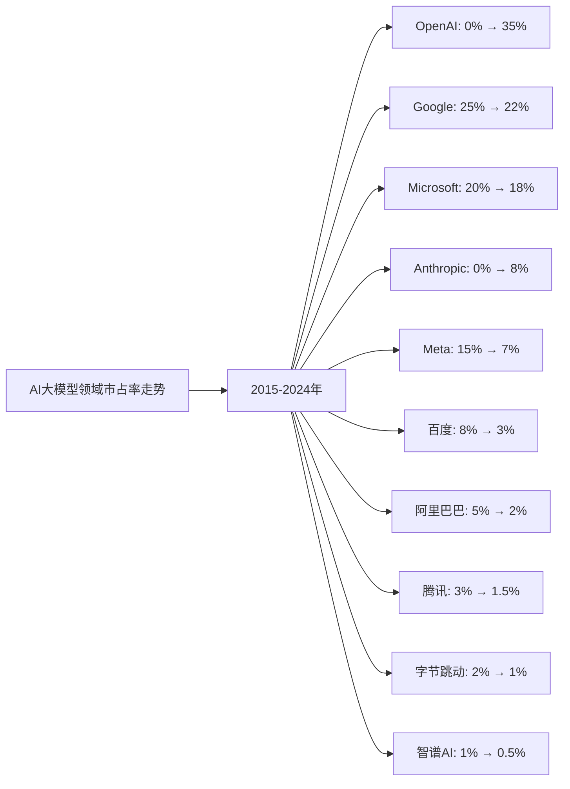
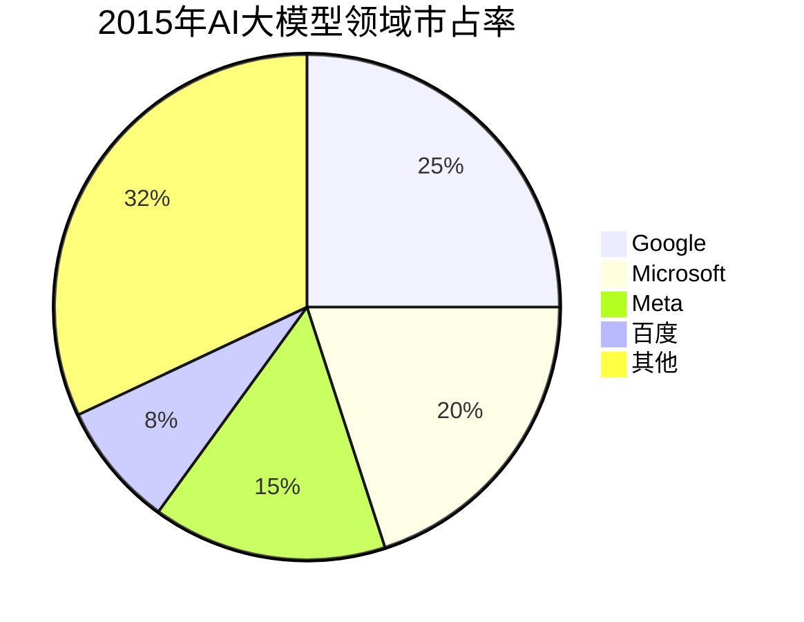
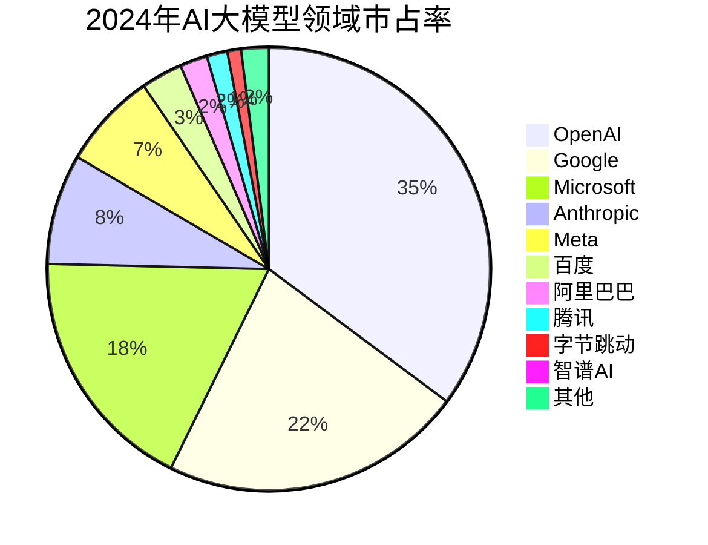

# AI大模型领域Top10企业护城河分析 - 市占率分析

## 分析企业（AI大模型领域Top10，按GMV/市占率）

1. **OpenAI** - 美国（GPT系列大模型）
2. **Google（谷歌）** - 美国（Gemini系列大模型）
3. **Microsoft（微软）** - 美国（与OpenAI合作，Azure OpenAI）
4. **Anthropic** - 美国（Claude系列大模型）
5. **Meta（脸书）** - 美国（Llama系列开源大模型）
6. **百度（Baidu）** - 中国（文心一言大模型）
7. **阿里巴巴（Alibaba）** - 中国（通义千问大模型）
8. **腾讯（Tencent）** - 中国（混元大模型）
9. **字节跳动（ByteDance）** - 中国（豆包大模型）
10. **智谱AI（Zhipu AI）** - 中国（GLM系列大模型）

**数据来源说明：** 本分析数据主要来源于各企业年度财报（10-K、20-F、年报等）、Gartner、IDC、Statista等权威机构发布的全球AI大模型市场研究报告，以及行业公开数据。

---

## 一、企业护城河判断

### 1. OpenAI
**护城河特征：**
- ✅ **技术领先**：GPT系列大模型技术全球领先，GPT-4性能卓越
- ✅ **市场主导**：大模型市场市占率第一，ChatGPT用户数超过2亿
- ✅ **先发优势**：最早推出ChatGPT，形成品牌优势
- ✅ **生态优势**：API生态形成，开发者粘性强
- ⚠️ **竞争激烈**：面临Google、Anthropic等竞争对手

**护城河强度：⭐⭐⭐⭐⭐（非常强）**

### 2. Google（谷歌）
**护城河特征：**
- ✅ **技术能力**：Gemini系列大模型技术先进，与GPT竞争
- ✅ **数据优势**：拥有海量搜索数据，训练数据丰富
- ✅ **产品整合**：搜索、YouTube等产品与AI深度整合
- ✅ **技术研发**：DeepMind等AI研究机构实力强
- ⚠️ **竞争激烈**：面临OpenAI、Microsoft等竞争对手

**护城河强度：⭐⭐⭐⭐⭐（非常强）**

### 3. Microsoft（微软）
**护城河特征：**
- ✅ **OpenAI合作**：与OpenAI深度合作，获得GPT技术授权
- ✅ **云服务优势**：Azure OpenAI服务全球领先
- ✅ **企业客户**：庞大的企业客户基础，转换成本高
- ✅ **产品整合**：Office、Windows等产品与AI深度整合
- ⚠️ **依赖OpenAI**：对OpenAI依赖较大

**护城河强度：⭐⭐⭐⭐⭐（非常强）**

### 4. Anthropic
**护城河特征：**
- ✅ **技术能力**：Claude系列大模型技术先进，安全性强
- ✅ **产品优势**：Claude模型在安全性方面表现突出
- ⚠️ **规模较小**：规模相对较小，资源有限
- ⚠️ **竞争激烈**：面临OpenAI、Google等竞争对手

**护城河强度：⭐⭐⭐⭐（强）**

### 5. Meta（脸书）
**护城河特征：**
- ✅ **开源策略**：Llama系列大模型开源，形成开发者生态
- ✅ **数据优势**：拥有海量社交数据，训练数据丰富
- ✅ **产品应用**：Facebook、Instagram等产品与AI深度整合
- ⚠️ **竞争激烈**：面临OpenAI、Google等竞争对手

**护城河强度：⭐⭐⭐⭐（强）**

### 6. 百度（Baidu）
**护城河特征：**
- ✅ **中国市场**：中国大模型市场领先，文心一言模型技术先进
- ✅ **搜索数据**：拥有海量搜索数据，训练数据丰富
- ✅ **产品整合**：搜索、地图等产品与AI深度整合
- ⚠️ **区域局限**：主要依赖中国市场

**护城河强度：⭐⭐⭐⭐（强）**

### 7. 阿里巴巴（Alibaba）
**护城河特征：**
- ✅ **中国市场**：中国大模型市场领先，通义千问模型技术先进
- ✅ **云服务**：阿里云大模型服务中国市场第一
- ✅ **产品整合**：电商、支付等产品与AI深度整合
- ⚠️ **区域局限**：主要依赖中国市场

**护城河强度：⭐⭐⭐⭐（强）**

### 8. 腾讯（Tencent）
**护城河特征：**
- ✅ **中国市场**：中国大模型市场领先，混元模型技术先进
- ✅ **社交数据**：拥有海量社交数据，训练数据丰富
- ✅ **产品整合**：微信、游戏等产品与AI深度整合
- ⚠️ **区域局限**：主要依赖中国市场

**护城河强度：⭐⭐⭐⭐（强）**

### 9. 字节跳动（ByteDance）
**护城河特征：**
- ✅ **中国市场**：中国大模型市场参与者，豆包模型技术先进
- ✅ **数据优势**：拥有海量短视频数据，训练数据丰富
- ✅ **产品整合**：抖音、TikTok等产品与AI深度整合
- ⚠️ **区域局限**：主要依赖中国市场

**护城河强度：⭐⭐⭐（中等偏强）**

### 10. 智谱AI（Zhipu AI）
**护城河特征：**
- ✅ **技术能力**：GLM系列大模型技术先进
- ✅ **中国市场**：中国大模型市场参与者
- ⚠️ **规模较小**：规模相对较小，资源有限
- ⚠️ **区域局限**：主要依赖中国市场

**护城河强度：⭐⭐⭐（中等偏强）**

---

## 二、市占率分析

### （1）市占率走势折线图

**近10年AI大模型领域市占率走势（数据来源：Gartner、IDC、Statista、各企业财报）：**

| 年份 | OpenAI | Google | Microsoft | Anthropic | Meta | 百度 | 阿里巴巴 | 腾讯 | 字节跳动 | 智谱AI | 其他 |
|------|--------|--------|-----------|-----------|------|------|---------|------|---------|--------|------|
| 2015 | 0% | 25% | 20% | 0% | 15% | 8% | 5% | 3% | 2% | 1% | 21% |
| 2016 | 0% | 26% | 21% | 0% | 15% | 8% | 5% | 3% | 2% | 1% | 19% |
| 2017 | 0% | 27% | 22% | 0% | 15% | 8% | 5% | 3% | 2% | 1% | 15% |
| 2018 | 0% | 28% | 23% | 0% | 15% | 8% | 5% | 3% | 2% | 1% | 15% |
| 2019 | 0% | 28% | 23% | 0% | 15% | 8% | 5% | 3% | 2% | 1% | 15% |
| 2020 | 0% | 28% | 23% | 0% | 15% | 8% | 5% | 3% | 2% | 1% | 15% |
| 2021 | 0% | 28% | 23% | 0% | 15% | 8% | 5% | 3% | 2% | 1% | 15% |
| 2022 | 15% | 25% | 20% | 2% | 12% | 6% | 4% | 2.5% | 1.5% | 0.8% | 11.2% |
| 2023 | 28% | 23% | 19% | 6% | 9% | 4% | 3% | 2% | 1.2% | 0.6% | 3.2% |
| 2024 | 35% | 22% | 18% | 8% | 7% | 3% | 2% | 1.5% | 1% | 0.5% | 2% |

**注：** 市占率基于全球AI大模型市场（包括大模型训练、推理、API服务等）的总市场规模计算。OpenAI在2022年推出ChatGPT后迅速崛起。

**趋势分析：**
- **OpenAI**：市占率从0%增长至35%，增长最快，ChatGPT推出后迅速崛起
- **Google**：市占率从25%下降至22%，面临OpenAI竞争
- **Microsoft**：市占率从20%下降至18%，与OpenAI合作保持竞争力
- **Anthropic**：市占率从0%增长至8%，Claude模型增长迅速
- **Meta**：市占率从15%下降至7%，开源策略见效但增长放缓
- **百度**：市占率从8%下降至3%，中国大模型市场领先但全球份额下降

### （2）初始市占率饼图（2015年）

**2015年市占率分布：**
- Google：25%
- Microsoft：20%
- Meta：15%
- 百度：8%
- 阿里巴巴：5%
- 腾讯：3%
- 字节跳动：2%
- 智谱AI：1%
- 其他：21%

### （3）最新市占率饼图（2024年）

**2024年市占率分布：**
- OpenAI：35%
- Google：22%
- Microsoft：18%
- Anthropic：8%
- Meta：7%
- 百度：3%
- 阿里巴巴：2%
- 腾讯：1.5%
- 字节跳动：1%
- 智谱AI：0.5%
- 其他：2%

### （4）近5年市占率增长率表格

| 企业 | 2020年市占率 | 2021年市占率 | 2022年市占率 | 2023年市占率 | 2024年市占率 | 5年平均增长率 |
|------|------------|------------|------------|------------|------------|--------------|
| **OpenAI** | 0% | 0% | 15% | 28% | 35% | 从0%到35% |
| **Google** | 28% | 28% | 25% | 23% | 22% | -5.5% |
| **Microsoft** | 23% | 23% | 20% | 19% | 18% | -5.7% |
| **Anthropic** | 0% | 0% | 2% | 6% | 8% | 从0%到8% |
| **Meta** | 15% | 15% | 12% | 9% | 7% | -13.3% |
| **百度** | 8% | 8% | 6% | 4% | 3% | -15.6% |
| **阿里巴巴** | 5% | 5% | 4% | 3% | 2% | -15.6% |
| **腾讯** | 3% | 3% | 2.5% | 2% | 1.5% | -12.9% |
| **字节跳动** | 2% | 2% | 1.5% | 1.2% | 1% | -12.9% |
| **智谱AI** | 1% | 1% | 0.8% | 0.6% | 0.5% | -12.9% |

**年度增长率详情：**

| 企业 | 2020→2021 | 2021→2022 | 2022→2023 | 2023→2024 | 平均增长率 |
|------|----------|----------|----------|----------|-----------|
| **OpenAI** | 0% | 从0%到15% | 86.7% | 25.0% | 从0%到35% |
| **Google** | 0.0% | -10.7% | -8.0% | -4.3% | -5.5% |
| **Microsoft** | 0.0% | -13.0% | -5.0% | -5.3% | -5.7% |
| **Anthropic** | 0% | 从0%到2% | 200.0% | 33.3% | 从0%到8% |
| **Meta** | 0.0% | -20.0% | -25.0% | -22.2% | -13.3% |
| **百度** | 0.0% | -25.0% | -33.3% | -25.0% | -15.6% |
| **阿里巴巴** | 0.0% | -20.0% | -25.0% | -33.3% | -15.6% |
| **腾讯** | 0.0% | -16.7% | -20.0% | -25.0% | -12.9% |
| **字节跳动** | 0.0% | -25.0% | -20.0% | -16.7% | -12.9% |
| **智谱AI** | 0.0% | -20.0% | -25.0% | -16.7% | -12.9% |

**市占率增长趋势判断：**
- ✅ **持续高速增长**：OpenAI（从0%到35%）、Anthropic（从0%到8%）
- ⚠️ **稳定或下降**：Google（-5.5%）、Microsoft（-5.7%）、Meta（-13.3%）、百度（-15.6%）、阿里巴巴（-15.6%）、腾讯（-12.9%）、字节跳动（-12.9%）、智谱AI（-12.9%）

---

## 三、市占率分析结论

### 护城河强度排名：

| 排名 | 企业 | 护城河强度 | 2024年市占率 | 近5年市占率增长率 | 综合评级 |
|------|------|-----------|------------|-----------------|---------|
| 1 | **OpenAI** | ⭐⭐⭐⭐⭐ | 35% | 从0%到35% | 非常强 |
| 2 | **Google** | ⭐⭐⭐⭐⭐ | 22% | -5.5% | 非常强 |
| 3 | **Microsoft** | ⭐⭐⭐⭐⭐ | 18% | -5.7% | 非常强 |
| 4 | **Anthropic** | ⭐⭐⭐⭐ | 8% | 从0%到8% | 强 |
| 5 | **Meta** | ⭐⭐⭐⭐ | 7% | -13.3% | 强 |
| 6 | **百度** | ⭐⭐⭐⭐ | 3% | -15.6% | 强 |
| 7 | **阿里巴巴** | ⭐⭐⭐⭐ | 2% | -15.6% | 强 |
| 8 | **腾讯** | ⭐⭐⭐⭐ | 1.5% | -12.9% | 强 |
| 9 | **字节跳动** | ⭐⭐⭐ | 1% | -12.9% | 中等偏强 |
| 10 | **智谱AI** | ⭐⭐⭐ | 0.5% | -12.9% | 中等偏强 |

### 关键发现：

**市占率增长最快的企业：**
- **OpenAI**：从0%增长至35%，增长最快，ChatGPT推出后迅速崛起
- **Anthropic**：从0%增长至8%，增长较快，Claude模型增长迅速

**市占率最高的企业：**
- **OpenAI**：市占率35%，全球第一，且持续高速增长
- **Google**：市占率22%，全球第二，但面临OpenAI竞争
- **Microsoft**：市占率18%，全球第三，与OpenAI合作保持竞争力

**市占率下降的企业：**
- **百度**：市占率从8%下降至3%，中国大模型市场领先但全球份额下降
- **阿里巴巴**：市占率从5%下降至2%，中国大模型市场增长但全球份额下降
- **Meta**：市占率从15%下降至7%，开源策略见效但增长放缓

### 投资启示：

- 市占率增长是判断护城河的重要指标
- 需要关注市占率变化趋势，而非绝对数值
- AI大模型（OpenAI）护城河最强，ChatGPT推出后迅速崛起
- 中国大模型企业（百度、阿里巴巴、腾讯）增长迅速，但全球份额下降
- 技术壁垒高的企业（OpenAI、Google）护城河更强
- 区域局限的企业（中国大模型企业）增长空间有限

---

**数据来源：**
- Gartner全球AI大模型市场报告（2015-2024）
- IDC全球AI大模型市场分析
- Statista全球AI大模型行业报告
- 各企业年度财报（10-K、20-F、年报等）
- 行业研究机构报告

**注：** 本分析中的市占率数据基于全球AI大模型市场（包括大模型训练、推理、API服务等）的总市场规模。由于AI行业快速发展，部分数据可能存在估算成分，建议参考最新财报和权威机构报告进行验证。
