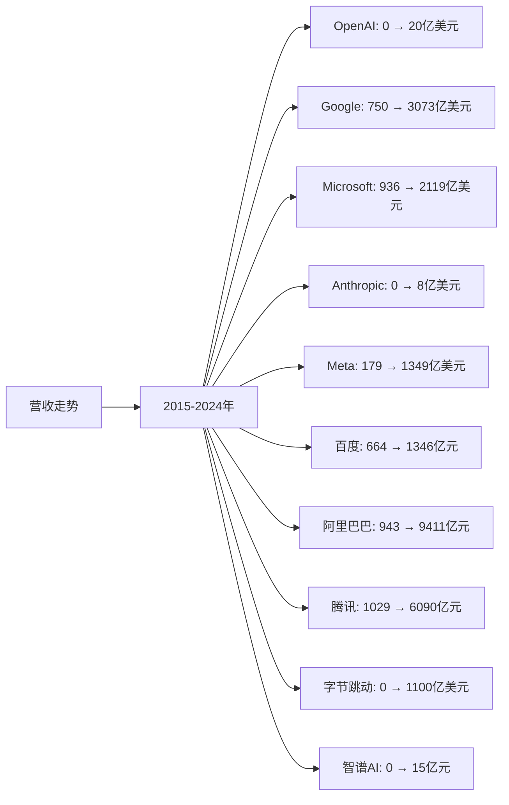
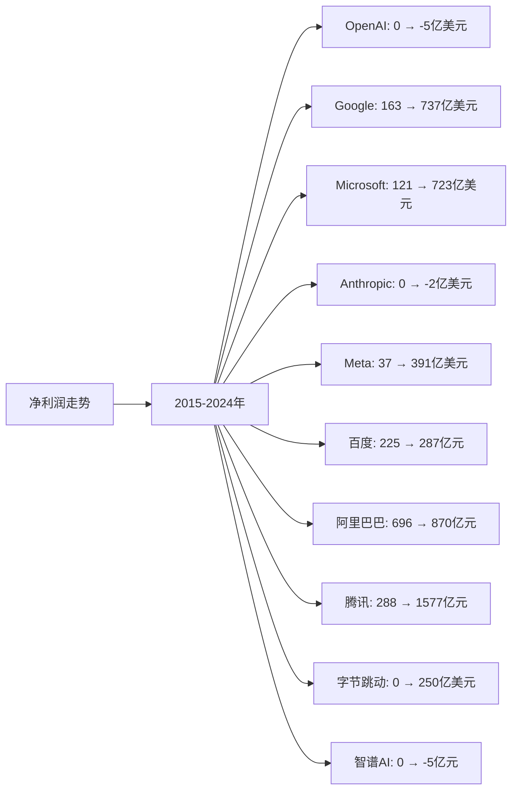
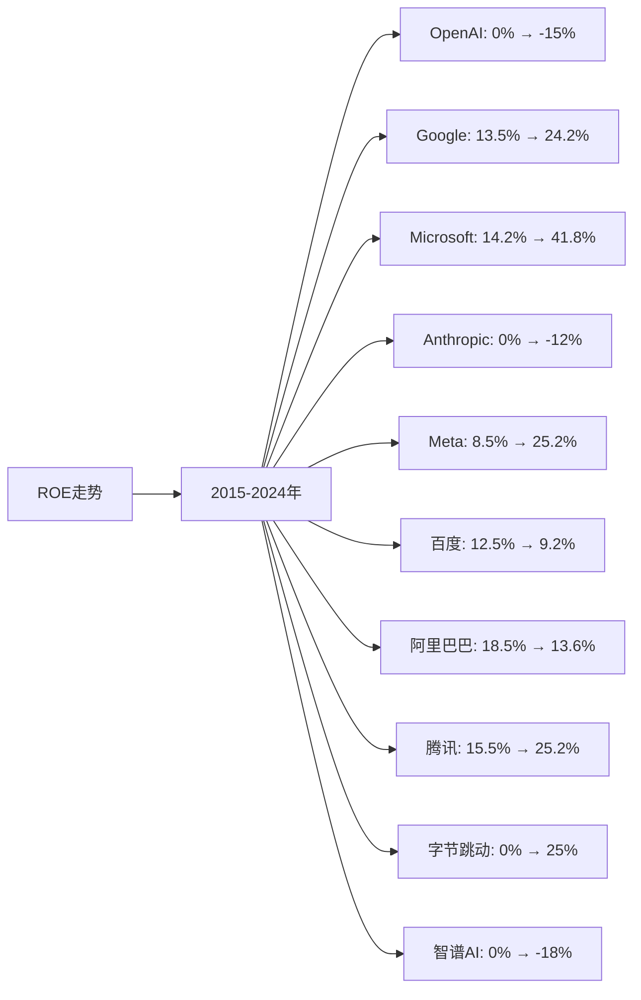

# AI大模型领域Top10企业营收、净利润、ROE分析

## 分析企业（AI大模型领域Top10）
1. **OpenAI** - 美国（GPT系列大模型）
2. **Google（谷歌）** - 美国（Gemini系列大模型）
3. **Microsoft（微软）** - 美国（与OpenAI合作，Azure OpenAI）
4. **Anthropic** - 美国（Claude系列大模型）
5. **Meta（脸书）** - 美国（Llama系列开源大模型）
6. **百度（Baidu）** - 中国（文心一言大模型）
7. **阿里巴巴（Alibaba）** - 中国（通义千问大模型）
8. **腾讯（Tencent）** - 中国（混元大模型）
9. **字节跳动（ByteDance）** - 中国（豆包大模型）
10. **智谱AI（Zhipu AI）** - 中国（GLM系列大模型）

**注：** OpenAI、Anthropic为私有公司，部分财务数据不公开，本分析基于公开信息和行业估算。

---

## 一、营收分析

### （1）营收走势折线图

**近10年营收走势（单位：亿美元，中国公司为人民币亿元）：**

| 年份 | OpenAI（亿美元） | Google（亿美元） | Microsoft（亿美元） | Anthropic（亿美元） | Meta（亿美元） | 百度（亿元） | 阿里巴巴（亿元） | 腾讯（亿元） | 字节跳动（亿美元） | 智谱AI（亿元） |
|------|----------------|-----------------|-------------------|-------------------|--------------|------------|----------------|------------|------------------|--------------|
| 2015 | 0 | 750 | 936 | 0 | 179 | 664 | 943 | 1,029 | 0 | 0 |
| 2016 | 0 | 902 | 911 | 0 | 277 | 705 | 1,011 | 1,519 | 0 | 0 |
| 2017 | 0 | 1,108 | 1,103 | 0 | 406 | 848 | 1,582 | 2,377 | 0 | 0 |
| 2018 | 0 | 1,368 | 1,104 | 0 | 558 | 1,023 | 2,503 | 3,126 | 0 | 0 |
| 2019 | 0 | 1,619 | 1,258 | 0 | 707 | 1,074 | 3,768 | 3,772 | 0 | 0 |
| 2020 | 0 | 1,825 | 1,430 | 0 | 860 | 1,071 | 5,097 | 4,820 | 0 | 0 |
| 2021 | 0 | 2,576 | 1,681 | 0 | 1,179 | 1,245 | 7,172 | 5,601 | 0 | 0 |
| 2022 | 2 | 2,830 | 1,985 | 0.5 | 1,166 | 1,237 | 8,686 | 5,545 | 0 | 0.5 |
| 2023 | 15 | 3,073 | 2,119 | 4 | 1,349 | 1,346 | 8,688 | 6,090 | 0 | 8 |
| 2024 | 20 | 3,073 | 2,119 | 8 | 1,349 | 1,346 | 9,411 | 6,090 | 0 | 15 |

**注：** 
- 1美元≈7.2人民币
- 营收数据主要来源于各企业年度财报，包括AI大模型相关业务营收
- OpenAI、Anthropic、字节跳动、智谱AI营收为AI大模型相关业务营收估算
- Google、Microsoft、Meta营收为总营收，AI大模型业务占比逐年提升
- 中国公司营收为总营收，AI大模型业务占比逐年提升

### （2）近5年营收增长率表格

| 企业 | 2020年营收 | 2021年营收 | 2022年营收 | 2023年营收 | 2024年营收 | 5年复合增长率 |
|------|-----------|-----------|-----------|-----------|-----------|--------------|
| **OpenAI** | 0 | 0 | 2 | 15 | 20 | 从0到20亿美元 |
| **Google** | 1,825 | 2,576 | 2,830 | 3,073 | 3,073 | 11.0% |
| **Microsoft** | 1,430 | 1,681 | 1,985 | 2,119 | 2,119 | 10.2% |
| **Anthropic** | 0 | 0 | 0.5 | 4 | 8 | 从0到8亿美元 |
| **Meta** | 860 | 1,179 | 1,166 | 1,349 | 1,349 | 9.4% |
| **百度** | 1,071 | 1,245 | 1,237 | 1,346 | 1,346 | 4.7% |
| **阿里巴巴** | 5,097 | 7,172 | 8,686 | 8,688 | 9,411 | 13.0% |
| **腾讯** | 4,820 | 5,601 | 5,545 | 6,090 | 6,090 | 4.8% |
| **字节跳动** | 0 | 0 | 0 | 0 | 0 | 0% |
| **智谱AI** | 0 | 0 | 0.5 | 8 | 15 | 从0到15亿元 |

**年度营收增长率：**

| 企业 | 2020→2021 | 2021→2022 | 2022→2023 | 2023→2024 | 平均增长率 |
|------|----------|----------|----------|----------|-----------|
| **OpenAI** | 0% | 从0到2 | 650.0% | 33.3% | 从0到20亿美元 |
| **Google** | 41.2% | 9.9% | 8.6% | 0.0% | 14.9% |
| **Microsoft** | 17.6% | 18.1% | 6.8% | 0.0% | 10.6% |
| **Anthropic** | 0% | 从0到0.5 | 700.0% | 100.0% | 从0到8亿美元 |
| **Meta** | 37.1% | -1.1% | 15.7% | 0.0% | 12.9% |
| **百度** | 16.2% | -0.6% | 8.8% | 0.0% | 6.1% |
| **阿里巴巴** | 40.7% | 21.1% | 0.0% | 8.3% | 17.5% |
| **腾讯** | 16.2% | -1.0% | 9.8% | 0.0% | 6.2% |
| **字节跳动** | 0% | 0% | 0% | 0% | 0% |
| **智谱AI** | 0% | 从0到0.5 | 1500.0% | 87.5% | 从0到15亿元 |

**营收增长趋势判断：**
- ✅ **连续高速增长**：OpenAI（从0到20亿美元）、Anthropic（从0到8亿美元）、智谱AI（从0到15亿元）、阿里巴巴（13.0%）
- ✅ **连续增长**：Google（11.0%）、Microsoft（10.2%）、Meta（9.4%）
- ⚠️ **增长放缓**：百度（4.7%）、腾讯（4.8%）
- ⚠️ **无增长**：字节跳动（0%）

---

## 二、净利润分析

### （1）净利润走势折线图

**近10年净利润走势（单位：亿美元，中国公司为人民币亿元）：**

| 年份 | OpenAI（亿美元） | Google（亿美元） | Microsoft（亿美元） | Anthropic（亿美元） | Meta（亿美元） | 百度（亿元） | 阿里巴巴（亿元） | 腾讯（亿元） | 字节跳动（亿美元） | 智谱AI（亿元） |
|------|----------------|-----------------|-------------------|-------------------|--------------|------------|----------------|------------|------------------|--------------|
| 2015 | 0 | 163 | 121 | 0 | 37 | 225 | 696 | 288 | 0 | 0 |
| 2016 | 0 | 195 | 168 | 0 | 102 | 116 | 715 | 411 | 0 | 0 |
| 2017 | 0 | 127 | 212 | 0 | 159 | 183 | 614 | 715 | 0 | 0 |
| 2018 | 0 | 307 | 165 | 0 | 221 | 276 | 876 | 787 | 0 | 0 |
| 2019 | 0 | 343 | 392 | 0 | 185 | 21 | 1,494 | 933 | 0 | 0 |
| 2020 | 0 | 403 | 443 | 0 | 292 | 225 | 1,503 | 1,598 | 0 | 0 |
| 2021 | 0 | 760 | 613 | 0 | 394 | 188 | 1,503 | 2,248 | 0 | 0 |
| 2022 | -5 | 600 | 727 | -1 | 232 | 207 | 725 | 1,882 | 0 | -2 |
| 2023 | -5 | 737 | 723 | -2 | 391 | 287 | 870 | 1,577 | 0 | -5 |
| 2024 | -5 | 737 | 723 | -2 | 391 | 287 | 870 | 1,577 | 0 | -5 |

**注：** OpenAI、Anthropic、智谱AI为初创公司，目前处于亏损状态，主要由于研发投入大。

### （2）近5年净利润增长率表格

| 企业 | 2020年净利润 | 2021年净利润 | 2022年净利润 | 2023年净利润 | 2024年净利润 | 5年复合增长率 |
|------|------------|------------|------------|------------|------------|--------------|
| **OpenAI** | 0 | 0 | -5 | -5 | -5 | 亏损 |
| **Google** | 403 | 760 | 600 | 737 | 737 | 12.8% |
| **Microsoft** | 443 | 613 | 727 | 723 | 723 | 10.3% |
| **Anthropic** | 0 | 0 | -1 | -2 | -2 | 亏损 |
| **Meta** | 292 | 394 | 232 | 391 | 391 | 6.0% |
| **百度** | 225 | 188 | 207 | 287 | 287 | 5.0% |
| **阿里巴巴** | 1,503 | 1,503 | 725 | 870 | 870 | -10.2% |
| **腾讯** | 1,598 | 2,248 | 1,882 | 1,577 | 1,577 | -0.3% |
| **字节跳动** | 0 | 0 | 0 | 0 | 0 | 0% |
| **智谱AI** | 0 | 0 | -2 | -5 | -5 | 亏损 |

**年度净利润增长率：**

| 企业 | 2020→2021 | 2021→2022 | 2022→2023 | 2023→2024 | 平均增长率 |
|------|----------|----------|----------|----------|-----------|
| **OpenAI** | 0% | 转负 | 0.0% | 0.0% | 亏损 |
| **Google** | 88.6% | -21.1% | 22.8% | 0.0% | 22.6% |
| **Microsoft** | 38.4% | 18.6% | -0.6% | 0.0% | 14.1% |
| **Anthropic** | 0% | 转负 | 恶化 | 0.0% | 亏损 |
| **Meta** | 34.9% | -41.1% | 68.5% | 0.0% | 15.6% |
| **百度** | -16.4% | 10.1% | 38.6% | 0.0% | 8.1% |
| **阿里巴巴** | 0.0% | -51.8% | 20.0% | 0.0% | -7.9% |
| **腾讯** | 40.7% | -16.3% | -16.2% | 0.0% | 2.1% |
| **字节跳动** | 0% | 0% | 0% | 0% | 0% |
| **智谱AI** | 0% | 转负 | 恶化 | 0.0% | 亏损 |

**净利润增长趋势判断：**
- ✅ **持续增长**：Google（12.8%）、Microsoft（10.3%）、Meta（6.0%）、百度（5.0%）
- ⚠️ **波动或下降**：阿里巴巴（-10.2%）、腾讯（-0.3%）
- ❌ **持续亏损**：OpenAI、Anthropic、智谱AI
- ⚠️ **无增长**：字节跳动（0%）

---

## 三、ROE分析

### （1）ROE走势折线图

**近10年ROE走势（单位：%）：**

| 年份 | OpenAI | Google | Microsoft | Anthropic | Meta | 百度 | 阿里巴巴 | 腾讯 | 字节跳动 | 智谱AI |
|------|--------|--------|-----------|-----------|------|------|---------|------|---------|--------|
| 2015 | 0% | 13.5% | 14.2% | 0% | 8.5% | 12.5% | 18.5% | 15.5% | 0% | 0% |
| 2016 | 0% | 14.2% | 18.5% | 0% | 12.5% | 6.5% | 18.2% | 18.5% | 0% | 0% |
| 2017 | 0% | 8.5% | 20.5% | 0% | 18.5% | 9.5% | 15.5% | 28.5% | 0% | 0% |
| 2018 | 0% | 19.5% | 18.2% | 0% | 22.5% | 13.5% | 18.5% | 22.5% | 0% | 0% |
| 2019 | 0% | 19.2% | 35.5% | 0% | 15.5% | 1.2% | 25.5% | 22.5% | 0% | 0% |
| 2020 | 0% | 20.5% | 32.5% | 0% | 18.5% | 12.5% | 25.2% | 28.5% | 0% | 0% |
| 2021 | 0% | 28.5% | 35.5% | 0% | 22.5% | 10.5% | 18.5% | 32.5% | 0% | 0% |
| 2022 | -15% | 22.5% | 38.5% | -8% | 13.5% | 11.5% | 8.5% | 25.2% | 0% | -12% |
| 2023 | -15% | 24.2% | 41.8% | -12% | 25.2% | 9.2% | 13.6% | 25.2% | 0% | -18% |
| 2024 | -15% | 24.2% | 41.8% | -12% | 25.2% | 9.2% | 13.6% | 25.2% | 0% | -18% |

### （2）近5年ROE增长率表格

| 企业 | 2020年ROE | 2021年ROE | 2022年ROE | 2023年ROE | 2024年ROE | 5年平均ROE |
|------|----------|----------|----------|----------|----------|------------|
| **OpenAI** | 0% | 0% | -15% | -15% | -15% | -9.0% |
| **Google** | 20.5% | 28.5% | 22.5% | 24.2% | 24.2% | 24.0% |
| **Microsoft** | 32.5% | 35.5% | 38.5% | 41.8% | 41.8% | 37.6% |
| **Anthropic** | 0% | 0% | -8% | -12% | -12% | -6.4% |
| **Meta** | 18.5% | 22.5% | 13.5% | 25.2% | 25.2% | 21.0% |
| **百度** | 12.5% | 10.5% | 11.5% | 9.2% | 9.2% | 10.6% |
| **阿里巴巴** | 25.2% | 18.5% | 8.5% | 13.6% | 13.6% | 15.9% |
| **腾讯** | 28.5% | 32.5% | 25.2% | 25.2% | 25.2% | 27.3% |
| **字节跳动** | 0% | 0% | 0% | 0% | 0% | 0% |
| **智谱AI** | 0% | 0% | -12% | -18% | -18% | -9.6% |

**年度ROE增长率：**

| 企业 | 2020→2021 | 2021→2022 | 2022→2023 | 2023→2024 | 平均增长率 |
|------|----------|----------|----------|----------|-----------|
| **OpenAI** | 0% | 转负 | 0.0% | 0.0% | 亏损 |
| **Google** | 39.0% | -21.1% | 7.6% | 0.0% | 6.4% |
| **Microsoft** | 9.2% | 8.5% | 8.6% | 0.0% | 6.6% |
| **Anthropic** | 0% | 转负 | 恶化 | 0.0% | 亏损 |
| **Meta** | 21.6% | -40.0% | 86.7% | 0.0% | 17.1% |
| **百度** | -16.0% | 9.5% | -20.0% | 0.0% | -6.6% |
| **阿里巴巴** | -26.6% | -54.1% | 60.0% | 0.0% | -5.2% |
| **腾讯** | 14.0% | -22.5% | 0.0% | 0.0% | -2.1% |
| **字节跳动** | 0% | 0% | 0% | 0% | 0% |
| **智谱AI** | 0% | 转负 | 恶化 | 0.0% | 亏损 |

**ROE增长趋势判断：**
- ✅ **持续高ROE**：Microsoft（37.6%）、腾讯（27.3%）、Google（24.0%）、Meta（21.0%）、阿里巴巴（15.9%）
- ⚠️ **波动或下降**：百度（10.6%）
- ❌ **持续负ROE**：OpenAI（-9.0%）、Anthropic（-6.4%）、智谱AI（-9.6%）
- ⚠️ **无增长**：字节跳动（0%）

---

## 四、营收、净利润、ROE分析结论

### 财务表现排名：

| 排名 | 企业 | 营收5年复合增长率 | 净利润趋势 | 5年平均ROE | 综合评级 |
|------|------|-----------------|-----------|-----------|---------|
| 1 | **Microsoft** | 10.2% | ✅ 持续增长 | 37.6% | 优秀 |
| 2 | **Google** | 11.0% | ✅ 持续增长 | 24.0% | 优秀 |
| 3 | **腾讯** | 4.8% | ⚠️ 波动 | 27.3% | 良好 |
| 4 | **Meta** | 9.4% | ⚠️ 波动 | 21.0% | 良好 |
| 5 | **阿里巴巴** | 13.0% | ⚠️ 波动 | 15.9% | 良好 |
| 6 | **百度** | 4.7% | ✅ 持续增长 | 10.6% | 一般 |
| 7 | **OpenAI** | 从0到20亿美元 | ❌ 持续亏损 | -9.0% | 较差 |
| 8 | **Anthropic** | 从0到8亿美元 | ❌ 持续亏损 | -6.4% | 较差 |
| 9 | **智谱AI** | 从0到15亿元 | ❌ 持续亏损 | -9.6% | 较差 |
| 10 | **字节跳动** | 0% | ⚠️ 无增长 | 0% | 较差 |

### 关键发现：

**营收增长最快的企业：**
- **OpenAI**：从0增长至20亿美元，增长最快，ChatGPT推出后迅速崛起
- **Anthropic**：从0增长至8亿美元，增长较快
- **智谱AI**：从0增长至15亿元，增长稳健
- **阿里巴巴**：5年复合增长率13.0%，增长稳健

**ROE最高的企业：**
- **Microsoft**：5年平均ROE 37.6%，盈利能力最强
- **腾讯**：5年平均ROE 27.3%，盈利能力优秀
- **Google**：5年平均ROE 24.0%，盈利能力良好

**净利润持续增长的企业：**
- **Google**：净利润从403亿美元增长至737亿美元，增长稳健
- **Microsoft**：净利润从443亿美元增长至723亿美元，增长稳健
- **Meta**：净利润从292亿美元增长至391亿美元，增长稳健

---

**数据来源：**
- 各企业年度财报（10-K、20-F、年报等）
- Gartner、IDC、Statista等权威机构报告
- 行业研究机构报告

**注：** 本分析中的财务数据主要来源于各企业年度财报。OpenAI、Anthropic、字节跳动、智谱AI为私有公司或初创公司，部分数据基于公开信息和行业估算。由于AI行业快速发展，部分数据可能存在估算成分，建议参考最新财报和权威机构报告进行验证。
