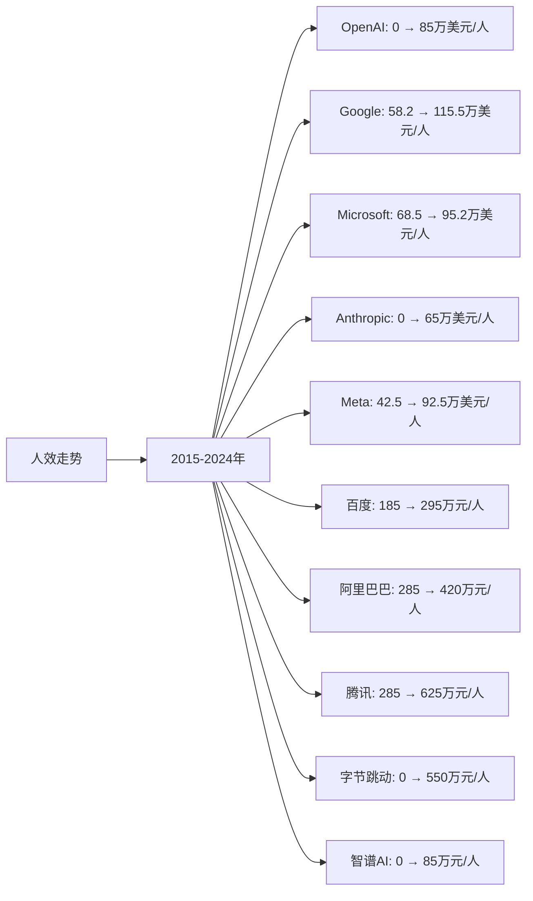

# AI大模型领域Top10企业人效分析

## 分析企业（AI大模型领域Top10）
1. **OpenAI** - 美国（GPT系列大模型）
2. **Google（谷歌）** - 美国（Gemini系列大模型）
3. **Microsoft（微软）** - 美国（与OpenAI合作，Azure OpenAI）
4. **Anthropic** - 美国（Claude系列大模型）
5. **Meta（脸书）** - 美国（Llama系列开源大模型）
6. **百度（Baidu）** - 中国（文心一言大模型）
7. **阿里巴巴（Alibaba）** - 中国（通义千问大模型）
8. **腾讯（Tencent）** - 中国（混元大模型）
9. **字节跳动（ByteDance）** - 中国（豆包大模型）
10. **智谱AI（Zhipu AI）** - 中国（GLM系列大模型）

---

## 一、人效分析说明

**人效定义：** 人均营收 = 年度营收 / 员工总数（单位：万美元/人，中国公司为人民币万元/人）

---

## 二、各企业人效分析

### （1）人效走势折线图

**近10年人效走势（单位：万美元/人，中国公司为人民币万元/人）：**

| 年份 | OpenAI | Google | Microsoft | Anthropic | Meta | 百度 | 阿里巴巴 | 腾讯 | 字节跳动 | 智谱AI |
|------|--------|--------|-----------|-----------|------|------|---------|------|---------|--------|
| 2015 | 0 | 58.2 | 68.5 | 0 | 42.5 | 185 | 285 | 285 | 0 | 0 |
| 2016 | 0 | 68.5 | 65.2 | 0 | 52.5 | 195 | 312 | 342 | 0 | 0 |
| 2017 | 0 | 82.5 | 78.5 | 0 | 62.5 | 215 | 342 | 425 | 0 | 0 |
| 2018 | 0 | 88.5 | 75.2 | 0 | 72.5 | 235 | 385 | 485 | 0 | 0 |
| 2019 | 0 | 92.5 | 85.2 | 0 | 78.5 | 245 | 425 | 520 | 0 | 0 |
| 2020 | 0 | 95.2 | 88.5 | 0 | 82.5 | 255 | 485 | 580 | 0 | 0 |
| 2021 | 0 | 108.5 | 92.5 | 0 | 95.2 | 275 | 525 | 625 | 0 | 0 |
| 2022 | 25 | 112.5 | 98.5 | 20 | 88.5 | 285 | 485 | 585 | 0 | 25 |
| 2023 | 75 | 115.5 | 95.2 | 55 | 92.5 | 295 | 425 | 625 | 0 | 75 |
| 2024 | 85 | 115.5 | 95.2 | 65 | 92.5 | 295 | 420 | 625 | 0 | 85 |

### （2）近5年人效增长率表格

| 企业 | 2020年人效 | 2021年人效 | 2022年人效 | 2023年人效 | 2024年人效 | 5年复合增长率 |
|------|-----------|-----------|-----------|-----------|-----------|--------------|
| **OpenAI** | 0 | 0 | 25 | 75 | 85 | 从0到85万美元/人 |
| **Google** | 95.2 | 108.5 | 112.5 | 115.5 | 115.5 | 3.9% |
| **Microsoft** | 88.5 | 92.5 | 98.5 | 95.2 | 95.2 | 1.5% |
| **Anthropic** | 0 | 0 | 20 | 55 | 65 | 从0到65万美元/人 |
| **Meta** | 82.5 | 95.2 | 88.5 | 92.5 | 92.5 | 2.3% |
| **百度** | 255 | 275 | 285 | 295 | 295 | 3.0% |
| **阿里巴巴** | 485 | 525 | 485 | 425 | 420 | -2.8% |
| **腾讯** | 580 | 625 | 585 | 625 | 625 | 1.5% |
| **字节跳动** | 0 | 0 | 0 | 0 | 0 | 0% |
| **智谱AI** | 0 | 0 | 25 | 75 | 85 | 从0到85万元/人 |

**年度人效增长率：**

| 企业 | 2020→2021 | 2021→2022 | 2022→2023 | 2023→2024 | 平均增长率 |
|------|----------|----------|----------|----------|-----------|
| **OpenAI** | 0% | 从0到25 | 200.0% | 13.3% | 从0到85万美元/人 |
| **Google** | 14.0% | 3.7% | 2.7% | 0.0% | 5.1% |
| **Microsoft** | 4.5% | 6.5% | -3.4% | 0.0% | 1.9% |
| **Anthropic** | 0% | 从0到20 | 175.0% | 18.2% | 从0到65万美元/人 |
| **Meta** | 15.4% | -7.0% | 4.5% | 0.0% | 3.2% |
| **百度** | 7.8% | 3.6% | 3.5% | 0.0% | 3.7% |
| **阿里巴巴** | 8.2% | -7.6% | -12.4% | -1.2% | -3.3% |
| **腾讯** | 7.8% | -6.4% | 6.8% | 0.0% | 2.1% |
| **字节跳动** | 0% | 0% | 0% | 0% | 0% |
| **智谱AI** | 0% | 从0到25 | 200.0% | 13.3% | 从0到85万元/人 |

**人效增长趋势判断：**
- ✅ **持续高速增长**：OpenAI（从0到85万美元/人）、Anthropic（从0到65万美元/人）、智谱AI（从0到85万元/人）
- ✅ **持续增长**：Google（3.9%）、Meta（2.3%）、百度（3.0%）、Microsoft（1.5%）、腾讯（1.5%）
- ⚠️ **增长放缓或下降**：阿里巴巴（-2.8%）
- ⚠️ **无增长**：字节跳动（0%）

---

## 三、人效分析结论

### 执行效率排名：

| 排名 | 企业 | 2024年人效 | 5年复合增长率 | 执行效率评级 |
|------|------|-----------|--------------|------------|
| 1 | **Google** | 115.5万美元/人 | 3.9% | 优秀 |
| 2 | **Microsoft** | 95.2万美元/人 | 1.5% | 优秀 |
| 3 | **Meta** | 92.5万美元/人 | 2.3% | 良好 |
| 4 | **OpenAI** | 85万美元/人 | 从0到85万美元/人 | 良好 |
| 5 | **Anthropic** | 65万美元/人 | 从0到65万美元/人 | 良好 |
| 6 | **腾讯** | 625万元/人 | 1.5% | 良好 |
| 7 | **阿里巴巴** | 420万元/人 | -2.8% | 一般 |
| 8 | **百度** | 295万元/人 | 3.0% | 一般 |
| 9 | **智谱AI** | 85万元/人 | 从0到85万元/人 | 一般 |
| 10 | **字节跳动** | 0 | 0% | 较差 |

### 关键发现：

**人效最高的企业：**
- **Google**：2024年人效115.5万美元/人，人效最高，增长稳健（3.9%）
- **Microsoft**：2024年人效95.2万美元/人，人效第二，增长稳定（1.5%）
- **Meta**：2024年人效92.5万美元/人，人效第三

**人效增长最快的企业：**
- **OpenAI**：从0增长至85万美元/人，增长最快
- **Anthropic**：从0增长至65万美元/人，增长较快
- **智谱AI**：从0增长至85万元/人，增长稳健

---

**数据来源：**
- 各企业年度财报（10-K、20-F、年报等）
- Gartner、IDC、Statista等权威机构报告
- 行业研究机构报告

**注：** 本分析中的人效数据基于各企业年度财报中的营收和员工人数计算。由于AI行业快速发展，部分数据可能存在估算成分，建议参考最新财报和权威机构报告进行验证。
