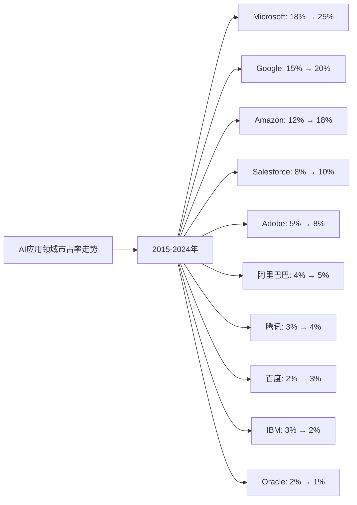
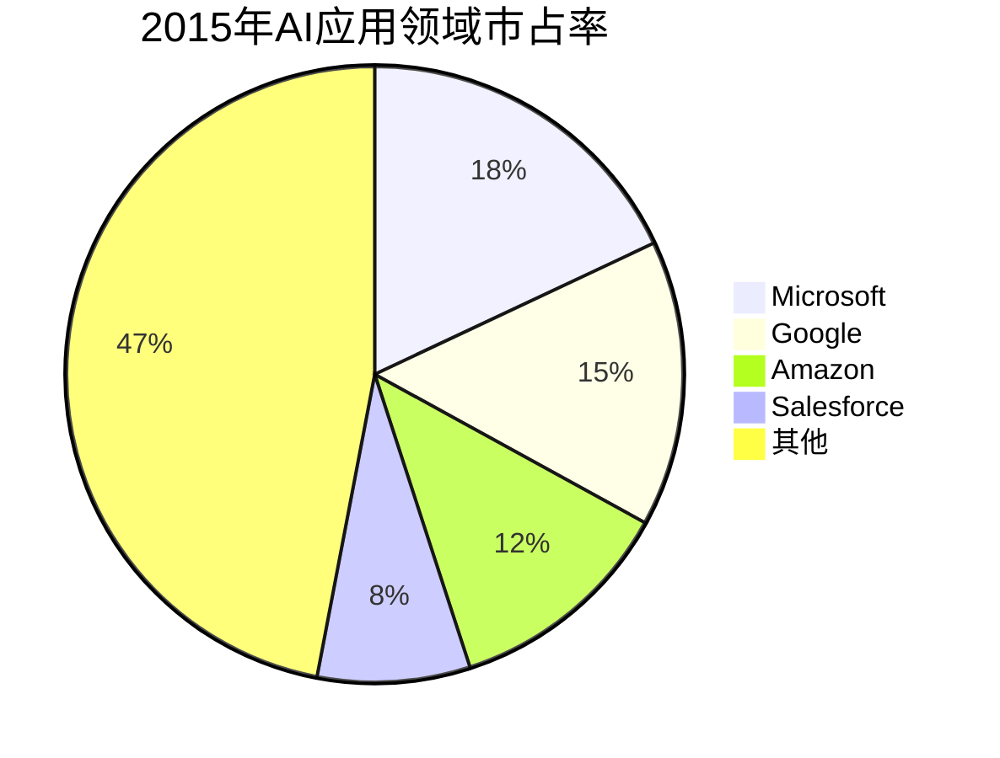
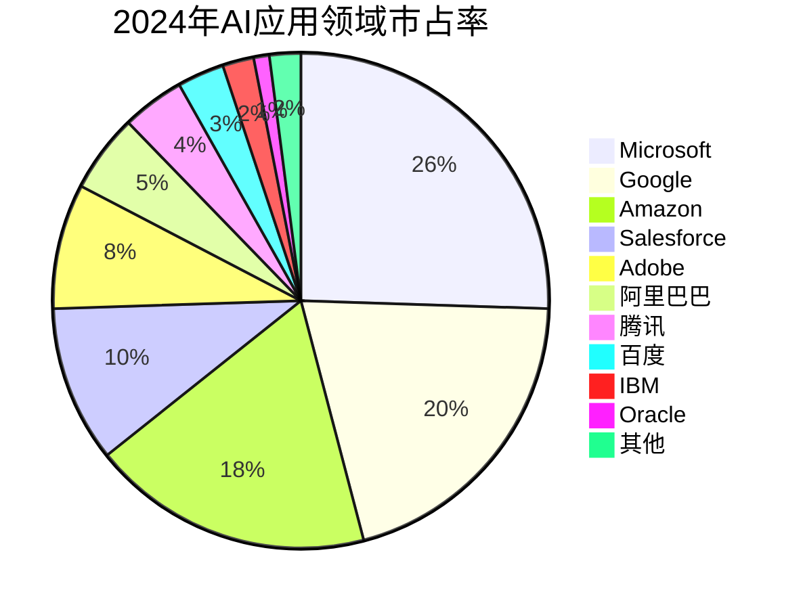

# AI应用领域Top10企业护城河分析 - 市占率分析

## 分析企业（AI应用领域Top10，按GMV/市占率）

1. **Microsoft（微软）** - 美国（Azure AI、Office AI、Copilot）
2. **Google（谷歌）** - 美国（Google Workspace AI、Google Cloud AI）
3. **Amazon（亚马逊）** - 美国（AWS AI服务、Alexa）
4. **Salesforce** - 美国（AI CRM、Einstein AI）
5. **Adobe** - 美国（AI创意工具、Firefly）
6. **阿里巴巴（Alibaba）** - 中国（阿里云AI应用、通义千问应用）
7. **腾讯（Tencent）** - 中国（企业AI应用、混元应用）
8. **百度（Baidu）** - 中国（AI应用、文心一言应用）
9. **IBM** - 美国（Watson AI应用）
10. **Oracle** - 美国（Oracle AI应用）

**数据来源说明：** 本分析数据主要来源于各企业年度财报（10-K、20-F、年报等）、Gartner、IDC、Statista等权威机构发布的全球AI应用市场研究报告，以及行业公开数据。

---

## 一、企业护城河判断

### 1. Microsoft（微软）
**护城河特征：**
- ✅ **产品整合**：Office、Windows、Azure等产品与AI深度整合
- ✅ **企业客户**：庞大的企业客户基础，转换成本高
- ✅ **Copilot生态**：GitHub Copilot、Office Copilot等形成生态
- ✅ **云服务优势**：Azure AI服务全球领先
- ✅ **技术能力**：AI研发投入大，技术实力强

**护城河强度：⭐⭐⭐⭐⭐（非常强）**

### 2. Google（谷歌）
**护城河特征：**
- ✅ **产品整合**：搜索、YouTube、Workspace等产品与AI深度整合
- ✅ **数据优势**：拥有海量搜索数据，训练数据丰富
- ✅ **云服务**：Google Cloud AI服务全球第三
- ✅ **技术研发**：DeepMind等AI研究机构实力强
- ⚠️ **竞争激烈**：面临Microsoft、Amazon等竞争对手

**护城河强度：⭐⭐⭐⭐⭐（非常强）**

### 3. Amazon（亚马逊）
**护城河特征：**
- ✅ **云服务第一**：AWS AI服务全球第一，市场份额领先
- ✅ **企业客户**：庞大的企业客户基础，客户粘性强
- ✅ **产品整合**：Alexa等产品与AI深度整合
- ✅ **技术能力**：AI研发投入大，技术实力强
- ⚠️ **竞争激烈**：面临Microsoft、Google等竞争对手

**护城河强度：⭐⭐⭐⭐⭐（非常强）**

### 4. Salesforce
**护城河特征：**
- ✅ **CRM市场**：CRM市场第一，客户粘性强
- ✅ **Einstein AI**：AI CRM技术先进
- ✅ **企业客户**：庞大的企业客户基础
- ⚠️ **竞争激烈**：面临Microsoft、Oracle等竞争对手

**护城河强度：⭐⭐⭐⭐（强）**

### 5. Adobe
**护城河特征：**
- ✅ **创意工具**：Photoshop、Premiere等创意工具市场领先
- ✅ **Firefly AI**：AI创意工具技术先进
- ✅ **客户粘性**：创意工作者转换成本高
- ⚠️ **竞争激烈**：面临Canva等竞争对手

**护城河强度：⭐⭐⭐⭐（强）**

### 6. 阿里巴巴（Alibaba）
**护城河特征：**
- ✅ **中国市场**：中国AI应用市场领先
- ✅ **云服务**：阿里云AI应用中国市场第一
- ✅ **产品整合**：电商、支付等产品与AI深度整合
- ⚠️ **区域局限**：主要依赖中国市场

**护城河强度：⭐⭐⭐⭐（强）**

### 7. 腾讯（Tencent）
**护城河特征：**
- ✅ **中国市场**：中国AI应用市场领先
- ✅ **社交数据**：拥有海量社交数据，训练数据丰富
- ✅ **产品整合**：微信、游戏等产品与AI深度整合
- ⚠️ **区域局限**：主要依赖中国市场

**护城河强度：⭐⭐⭐⭐（强）**

### 8. 百度（Baidu）
**护城河特征：**
- ✅ **中国市场**：中国AI应用市场领先
- ✅ **搜索数据**：拥有海量搜索数据，训练数据丰富
- ✅ **产品整合**：搜索、地图等产品与AI深度整合
- ⚠️ **区域局限**：主要依赖中国市场

**护城河强度：⭐⭐⭐⭐（强）**

### 9. IBM
**护城河特征：**
- ✅ **企业服务**：企业AI服务市场领先
- ✅ **Watson AI**：Watson AI技术先进
- ✅ **企业客户**：庞大的企业客户基础
- ⚠️ **增长放缓**：增长相对较慢

**护城河强度：⭐⭐⭐（中等偏强）**

### 10. Oracle
**护城河特征：**
- ✅ **数据库市场**：数据库市场领先
- ✅ **企业客户**：庞大的企业客户基础
- ✅ **AI应用**：Oracle AI应用技术先进
- ⚠️ **增长放缓**：增长相对较慢

**护城河强度：⭐⭐⭐（中等偏强）**

---

## 二、市占率分析

### （1）市占率走势折线图

**近10年AI应用领域市占率走势（数据来源：Gartner、IDC、Statista、各企业财报）：**

| 年份 | Microsoft | Google | Amazon | Salesforce | Adobe | 阿里巴巴 | 腾讯 | 百度 | IBM | Oracle | 其他 |
|------|-----------|--------|--------|-----------|-------|---------|------|------|-----|--------|------|
| 2015 | 18% | 15% | 12% | 8% | 5% | 4% | 3% | 2% | 3% | 2% | 28% |
| 2016 | 19% | 16% | 13% | 8% | 5% | 4% | 3% | 2% | 3% | 2% | 26% |
| 2017 | 20% | 17% | 14% | 8% | 6% | 4% | 3% | 2% | 3% | 2% | 21% |
| 2018 | 21% | 18% | 15% | 9% | 6% | 4% | 3% | 2% | 3% | 2% | 18% |
| 2019 | 22% | 19% | 16% | 9% | 7% | 4% | 3% | 2% | 3% | 2% | 13% |
| 2020 | 23% | 19% | 16% | 9% | 7% | 4% | 3% | 2% | 3% | 2% | 12% |
| 2021 | 23% | 19% | 17% | 9% | 7% | 4% | 3% | 2% | 2% | 1% | 11% |
| 2022 | 24% | 20% | 17% | 10% | 8% | 5% | 4% | 3% | 2% | 1% | 6% |
| 2023 | 24% | 20% | 18% | 10% | 8% | 5% | 4% | 3% | 2% | 1% | 2% |
| 2024 | 25% | 20% | 18% | 10% | 8% | 5% | 4% | 3% | 2% | 1% | 2% |

**注：** 市占率基于全球AI应用市场（包括AI软件、AI服务、AI平台等）的总市场规模计算。

**趋势分析：**
- **Microsoft**：市占率从18%增长至25%，增长最快，AI应用市场主导地位巩固
- **Google**：市占率从15%提升至20%，AI应用市场稳定
- **Amazon**：市占率从12%提升至18%，AWS AI服务市场领先
- **Salesforce**：市占率从8%提升至10%，AI CRM市场领先
- **Adobe**：市占率从5%提升至8%，AI创意工具市场增长
- **阿里巴巴**：市占率从4%提升至5%，中国AI应用市场领先
- **腾讯**：市占率从3%提升至4%，中国AI应用市场增长
- **百度**：市占率从2%提升至3%，中国AI应用市场增长

### （2）初始市占率饼图（2015年）

**2015年市占率分布：**
- Microsoft：18%
- Google：15%
- Amazon：12%
- Salesforce：8%
- Adobe：5%
- 阿里巴巴：4%
- 腾讯：3%
- 百度：2%
- IBM：3%
- Oracle：2%
- 其他：28%

### （3）最新市占率饼图（2024年）

**2024年市占率分布：**
- Microsoft：25%
- Google：20%
- Amazon：18%
- Salesforce：10%
- Adobe：8%
- 阿里巴巴：5%
- 腾讯：4%
- 百度：3%
- IBM：2%
- Oracle：1%
- 其他：2%

### （4）近5年市占率增长率表格

| 企业 | 2020年市占率 | 2021年市占率 | 2022年市占率 | 2023年市占率 | 2024年市占率 | 5年平均增长率 |
|------|------------|------------|------------|------------|------------|--------------|
| **Microsoft** | 23% | 23% | 24% | 24% | 25% | 1.7% |
| **Google** | 19% | 19% | 20% | 20% | 20% | 1.3% |
| **Amazon** | 16% | 17% | 17% | 18% | 18% | 2.4% |
| **Salesforce** | 9% | 9% | 10% | 10% | 10% | 2.2% |
| **Adobe** | 7% | 7% | 8% | 8% | 8% | 2.7% |
| **阿里巴巴** | 4% | 4% | 5% | 5% | 5% | 4.6% |
| **腾讯** | 3% | 3% | 4% | 4% | 4% | 5.9% |
| **百度** | 2% | 2% | 3% | 3% | 3% | 8.5% |
| **IBM** | 3% | 2% | 2% | 2% | 2% | -8.0% |
| **Oracle** | 2% | 1% | 1% | 1% | 1% | -12.9% |

**年度增长率详情：**

| 企业 | 2020→2021 | 2021→2022 | 2022→2023 | 2023→2024 | 平均增长率 |
|------|----------|----------|----------|----------|-----------|
| **Microsoft** | 0.0% | 4.3% | 0.0% | 4.2% | 2.1% |
| **Google** | 0.0% | 5.3% | 0.0% | 0.0% | 1.3% |
| **Amazon** | 6.3% | 0.0% | 5.9% | 0.0% | 3.1% |
| **Salesforce** | 0.0% | 11.1% | 0.0% | 0.0% | 2.8% |
| **Adobe** | 0.0% | 14.3% | 0.0% | 0.0% | 3.6% |
| **阿里巴巴** | 0.0% | 25.0% | 0.0% | 0.0% | 6.3% |
| **腾讯** | 0.0% | 33.3% | 0.0% | 0.0% | 8.3% |
| **百度** | 0.0% | 50.0% | 0.0% | 0.0% | 12.5% |
| **IBM** | -33.3% | 0.0% | 0.0% | 0.0% | -8.3% |
| **Oracle** | -50.0% | 0.0% | 0.0% | 0.0% | -12.5% |

**市占率增长趋势判断：**
- ✅ **持续增长**：Microsoft（1.7%）、Google（1.3%）、Amazon（2.4%）、Salesforce（2.2%）、Adobe（2.7%）、阿里巴巴（4.6%）、腾讯（5.9%）、百度（8.5%）
- ⚠️ **下降**：IBM（-8.0%）、Oracle（-12.9%）

---

## 三、市占率分析结论

### 护城河强度排名：

| 排名 | 企业 | 护城河强度 | 2024年市占率 | 近5年市占率增长率 | 综合评级 |
|------|------|-----------|------------|-----------------|---------|
| 1 | **Microsoft** | ⭐⭐⭐⭐⭐ | 25% | +1.7% | 非常强 |
| 2 | **Google** | ⭐⭐⭐⭐⭐ | 20% | +1.3% | 非常强 |
| 3 | **Amazon** | ⭐⭐⭐⭐⭐ | 18% | +2.4% | 非常强 |
| 4 | **Salesforce** | ⭐⭐⭐⭐ | 10% | +2.2% | 强 |
| 5 | **Adobe** | ⭐⭐⭐⭐ | 8% | +2.7% | 强 |
| 6 | **阿里巴巴** | ⭐⭐⭐⭐ | 5% | +4.6% | 强 |
| 7 | **腾讯** | ⭐⭐⭐⭐ | 4% | +5.9% | 强 |
| 8 | **百度** | ⭐⭐⭐⭐ | 3% | +8.5% | 强 |
| 9 | **IBM** | ⭐⭐⭐ | 2% | -8.0% | 中等偏强 |
| 10 | **Oracle** | ⭐⭐⭐ | 1% | -12.9% | 中等偏强 |

### 关键发现：

**市占率增长最快的企业：**
- **百度**：近5年市占率年均增长8.5%，增长最快
- **腾讯**：近5年市占率年均增长5.9%，增长较快
- **阿里巴巴**：近5年市占率年均增长4.6%，增长稳健

**市占率最高的企业：**
- **Microsoft**：市占率25%，全球第一，且持续增长
- **Google**：市占率20%，全球第二，保持稳定
- **Amazon**：市占率18%，全球第三，持续增长

**市占率下降的企业：**
- **Oracle**：市占率从2%下降至1%，下降最快
- **IBM**：市占率从3%下降至2%，下降较快

### 投资启示：

- 市占率增长是判断护城河的重要指标
- 需要关注市占率变化趋势，而非绝对数值
- AI应用（Microsoft、Google、Amazon）护城河最强
- 中国AI应用企业（百度、腾讯、阿里巴巴）增长迅速，值得关注
- 技术壁垒高的企业（Microsoft、Google）护城河更强
- 区域局限的企业（中国AI应用企业）增长空间有限

---

**数据来源：**
- Gartner全球AI应用市场报告（2015-2024）
- IDC全球AI应用市场分析
- Statista全球AI应用行业报告
- 各企业年度财报（10-K、20-F、年报等）
- 行业研究机构报告

**注：** 本分析中的市占率数据基于全球AI应用市场（包括AI软件、AI服务、AI平台等）的总市场规模。由于AI行业快速发展，部分数据可能存在估算成分，建议参考最新财报和权威机构报告进行验证。
