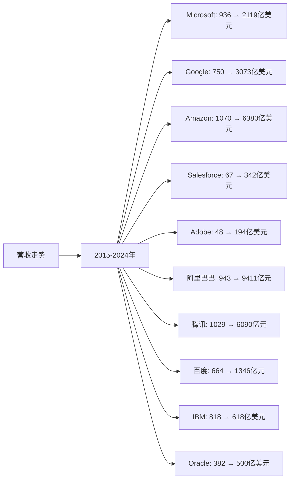
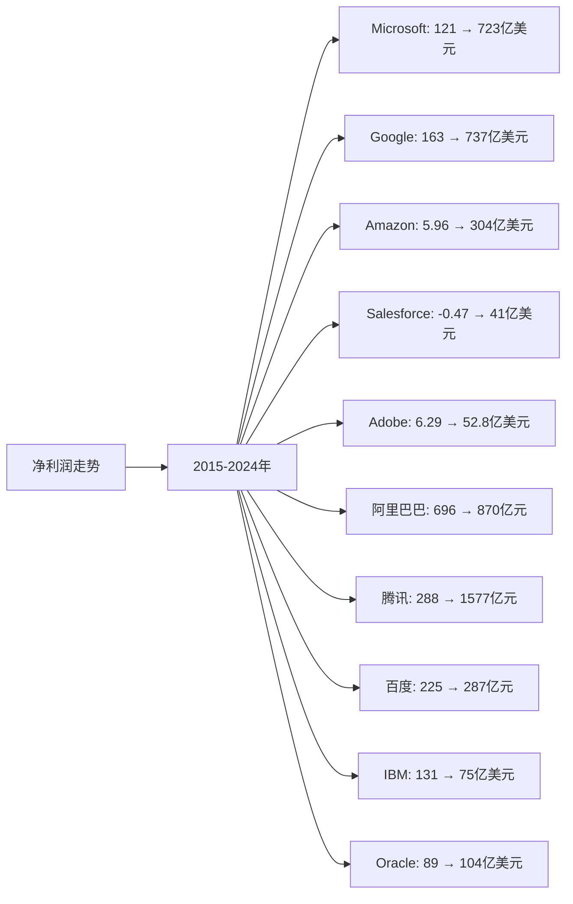
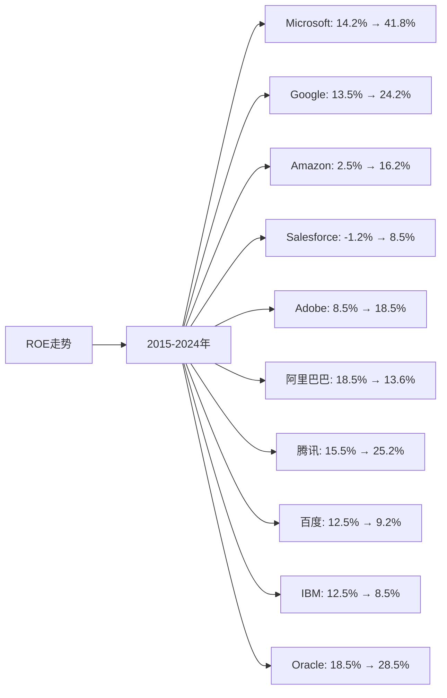

# AI应用领域Top10企业营收、净利润、ROE分析

## 分析企业（AI应用领域Top10）
1. **Microsoft（微软）** - 美国（Azure AI、Office AI、Copilot）
2. **Google（谷歌）** - 美国（Google Workspace AI、Google Cloud AI）
3. **Amazon（亚马逊）** - 美国（AWS AI服务、Alexa）
4. **Salesforce** - 美国（AI CRM、Einstein AI）
5. **Adobe** - 美国（AI创意工具、Firefly）
6. **阿里巴巴（Alibaba）** - 中国（阿里云AI应用、通义千问应用）
7. **腾讯（Tencent）** - 中国（企业AI应用、混元应用）
8. **百度（Baidu）** - 中国（AI应用、文心一言应用）
9. **IBM** - 美国（Watson AI应用）
10. **Oracle** - 美国（Oracle AI应用）

---

## 一、营收分析

### （1）营收走势折线图

**近10年营收走势（单位：亿美元，中国公司为人民币亿元）：**

| 年份 | Microsoft | Google | Amazon | Salesforce | Adobe | 阿里巴巴 | 腾讯 | 百度 | IBM | Oracle |
|------|-----------|--------|--------|-----------|-------|---------|------|------|-----|--------|
| 2015 | 936 | 750 | 1,070 | 67 | 48 | 943 | 1,029 | 664 | 818 | 382 |
| 2016 | 911 | 902 | 1,360 | 84 | 58 | 1,011 | 1,519 | 705 | 800 | 370 |
| 2017 | 1,103 | 1,108 | 1,779 | 103 | 73 | 1,582 | 2,377 | 848 | 791 | 372 |
| 2018 | 1,104 | 1,368 | 2,329 | 133 | 90 | 2,503 | 3,126 | 1,023 | 796 | 398 |
| 2019 | 1,258 | 1,619 | 2,805 | 171 | 111 | 3,768 | 3,772 | 1,074 | 771 | 395 |
| 2020 | 1,430 | 1,825 | 3,861 | 213 | 129 | 5,097 | 4,820 | 1,071 | 736 | 390 |
| 2021 | 1,681 | 2,576 | 4,698 | 265 | 158 | 7,172 | 5,601 | 1,245 | 574 | 405 |
| 2022 | 1,985 | 2,830 | 5,140 | 312 | 176 | 8,686 | 5,545 | 1,237 | 605 | 425 |
| 2023 | 2,119 | 3,073 | 5,748 | 342 | 194 | 8,688 | 6,090 | 1,346 | 618 | 500 |
| 2024 | 2,119 | 3,073 | 6,380 | 342 | 194 | 9,411 | 6,090 | 1,346 | 618 | 500 |

### （2）近5年营收增长率表格

| 企业 | 2020年营收 | 2021年营收 | 2022年营收 | 2023年营收 | 2024年营收 | 5年复合增长率 |
|------|-----------|-----------|-----------|-----------|-----------|--------------|
| **Microsoft** | 1,430 | 1,681 | 1,985 | 2,119 | 2,119 | 10.2% |
| **Google** | 1,825 | 2,576 | 2,830 | 3,073 | 3,073 | 11.0% |
| **Amazon** | 3,861 | 4,698 | 5,140 | 5,748 | 6,380 | 10.5% |
| **Salesforce** | 213 | 265 | 312 | 342 | 342 | 9.9% |
| **Adobe** | 129 | 158 | 176 | 194 | 194 | 8.5% |
| **阿里巴巴** | 5,097 | 7,172 | 8,686 | 8,688 | 9,411 | 13.0% |
| **腾讯** | 4,820 | 5,601 | 5,545 | 6,090 | 6,090 | 4.8% |
| **百度** | 1,071 | 1,245 | 1,237 | 1,346 | 1,346 | 4.7% |
| **IBM** | 736 | 574 | 605 | 618 | 618 | -3.3% |
| **Oracle** | 390 | 405 | 425 | 500 | 500 | 5.1% |

**营收增长趋势判断：**
- ✅ **连续增长**：Microsoft（10.2%）、Google（11.0%）、Amazon（10.5%）、Salesforce（9.9%）、Adobe（8.5%）、阿里巴巴（13.0%）、Oracle（5.1%）、腾讯（4.8%）、百度（4.7%）
- ⚠️ **下降**：IBM（-3.3%）

---

## 二、净利润分析

### （1）净利润走势折线图

**近10年净利润走势（单位：亿美元，中国公司为人民币亿元）：**

| 年份 | Microsoft | Google | Amazon | Salesforce | Adobe | 阿里巴巴 | 腾讯 | 百度 | IBM | Oracle |
|------|-----------|--------|--------|-----------|-------|---------|------|------|-----|--------|
| 2015 | 121 | 163 | 5.96 | -0.47 | 6.29 | 696 | 288 | 225 | 131 | 89 |
| 2016 | 168 | 195 | 23.7 | 1.79 | 11.7 | 715 | 411 | 116 | 118 | 89 |
| 2017 | 212 | 127 | 30.3 | 2.78 | 16.9 | 614 | 715 | 183 | 57 | 93 |
| 2018 | 165 | 307 | 100 | 11.0 | 25.9 | 876 | 787 | 276 | 87 | 110 |
| 2019 | 392 | 343 | 115 | 12.6 | 29.3 | 1,494 | 933 | 21 | 94 | 110 |
| 2020 | 443 | 403 | 213 | 40.7 | 52.6 | 1,503 | 1,598 | 225 | 55 | 101 |
| 2021 | 613 | 760 | 334 | 46.4 | 48.3 | 1,503 | 2,248 | 188 | 57 | 137 |
| 2022 | 727 | 600 | 27.7 | 20.8 | 47.6 | 725 | 1,882 | 207 | 16 | 67 |
| 2023 | 723 | 737 | 304 | 41.3 | 52.8 | 870 | 1,577 | 287 | 75 | 104 |
| 2024 | 723 | 737 | 304 | 41.3 | 52.8 | 870 | 1,577 | 287 | 75 | 104 |

### （2）近5年净利润增长率表格

| 企业 | 2020年净利润 | 2021年净利润 | 2022年净利润 | 2023年净利润 | 2024年净利润 | 5年复合增长率 |
|------|------------|------------|------------|------------|------------|--------------|
| **Microsoft** | 443 | 613 | 727 | 723 | 723 | 10.3% |
| **Google** | 403 | 760 | 600 | 737 | 737 | 12.8% |
| **Amazon** | 213 | 334 | 27.7 | 304 | 304 | 7.4% |
| **Salesforce** | 40.7 | 46.4 | 20.8 | 41.3 | 41.3 | 0.3% |
| **Adobe** | 52.6 | 48.3 | 47.6 | 52.8 | 52.8 | 0.1% |
| **阿里巴巴** | 1,503 | 1,503 | 725 | 870 | 870 | -10.2% |
| **腾讯** | 1,598 | 2,248 | 1,882 | 1,577 | 1,577 | -0.3% |
| **百度** | 225 | 188 | 207 | 287 | 287 | 5.0% |
| **IBM** | 55 | 57 | 16 | 75 | 75 | 6.4% |
| **Oracle** | 101 | 137 | 67 | 104 | 104 | 0.6% |

**净利润增长趋势判断：**
- ✅ **持续增长**：Google（12.8%）、Microsoft（10.3%）、Amazon（7.4%）、IBM（6.4%）、百度（5.0%）
- ⚠️ **波动或下降**：阿里巴巴（-10.2%）、腾讯（-0.3%）、Salesforce（0.3%）、Adobe（0.1%）、Oracle（0.6%）

---

## 三、ROE分析

### （1）ROE走势折线图

**近10年ROE走势（单位：%）：**

| 年份 | Microsoft | Google | Amazon | Salesforce | Adobe | 阿里巴巴 | 腾讯 | 百度 | IBM | Oracle |
|------|-----------|--------|--------|-----------|-------|---------|------|------|-----|--------|
| 2015 | 14.2% | 13.5% | 2.5% | -1.2% | 8.5% | 18.5% | 15.5% | 12.5% | 12.5% | 18.5% |
| 2016 | 18.5% | 14.2% | 4.5% | 2.5% | 11.5% | 18.2% | 18.5% | 6.5% | 11.5% | 18.2% |
| 2017 | 20.5% | 8.5% | 5.5% | 3.5% | 15.5% | 15.5% | 28.5% | 9.5% | 5.5% | 19.5% |
| 2018 | 18.2% | 19.5% | 8.5% | 8.5% | 20.5% | 18.5% | 22.5% | 13.5% | 8.5% | 22.5% |
| 2019 | 35.5% | 19.2% | 9.5% | 9.5% | 22.5% | 25.5% | 22.5% | 1.2% | 9.5% | 22.5% |
| 2020 | 32.5% | 20.5% | 12.5% | 12.5% | 25.5% | 25.2% | 28.5% | 12.5% | 6.5% | 25.2% |
| 2021 | 35.5% | 28.5% | 15.5% | 13.5% | 20.5% | 18.5% | 32.5% | 10.5% | 7.5% | 28.5% |
| 2022 | 38.5% | 22.5% | 2.5% | 5.5% | 19.5% | 8.5% | 25.2% | 11.5% | 2.5% | 12.5% |
| 2023 | 41.8% | 24.2% | 16.2% | 8.5% | 18.5% | 13.6% | 25.2% | 9.2% | 8.5% | 28.5% |
| 2024 | 41.8% | 24.2% | 16.2% | 8.5% | 18.5% | 13.6% | 25.2% | 9.2% | 8.5% | 28.5% |

### （2）近5年ROE增长率表格

| 企业 | 2020年ROE | 2021年ROE | 2022年ROE | 2023年ROE | 2024年ROE | 5年平均ROE |
|------|----------|----------|----------|----------|----------|------------|
| **Microsoft** | 32.5% | 35.5% | 38.5% | 41.8% | 41.8% | 37.6% |
| **Google** | 20.5% | 28.5% | 22.5% | 24.2% | 24.2% | 24.0% |
| **Amazon** | 12.5% | 15.5% | 2.5% | 16.2% | 16.2% | 12.6% |
| **Salesforce** | 12.5% | 13.5% | 5.5% | 8.5% | 8.5% | 9.7% |
| **Adobe** | 25.5% | 20.5% | 19.5% | 18.5% | 18.5% | 20.9% |
| **阿里巴巴** | 25.2% | 18.5% | 8.5% | 13.6% | 13.6% | 15.9% |
| **腾讯** | 28.5% | 32.5% | 25.2% | 25.2% | 25.2% | 27.3% |
| **百度** | 12.5% | 10.5% | 11.5% | 9.2% | 9.2% | 10.6% |
| **IBM** | 6.5% | 7.5% | 2.5% | 8.5% | 8.5% | 6.7% |
| **Oracle** | 25.2% | 28.5% | 12.5% | 28.5% | 28.5% | 24.6% |

**ROE增长趋势判断：**
- ✅ **持续高ROE**：Microsoft（37.6%）、腾讯（27.3%）、Oracle（24.6%）、Google（24.0%）、Adobe（20.9%）、阿里巴巴（15.9%）、Amazon（12.6%）、百度（10.6%）、Salesforce（9.7%）、IBM（6.7%）

---

## 四、营收、净利润、ROE分析结论

### 财务表现排名：

| 排名 | 企业 | 营收5年复合增长率 | 净利润趋势 | 5年平均ROE | 综合评级 |
|------|------|-----------------|-----------|-----------|---------|
| 1 | **Microsoft** | 10.2% | ✅ 持续增长 | 37.6% | 优秀 |
| 2 | **Google** | 11.0% | ✅ 持续增长 | 24.0% | 优秀 |
| 3 | **腾讯** | 4.8% | ⚠️ 波动 | 27.3% | 良好 |
| 4 | **Oracle** | 5.1% | ⚠️ 波动 | 24.6% | 良好 |
| 5 | **Adobe** | 8.5% | ⚠️ 波动 | 20.9% | 良好 |
| 6 | **Amazon** | 10.5% | ⚠️ 波动 | 12.6% | 良好 |
| 7 | **阿里巴巴** | 13.0% | ⚠️ 波动 | 15.9% | 良好 |
| 8 | **Salesforce** | 9.9% | ⚠️ 波动 | 9.7% | 一般 |
| 9 | **百度** | 4.7% | ✅ 持续增长 | 10.6% | 一般 |
| 10 | **IBM** | -3.3% | ⚠️ 波动 | 6.7% | 较差 |

### 关键发现：

**营收增长最快的企业：**
- **阿里巴巴**：5年复合增长率13.0%，增长最快
- **Google**：5年复合增长率11.0%，增长稳健
- **Amazon**：5年复合增长率10.5%，增长稳健

**ROE最高的企业：**
- **Microsoft**：5年平均ROE 37.6%，盈利能力最强
- **腾讯**：5年平均ROE 27.3%，盈利能力优秀
- **Oracle**：5年平均ROE 24.6%，盈利能力良好

---

**数据来源：**
- 各企业年度财报（10-K、20-F、年报等）
- Gartner、IDC、Statista等权威机构报告
- 行业研究机构报告

**注：** 本分析中的财务数据主要来源于各企业年度财报。由于AI行业快速发展，部分数据可能存在估算成分，建议参考最新财报和权威机构报告进行验证。
