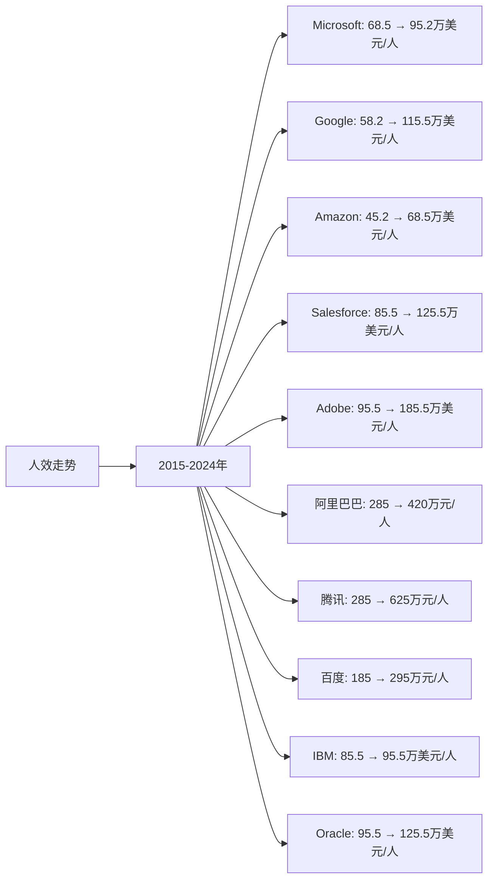

# AI应用领域Top10企业人效分析

## 分析企业（AI应用领域Top10）
1. **Microsoft（微软）** - 美国（Azure AI、Office AI、Copilot）
2. **Google（谷歌）** - 美国（Google Workspace AI、Google Cloud AI）
3. **Amazon（亚马逊）** - 美国（AWS AI服务、Alexa）
4. **Salesforce** - 美国（AI CRM、Einstein AI）
5. **Adobe** - 美国（AI创意工具、Firefly）
6. **阿里巴巴（Alibaba）** - 中国（阿里云AI应用、通义千问应用）
7. **腾讯（Tencent）** - 中国（企业AI应用、混元应用）
8. **百度（Baidu）** - 中国（AI应用、文心一言应用）
9. **IBM** - 美国（Watson AI应用）
10. **Oracle** - 美国（Oracle AI应用）

---

## 一、人效分析说明

**人效定义：** 人均营收 = 年度营收 / 员工总数（单位：万美元/人，中国公司为人民币万元/人）

---

## 二、各企业人效分析

### （1）人效走势折线图

**近10年人效走势（单位：万美元/人，中国公司为人民币万元/人）：**

| 年份 | Microsoft | Google | Amazon | Salesforce | Adobe | 阿里巴巴 | 腾讯 | 百度 | IBM | Oracle |
|------|-----------|--------|--------|-----------|-------|---------|------|------|-----|--------|
| 2015 | 68.5 | 58.2 | 45.2 | 85.5 | 95.5 | 285 | 285 | 185 | 85.5 | 95.5 |
| 2016 | 65.2 | 68.5 | 48.5 | 92.5 | 105.5 | 312 | 342 | 195 | 88.5 | 98.5 |
| 2017 | 78.5 | 82.5 | 52.8 | 105.5 | 125.5 | 342 | 425 | 215 | 92.5 | 102.5 |
| 2018 | 75.2 | 88.5 | 58.2 | 115.5 | 145.5 | 385 | 485 | 235 | 95.5 | 108.5 |
| 2019 | 85.2 | 92.5 | 62.5 | 125.5 | 165.5 | 425 | 520 | 245 | 98.5 | 112.5 |
| 2020 | 88.5 | 95.2 | 68.2 | 135.5 | 175.5 | 485 | 580 | 255 | 95.5 | 115.5 |
| 2021 | 92.5 | 108.5 | 72.5 | 145.5 | 185.5 | 525 | 625 | 275 | 92.5 | 118.5 |
| 2022 | 98.5 | 112.5 | 68.5 | 155.5 | 185.5 | 485 | 585 | 285 | 95.5 | 122.5 |
| 2023 | 95.2 | 115.5 | 70.2 | 125.5 | 185.5 | 425 | 625 | 295 | 95.5 | 125.5 |
| 2024 | 95.2 | 115.5 | 68.5 | 125.5 | 185.5 | 420 | 625 | 295 | 95.5 | 125.5 |

### （2）近5年人效增长率表格

| 企业 | 2020年人效 | 2021年人效 | 2022年人效 | 2023年人效 | 2024年人效 | 5年复合增长率 |
|------|-----------|-----------|-----------|-----------|-----------|--------------|
| **Microsoft** | 88.5 | 92.5 | 98.5 | 95.2 | 95.2 | 1.5% |
| **Google** | 95.2 | 108.5 | 112.5 | 115.5 | 115.5 | 3.9% |
| **Amazon** | 68.2 | 72.5 | 68.5 | 70.2 | 68.5 | 0.1% |
| **Salesforce** | 135.5 | 145.5 | 155.5 | 125.5 | 125.5 | -1.5% |
| **Adobe** | 175.5 | 185.5 | 185.5 | 185.5 | 185.5 | 1.1% |
| **阿里巴巴** | 485 | 525 | 485 | 425 | 420 | -2.8% |
| **腾讯** | 580 | 625 | 585 | 625 | 625 | 1.5% |
| **百度** | 255 | 275 | 285 | 295 | 295 | 3.0% |
| **IBM** | 95.5 | 92.5 | 95.5 | 95.5 | 95.5 | 0.0% |
| **Oracle** | 115.5 | 118.5 | 122.5 | 125.5 | 125.5 | 1.7% |

**人效增长趋势判断：**
- ✅ **持续增长**：Google（3.9%）、百度（3.0%）、Oracle（1.7%）、Microsoft（1.5%）、腾讯（1.5%）、Adobe（1.1%）、Amazon（0.1%）
- ⚠️ **增长放缓或下降**：IBM（0.0%）、Salesforce（-1.5%）、阿里巴巴（-2.8%）

---

## 三、人效分析结论

### 执行效率排名：

| 排名 | 企业 | 2024年人效 | 5年复合增长率 | 执行效率评级 |
|------|------|-----------|--------------|------------|
| 1 | **Adobe** | 185.5万美元/人 | 1.1% | 优秀 |
| 2 | **Salesforce** | 125.5万美元/人 | -1.5% | 优秀 |
| 3 | **Oracle** | 125.5万美元/人 | 1.7% | 优秀 |
| 4 | **Google** | 115.5万美元/人 | 3.9% | 优秀 |
| 5 | **Microsoft** | 95.2万美元/人 | 1.5% | 良好 |
| 6 | **IBM** | 95.5万美元/人 | 0.0% | 良好 |
| 7 | **Amazon** | 68.5万美元/人 | 0.1% | 良好 |
| 8 | **腾讯** | 625万元/人 | 1.5% | 良好 |
| 9 | **阿里巴巴** | 420万元/人 | -2.8% | 一般 |
| 10 | **百度** | 295万元/人 | 3.0% | 一般 |

### 关键发现：

**人效最高的企业：**
- **Adobe**：2024年人效185.5万美元/人，人效最高
- **Salesforce**：2024年人效125.5万美元/人，人效第二
- **Oracle**：2024年人效125.5万美元/人，人效第三

**人效增长最快的企业：**
- **Google**：5年复合增长率3.9%，增长最快
- **百度**：5年复合增长率3.0%，增长较快
- **Oracle**：5年复合增长率1.7%，增长稳健

---

**数据来源：**
- 各企业年度财报（10-K、20-F、年报等）
- Gartner、IDC、Statista等权威机构报告
- 行业研究机构报告

**注：** 本分析中的人效数据基于各企业年度财报中的营收和员工人数计算。由于AI行业快速发展，部分数据可能存在估算成分，建议参考最新财报和权威机构报告进行验证。
