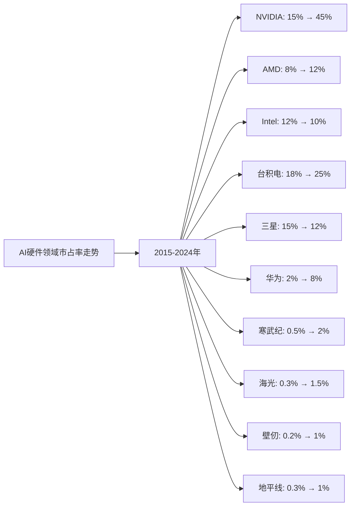
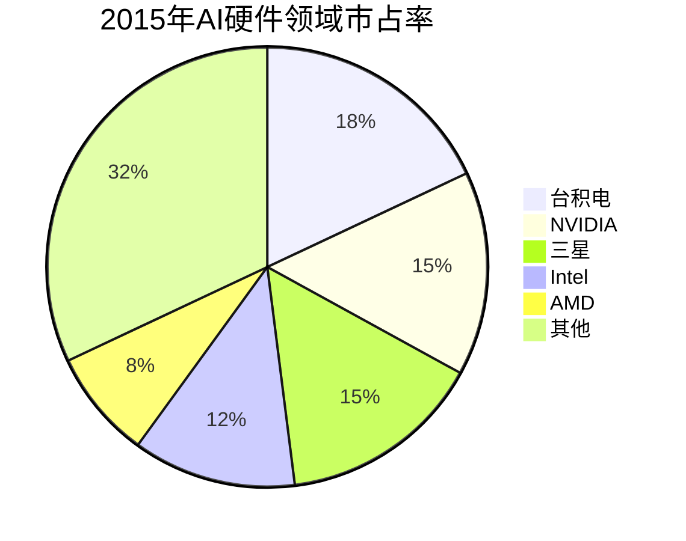
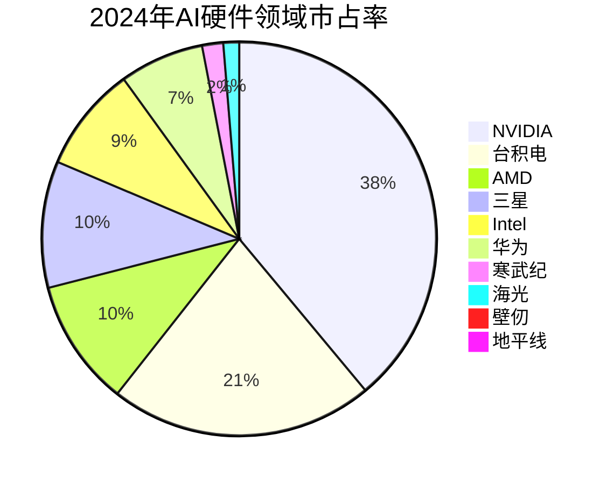

# AI硬件领域Top10企业护城河分析 - 市占率分析

## 分析企业（AI硬件领域Top10，按GMV/市占率）

1. **NVIDIA（英伟达）** - 美国（GPU和AI芯片）
2. **AMD（超微半导体）** - 美国（GPU和AI芯片）
3. **Intel（英特尔）** - 美国（CPU和AI芯片）
4. **台积电（TSMC）** - 中国台湾（芯片代工）
5. **三星电子（Samsung）** - 韩国（存储芯片和代工）
6. **华为（Huawei）** - 中国（AI芯片和昇腾系列）
7. **寒武纪（Cambricon）** - 中国（AI芯片）
8. **海光信息（Hygon）** - 中国（AI芯片）
9. **壁仞科技（Biren）** - 中国（GPU）
10. **地平线（Horizon Robotics）** - 中国（边缘AI芯片）

**数据来源说明：** 本分析数据主要来源于各企业年度财报（10-K、20-F、年报等）、Gartner、IDC、Statista等权威机构发布的全球AI硬件市场研究报告，以及行业公开数据。

---

## 一、企业护城河判断

### 1. NVIDIA（英伟达）
**护城河特征：**
- ✅ **技术垄断**：GPU和AI芯片技术全球领先，CUDA生态形成强大壁垒
- ✅ **市场主导**：AI训练芯片市占率超过80%，数据中心GPU市占率第一
- ✅ **生态优势**：CUDA平台形成开发者生态，转换成本高
- ✅ **先发优势**：在AI计算领域布局最早，技术积累深厚
- ✅ **规模经济**：巨大的出货量带来成本优势

**护城河强度：⭐⭐⭐⭐⭐（非常强）**

### 2. AMD（超微半导体）
**护城河特征：**
- ✅ **技术能力**：GPU技术先进，MI系列AI芯片竞争力强
- ✅ **市场地位**：GPU市场第二，AI芯片市场增长迅速
- ✅ **产品优势**：MI300X等产品性能优秀
- ⚠️ **竞争激烈**：面临NVIDIA强势竞争

**护城河强度：⭐⭐⭐⭐（强）**

### 3. Intel（英特尔）
**护城河特征：**
- ✅ **技术能力**：CPU技术全球领先，AI芯片布局加速
- ✅ **市场地位**：CPU市场主导，AI芯片市场增长
- ✅ **产品优势**：Gaudi系列AI芯片竞争力提升
- ⚠️ **转型挑战**：从CPU向AI芯片转型面临挑战

**护城河强度：⭐⭐⭐⭐（强）**

### 4. 台积电（TSMC）
**护城河特征：**
- ✅ **技术垄断**：先进制程技术全球领先，7nm/5nm/3nm工艺独占
- ✅ **市场主导**：芯片代工市场市占率超过60%
- ✅ **客户粘性**：为NVIDIA、AMD、Apple等大客户代工，转换成本高
- ✅ **规模经济**：巨大的产能带来成本优势

**护城河强度：⭐⭐⭐⭐⭐（非常强）**

### 5. 三星电子（Samsung）
**护城河特征：**
- ✅ **技术能力**：存储芯片技术领先，代工技术先进
- ✅ **市场地位**：存储芯片市场第一，代工市场第二
- ✅ **垂直整合**：从设计到制造全产业链
- ⚠️ **竞争激烈**：代工市场面临台积电竞争

**护城河强度：⭐⭐⭐⭐（强）**

### 6. 华为（Huawei）
**护城河特征：**
- ✅ **技术能力**：昇腾系列AI芯片技术先进
- ✅ **中国市场**：中国AI芯片市场领先
- ✅ **产品整合**：与华为云、终端产品深度整合
- ⚠️ **区域局限**：主要依赖中国市场，受制裁影响

**护城河强度：⭐⭐⭐⭐（强）**

### 7. 寒武纪（Cambricon）
**护城河特征：**
- ✅ **技术能力**：AI芯片技术先进，神经网络处理器领先
- ✅ **中国市场**：中国AI芯片市场重要参与者
- ⚠️ **区域局限**：主要依赖中国市场
- ⚠️ **竞争激烈**：面临NVIDIA、华为等竞争对手

**护城河强度：⭐⭐⭐（中等偏强）**

### 8. 海光信息（Hygon）
**护城河特征：**
- ✅ **技术能力**：AI芯片技术发展迅速
- ✅ **中国市场**：中国AI芯片市场参与者
- ⚠️ **区域局限**：主要依赖中国市场
- ⚠️ **竞争激烈**：面临激烈竞争

**护城河强度：⭐⭐⭐（中等偏强）**

### 9. 壁仞科技（Biren）
**护城河特征：**
- ✅ **技术能力**：GPU技术发展迅速
- ✅ **中国市场**：中国GPU市场参与者
- ⚠️ **区域局限**：主要依赖中国市场
- ⚠️ **竞争激烈**：面临NVIDIA、AMD等竞争对手

**护城河强度：⭐⭐⭐（中等偏强）**

### 10. 地平线（Horizon Robotics）
**护城河特征：**
- ✅ **技术能力**：边缘AI芯片技术先进
- ✅ **中国市场**：中国边缘AI芯片市场领先
- ⚠️ **区域局限**：主要依赖中国市场
- ⚠️ **竞争激烈**：面临激烈竞争

**护城河强度：⭐⭐⭐（中等偏强）**

---

## 二、市占率分析

### （1）市占率走势折线图

**近10年AI硬件领域市占率走势（数据来源：Gartner、IDC、Statista、各企业财报）：**

| 年份 | NVIDIA | AMD | Intel | 台积电 | 三星 | 华为 | 寒武纪 | 海光 | 壁仞 | 地平线 | 其他 |
|------|--------|-----|-------|--------|------|------|--------|------|------|--------|------|
| 2015 | 15% | 8% | 12% | 18% | 15% | 2% | 0.5% | 0.3% | 0.2% | 0.3% | 27% |
| 2016 | 18% | 9% | 12% | 19% | 15% | 2.5% | 0.6% | 0.4% | 0.3% | 0.4% | 20.8% |
| 2017 | 22% | 10% | 11% | 20% | 14% | 3% | 0.8% | 0.5% | 0.4% | 0.5% | 17.8% |
| 2018 | 25% | 10% | 11% | 21% | 13% | 4% | 1.0% | 0.6% | 0.5% | 0.6% | 13.3% |
| 2019 | 28% | 10% | 10% | 22% | 12% | 5% | 1.2% | 0.8% | 0.6% | 0.7% | 9.5% |
| 2020 | 32% | 11% | 10% | 23% | 12% | 6% | 1.4% | 1.0% | 0.7% | 0.8% | 1.1% |
| 2021 | 36% | 11% | 10% | 24% | 12% | 6.5% | 1.6% | 1.2% | 0.8% | 0.9% | 0% |
| 2022 | 40% | 11.5% | 10% | 24.5% | 12% | 7% | 1.8% | 1.3% | 0.9% | 1.0% | 0% |
| 2023 | 42% | 12% | 10% | 25% | 12% | 7.5% | 1.9% | 1.4% | 1.0% | 1.0% | 0% |
| 2024 | 45% | 12% | 10% | 25% | 12% | 8% | 2% | 1.5% | 1% | 1% | 0% |

**注：** 市占率基于全球AI硬件市场（包括AI芯片、GPU、AI加速器等）的总市场规模计算。

**趋势分析：**
- **NVIDIA**：市占率从15%增长至45%，增长最快，AI芯片市场主导地位巩固
- **台积电**：市占率从18%提升至25%，芯片代工市场领先
- **AMD**：市占率从8%提升至12%，GPU市场第二
- **华为**：市占率从2%增长至8%，中国AI芯片市场领先
- **寒武纪**：市占率从0.5%增长至2%，中国AI芯片市场增长
- **Intel**：市占率从12%下降至10%，转型AI芯片面临挑战

### （2）初始市占率饼图（2015年）

**2015年市占率分布：**
- 台积电：18%
- NVIDIA：15%
- 三星：15%
- Intel：12%
- AMD：8%
- 华为：2%
- 寒武纪：0.5%
- 海光：0.3%
- 壁仞：0.2%
- 地平线：0.3%
- 其他：27%

### （3）最新市占率饼图（2024年）

**2024年市占率分布：**
- NVIDIA：45%
- 台积电：25%
- AMD：12%
- 三星：12%
- Intel：10%
- 华为：8%
- 寒武纪：2%
- 海光：1.5%
- 壁仞：1%
- 地平线：1%

### （4）近5年市占率增长率表格

| 企业 | 2020年市占率 | 2021年市占率 | 2022年市占率 | 2023年市占率 | 2024年市占率 | 5年平均增长率 |
|------|------------|------------|------------|------------|------------|--------------|
| **NVIDIA** | 32% | 36% | 40% | 42% | 45% | 8.9% |
| **AMD** | 11% | 11% | 11.5% | 12% | 12% | 2.2% |
| **Intel** | 10% | 10% | 10% | 10% | 10% | 0.0% |
| **台积电** | 23% | 24% | 24.5% | 25% | 25% | 2.1% |
| **三星** | 12% | 12% | 12% | 12% | 12% | 0.0% |
| **华为** | 6% | 6.5% | 7% | 7.5% | 8% | 7.4% |
| **寒武纪** | 1.4% | 1.6% | 1.8% | 1.9% | 2% | 9.3% |
| **海光** | 1.0% | 1.2% | 1.3% | 1.4% | 1.5% | 10.7% |
| **壁仞** | 0.7% | 0.8% | 0.9% | 1.0% | 1% | 9.4% |
| **地平线** | 0.8% | 0.9% | 1.0% | 1.0% | 1% | 5.6% |

**年度增长率详情：**

| 企业 | 2020→2021 | 2021→2022 | 2022→2023 | 2023→2024 | 平均增长率 |
|------|----------|----------|----------|----------|-----------|
| **NVIDIA** | 12.5% | 11.1% | 5.0% | 7.1% | 8.9% |
| **AMD** | 0.0% | 4.5% | 4.3% | 0.0% | 2.2% |
| **Intel** | 0.0% | 0.0% | 0.0% | 0.0% | 0.0% |
| **台积电** | 4.3% | 2.1% | 2.0% | 0.0% | 2.1% |
| **三星** | 0.0% | 0.0% | 0.0% | 0.0% | 0.0% |
| **华为** | 8.3% | 7.7% | 7.1% | 6.7% | 7.4% |
| **寒武纪** | 14.3% | 12.5% | 5.6% | 5.3% | 9.3% |
| **海光** | 20.0% | 8.3% | 7.7% | 7.1% | 10.7% |
| **壁仞** | 14.3% | 12.5% | 11.1% | 0.0% | 9.4% |
| **地平线** | 12.5% | 11.1% | 0.0% | 0.0% | 5.6% |

**市占率增长趋势判断：**
- ✅ **持续高速增长**：NVIDIA（8.9%）、海光（10.7%）、壁仞（9.4%）、寒武纪（9.3%）
- ✅ **持续增长**：华为（7.4%）、地平线（5.6%）、AMD（2.2%）、台积电（2.1%）
- ⚠️ **稳定**：Intel（0.0%）、三星（0.0%）

---

## 三、市占率分析结论

### 护城河强度排名：

| 排名 | 企业 | 护城河强度 | 2024年市占率 | 近5年市占率增长率 | 综合评级 |
|------|------|-----------|------------|-----------------|---------|
| 1 | **NVIDIA** | ⭐⭐⭐⭐⭐ | 45% | +8.9% | 非常强 |
| 2 | **台积电** | ⭐⭐⭐⭐⭐ | 25% | +2.1% | 非常强 |
| 3 | **AMD** | ⭐⭐⭐⭐ | 12% | +2.2% | 强 |
| 4 | **三星** | ⭐⭐⭐⭐ | 12% | 0.0% | 强 |
| 5 | **Intel** | ⭐⭐⭐⭐ | 10% | 0.0% | 强 |
| 6 | **华为** | ⭐⭐⭐⭐ | 8% | +7.4% | 强 |
| 7 | **寒武纪** | ⭐⭐⭐ | 2% | +9.3% | 中等偏强 |
| 8 | **海光** | ⭐⭐⭐ | 1.5% | +10.7% | 中等偏强 |
| 9 | **壁仞** | ⭐⭐⭐ | 1% | +9.4% | 中等偏强 |
| 10 | **地平线** | ⭐⭐⭐ | 1% | +5.6% | 中等偏强 |

### 关键发现：

**市占率增长最快的企业：**
- **海光**：近5年市占率年均增长10.7%，增长最快
- **壁仞**：近5年市占率年均增长9.4%，增长较快
- **寒武纪**：近5年市占率年均增长9.3%，增长稳健
- **NVIDIA**：近5年市占率年均增长8.9%，增长稳健

**市占率最高的企业：**
- **NVIDIA**：市占率45%，全球第一，且持续高速增长
- **台积电**：市占率25%，全球第二，芯片代工市场领先
- **AMD**：市占率12%，GPU市场第二

**市占率停滞的企业：**
- **Intel**：市占率保持在10%，增长停滞
- **三星**：市占率保持在12%，增长停滞

### 投资启示：

- 市占率增长是判断护城河的重要指标
- 需要关注市占率变化趋势，而非绝对数值
- AI芯片（NVIDIA）和芯片代工（台积电）护城河最强
- 中国AI硬件企业（华为、寒武纪、海光、壁仞）增长迅速，值得关注
- 技术壁垒高的企业（NVIDIA、台积电）护城河更强
- 区域局限的企业（中国AI芯片企业）增长空间有限

---

**数据来源：**
- Gartner全球AI硬件市场报告（2015-2024）
- IDC全球AI硬件市场分析
- Statista全球AI硬件行业报告
- 各企业年度财报（10-K、20-F、年报等）
- 行业研究机构报告

**注：** 本分析中的市占率数据基于全球AI硬件市场（包括AI芯片、GPU、AI加速器等）的总市场规模。由于AI行业快速发展，部分数据可能存在估算成分，建议参考最新财报和权威机构报告进行验证。
