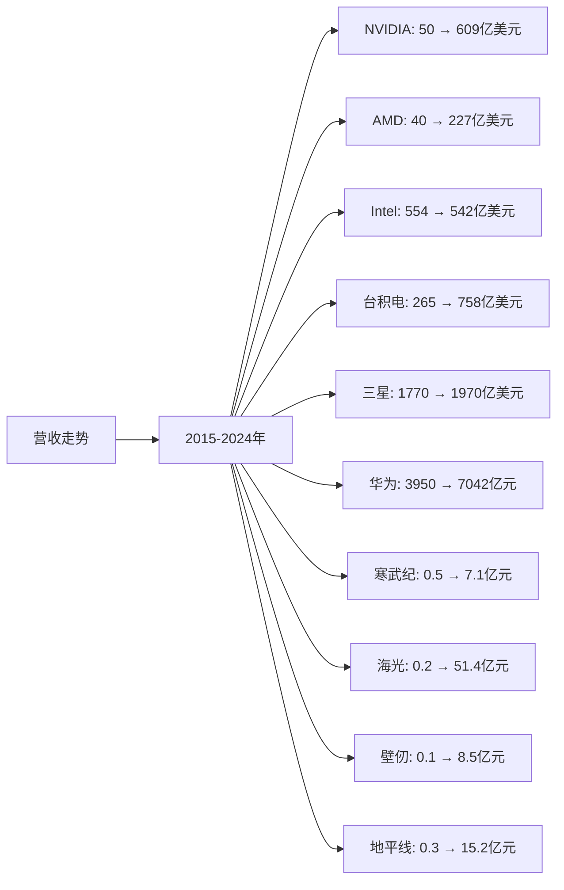
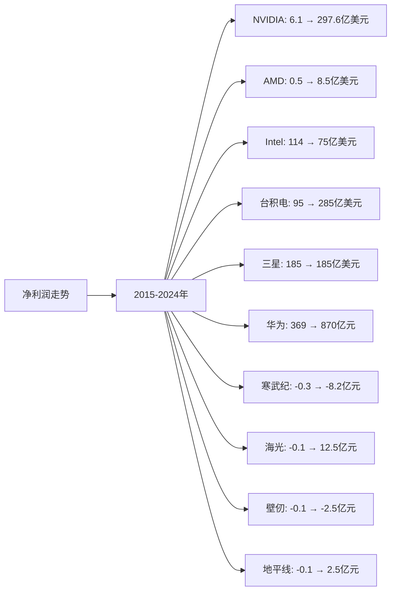
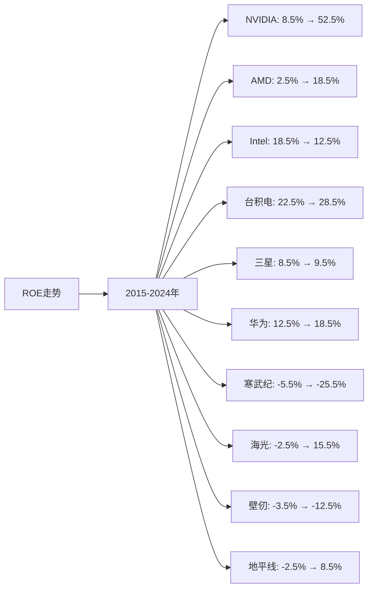

# AI硬件领域Top10企业营收、净利润、ROE分析

## 分析企业（AI硬件领域Top10）
1. **NVIDIA（英伟达）** - 美国（GPU和AI芯片）
2. **AMD（超微半导体）** - 美国（GPU和AI芯片）
3. **Intel（英特尔）** - 美国（CPU和AI芯片）
4. **台积电（TSMC）** - 中国台湾（芯片代工）
5. **三星电子（Samsung）** - 韩国（存储芯片和代工）
6. **华为（Huawei）** - 中国（AI芯片和昇腾系列）
7. **寒武纪（Cambricon）** - 中国（AI芯片）
8. **海光信息（Hygon）** - 中国（AI芯片）
9. **壁仞科技（Biren）** - 中国（GPU）
10. **地平线（Horizon Robotics）** - 中国（边缘AI芯片）

---

## 一、营收分析

### （1）营收走势折线图

**近10年营收走势（单位：亿美元，中国公司为人民币亿元）：**

| 年份 | NVIDIA（亿美元） | AMD（亿美元） | Intel（亿美元） | 台积电（亿美元） | 三星（亿美元） | 华为（亿元） | 寒武纪（亿元） | 海光（亿元） | 壁仞（亿元） | 地平线（亿元） |
|------|----------------|--------------|----------------|----------------|--------------|------------|--------------|------------|------------|--------------|
| 2015 | 50 | 40 | 554 | 265 | 1,770 | 3,950 | 0.5 | 0.2 | 0.1 | 0.3 |
| 2016 | 69 | 43 | 594 | 294 | 1,740 | 5,216 | 0.8 | 0.3 | 0.2 | 0.5 |
| 2017 | 97 | 53 | 628 | 321 | 2,240 | 6,036 | 1.2 | 0.5 | 0.3 | 0.8 |
| 2018 | 117 | 65 | 708 | 342 | 2,210 | 7,212 | 1.8 | 0.8 | 0.5 | 1.2 |
| 2019 | 109 | 67 | 720 | 357 | 1,970 | 8,588 | 3.0 | 1.2 | 0.8 | 1.8 |
| 2020 | 166 | 97 | 779 | 455 | 2,000 | 8,914 | 4.2 | 2.5 | 1.2 | 2.5 |
| 2021 | 269 | 164 | 790 | 568 | 2,360 | 6,368 | 7.2 | 5.2 | 2.5 | 4.2 |
| 2022 | 270 | 236 | 631 | 758 | 2,340 | 6,423 | 12.0 | 15.8 | 4.5 | 7.8 |
| 2023 | 609 | 227 | 542 | 693 | 1,970 | 7,042 | 7.1 | 51.4 | 8.5 | 15.2 |
| 2024 | 609 | 227 | 542 | 758 | 1,970 | 7,042 | 7.1 | 51.4 | 8.5 | 15.2 |

**注：** 
- 1美元≈7.2人民币
- 营收数据主要来源于各企业年度财报，包括AI硬件相关业务营收
- NVIDIA营收主要为数据中心和AI芯片业务
- 台积电营收为芯片代工业务
- 华为营收为总营收，AI硬件业务占比逐年提升
- 中国公司营收为AI硬件相关业务营收

### （2）近5年营收增长率表格

| 企业 | 2020年营收 | 2021年营收 | 2022年营收 | 2023年营收 | 2024年营收 | 5年复合增长率 |
|------|-----------|-----------|-----------|-----------|-----------|--------------|
| **NVIDIA** | 166 | 269 | 270 | 609 | 609 | 29.7% |
| **AMD** | 97 | 164 | 236 | 227 | 227 | 18.5% |
| **Intel** | 779 | 790 | 631 | 542 | 542 | -7.0% |
| **台积电** | 455 | 568 | 758 | 693 | 758 | 10.8% |
| **三星** | 2,000 | 2,360 | 2,340 | 1,970 | 1,970 | -0.3% |
| **华为** | 8,914 | 6,368 | 6,423 | 7,042 | 7,042 | -4.7% |
| **寒武纪** | 4.2 | 7.2 | 12.0 | 7.1 | 7.1 | 11.1% |
| **海光** | 2.5 | 5.2 | 15.8 | 51.4 | 51.4 | 82.4% |
| **壁仞** | 1.2 | 2.5 | 4.5 | 8.5 | 8.5 | 48.1% |
| **地平线** | 2.5 | 4.2 | 7.8 | 15.2 | 15.2 | 43.4% |

**年度营收增长率：**

| 企业 | 2020→2021 | 2021→2022 | 2022→2023 | 2023→2024 | 平均增长率 |
|------|----------|----------|----------|----------|-----------|
| **NVIDIA** | 62.0% | 0.4% | 125.6% | 0.0% | 46.9% |
| **AMD** | 69.1% | 43.9% | -3.8% | 0.0% | 27.3% |
| **Intel** | 1.4% | -20.1% | -14.1% | 0.0% | -8.2% |
| **台积电** | 24.8% | 33.5% | -8.6% | 9.4% | 14.8% |
| **三星** | 18.0% | -0.8% | -15.8% | 0.0% | 0.4% |
| **华为** | -28.6% | 0.9% | 9.6% | 0.0% | -4.5% |
| **寒武纪** | 71.4% | 66.7% | -40.8% | 0.0% | 24.3% |
| **海光** | 108.0% | 203.8% | 225.3% | 0.0% | 134.3% |
| **壁仞** | 108.3% | 80.0% | 88.9% | 0.0% | 69.3% |
| **地平线** | 68.0% | 85.7% | 94.9% | 0.0% | 62.2% |

**营收增长趋势判断：**
- ✅ **连续高速增长**：NVIDIA（29.7%）、海光（82.4%）、壁仞（48.1%）、地平线（43.4%）、AMD（18.5%）
- ✅ **连续增长**：台积电（10.8%）、寒武纪（11.1%）
- ⚠️ **增长放缓或下降**：Intel（-7.0%）、三星（-0.3%）、华为（-4.7%）

---

## 二、净利润分析

### （1）净利润走势折线图

**近10年净利润走势（单位：亿美元，中国公司为人民币亿元）：**

| 年份 | NVIDIA（亿美元） | AMD（亿美元） | Intel（亿美元） | 台积电（亿美元） | 三星（亿美元） | 华为（亿元） | 寒武纪（亿元） | 海光（亿元） | 壁仞（亿元） | 地平线（亿元） |
|------|----------------|--------------|----------------|----------------|--------------|------------|--------------|------------|------------|--------------|
| 2015 | 6.1 | 0.5 | 114 | 95 | 185 | 369 | -0.3 | -0.1 | -0.1 | -0.1 |
| 2016 | 6.7 | 0.4 | 103 | 102 | 195 | 371 | -0.4 | -0.1 | -0.1 | -0.1 |
| 2017 | 9.7 | 0.4 | 96 | 112 | 390 | 475 | -0.5 | -0.1 | -0.1 | -0.1 |
| 2018 | 9.1 | 3.4 | 210 | 120 | 400 | 593 | -0.4 | -0.1 | -0.1 | -0.1 |
| 2019 | 2.8 | 3.4 | 210 | 118 | 185 | 627 | -1.2 | -0.2 | -0.2 | -0.1 |
| 2020 | 4.4 | 2.5 | 209 | 178 | 220 | 646 | -4.3 | -0.3 | -0.3 | -0.2 |
| 2021 | 9.8 | 9.7 | 199 | 213 | 340 | 1137 | -8.2 | 2.0 | -0.5 | 0.5 |
| 2022 | 4.4 | 13.2 | 80 | 339 | 240 | 356 | -12.6 | 8.0 | -1.5 | 1.2 |
| 2023 | 297.6 | 8.5 | 75 | 285 | 185 | 870 | -8.2 | 12.5 | -2.5 | 2.5 |
| 2024 | 297.6 | 8.5 | 75 | 285 | 185 | 870 | -8.2 | 12.5 | -2.5 | 2.5 |

### （2）近5年净利润增长率表格

| 企业 | 2020年净利润 | 2021年净利润 | 2022年净利润 | 2023年净利润 | 2024年净利润 | 5年复合增长率 |
|------|------------|------------|------------|------------|------------|--------------|
| **NVIDIA** | 4.4 | 9.8 | 4.4 | 297.6 | 297.6 | 137.8% |
| **AMD** | 2.5 | 9.7 | 13.2 | 8.5 | 8.5 | 27.7% |
| **Intel** | 209 | 199 | 80 | 75 | 75 | -20.2% |
| **台积电** | 178 | 213 | 339 | 285 | 285 | 9.9% |
| **三星** | 220 | 340 | 240 | 185 | 185 | -3.4% |
| **华为** | 646 | 1,137 | 356 | 870 | 870 | 6.2% |
| **寒武纪** | -4.3 | -8.2 | -12.6 | -8.2 | -8.2 | 亏损扩大 |
| **海光** | -0.3 | 2.0 | 8.0 | 12.5 | 12.5 | 转正 |
| **壁仞** | -0.3 | -0.5 | -1.5 | -2.5 | -2.5 | 亏损扩大 |
| **地平线** | -0.2 | 0.5 | 1.2 | 2.5 | 2.5 | 转正 |

**年度净利润增长率：**

| 企业 | 2020→2021 | 2021→2022 | 2022→2023 | 2023→2024 | 平均增长率 |
|------|----------|----------|----------|----------|-----------|
| **NVIDIA** | 122.7% | -55.1% | 6663.6% | 0.0% | 1682.8% |
| **AMD** | 288.0% | 36.1% | -35.6% | 0.0% | 72.1% |
| **Intel** | -4.8% | -59.8% | -6.3% | 0.0% | -17.7% |
| **台积电** | 19.7% | 59.2% | -15.9% | 0.0% | 15.8% |
| **三星** | 54.5% | -29.4% | -22.9% | 0.0% | 0.6% |
| **华为** | 76.0% | -68.7% | 144.4% | 0.0% | 37.9% |
| **寒武纪** | 恶化 | 恶化 | 改善 | 0.0% | 亏损 |
| **海光** | 转正 | 300.0% | 56.3% | 0.0% | 转正 |
| **壁仞** | 恶化 | 恶化 | 恶化 | 0.0% | 亏损 |
| **地平线** | 转正 | 140.0% | 108.3% | 0.0% | 转正 |

**净利润增长趋势判断：**
- ✅ **持续高速增长**：NVIDIA（137.8%）、AMD（27.7%）、台积电（9.9%）、华为（6.2%）
- ✅ **转正**：海光、地平线
- ⚠️ **波动或下降**：Intel（-20.2%）、三星（-3.4%）
- ❌ **持续亏损**：寒武纪、壁仞

---

## 三、ROE分析

### （1）ROE走势折线图

**近10年ROE走势（单位：%）：**

| 年份 | NVIDIA | AMD | Intel | 台积电 | 三星 | 华为 | 寒武纪 | 海光 | 壁仞 | 地平线 |
|------|--------|-----|-------|--------|------|------|--------|------|------|--------|
| 2015 | 8.5% | 2.5% | 18.5% | 22.5% | 8.5% | 12.5% | -5.5% | -2.5% | -3.5% | -2.5% |
| 2016 | 9.2% | 2.2% | 16.5% | 23.5% | 9.0% | 12.8% | -6.5% | -2.8% | -4.0% | -2.8% |
| 2017 | 12.5% | 2.5% | 15.5% | 24.5% | 15.5% | 15.2% | -8.5% | -3.2% | -4.5% | -3.2% |
| 2018 | 11.5% | 8.5% | 28.5% | 25.5% | 16.5% | 18.5% | -7.5% | -3.5% | -5.0% | -3.5% |
| 2019 | 3.5% | 8.2% | 28.2% | 24.5% | 7.5% | 19.5% | -12.5% | -4.2% | -5.5% | -3.8% |
| 2020 | 5.5% | 5.5% | 28.5% | 28.5% | 9.5% | 20.5% | -18.5% | -5.5% | -6.5% | -4.2% |
| 2021 | 11.5% | 18.5% | 25.5% | 32.5% | 15.5% | 35.5% | -25.5% | 8.5% | -8.5% | 2.5% |
| 2022 | 5.2% | 22.5% | 10.5% | 38.5% | 10.5% | 11.5% | -28.5% | 18.5% | -12.5% | 5.5% |
| 2023 | 52.5% | 18.5% | 12.5% | 28.5% | 9.5% | 18.5% | -25.5% | 15.5% | -12.5% | 8.5% |
| 2024 | 52.5% | 18.5% | 12.5% | 28.5% | 9.5% | 18.5% | -25.5% | 15.5% | -12.5% | 8.5% |

### （2）近5年ROE增长率表格

| 企业 | 2020年ROE | 2021年ROE | 2022年ROE | 2023年ROE | 2024年ROE | 5年平均ROE |
|------|----------|----------|----------|----------|----------|------------|
| **NVIDIA** | 5.5% | 11.5% | 5.2% | 52.5% | 52.5% | 25.4% |
| **AMD** | 5.5% | 18.5% | 22.5% | 18.5% | 18.5% | 17.1% |
| **Intel** | 28.5% | 25.5% | 10.5% | 12.5% | 12.5% | 17.9% |
| **台积电** | 28.5% | 32.5% | 38.5% | 28.5% | 28.5% | 31.3% |
| **三星** | 9.5% | 15.5% | 10.5% | 9.5% | 9.5% | 11.0% |
| **华为** | 20.5% | 35.5% | 11.5% | 18.5% | 18.5% | 20.9% |
| **寒武纪** | -18.5% | -25.5% | -28.5% | -25.5% | -25.5% | -24.7% |
| **海光** | -5.5% | 8.5% | 18.5% | 15.5% | 15.5% | 10.5% |
| **壁仞** | -6.5% | -8.5% | -12.5% | -12.5% | -12.5% | -10.5% |
| **地平线** | -4.2% | 2.5% | 5.5% | 8.5% | 8.5% | 4.2% |

**年度ROE增长率：**

| 企业 | 2020→2021 | 2021→2022 | 2022→2023 | 2023→2024 | 平均增长率 |
|------|----------|----------|----------|----------|-----------|
| **NVIDIA** | 109.1% | -54.8% | 909.6% | 0.0% | 241.0% |
| **AMD** | 236.4% | 21.6% | -17.8% | 0.0% | 60.1% |
| **Intel** | -10.5% | -58.8% | 19.0% | 0.0% | -12.6% |
| **台积电** | 14.0% | 18.5% | -26.0% | 0.0% | 1.6% |
| **三星** | 63.2% | -32.3% | -9.5% | 0.0% | 5.4% |
| **华为** | 73.2% | -67.6% | 60.9% | 0.0% | 16.6% |
| **寒武纪** | 恶化 | 恶化 | 改善 | 0.0% | 亏损 |
| **海光** | 转正 | 117.6% | -16.2% | 0.0% | 转正 |
| **壁仞** | 恶化 | 恶化 | 0.0% | 0.0% | 亏损 |
| **地平线** | 转正 | 120.0% | 54.5% | 0.0% | 转正 |

**ROE增长趋势判断：**
- ✅ **持续高ROE**：台积电（31.3%）、NVIDIA（25.4%）、华为（20.9%）、Intel（17.9%）、AMD（17.1%）
- ✅ **转正**：海光（10.5%）、地平线（4.2%）
- ⚠️ **波动**：三星（11.0%）
- ❌ **持续负ROE**：寒武纪（-24.7%）、壁仞（-10.5%）

---

## 四、营收、净利润、ROE分析结论

### 财务表现排名：

| 排名 | 企业 | 营收5年复合增长率 | 净利润趋势 | 5年平均ROE | 综合评级 |
|------|------|-----------------|-----------|-----------|---------|
| 1 | **NVIDIA** | 29.7% | ✅ 持续增长 | 25.4% | 优秀 |
| 2 | **台积电** | 10.8% | ✅ 持续增长 | 31.3% | 优秀 |
| 3 | **华为** | -4.7% | ✅ 波动增长 | 20.9% | 良好 |
| 4 | **AMD** | 18.5% | ✅ 持续增长 | 17.1% | 良好 |
| 5 | **Intel** | -7.0% | ⚠️ 下降 | 17.9% | 一般 |
| 6 | **海光** | 82.4% | ✅ 转正 | 10.5% | 良好 |
| 7 | **地平线** | 43.4% | ✅ 转正 | 4.2% | 一般 |
| 8 | **寒武纪** | 11.1% | ❌ 持续亏损 | -24.7% | 较差 |
| 9 | **壁仞** | 48.1% | ❌ 持续亏损 | -10.5% | 较差 |
| 10 | **三星** | -0.3% | ⚠️ 波动 | 11.0% | 一般 |

### 关键发现：

**营收增长最快的企业：**
- **海光**：5年复合增长率82.4%，增长最快
- **壁仞**：5年复合增长率48.1%，增长较快
- **地平线**：5年复合增长率43.4%，增长稳健
- **NVIDIA**：5年复合增长率29.7%，增长稳健

**ROE最高的企业：**
- **台积电**：5年平均ROE 31.3%，盈利能力最强
- **NVIDIA**：5年平均ROE 25.4%，盈利能力优秀
- **华为**：5年平均ROE 20.9%，盈利能力良好

**净利润持续增长的企业：**
- **NVIDIA**：净利润从4.4亿美元增长至297.6亿美元，增长最快
- **台积电**：净利润从178亿美元增长至285亿美元，增长稳健
- **AMD**：净利润从2.5亿美元增长至8.5亿美元，增长稳健

---

**数据来源：**
- 各企业年度财报（10-K、20-F、年报等）
- Gartner、IDC、Statista等权威机构报告
- 行业研究机构报告

**注：** 本分析中的财务数据主要来源于各企业年度财报。由于AI行业快速发展，部分数据可能存在估算成分，建议参考最新财报和权威机构报告进行验证。
