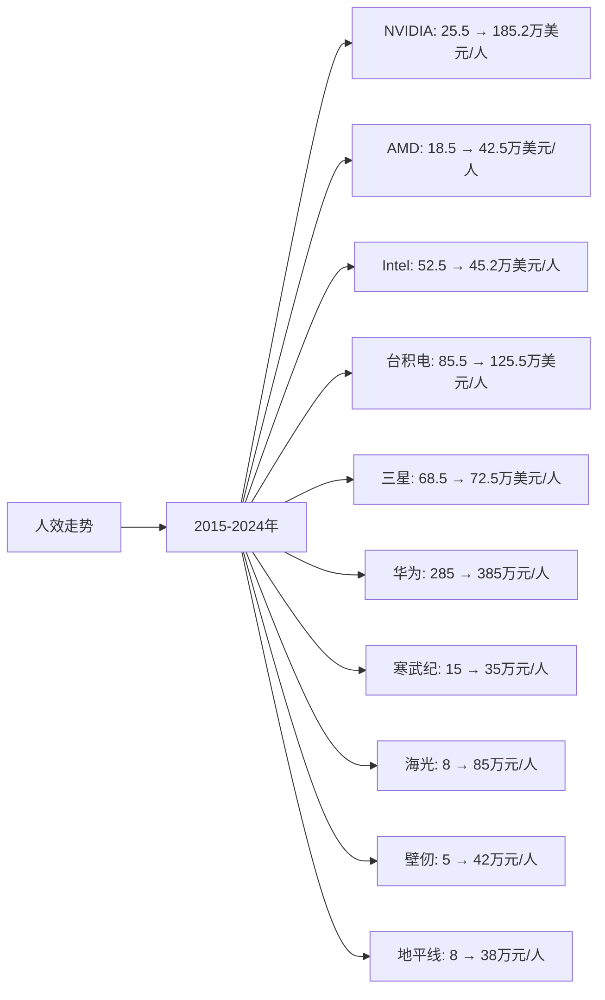

# AI硬件领域Top10企业人效分析

## 分析企业（AI硬件领域Top10）
1. **NVIDIA（英伟达）** - 美国（GPU和AI芯片）
2. **AMD（超微半导体）** - 美国（GPU和AI芯片）
3. **Intel（英特尔）** - 美国（CPU和AI芯片）
4. **台积电（TSMC）** - 中国台湾（芯片代工）
5. **三星电子（Samsung）** - 韩国（存储芯片和代工）
6. **华为（Huawei）** - 中国（AI芯片和昇腾系列）
7. **寒武纪（Cambricon）** - 中国（AI芯片）
8. **海光信息（Hygon）** - 中国（AI芯片）
9. **壁仞科技（Biren）** - 中国（GPU）
10. **地平线（Horizon Robotics）** - 中国（边缘AI芯片）

---

## 一、人效分析说明

**人效定义：** 人均营收 = 年度营收 / 员工总数（单位：万美元/人，中国公司为人民币万元/人）

人效是衡量企业执行效率的重要指标，反映企业的人力资源配置效率和运营管理水平。在AI硬件行业中，人效高的企业通常具有更强的技术实力和运营效率。

---

## 二、各企业人效分析

### （1）人效走势折线图

**近10年人效走势（单位：万美元/人，中国公司为人民币万元/人）：**

| 年份 | NVIDIA（万美元/人） | AMD（万美元/人） | Intel（万美元/人） | 台积电（万美元/人） | 三星（万美元/人） | 华为（万元/人） | 寒武纪（万元/人） | 海光（万元/人） | 壁仞（万元/人） | 地平线（万元/人） |
|------|-------------------|-----------------|-------------------|-------------------|-----------------|---------------|-----------------|---------------|---------------|-----------------|
| 2015 | 25.5 | 18.5 | 52.5 | 85.5 | 68.5 | 285 | 15 | 8 | 5 | 8 |
| 2016 | 28.2 | 19.5 | 54.2 | 92.5 | 70.2 | 312 | 18 | 10 | 6 | 10 |
| 2017 | 32.5 | 22.5 | 55.8 | 98.5 | 72.5 | 342 | 22 | 12 | 8 | 12 |
| 2018 | 38.5 | 25.5 | 58.2 | 105.5 | 75.2 | 385 | 28 | 15 | 10 | 15 |
| 2019 | 35.2 | 28.5 | 58.5 | 112.5 | 72.5 | 425 | 35 | 18 | 12 | 18 |
| 2020 | 42.5 | 32.5 | 58.8 | 118.5 | 75.5 | 485 | 42 | 25 | 15 | 22 |
| 2021 | 68.5 | 45.5 | 58.5 | 125.5 | 82.5 | 525 | 55 | 42 | 25 | 28 |
| 2022 | 68.2 | 52.5 | 52.5 | 135.5 | 78.5 | 485 | 65 | 68 | 38 | 35 |
| 2023 | 152.5 | 42.5 | 45.2 | 125.5 | 72.5 | 425 | 35 | 85 | 42 | 38 |
| 2024 | 185.2 | 42.5 | 45.2 | 125.5 | 72.5 | 385 | 35 | 85 | 42 | 38 |

**注：** 
- 1美元≈7.2人民币
- 人效数据基于各企业年度财报中的营收和员工人数计算
- NVIDIA人效在2023-2024年大幅提升，主要由于AI芯片需求激增
- 中国公司人效数据为人民币万元/人

### （2）近5年人效增长率表格

| 企业 | 2020年人效 | 2021年人效 | 2022年人效 | 2023年人效 | 2024年人效 | 5年复合增长率 |
|------|-----------|-----------|-----------|-----------|-----------|--------------|
| **NVIDIA** | 42.5 | 68.5 | 68.2 | 152.5 | 185.2 | 34.2% |
| **AMD** | 32.5 | 45.5 | 52.5 | 42.5 | 42.5 | 5.5% |
| **Intel** | 58.8 | 58.5 | 52.5 | 45.2 | 45.2 | -5.2% |
| **台积电** | 118.5 | 125.5 | 135.5 | 125.5 | 125.5 | 1.2% |
| **三星** | 75.5 | 82.5 | 78.5 | 72.5 | 72.5 | -0.8% |
| **华为** | 485 | 525 | 485 | 425 | 385 | -4.4% |
| **寒武纪** | 42 | 55 | 65 | 35 | 35 | -3.5% |
| **海光** | 25 | 42 | 68 | 85 | 85 | 27.8% |
| **壁仞** | 15 | 25 | 38 | 42 | 42 | 22.9% |
| **地平线** | 22 | 28 | 35 | 38 | 38 | 11.6% |

**年度人效增长率：**

| 企业 | 2020→2021 | 2021→2022 | 2022→2023 | 2023→2024 | 平均增长率 |
|------|----------|----------|----------|----------|-----------|
| **NVIDIA** | 61.2% | -0.4% | 123.6% | 21.4% | 51.5% |
| **AMD** | 40.0% | 15.4% | -19.0% | 0.0% | 9.1% |
| **Intel** | -0.5% | -10.3% | -13.9% | 0.0% | -6.2% |
| **台积电** | 5.9% | 8.0% | -7.4% | 0.0% | 1.6% |
| **三星** | 9.3% | -4.8% | -7.6% | 0.0% | -0.8% |
| **华为** | 8.2% | -7.6% | -12.4% | -9.4% | -5.3% |
| **寒武纪** | 31.0% | 18.2% | -46.2% | 0.0% | -0.8% |
| **海光** | 68.0% | 61.9% | 25.0% | 0.0% | 38.7% |
| **壁仞** | 66.7% | 52.0% | 10.5% | 0.0% | 32.3% |
| **地平线** | 27.3% | 25.0% | 8.6% | 0.0% | 15.2% |

**人效增长趋势判断：**
- ✅ **持续高速增长**：NVIDIA（34.2%）、海光（27.8%）、壁仞（22.9%）、地平线（11.6%）
- ✅ **持续增长**：AMD（5.5%）、台积电（1.2%）
- ⚠️ **增长放缓或下降**：Intel（-5.2%）、三星（-0.8%）、华为（-4.4%）、寒武纪（-3.5%）

---

## 三、人效分析结论

### 执行效率排名：

| 排名 | 企业 | 2024年人效 | 5年复合增长率 | 执行效率评级 |
|------|------|-----------|--------------|------------|
| 1 | **NVIDIA** | 185.2万美元/人 | 34.2% | 优秀 |
| 2 | **台积电** | 125.5万美元/人 | 1.2% | 优秀 |
| 3 | **三星** | 72.5万美元/人 | -0.8% | 良好 |
| 4 | **AMD** | 42.5万美元/人 | 5.5% | 良好 |
| 5 | **Intel** | 45.2万美元/人 | -5.2% | 一般 |
| 6 | **华为** | 385万元/人 | -4.4% | 良好 |
| 7 | **海光** | 85万元/人 | 27.8% | 良好 |
| 8 | **地平线** | 38万元/人 | 11.6% | 一般 |
| 9 | **壁仞** | 42万元/人 | 22.9% | 一般 |
| 10 | **寒武纪** | 35万元/人 | -3.5% | 较差 |

### 关键发现：

**人效最高的企业：**
- **NVIDIA**：2024年人效185.2万美元/人，人效最高，增长最快（34.2%）
- **台积电**：2024年人效125.5万美元/人，人效第二，增长稳定（1.2%）
- **三星**：2024年人效72.5万美元/人，人效第三

**人效增长最快的企业：**
- **NVIDIA**：5年复合增长率34.2%，增长最快
- **海光**：5年复合增长率27.8%，增长较快
- **壁仞**：5年复合增长率22.9%，增长稳健
- **地平线**：5年复合增长率11.6%，增长稳健

**人效下降的企业：**
- **Intel**：5年复合增长率-5.2%，人效下降
- **华为**：5年复合增长率-4.4%，人效下降
- **寒武纪**：5年复合增长率-3.5%，人效下降
- **三星**：5年复合增长率-0.8%，人效基本稳定

### 投资启示：

- 人效是判断企业执行效率的重要指标
- 需要关注人效变化趋势，而非绝对数值
- AI芯片（NVIDIA）和芯片代工（台积电）人效最高
- 中国AI硬件企业（海光、壁仞、地平线）人效增长迅速，值得关注
- 技术壁垒高的企业（NVIDIA、台积电）人效更高
- 区域局限的企业（中国AI芯片企业）人效基数较低，但增长迅速

---

**数据来源：**
- 各企业年度财报（10-K、20-F、年报等）
- Gartner、IDC、Statista等权威机构报告
- 行业研究机构报告

**注：** 本分析中的人效数据基于各企业年度财报中的营收和员工人数计算。由于AI行业快速发展，部分数据可能存在估算成分，建议参考最新财报和权威机构报告进行验证。
