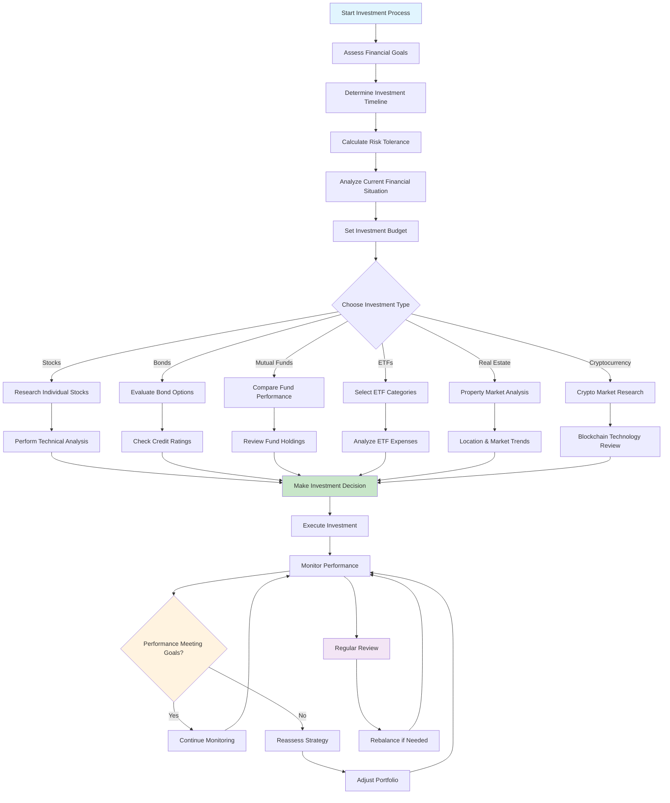
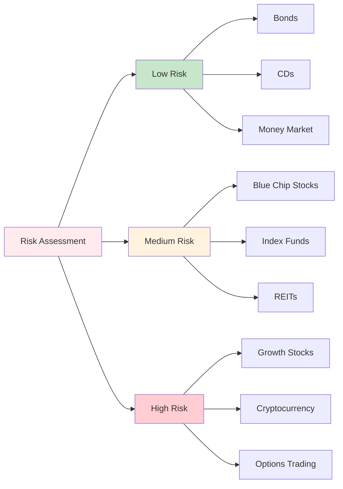
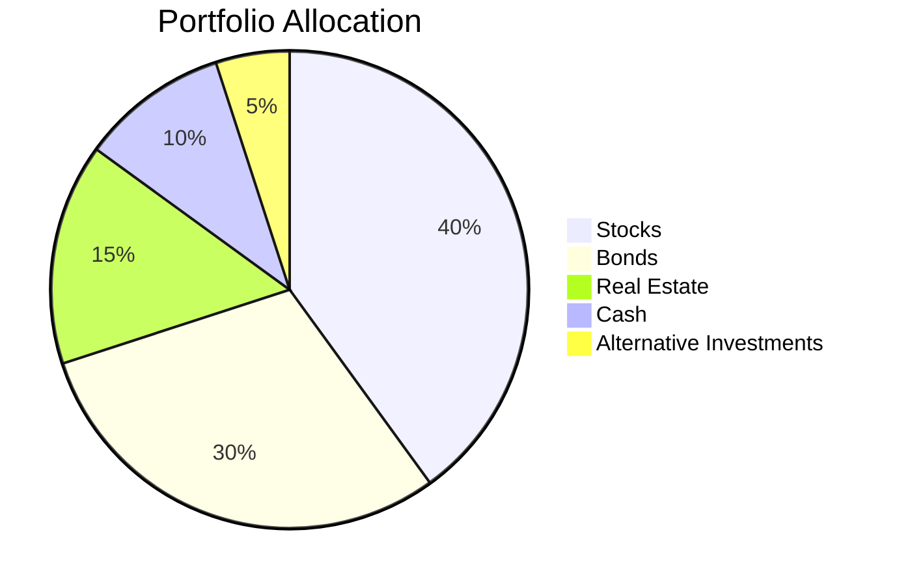
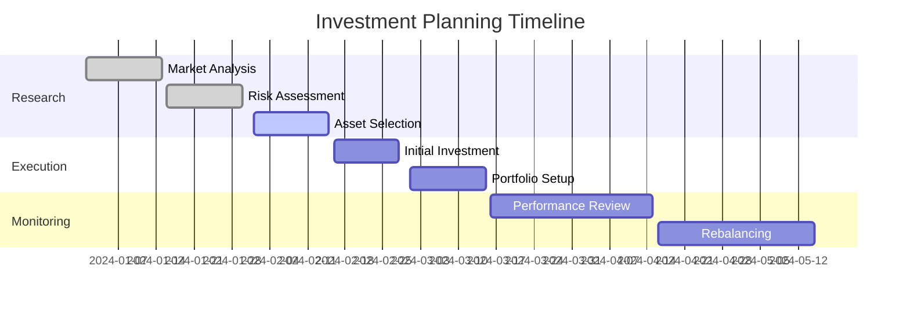

# Investment Flowchart

## Investment Decision Process

```mermaid
graph TD
    A[Start Investment Process] --> B[Assess Financial Goals]
    B --> C[Determine Investment Timeline]
    C --> D[Calculate Risk Tolerance]
    D --> E[Analyze Current Financial Situation]
    E --> F[Set Investment Budget]
    F --> G{Choose Investment Type}
    
    G -->|Stocks| H[Research Individual Stocks]
    G -->|Bonds| I[Evaluate Bond Options]
    G -->|Mutual Funds| J[Compare Fund Performance]
    G -->|ETFs| K[Select ETF Categories]
    G -->|Real Estate| L[Property Market Analysis]
    G -->|Cryptocurrency| M[Crypto Market Research]
    
    H --> N[Perform Technical Analysis]
    I --> O[Check Credit Ratings]
    J --> P[Review Fund Holdings]
    K --> Q[Analyze ETF Expenses]
    L --> R[Location & Market Trends]
    M --> S[Blockchain Technology Review]
    
    N --> T[Make Investment Decision]
    O --> T
    P --> T
    Q --> T
    R --> T
    S --> T
    
    T --> U[Execute Investment]
    U --> V[Monitor Performance]
    V --> W{Performance Meeting Goals?}
    W -->|Yes| X[Continue Monitoring]
    W -->|No| Y[Reassess Strategy]
    X --> V
    Y --> Z[Adjust Portfolio]
    Z --> V
    
    V --> AA[Regular Review]
    AA --> BB[Rebalance if Needed]
    BB --> V
    
    style A fill:#e1f5fe
    style T fill:#c8e6c9
    style W fill:#fff3e0
    style AA fill:#f3e5f5
```

## Investment Risk Assessment

```mermaid
graph LR
    A[Risk Assessment] --> B[Low Risk]
    A --> C[Medium Risk]
    A --> D[High Risk]
    
    B --> E[Bonds]
    B --> F[CDs]
    B --> G[Money Market]
    
    C --> H[Blue Chip Stocks]
    C --> I[Index Funds]
    C --> J[REITs]
    
    D --> K[Growth Stocks]
    D --> L[Cryptocurrency]
    D --> M[Options Trading]
    
    style A fill:#ffebee
    style B fill:#c8e6c9
    style C fill:#fff3e0
    style D fill:#ffcdd2
```

## Portfolio Diversification Strategy

```mermaid
pie title Portfolio Allocation
    "Stocks" : 40
    "Bonds" : 30
    "Real Estate" : 15
    "Cash" : 10
    "Alternative Investments" : 5
```

## Investment Timeline

```mermaid
gantt
    title Investment Planning Timeline
    dateFormat  YYYY-MM-DD
    section Research
    Market Analysis    :done, market, 2024-01-01, 2024-01-15
    Risk Assessment    :done, risk, 2024-01-16, 2024-01-30
    Asset Selection    :active, assets, 2024-02-01, 2024-02-15
    section Execution
    Initial Investment :investment, 2024-02-16, 2024-02-28
    Portfolio Setup    :portfolio, 2024-03-01, 2024-03-15
    section Monitoring
    Performance Review :review, 2024-03-16, 2024-04-15
    Rebalancing       :rebalance, 2024-04-16, 2024-05-15
``` 