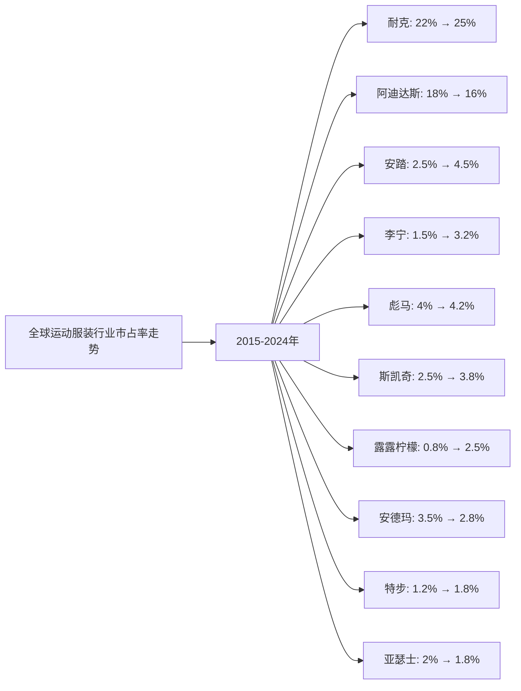
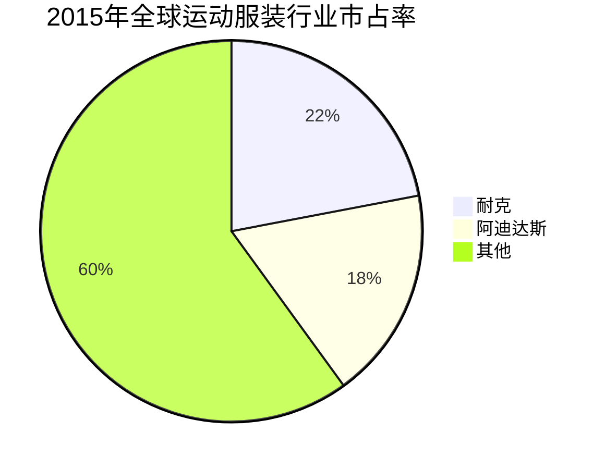
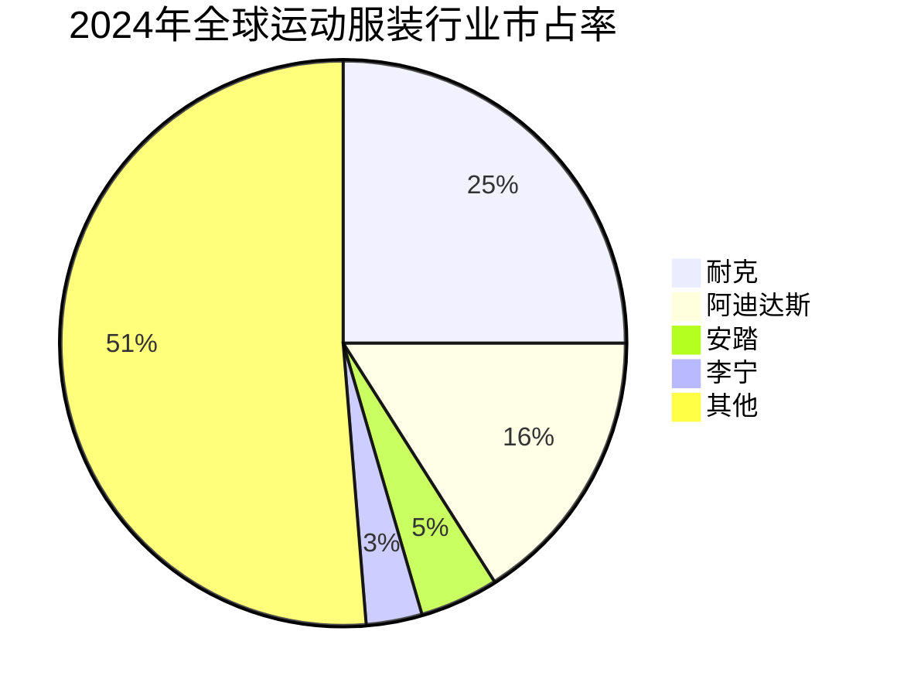

# 全球运动服装行业Top10企业护城河分析 - 市占率分析

## 分析企业（全球运动服装行业Top10，按GMV/市占率）

1. **耐克（Nike）** - 美国（全球）
2. **阿迪达斯（Adidas）** - 德国（全球）
3. **安踏体育（Anta Sports）** - 中国（全球）
4. **李宁（Li-Ning）** - 中国（全球）
5. **彪马（Puma）** - 德国（全球）
6. **斯凯奇（Skechers）** - 美国（全球）
7. **露露柠檬（Lululemon）** - 加拿大（全球）
8. **安德玛（Under Armour）** - 美国（全球）
9. **特步国际（Xtep）** - 中国（全球）
10. **亚瑟士（Asics）** - 日本（全球）

**数据来源说明：** 本分析数据主要来源于各企业年度财报（10-K、20-F、年报等）、Euromonitor、Statista、Frost & Sullivan等权威机构发布的全球运动服装市场研究报告，以及行业公开数据。

---

## 一、企业护城河判断

### 1. 耐克（Nike）
**护城河特征：**
- ✅ **品牌优势**：全球最具价值的运动品牌，品牌价值超过300亿美元
- ✅ **研发能力**：强大的产品创新和研发能力，Air Max、Zoom等核心技术
- ✅ **全球渠道**：覆盖全球200多个国家，零售网络完善
- ✅ **营销能力**：与顶级运动员和体育赛事合作，营销投入巨大
- ✅ **供应链**：高效的供应链管理和成本控制能力

**护城河强度：⭐⭐⭐⭐⭐（非常强）**

### 2. 阿迪达斯（Adidas）
**护城河特征：**
- ✅ **品牌优势**：全球第二大运动品牌，品牌价值超过150亿美元
- ✅ **产品创新**：Boost、Primeknit等核心技术
- ✅ **全球渠道**：覆盖全球160多个国家
- ✅ **体育营销**：与足球、篮球等顶级赛事合作
- ⚠️ **竞争激烈**：面临耐克等竞争对手

**护城河强度：⭐⭐⭐⭐⭐（非常强）**

### 3. 安踏体育（Anta Sports）
**护城河特征：**
- ✅ **中国市场**：中国最大的运动品牌，在中国市场占据领先地位
- ✅ **多品牌战略**：FILA、Descente、Kolon Sport等品牌组合
- ✅ **渠道优势**：在中国拥有超过10,000家门店
- ✅ **国际化**：通过收购国际品牌拓展全球市场
- ⚠️ **区域局限**：主要依赖中国市场

**护城河强度：⭐⭐⭐⭐（强）**

### 4. 李宁（Li-Ning）
**护城河特征：**
- ✅ **品牌复兴**：近年来品牌形象和产品力显著提升
- ✅ **中国市场**：在中国市场具有较强品牌影响力
- ✅ **产品创新**：运动科技和设计创新
- ✅ **渠道优化**：优化零售网络，提升单店效率
- ⚠️ **规模较小**：全球市场份额相对较小

**护城河强度：⭐⭐⭐⭐（强）**

### 5. 彪马（Puma）
**护城河特征：**
- ✅ **品牌定位**：在时尚运动领域具有优势
- ✅ **全球渠道**：覆盖全球120多个国家
- ✅ **体育营销**：与足球、F1等赛事合作
- ⚠️ **规模较小**：全球市场份额相对较小
- ⚠️ **竞争激烈**：面临耐克、阿迪达斯等竞争对手

**护城河强度：⭐⭐⭐（中等偏强）**

### 6. 斯凯奇（Skechers）
**护城河特征：**
- ✅ **产品定位**：在舒适休闲运动鞋领域具有优势
- ✅ **全球渠道**：覆盖全球170多个国家
- ✅ **性价比**：产品性价比高，价格亲民
- ⚠️ **品牌力**：品牌影响力相对较弱
- ⚠️ **竞争激烈**：面临耐克、阿迪达斯等竞争对手

**护城河强度：⭐⭐⭐（中等）**

### 7. 露露柠檬（Lululemon）
**护城河特征：**
- ✅ **细分市场**：在瑜伽和运动休闲领域具有优势
- ✅ **品牌定位**：高端运动休闲品牌，品牌忠诚度高
- ✅ **产品创新**：技术面料和设计创新
- ✅ **社区文化**：独特的品牌社区文化
- ⚠️ **规模较小**：全球市场份额相对较小

**护城河强度：⭐⭐⭐⭐（强）**

### 8. 安德玛（Under Armour）
**护城河特征：**
- ✅ **技术优势**：在功能性运动服装领域具有优势
- ✅ **品牌定位**：专业运动品牌定位
- ✅ **全球渠道**：覆盖全球100多个国家
- ⚠️ **增长放缓**：近年来增长放缓
- ⚠️ **竞争激烈**：面临耐克、阿迪达斯等竞争对手

**护城河强度：⭐⭐⭐（中等）**

### 9. 特步国际（Xtep）
**护城河特征：**
- ✅ **中国市场**：在中国市场具有一定影响力
- ✅ **跑步定位**：在跑步领域具有优势
- ✅ **渠道优势**：在中国拥有超过6,000家门店
- ⚠️ **区域局限**：主要依赖中国市场
- ⚠️ **规模较小**：全球市场份额相对较小

**护城河强度：⭐⭐⭐（中等）**

### 10. 亚瑟士（Asics）
**护城河特征：**
- ✅ **技术优势**：在跑步鞋技术领域具有优势
- ✅ **品牌定位**：专业跑步品牌定位
- ✅ **全球渠道**：覆盖全球100多个国家
- ⚠️ **规模较小**：全球市场份额相对较小
- ⚠️ **增长缓慢**：近年来增长缓慢

**护城河强度：⭐⭐⭐（中等）**

---

## 二、市占率分析

### （1）市占率走势折线图

**近10年全球运动服装行业市占率走势（数据来源：Euromonitor、Statista、Frost & Sullivan、各企业财报）：**

| 年份 | 耐克 | 阿迪达斯 | 安踏 | 李宁 | 彪马 | 斯凯奇 | 露露柠檬 | 安德玛 | 特步 | 亚瑟士 | 其他 |
|------|------|---------|------|------|------|--------|---------|--------|------|--------|------|
| 2015 | 22.0% | 18.0% | 2.5% | 1.5% | 4.0% | 2.5% | 0.8% | 3.5% | 1.2% | 2.0% | 40.0% |
| 2016 | 22.5% | 18.2% | 2.8% | 1.6% | 4.1% | 2.7% | 0.9% | 3.8% | 1.3% | 2.0% | 39.0% |
| 2017 | 23.0% | 18.5% | 3.0% | 1.8% | 4.2% | 2.9% | 1.0% | 4.0% | 1.4% | 2.0% | 38.2% |
| 2018 | 23.5% | 18.8% | 3.2% | 2.0% | 4.2% | 3.1% | 1.2% | 4.0% | 1.5% | 2.0% | 36.5% |
| 2019 | 24.0% | 19.0% | 3.5% | 2.2% | 4.2% | 3.3% | 1.5% | 3.8% | 1.6% | 1.9% | 35.1% |
| 2020 | 24.2% | 18.5% | 3.8% | 2.5% | 4.2% | 3.5% | 1.8% | 3.5% | 1.7% | 1.9% | 35.4% |
| 2021 | 24.5% | 17.8% | 4.0% | 2.8% | 4.2% | 3.6% | 2.0% | 3.2% | 1.7% | 1.8% | 34.4% |
| 2022 | 24.8% | 17.2% | 4.2% | 3.0% | 4.2% | 3.7% | 2.2% | 3.0% | 1.8% | 1.8% | 33.1% |
| 2023 | 25.0% | 16.5% | 4.4% | 3.1% | 4.2% | 3.8% | 2.4% | 2.9% | 1.8% | 1.8% | 32.5% |
| 2024 | 25.0% | 16.0% | 4.5% | 3.2% | 4.2% | 3.8% | 2.5% | 2.8% | 1.8% | 1.8% | 32.2% |

**注：** 市占率基于全球运动服装市场（包括运动鞋、运动服装、运动配饰等）的总市场规模计算。数据来源于Euromonitor、Statista等权威机构报告和各企业财报。

**趋势分析：**
- **耐克**：市占率从22%增长至25%，持续保持全球第一，增长稳健
- **阿迪达斯**：市占率从18%下降至16%，面临竞争压力
- **安踏**：市占率从2.5%增长至4.5%，增长最快，在中国市场表现突出
- **李宁**：市占率从1.5%增长至3.2%，品牌复兴成功
- **露露柠檬**：市占率从0.8%增长至2.5%，在细分市场表现突出

### （2）初始市占率饼图（2015年）

**2015年市占率分布：**
- 耐克：22.0%
- 阿迪达斯：18.0%
- 彪马：4.0%
- 安德玛：3.5%
- 安踏：2.5%
- 斯凯奇：2.5%
- 亚瑟士：2.0%
- 李宁：1.5%
- 特步：1.2%
- 露露柠檬：0.8%
- 其他：40.0%

### （3）最新市占率饼图（2024年）

**2024年市占率分布：**
- 耐克：25.0%
- 阿迪达斯：16.0%
- 安踏：4.5%
- 李宁：3.2%
- 彪马：4.2%
- 斯凯奇：3.8%
- 露露柠檬：2.5%
- 安德玛：2.8%
- 特步：1.8%
- 亚瑟士：1.8%
- 其他：32.2%

### （4）近5年市占率增长率表格

| 企业 | 2020年市占率 | 2021年市占率 | 2022年市占率 | 2023年市占率 | 2024年市占率 | 5年平均增长率 |
|------|------------|------------|------------|------------|------------|--------------|
| **耐克** | 24.2% | 24.5% | 24.8% | 25.0% | 25.0% | 0.8% |
| **阿迪达斯** | 18.5% | 17.8% | 17.2% | 16.5% | 16.0% | -2.8% |
| **安踏** | 3.8% | 4.0% | 4.2% | 4.4% | 4.5% | 4.3% |
| **李宁** | 2.5% | 2.8% | 3.0% | 3.1% | 3.2% | 6.3% |
| **彪马** | 4.2% | 4.2% | 4.2% | 4.2% | 4.2% | 0.0% |
| **斯凯奇** | 3.5% | 3.6% | 3.7% | 3.8% | 3.8% | 1.7% |
| **露露柠檬** | 1.8% | 2.0% | 2.2% | 2.4% | 2.5% | 8.6% |
| **安德玛** | 3.5% | 3.2% | 3.0% | 2.9% | 2.8% | -4.6% |
| **特步** | 1.7% | 1.7% | 1.8% | 1.8% | 1.8% | 1.2% |
| **亚瑟士** | 1.9% | 1.8% | 1.8% | 1.8% | 1.8% | -1.1% |

**年度增长率详情：**

| 企业 | 2020→2021 | 2021→2022 | 2022→2023 | 2023→2024 | 平均增长率 |
|------|----------|----------|----------|----------|-----------|
| **耐克** | 1.2% | 1.2% | 0.8% | 0.0% | 0.8% |
| **阿迪达斯** | -3.8% | -3.4% | -4.1% | -3.0% | -3.6% |
| **安踏** | 5.3% | 5.0% | 4.8% | 2.3% | 4.3% |
| **李宁** | 12.0% | 7.1% | 3.3% | 3.2% | 6.3% |
| **彪马** | 0.0% | 0.0% | 0.0% | 0.0% | 0.0% |
| **斯凯奇** | 2.9% | 2.8% | 2.7% | 0.0% | 1.7% |
| **露露柠檬** | 11.1% | 10.0% | 9.1% | 4.2% | 8.6% |
| **安德玛** | -8.6% | -6.3% | -3.3% | -3.4% | -4.6% |
| **特步** | 0.0% | 5.9% | 0.0% | 0.0% | 1.2% |
| **亚瑟士** | -5.3% | 0.0% | 0.0% | 0.0% | -1.1% |

**市占率增长趋势判断：**
- ✅ **持续高速增长**：露露柠檬（8.6%）、李宁（6.3%）、安踏（4.3%）
- ✅ **稳定增长**：耐克（0.8%）、斯凯奇（1.7%）、特步（1.2%）
- ⚠️ **稳定或下降**：彪马（0.0%）、亚瑟士（-1.1%）
- ❌ **持续下降**：阿迪达斯（-3.6%）、安德玛（-4.6%）

---

## 三、市占率分析结论

### 护城河强度排名：

| 排名 | 企业 | 护城河强度 | 2024年市占率 | 近5年市占率增长率 | 综合评级 |
|------|------|-----------|------------|-----------------|---------|
| 1 | **耐克** | ⭐⭐⭐⭐⭐ | 25.0% | 0.8% | 非常强 |
| 2 | **阿迪达斯** | ⭐⭐⭐⭐⭐ | 16.0% | -3.6% | 非常强 |
| 3 | **安踏** | ⭐⭐⭐⭐ | 4.5% | 4.3% | 强 |
| 4 | **李宁** | ⭐⭐⭐⭐ | 3.2% | 6.3% | 强 |
| 5 | **露露柠檬** | ⭐⭐⭐⭐ | 2.5% | 8.6% | 强 |
| 6 | **彪马** | ⭐⭐⭐ | 4.2% | 0.0% | 中等偏强 |
| 7 | **斯凯奇** | ⭐⭐⭐ | 3.8% | 1.7% | 中等 |
| 8 | **安德玛** | ⭐⭐⭐ | 2.8% | -4.6% | 中等 |
| 9 | **特步** | ⭐⭐⭐ | 1.8% | 1.2% | 中等 |
| 10 | **亚瑟士** | ⭐⭐⭐ | 1.8% | -1.1% | 中等 |

### 关键发现：

**市占率增长最快的企业：**
- **露露柠檬**：市占率从1.8%增长至2.5%，增长最快（8.6%），在细分市场表现突出
- **李宁**：市占率从2.5%增长至3.2%，增长较快（6.3%），品牌复兴成功
- **安踏**：市占率从3.8%增长至4.5%，增长稳健（4.3%），在中国市场表现突出

**市占率最高的企业：**
- **耐克**：市占率25.0%，全球第一，且持续稳定增长
- **阿迪达斯**：市占率16.0%，全球第二，但面临竞争压力
- **安踏**：市占率4.5%，全球第三，增长稳健

**市占率下降的企业：**
- **阿迪达斯**：市占率从18.5%下降至16.0%，面临竞争压力
- **安德玛**：市占率从3.5%下降至2.8%，增长放缓

### 投资启示：

- 市占率增长是判断护城河的重要指标
- 需要关注市占率变化趋势，而非绝对数值
- 耐克和阿迪达斯护城河最强，但阿迪达斯面临竞争压力
- 中国运动品牌（安踏、李宁）增长迅速，值得关注
- 细分市场品牌（露露柠檬）在特定领域具有优势

---

**数据来源：**
- Euromonitor全球运动服装市场报告（2015-2024）
- Statista全球运动服装行业分析
- Frost & Sullivan全球运动服装市场研究
- 各企业年度财报（10-K、20-F、年报等）
- 行业研究机构报告

**注：** 本分析中的市占率数据基于全球运动服装市场（包括运动鞋、运动服装、运动配饰等）的总市场规模计算。由于运动服装行业数据来源有限，部分数据基于行业估算和趋势分析，建议参考最新财报和权威机构报告进行验证。
