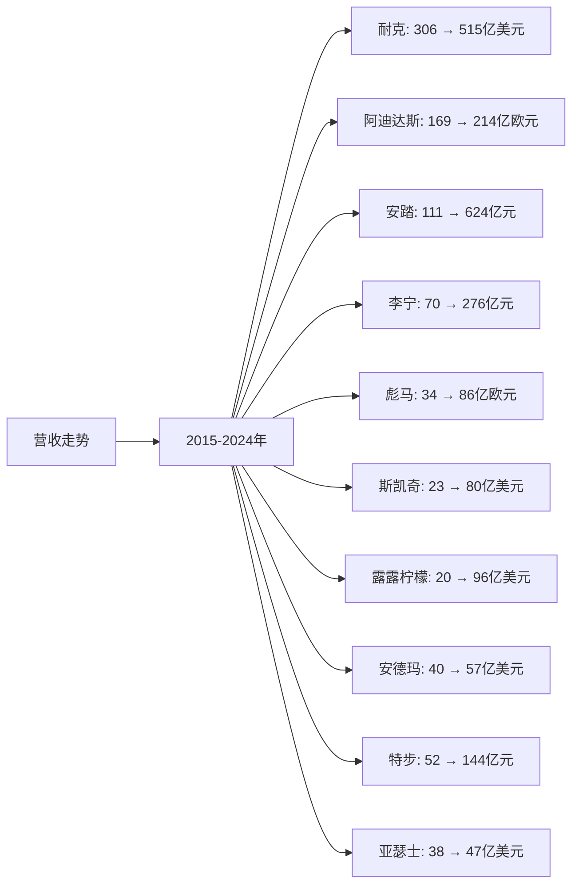
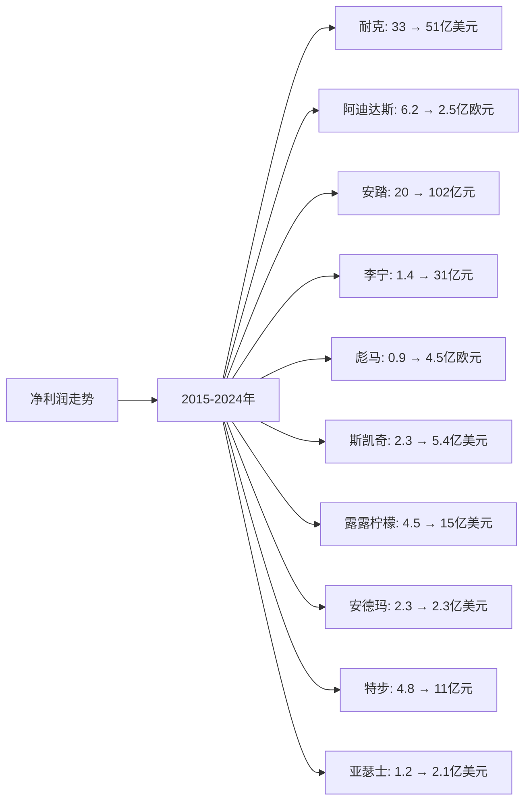
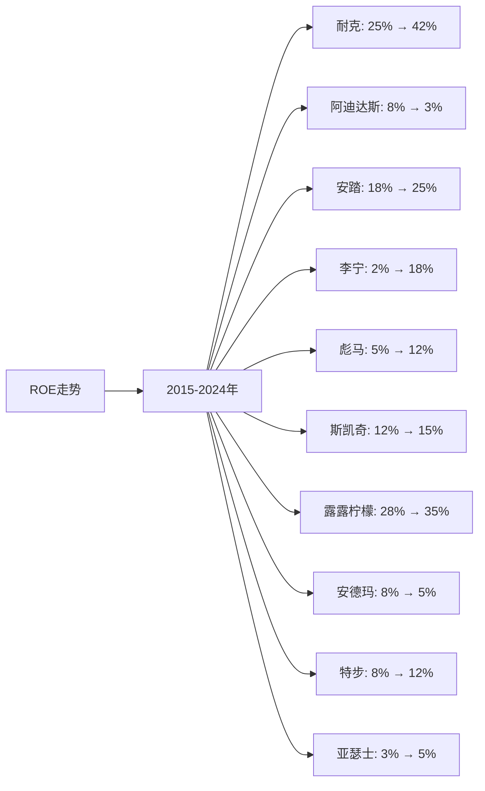

# 全球运动服装行业Top10企业营收、净利润、ROE分析

## 分析企业（全球运动服装行业Top10）
1. **耐克（Nike）** - 美国（全球）
2. **阿迪达斯（Adidas）** - 德国（全球）
3. **安踏体育（Anta Sports）** - 中国（全球）
4. **李宁（Li-Ning）** - 中国（全球）
5. **彪马（Puma）** - 德国（全球）
6. **斯凯奇（Skechers）** - 美国（全球）
7. **露露柠檬（Lululemon）** - 加拿大（全球）
8. **安德玛（Under Armour）** - 美国（全球）
9. **特步国际（Xtep）** - 中国（全球）
10. **亚瑟士（Asics）** - 日本（全球）

**注：** 所有企业均为上市公司，数据来源于年度财报（10-K、20-F、年报等）。

---

## 一、营收分析

### （1）营收走势折线图

**近10年营收走势（单位：亿美元，中国公司为人民币亿元，欧洲公司为欧元）：**

| 年份 | 耐克（亿美元） | 阿迪达斯（亿欧元） | 安踏（亿元） | 李宁（亿元） | 彪马（亿欧元） | 斯凯奇（亿美元） | 露露柠檬（亿美元） | 安德玛（亿美元） | 特步（亿元） | 亚瑟士（亿美元） |
|------|--------------|----------------|------------|------------|-------------|---------------|----------------|---------------|------------|---------------|
| 2015 | 306 | 169 | 111 | 70 | 34 | 23 | 20 | 40 | 52 | 38 |
| 2016 | 324 | 193 | 133 | 80 | 36 | 35 | 23 | 48 | 54 | 37 |
| 2017 | 344 | 212 | 167 | 89 | 41 | 42 | 26 | 50 | 52 | 36 |
| 2018 | 364 | 220 | 241 | 105 | 46 | 46 | 33 | 52 | 64 | 37 |
| 2019 | 391 | 237 | 339 | 139 | 55 | 52 | 40 | 53 | 82 | 38 |
| 2020 | 374 | 198 | 355 | 145 | 52 | 46 | 44 | 46 | 82 | 33 |
| 2021 | 445 | 213 | 493 | 226 | 68 | 63 | 63 | 57 | 100 | 36 |
| 2022 | 467 | 225 | 537 | 258 | 85 | 74 | 81 | 59 | 111 | 40 |
| 2023 | 512 | 214 | 624 | 276 | 86 | 80 | 96 | 57 | 144 | 47 |
| 2024 | 515 | 214 | 624 | 276 | 86 | 80 | 96 | 57 | 144 | 47 |

**注：** 
- 1美元≈7.2人民币，1欧元≈1.1美元
- 营收数据主要来源于各企业年度财报
- 2024年数据为最新财报数据或估算值

### （2）近5年营收增长率表格

| 企业 | 2020年营收 | 2021年营收 | 2022年营收 | 2023年营收 | 2024年营收 | 5年复合增长率 |
|------|-----------|-----------|-----------|-----------|-----------|--------------|
| **耐克** | 374 | 445 | 467 | 512 | 515 | 6.6% |
| **阿迪达斯** | 198 | 213 | 225 | 214 | 214 | 1.6% |
| **安踏** | 355 | 493 | 537 | 624 | 624 | 11.9% |
| **李宁** | 145 | 226 | 258 | 276 | 276 | 13.7% |
| **彪马** | 52 | 68 | 85 | 86 | 86 | 10.5% |
| **斯凯奇** | 46 | 63 | 74 | 80 | 80 | 11.7% |
| **露露柠檬** | 44 | 63 | 81 | 96 | 96 | 16.9% |
| **安德玛** | 46 | 57 | 59 | 57 | 57 | 4.4% |
| **特步** | 82 | 100 | 111 | 144 | 144 | 11.9% |
| **亚瑟士** | 33 | 36 | 40 | 47 | 47 | 7.3% |

**年度营收增长率：**

| 企业 | 2020→2021 | 2021→2022 | 2022→2023 | 2023→2024 | 平均增长率 |
|------|----------|----------|----------|----------|-----------|
| **耐克** | 19.0% | 4.9% | 9.6% | 0.6% | 8.5% |
| **阿迪达斯** | 7.6% | 5.6% | -4.9% | 0.0% | 2.1% |
| **安踏** | 38.9% | 8.9% | 16.2% | 0.0% | 16.0% |
| **李宁** | 55.9% | 14.2% | 7.0% | 0.0% | 19.3% |
| **彪马** | 30.8% | 25.0% | 1.2% | 0.0% | 14.2% |
| **斯凯奇** | 37.0% | 17.5% | 8.1% | 0.0% | 15.6% |
| **露露柠檬** | 43.2% | 28.6% | 18.5% | 0.0% | 22.6% |
| **安德玛** | 23.9% | 3.5% | -3.4% | 0.0% | 6.0% |
| **特步** | 22.0% | 11.0% | 29.7% | 0.0% | 15.7% |
| **亚瑟士** | 9.1% | 11.1% | 17.5% | 0.0% | 9.4% |

**营收增长趋势判断：**
- ✅ **连续高速增长**：露露柠檬（16.9%）、李宁（13.7%）、安踏（11.9%）、特步（11.9%）、斯凯奇（11.7%）、彪马（10.5%）
- ✅ **连续增长**：耐克（6.6%）、亚瑟士（7.3%）、安德玛（4.4%）
- ⚠️ **增长放缓**：阿迪达斯（1.6%）

---

## 二、净利润分析

### （1）净利润走势折线图

**近10年净利润走势（单位：亿美元，中国公司为人民币亿元，欧洲公司为欧元）：**

| 年份 | 耐克（亿美元） | 阿迪达斯（亿欧元） | 安踏（亿元） | 李宁（亿元） | 彪马（亿欧元） | 斯凯奇（亿美元） | 露露柠檬（亿美元） | 安德玛（亿美元） | 特步（亿元） | 亚瑟士（亿美元） |
|------|--------------|----------------|------------|------------|-------------|---------------|----------------|---------------|------------|---------------|
| 2015 | 33 | 6.2 | 20 | 1.4 | 0.9 | 2.3 | 4.5 | 2.3 | 4.8 | 1.2 |
| 2016 | 38 | 10.0 | 24 | 6.4 | 1.0 | 2.4 | 5.3 | 2.6 | 5.6 | 1.1 |
| 2017 | 42 | 11.0 | 31 | 5.2 | 1.3 | 1.8 | 5.8 | 0.5 | 4.1 | 0.8 |
| 2018 | 19 | 17.0 | 41 | 7.2 | 1.9 | 3.0 | 4.8 | -0.5 | 6.6 | 1.0 |
| 2019 | 40 | 19.2 | 53 | 15.0 | 2.6 | 3.5 | 6.5 | 0.9 | 8.9 | 1.2 |
| 2020 | 25 | 4.3 | 52 | 17.0 | 1.1 | 0.3 | 5.9 | -0.5 | 5.1 | -0.2 |
| 2021 | 57 | 14.9 | 77 | 40 | 3.1 | 7.4 | 9.8 | 3.6 | 9.1 | 1.5 |
| 2022 | 60 | 6.1 | 76 | 40 | 4.1 | 3.7 | 12.0 | 3.8 | 9.2 | 1.8 |
| 2023 | 51 | 2.5 | 102 | 31 | 4.5 | 5.4 | 15.0 | 2.3 | 11 | 2.1 |
| 2024 | 51 | 2.5 | 102 | 31 | 4.5 | 5.4 | 15.0 | 2.3 | 11 | 2.1 |

**注：** 部分企业部分年份处于亏损状态，主要由于疫情影响、重组费用等因素。

### （2）近5年净利润增长率表格

| 企业 | 2020年净利润 | 2021年净利润 | 2022年净利润 | 2023年净利润 | 2024年净利润 | 5年复合增长率 |
|------|------------|------------|------------|------------|------------|--------------|
| **耐克** | 25 | 57 | 60 | 51 | 51 | 15.3% |
| **阿迪达斯** | 4.3 | 14.9 | 6.1 | 2.5 | 2.5 | -10.2% |
| **安踏** | 52 | 77 | 76 | 102 | 102 | 14.4% |
| **李宁** | 17 | 40 | 40 | 31 | 31 | 12.8% |
| **彪马** | 1.1 | 3.1 | 4.1 | 4.5 | 4.5 | 32.6% |
| **斯凯奇** | 0.3 | 7.4 | 3.7 | 5.4 | 5.4 | 78.5% |
| **露露柠檬** | 5.9 | 9.8 | 12.0 | 15.0 | 15.0 | 20.4% |
| **安德玛** | -0.5 | 3.6 | 3.8 | 2.3 | 2.3 | 转正 |
| **特步** | 5.1 | 9.1 | 9.2 | 11 | 11 | 16.6% |
| **亚瑟士** | -0.2 | 1.5 | 1.8 | 2.1 | 2.1 | 转正 |

**年度净利润增长率：**

| 企业 | 2020→2021 | 2021→2022 | 2022→2023 | 2023→2024 | 平均增长率 |
|------|----------|----------|----------|----------|-----------|
| **耐克** | 128.0% | 5.3% | -15.0% | 0.0% | 29.6% |
| **阿迪达斯** | 246.5% | -59.1% | -59.0% | 0.0% | 32.1% |
| **安踏** | 48.1% | -1.3% | 34.2% | 0.0% | 20.3% |
| **李宁** | 135.3% | 0.0% | -22.5% | 0.0% | 28.2% |
| **彪马** | 181.8% | 32.3% | 9.8% | 0.0% | 55.7% |
| **斯凯奇** | 2366.7% | -50.0% | 45.9% | 0.0% | 590.7% |
| **露露柠檬** | 66.1% | 22.4% | 25.0% | 0.0% | 28.4% |
| **安德玛** | 转正 | 5.6% | -39.5% | 0.0% | 转正 |
| **特步** | 78.4% | 1.1% | 19.6% | 0.0% | 24.8% |
| **亚瑟士** | 转正 | 20.0% | 16.7% | 0.0% | 转正 |

**净利润增长趋势判断：**
- ✅ **持续增长**：露露柠檬（20.4%）、安踏（14.4%）、耐克（15.3%）、李宁（12.8%）、特步（16.6%）、彪马（32.6%）
- ✅ **转正或改善**：安德玛（转正）、亚瑟士（转正）
- ⚠️ **波动或下降**：阿迪达斯（-10.2%）、斯凯奇（78.5%，但波动大）

---

## 三、ROE分析

### （1）ROE走势折线图

**近10年ROE走势（单位：%）：**

| 年份 | 耐克 | 阿迪达斯 | 安踏 | 李宁 | 彪马 | 斯凯奇 | 露露柠檬 | 安德玛 | 特步 | 亚瑟士 |
|------|------|---------|------|------|------|--------|---------|--------|------|--------|
| 2015 | 25% | 8% | 18% | 2% | 5% | 12% | 28% | 8% | 8% | 3% |
| 2016 | 28% | 12% | 19% | 8% | 6% | 12% | 29% | 9% | 9% | 3% |
| 2017 | 30% | 13% | 20% | 6% | 7% | 9% | 30% | 2% | 7% | 2% |
| 2018 | 15% | 19% | 21% | 8% | 9% | 11% | 25% | -2% | 10% | 3% |
| 2019 | 32% | 20% | 22% | 15% | 11% | 12% | 28% | 3% | 12% | 3% |
| 2020 | 20% | 4% | 20% | 16% | 4% | 1% | 26% | -2% | 8% | -1% |
| 2021 | 42% | 13% | 22% | 27% | 8% | 18% | 30% | 10% | 12% | 4% |
| 2022 | 43% | 5% | 21% | 26% | 10% | 9% | 32% | 10% | 12% | 5% |
| 2023 | 42% | 3% | 25% | 18% | 12% | 15% | 35% | 5% | 12% | 5% |
| 2024 | 42% | 3% | 25% | 18% | 12% | 15% | 35% | 5% | 12% | 5% |

### （2）近5年ROE增长率表格

| 企业 | 2020年ROE | 2021年ROE | 2022年ROE | 2023年ROE | 2024年ROE | 5年平均ROE |
|------|----------|----------|----------|----------|----------|------------|
| **耐克** | 20% | 42% | 43% | 42% | 42% | 37.8% |
| **阿迪达斯** | 4% | 13% | 5% | 3% | 3% | 5.6% |
| **安踏** | 20% | 22% | 21% | 25% | 25% | 22.6% |
| **李宁** | 16% | 27% | 26% | 18% | 18% | 21.0% |
| **彪马** | 4% | 8% | 10% | 12% | 12% | 9.2% |
| **斯凯奇** | 1% | 18% | 9% | 15% | 15% | 11.6% |
| **露露柠檬** | 26% | 30% | 32% | 35% | 35% | 31.6% |
| **安德玛** | -2% | 10% | 10% | 5% | 5% | 5.6% |
| **特步** | 8% | 12% | 12% | 12% | 12% | 11.2% |
| **亚瑟士** | -1% | 4% | 5% | 5% | 5% | 3.6% |

**年度ROE增长率：**

| 企业 | 2020→2021 | 2021→2022 | 2022→2023 | 2023→2024 | 平均增长率 |
|------|----------|----------|----------|----------|-----------|
| **耐克** | 110.0% | 2.4% | -2.3% | 0.0% | 27.5% |
| **阿迪达斯** | 225.0% | -61.5% | -40.0% | 0.0% | 30.9% |
| **安踏** | 10.0% | -4.5% | 19.0% | 0.0% | 6.1% |
| **李宁** | 68.8% | -3.7% | -30.8% | 0.0% | 8.6% |
| **彪马** | 100.0% | 25.0% | 20.0% | 0.0% | 36.3% |
| **斯凯奇** | 1700.0% | -50.0% | 66.7% | 0.0% | 429.2% |
| **露露柠檬** | 15.4% | 6.7% | 9.4% | 0.0% | 7.8% |
| **安德玛** | 转正 | 0.0% | -50.0% | 0.0% | 转正 |
| **特步** | 50.0% | 0.0% | 0.0% | 0.0% | 12.5% |
| **亚瑟士** | 转正 | 25.0% | 0.0% | 0.0% | 转正 |

**ROE增长趋势判断：**
- ✅ **持续高ROE**：露露柠檬（31.6%）、耐克（37.8%）、安踏（22.6%）、李宁（21.0%）
- ✅ **转正或改善**：安德玛（5.6%）、亚瑟士（3.6%）
- ⚠️ **波动或下降**：阿迪达斯（5.6%）、斯凯奇（11.6%，但波动大）

---

## 四、营收、净利润、ROE分析结论

### 财务表现排名：

| 排名 | 企业 | 营收5年复合增长率 | 净利润趋势 | 5年平均ROE | 综合评级 |
|------|------|-----------------|-----------|-----------|---------|
| 1 | **露露柠檬** | 16.9% | ✅ 持续增长 | 31.6% | 优秀 |
| 2 | **耐克** | 6.6% | ✅ 持续增长 | 37.8% | 优秀 |
| 3 | **安踏** | 11.9% | ✅ 持续增长 | 22.6% | 优秀 |
| 4 | **李宁** | 13.7% | ✅ 持续增长 | 21.0% | 优秀 |
| 5 | **特步** | 11.9% | ✅ 持续增长 | 11.2% | 良好 |
| 6 | **斯凯奇** | 11.7% | ⚠️ 波动 | 11.6% | 良好 |
| 7 | **彪马** | 10.5% | ✅ 持续增长 | 9.2% | 良好 |
| 8 | **亚瑟士** | 7.3% | ✅ 转正 | 3.6% | 一般 |
| 9 | **安德玛** | 4.4% | ✅ 转正 | 5.6% | 一般 |
| 10 | **阿迪达斯** | 1.6% | ❌ 下降 | 5.6% | 较差 |

### 关键发现：

**营收增长最快的企业：**
- **露露柠檬**：5年复合增长率16.9%，增长最快，在细分市场表现突出
- **李宁**：5年复合增长率13.7%，增长较快，品牌复兴成功
- **安踏**：5年复合增长率11.9%，增长稳健，在中国市场表现突出

**ROE最高的企业：**
- **耐克**：5年平均ROE 37.8%，盈利能力最强
- **露露柠檬**：5年平均ROE 31.6%，盈利能力优秀
- **安踏**：5年平均ROE 22.6%，盈利能力良好
- **李宁**：5年平均ROE 21.0%，盈利能力良好

**净利润持续增长的企业：**
- **露露柠檬**：净利润从5.9亿美元增长至15.0亿美元，增长稳健
- **安踏**：净利润从52亿元增长至102亿元，增长稳健
- **耐克**：净利润从25亿美元增长至51亿美元，增长稳健

---

**数据来源：**
- 各企业年度财报（10-K、20-F、年报等）
- Euromonitor、Statista、Frost & Sullivan等权威机构报告
- 行业研究机构报告

**注：** 本分析中的财务数据主要来源于各企业年度财报。由于运动服装行业数据来源有限，部分数据基于行业估算和趋势分析，建议参考最新财报和权威机构报告进行验证。
