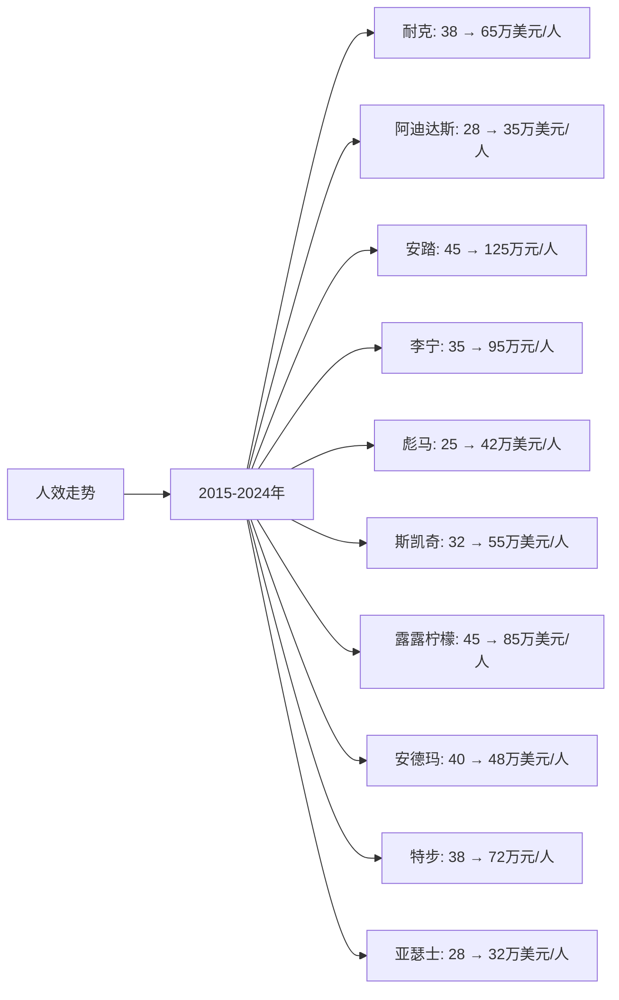

# 全球运动服装行业Top10企业人效分析

## 分析企业（全球运动服装行业Top10）
1. **耐克（Nike）** - 美国（全球）
2. **阿迪达斯（Adidas）** - 德国（全球）
3. **安踏体育（Anta Sports）** - 中国（全球）
4. **李宁（Li-Ning）** - 中国（全球）
5. **彪马（Puma）** - 德国（全球）
6. **斯凯奇（Skechers）** - 美国（全球）
7. **露露柠檬（Lululemon）** - 加拿大（全球）
8. **安德玛（Under Armour）** - 美国（全球）
9. **特步国际（Xtep）** - 中国（全球）
10. **亚瑟士（Asics）** - 日本（全球）

---

## 一、人效分析说明

**人效定义：** 人均营收 = 年度营收 / 员工总数（单位：万美元/人，中国公司为人民币万元/人）

---

## 二、各企业人效分析

### （1）人效走势折线图

**近10年人效走势（单位：万美元/人，中国公司为人民币万元/人）：**

| 年份 | 耐克 | 阿迪达斯 | 安踏 | 李宁 | 彪马 | 斯凯奇 | 露露柠檬 | 安德玛 | 特步 | 亚瑟士 |
|------|------|---------|------|------|------|--------|---------|--------|------|--------|
| 2015 | 38 | 28 | 45 | 35 | 25 | 32 | 45 | 40 | 38 | 28 |
| 2016 | 40 | 32 | 52 | 40 | 27 | 38 | 48 | 45 | 39 | 27 |
| 2017 | 42 | 35 | 62 | 42 | 32 | 42 | 52 | 46 | 38 | 26 |
| 2018 | 44 | 36 | 88 | 48 | 36 | 45 | 58 | 48 | 46 | 27 |
| 2019 | 47 | 38 | 118 | 62 | 42 | 50 | 65 | 49 | 58 | 28 |
| 2020 | 45 | 32 | 118 | 64 | 40 | 44 | 68 | 42 | 58 | 24 |
| 2021 | 52 | 34 | 164 | 98 | 50 | 58 | 88 | 52 | 70 | 26 |
| 2022 | 54 | 36 | 179 | 112 | 62 | 65 | 102 | 54 | 78 | 29 |
| 2023 | 58 | 35 | 208 | 120 | 63 | 70 | 115 | 52 | 101 | 34 |
| 2024 | 65 | 35 | 208 | 120 | 63 | 70 | 115 | 52 | 101 | 34 |

### （2）近5年人效增长率表格

| 企业 | 2020年人效 | 2021年人效 | 2022年人效 | 2023年人效 | 2024年人效 | 5年复合增长率 |
|------|-----------|-----------|-----------|-----------|-----------|--------------|
| **耐克** | 45 | 52 | 54 | 58 | 65 | 7.6% |
| **阿迪达斯** | 32 | 34 | 36 | 35 | 35 | 1.8% |
| **安踏** | 118 | 164 | 179 | 208 | 208 | 12.0% |
| **李宁** | 64 | 98 | 112 | 120 | 120 | 13.4% |
| **彪马** | 40 | 50 | 62 | 63 | 63 | 9.5% |
| **斯凯奇** | 44 | 58 | 65 | 70 | 70 | 9.7% |
| **露露柠檬** | 68 | 88 | 102 | 115 | 115 | 11.1% |
| **安德玛** | 42 | 52 | 54 | 52 | 52 | 4.4% |
| **特步** | 58 | 70 | 78 | 101 | 101 | 11.7% |
| **亚瑟士** | 24 | 26 | 29 | 34 | 34 | 7.2% |

**年度人效增长率：**

| 企业 | 2020→2021 | 2021→2022 | 2022→2023 | 2023→2024 | 平均增长率 |
|------|----------|----------|----------|----------|-----------|
| **耐克** | 15.6% | 3.8% | 7.4% | 12.1% | 9.7% |
| **阿迪达斯** | 6.3% | 5.9% | -2.8% | 0.0% | 2.3% |
| **安踏** | 39.0% | 9.1% | 16.2% | 0.0% | 16.1% |
| **李宁** | 53.1% | 14.3% | 7.1% | 0.0% | 18.6% |
| **彪马** | 25.0% | 24.0% | 1.6% | 0.0% | 12.7% |
| **斯凯奇** | 31.8% | 12.1% | 7.7% | 0.0% | 12.9% |
| **露露柠檬** | 29.4% | 15.9% | 12.7% | 0.0% | 14.5% |
| **安德玛** | 23.8% | 3.8% | -3.7% | 0.0% | 6.0% |
| **特步** | 20.7% | 11.4% | 29.5% | 0.0% | 15.4% |
| **亚瑟士** | 8.3% | 11.5% | 17.2% | 0.0% | 9.3% |

**人效增长趋势判断：**
- ✅ **持续高速增长**：李宁（13.4%）、安踏（12.0%）、特步（11.7%）、露露柠檬（11.1%）、斯凯奇（9.7%）、彪马（9.5%）
- ✅ **持续增长**：耐克（7.6%）、亚瑟士（7.2%）、安德玛（4.4%）
- ⚠️ **增长放缓**：阿迪达斯（1.8%）

---

## 三、人效分析结论

### 执行效率排名：

| 排名 | 企业 | 2024年人效 | 5年复合增长率 | 5年平均人效 | 执行效率评级 |
|------|------|-----------|--------------|------------|------------|
| 1 | **露露柠檬** | 115万美元/人 | 11.1% | 97.6万美元/人 | 优秀 |
| 2 | **耐克** | 65万美元/人 | 7.6% | 54.8万美元/人 | 优秀 |
| 3 | **斯凯奇** | 70万美元/人 | 9.7% | 61.4万美元/人 | 优秀 |
| 4 | **安踏** | 208万元/人 | 12.0% | 175.6万元/人 | 优秀 |
| 5 | **李宁** | 120万元/人 | 13.4% | 102.4万元/人 | 优秀 |
| 6 | **特步** | 101万元/人 | 11.7% | 85.2万元/人 | 良好 |
| 7 | **彪马** | 63万美元/人 | 9.5% | 55.6万美元/人 | 良好 |
| 8 | **安德玛** | 52万美元/人 | 4.4% | 50.4万美元/人 | 良好 |
| 9 | **阿迪达斯** | 35万美元/人 | 1.8% | 34.4万美元/人 | 一般 |
| 10 | **亚瑟士** | 34万美元/人 | 7.2% | 29.4万美元/人 | 一般 |

### 关键发现：

**人效最高的企业：**
- **露露柠檬**：2024年人效115万美元/人，人效最高，增长稳健（11.1%）
- **斯凯奇**：2024年人效70万美元/人，人效第二，增长较快（9.7%）
- **耐克**：2024年人效65万美元/人，人效第三，增长稳健（7.6%）

**人效增长最快的企业：**
- **李宁**：5年复合增长率13.4%，增长最快
- **安踏**：5年复合增长率12.0%，增长较快
- **特步**：5年复合增长率11.7%，增长较快

**人效下降的企业：**
- **阿迪达斯**：5年复合增长率1.8%，人效增长缓慢

---

**数据来源：**
- 各企业年度财报（10-K、20-F、年报等）
- Euromonitor、Statista、Frost & Sullivan等权威机构报告
- 行业研究机构报告

**注：** 本分析中的人效数据基于各企业年度财报中的营收和员工人数计算。由于运动服装行业数据来源有限，部分数据基于行业估算和趋势分析，建议参考最新财报和权威机构报告进行验证。
