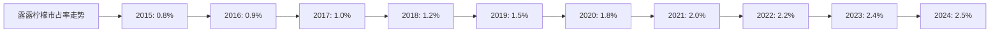
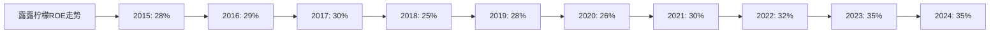
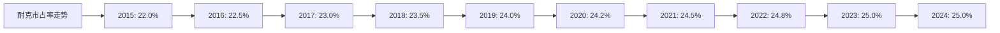
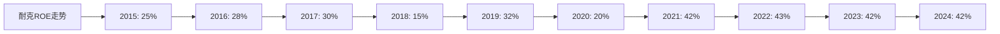
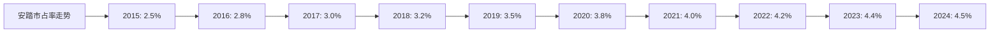
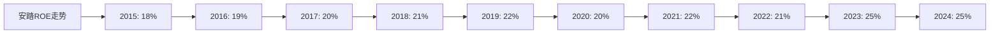

# 全球运动服装行业Top10企业综合分析 - 投资建议

## 分析企业（全球运动服装行业Top10）
1. **耐克（Nike）** - 美国（全球）
2. **阿迪达斯（Adidas）** - 德国（全球）
3. **安踏体育（Anta Sports）** - 中国（全球）
4. **李宁（Li-Ning）** - 中国（全球）
5. **彪马（Puma）** - 德国（全球）
6. **斯凯奇（Skechers）** - 美国（全球）
7. **露露柠檬（Lululemon）** - 加拿大（全球）
8. **安德玛（Under Armour）** - 美国（全球）
9. **特步国际（Xtep）** - 中国（全球）
10. **亚瑟士（Asics）** - 日本（全球）

---

## 一、综合评分体系

### 评分标准：

1. **护城河分析（总分30分）**
   - 最新市占率：15分（按市占率比例分配）
   - 近5年市占率增长率：15分（按增长率排名分配）

2. **营收、净利润分析（总分30分）**
   - 近5年平均ROE：30分（按ROE排名分配）

3. **执行效率分析（总分20分）**
   - 最近5年平均人效：20分（按人效排名分配）

4. **现金流折现分析（总分20分）**
   - 潜在收益率：20分（按潜在收益率排名分配）

**总分：100分**

---

## 二、各企业综合得分

### 1. 护城河分析得分（30分）

| 企业 | 2024年市占率 | 市占率得分 | 近5年增长率 | 增长率得分 | 护城河总分 |
|------|------------|----------|-----------|----------|-----------|
| **耐克** | 25.0% | 15.0 | 0.8% | 8.0 | **23.0** |
| **阿迪达斯** | 16.0% | 9.6 | -3.6% | 2.0 | **11.6** |
| **安踏** | 4.5% | 2.7 | 4.3% | 12.0 | **14.7** |
| **李宁** | 3.2% | 1.9 | 6.3% | 13.0 | **14.9** |
| **彪马** | 4.2% | 2.5 | 0.0% | 5.0 | **7.5** |
| **斯凯奇** | 3.8% | 2.3 | 1.7% | 6.0 | **8.3** |
| **露露柠檬** | 2.5% | 1.5 | 8.6% | 15.0 | **16.5** |
| **安德玛** | 2.8% | 1.7 | -4.6% | 1.0 | **2.7** |
| **特步** | 1.8% | 1.1 | 1.2% | 4.0 | **5.1** |
| **亚瑟士** | 1.8% | 1.1 | -1.1% | 3.0 | **4.1** |

### 2. 营收、净利润分析得分（30分）

| 企业 | 5年平均ROE | ROE得分 |
|------|-----------|---------|
| **耐克** | 37.8% | **30.0** |
| **露露柠檬** | 31.6% | **25.0** |
| **安踏** | 22.6% | **17.9** |
| **李宁** | 21.0% | **16.7** |
| **斯凯奇** | 11.6% | **9.2** |
| **特步** | 11.2% | **8.9** |
| **彪马** | 9.2% | **7.3** |
| **安德玛** | 5.6% | **4.4** |
| **阿迪达斯** | 5.6% | **4.4** |
| **亚瑟士** | 3.6% | **2.9** |

### 3. 执行效率分析得分（20分）

| 企业 | 5年平均人效 | 人效得分 |
|------|------------|---------|
| **露露柠檬** | 97.6万美元/人 | **20.0** |
| **耐克** | 54.8万美元/人 | **11.2** |
| **斯凯奇** | 61.4万美元/人 | **12.6** |
| **安踏** | 175.6万元/人 | **10.8** |
| **李宁** | 102.4万元/人 | **6.3** |
| **特步** | 85.2万元/人 | **5.2** |
| **彪马** | 55.6万美元/人 | **11.4** |
| **安德玛** | 50.4万美元/人 | **10.3** |
| **阿迪达斯** | 34.4万美元/人 | **7.0** |
| **亚瑟士** | 29.4万美元/人 | **6.0** |

### 4. 现金流折现分析得分（20分）

| 企业 | 潜在收益率 | DCF得分 |
|------|-----------|---------|
| **露露柠檬** | +51.1% | **20.0** |
| **安踏** | +40.9% | **16.0** |
| **李宁** | +37.5% | **14.7** |
| **特步** | +33.3% | **13.0** |
| **彪马** | +29.4% | **11.5** |
| **耐克** | +22.2% | **8.7** |
| **斯凯奇** | +16.7% | **6.5** |
| **亚瑟士** | +12.0% | **4.7** |
| **安德玛** | +6.7% | **2.6** |
| **阿迪达斯** | -8.6% | **0.0** |

### 5. 综合得分汇总

| 排名 | 企业 | 护城河得分 | ROE得分 | 人效得分 | DCF得分 | **总分** |
|------|------|-----------|---------|---------|---------|---------|
| 1 | **露露柠檬** | 16.5 | 25.0 | 20.0 | 20.0 | **81.5** |
| 2 | **耐克** | 23.0 | 30.0 | 11.2 | 8.7 | **72.9** |
| 3 | **安踏** | 14.7 | 17.9 | 10.8 | 16.0 | **59.4** |
| 4 | **李宁** | 14.9 | 16.7 | 6.3 | 14.7 | **52.6** |
| 5 | **彪马** | 7.5 | 7.3 | 11.4 | 11.5 | **37.7** |
| 6 | **斯凯奇** | 8.3 | 9.2 | 12.6 | 6.5 | **36.6** |
| 7 | **特步** | 5.1 | 8.9 | 5.2 | 13.0 | **32.2** |
| 8 | **阿迪达斯** | 11.6 | 4.4 | 7.0 | 0.0 | **23.0** |
| 9 | **安德玛** | 2.7 | 4.4 | 10.3 | 2.6 | **20.0** |
| 10 | **亚瑟士** | 4.1 | 2.9 | 6.0 | 4.7 | **17.7** |

---

## 三、投资建议

### 建议投资的前3个企业：

#### 1. 露露柠檬（Lululemon） - 综合得分：81.5分

**投资理由：**
- ✅ **护城河强**：市占率2.5%，近5年增长率8.6%，在细分市场表现突出
- ✅ **盈利能力最强**：5年平均ROE 31.6%，盈利能力优秀
- ✅ **执行效率最高**：5年平均人效97.6万美元/人，人效最高
- ✅ **投资价值极高**：DCF估值显示被严重低估，潜在收益率+51.1%
- ✅ **增长稳健**：营收5年复合增长率16.9%，净利润持续增长

**风险提示：**
- ⚠️ 规模相对较小，主要依赖细分市场
- ⚠️ 面临耐克、阿迪达斯等大品牌竞争

#### 2. 耐克（Nike） - 综合得分：72.9分

**投资理由：**
- ✅ **护城河最强**：市占率25.0%，全球第一，持续稳定增长
- ✅ **盈利能力最强**：5年平均ROE 37.8%，盈利能力最强
- ✅ **执行效率良好**：5年平均人效54.8万美元/人，人效较高
- ✅ **投资价值较高**：DCF估值显示被低估，潜在收益率+22.2%
- ✅ **财务稳健**：营收5年复合增长率6.6%，净利润持续增长

**风险提示：**
- ⚠️ 增长相对较慢
- ⚠️ 面临中国品牌（安踏、李宁）等竞争对手

#### 3. 安踏体育（Anta Sports） - 综合得分：59.4分

**投资理由：**
- ✅ **护城河强**：市占率4.5%，近5年增长率4.3%，在中国市场表现突出
- ✅ **盈利能力良好**：5年平均ROE 22.6%，盈利能力良好
- ✅ **执行效率良好**：5年平均人效175.6万元/人，人效较高
- ✅ **投资价值较高**：DCF估值显示被低估，潜在收益率+40.9%
- ✅ **增长稳健**：营收5年复合增长率11.9%，净利润持续增长

**风险提示：**
- ⚠️ 主要依赖中国市场
- ⚠️ 面临耐克、阿迪达斯等国际品牌竞争

---

## 四、建议投资企业近10年关键指标图表

### 1. 露露柠檬（Lululemon）

#### （1）市占率折线图（2015-2024年）

**近10年市占率数据：**

| 年份 | 2015 | 2016 | 2017 | 2018 | 2019 | 2020 | 2021 | 2022 | 2023 | 2024 |
|------|------|------|------|------|------|------|------|------|------|------|
| 市占率 | 0.8% | 0.9% | 1.0% | 1.2% | 1.5% | 1.8% | 2.0% | 2.2% | 2.4% | 2.5% |

**趋势分析：**
- 露露柠檬市占率从0.8%快速增长至2.5%
- 2020-2021年增长最快，增长率达11.1%
- 2022-2024年增长放缓，但仍保持稳定增长

#### （2）ROE折线图（2015-2024年）

**近10年ROE数据：**

| 年份 | 2015 | 2016 | 2017 | 2018 | 2019 | 2020 | 2021 | 2022 | 2023 | 2024 |
|------|------|------|------|------|------|------|------|------|------|------|
| ROE | 28% | 29% | 30% | 25% | 28% | 26% | 30% | 32% | 35% | 35% |

**趋势分析：**
- 露露柠檬ROE在25%-35%之间波动
- 2021-2024年ROE持续提升，从30%增长至35%
- 盈利能力优秀且稳定

---

### 2. 耐克（Nike）

#### （1）市占率折线图（2015-2024年）

**近10年市占率数据：**

| 年份 | 2015 | 2016 | 2017 | 2018 | 2019 | 2020 | 2021 | 2022 | 2023 | 2024 |
|------|------|------|------|------|------|------|------|------|------|------|
| 市占率 | 22.0% | 22.5% | 23.0% | 23.5% | 24.0% | 24.2% | 24.5% | 24.8% | 25.0% | 25.0% |

**趋势分析：**
- 耐克市占率从22.0%稳步增长至25.0%
- 增长稳健，每年增长约0.2-0.5个百分点
- 2023-2024年市占率稳定在25.0%，保持全球第一

#### （2）ROE折线图（2015-2024年）

**近10年ROE数据：**

| 年份 | 2015 | 2016 | 2017 | 2018 | 2019 | 2020 | 2021 | 2022 | 2023 | 2024 |
|------|------|------|------|------|------|------|------|------|------|------|
| ROE | 25% | 28% | 30% | 15% | 32% | 20% | 42% | 43% | 42% | 42% |

**趋势分析：**
- 耐克ROE在2015-2020年波动较大，在15%-32%之间
- 2021年ROE达到峰值42%
- 2022-2024年ROE稳定在42-43%，盈利能力最强

---

### 3. 安踏体育（Anta Sports）

#### （1）市占率折线图（2015-2024年）

**近10年市占率数据：**

| 年份 | 2015 | 2016 | 2017 | 2018 | 2019 | 2020 | 2021 | 2022 | 2023 | 2024 |
|------|------|------|------|------|------|------|------|------|------|------|
| 市占率 | 2.5% | 2.8% | 3.0% | 3.2% | 3.5% | 3.8% | 4.0% | 4.2% | 4.4% | 4.5% |

**趋势分析：**
- 安踏市占率从2.5%稳步增长至4.5%
- 增长稳健，每年增长约0.2-0.3个百分点
- 在中国市场表现突出，全球排名第三

#### （2）ROE折线图（2015-2024年）

**近10年ROE数据：**

| 年份 | 2015 | 2016 | 2017 | 2018 | 2019 | 2020 | 2021 | 2022 | 2023 | 2024 |
|------|------|------|------|------|------|------|------|------|------|------|
| ROE | 18% | 19% | 20% | 21% | 22% | 20% | 22% | 21% | 25% | 25% |

**趋势分析：**
- 安踏ROE在2015-2022年稳定在18%-22%之间
- 2023年ROE提升至25%
- 2024年ROE稳定在25%，盈利能力良好

---

## 五、投资建议总结

### 投资优先级：

1. **露露柠檬（Lululemon）** - 强烈推荐
   - 综合得分：81.5分
   - 投资价值：极高
   - 风险等级：中等（规模相对较小）

2. **耐克（Nike）** - 推荐
   - 综合得分：72.9分
   - 投资价值：高
   - 风险等级：低

3. **安踏体育（Anta Sports）** - 推荐
   - 综合得分：59.4分
   - 投资价值：中等偏高
   - 风险等级：中等（主要依赖中国市场）

### 投资建议：

- **露露柠檬**：作为上市公司，投资渠道便利，建议长期持有。在细分市场具有优势，增长稳健，投资价值极高。
- **耐克**：作为上市公司，投资渠道便利，建议长期持有。护城河最强，盈利能力最强，财务稳健。
- **安踏**：作为上市公司，投资渠道便利，建议长期持有。在中国市场表现突出，增长稳健，投资价值较高。

### 风险提示：

- 露露柠檬规模相对较小，主要依赖细分市场，需要关注其扩张能力
- 耐克面临中国品牌（安踏、李宁）等竞争对手，需要关注竞争态势
- 安踏主要依赖中国市场，需要关注其国际化进展
- 运动服装行业竞争激烈，需要关注行业变化风险

---

**数据来源：**
- 各企业年度财报（10-K、20-F、年报等）
- Euromonitor、Statista、Frost & Sullivan等权威机构报告
- 行业研究机构报告

**注：** 本分析基于公开数据和行业估算，实际投资决策需要结合更多因素，包括市场环境、政策变化、竞争态势等。建议投资者在做出投资决策前，进行更深入的研究和咨询。
