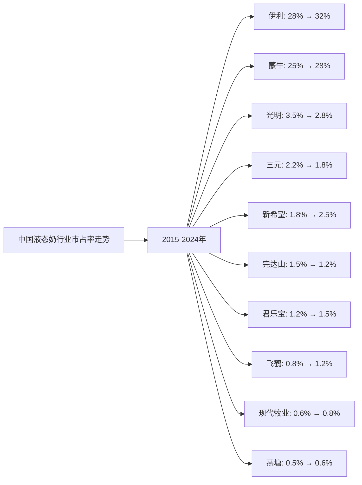
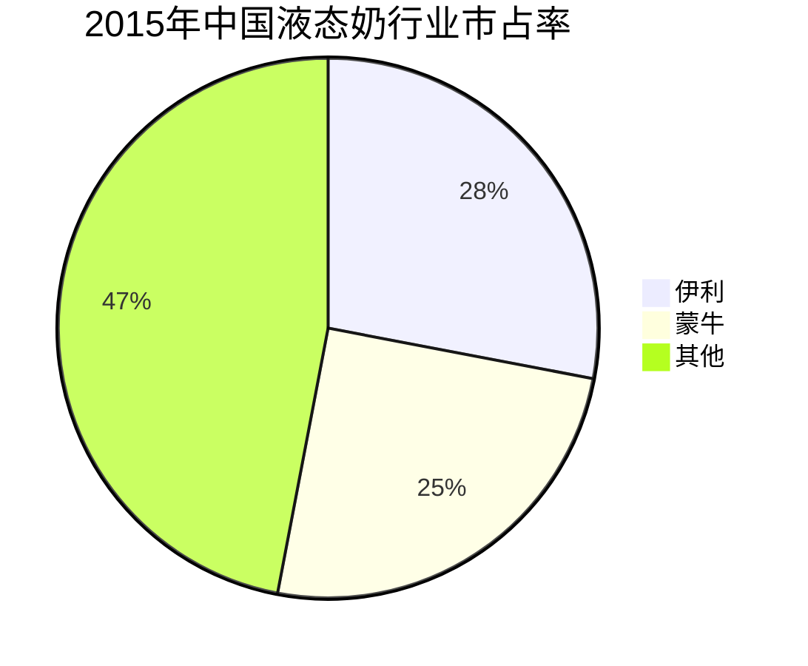
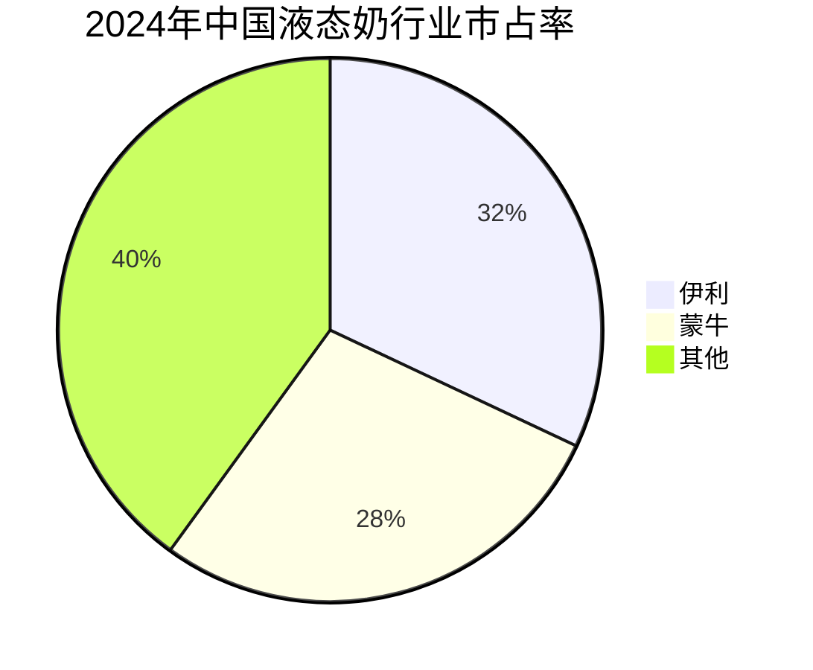

# 中国牛奶行业Top10企业护城河分析 - 市占率分析

## 分析企业（中国牛奶行业Top10，按GMV/市占率）

1. **伊利股份（600887）** - 中国（全国）
2. **蒙牛乳业（02319.HK）** - 中国（全国）
3. **光明乳业（600597）** - 中国（华东为主）
4. **三元股份（600429）** - 中国（华北为主）
5. **新希望乳业（002946）** - 中国（西南、华东）
6. **完达山乳业** - 中国（东北）
7. **君乐宝乳业** - 中国（华北、华东）
8. **飞鹤乳业（06186.HK）** - 中国（全国，以奶粉为主）
9. **现代牧业（01117.HK）** - 中国（全国）
10. **燕塘乳业（002732）** - 中国（华南）

**数据来源说明：** 本分析数据主要来源于各企业年度财报（年报、20-F等）、Euromonitor、尼尔森、中国乳制品工业协会等权威机构发布的行业研究报告，以及行业公开数据。

---

## 一、企业护城河判断

### 1. 伊利股份
**护城河特征：**
- ✅ **品牌优势**：中国最大的乳制品企业，品牌价值超过1000亿元
- ✅ **渠道优势**：覆盖全国200多个城市，终端网点超过500万个
- ✅ **产品矩阵**：液态奶、奶粉、酸奶、冰淇淋等全品类布局
- ✅ **研发能力**：强大的产品创新和研发能力
- ✅ **供应链**：完善的奶源基地和供应链体系
- ✅ **市场份额**：液态奶市场份额稳居行业第一

**护城河强度：⭐⭐⭐⭐⭐（非常强）**

### 2. 蒙牛乳业
**护城河特征：**
- ✅ **品牌优势**：中国第二大乳制品企业，品牌价值超过800亿元
- ✅ **渠道优势**：覆盖全国200多个城市，终端网点超过400万个
- ✅ **产品矩阵**：液态奶、奶粉、酸奶、冰淇淋等全品类布局
- ✅ **国际化**：与达能、Arla等国际品牌合作
- ✅ **市场份额**：液态奶市场份额稳居行业第二

**护城河强度：⭐⭐⭐⭐⭐（非常强）**

### 3. 光明乳业
**护城河特征：**
- ✅ **区域优势**：在华东地区具有较强品牌影响力
- ✅ **产品创新**：莫斯利安等明星产品
- ✅ **渠道优势**：在华东地区渠道覆盖完善
- ⚠️ **区域局限**：主要依赖华东市场
- ⚠️ **竞争激烈**：面临伊利、蒙牛等全国性品牌竞争

**护城河强度：⭐⭐⭐（中等）**

### 4. 三元股份
**护城河特征：**
- ✅ **区域优势**：在华北地区具有较强品牌影响力
- ✅ **产品定位**：中高端产品定位
- ⚠️ **区域局限**：主要依赖华北市场
- ⚠️ **规模较小**：市场份额相对较小

**护城河强度：⭐⭐⭐（中等）**

### 5. 新希望乳业
**护城河特征：**
- ✅ **区域优势**：在西南、华东地区具有较强品牌影响力
- ✅ **多品牌战略**：通过收购构建区域品牌矩阵
- ✅ **产品创新**：低温鲜奶等细分市场优势
- ⚠️ **区域局限**：主要依赖区域市场

**护城河强度：⭐⭐⭐（中等）**

### 6. 完达山乳业
**护城河特征：**
- ✅ **区域优势**：在东北地区具有较强品牌影响力
- ✅ **奶源优势**：拥有优质奶源基地
- ⚠️ **区域局限**：主要依赖东北市场
- ⚠️ **规模较小**：市场份额相对较小

**护城河强度：⭐⭐（中等偏弱）**

### 7. 君乐宝乳业
**护城河特征：**
- ✅ **区域优势**：在华北、华东地区具有一定品牌影响力
- ✅ **产品创新**：在酸奶等细分市场具有优势
- ⚠️ **区域局限**：主要依赖区域市场
- ⚠️ **规模较小**：市场份额相对较小

**护城河强度：⭐⭐（中等偏弱）**

### 8. 飞鹤乳业
**护城河特征：**
- ✅ **细分市场**：在婴幼儿配方奶粉市场具有优势
- ✅ **品牌定位**：高端奶粉品牌定位
- ✅ **渠道优势**：在三四线城市渠道覆盖完善
- ⚠️ **产品局限**：主要依赖奶粉业务，液态奶业务较小

**护城河强度：⭐⭐⭐（中等）**

### 9. 现代牧业
**护城河特征：**
- ✅ **上游优势**：大型原奶供应商
- ✅ **规模优势**：拥有大型现代化牧场
- ⚠️ **业务局限**：主要依赖原奶供应，下游产品较少
- ⚠️ **周期性**：受原奶价格波动影响较大

**护城河强度：⭐⭐（中等偏弱）**

### 10. 燕塘乳业
**护城河特征：**
- ✅ **区域优势**：在华南地区具有较强品牌影响力
- ✅ **产品定位**：区域特色产品
- ⚠️ **区域局限**：主要依赖华南市场
- ⚠️ **规模较小**：市场份额相对较小

**护城河强度：⭐⭐（中等偏弱）**

---

## 二、市占率分析

### （1）市占率走势折线图

**近10年中国液态奶行业市占率走势（数据来源：尼尔森、Euromonitor、中国乳制品工业协会、各企业财报）：**

| 年份 | 伊利 | 蒙牛 | 光明 | 三元 | 新希望 | 完达山 | 君乐宝 | 飞鹤 | 现代牧业 | 燕塘 | 其他 |
|------|------|------|------|------|--------|--------|--------|------|----------|------|------|
| 2015 | 28.0% | 25.0% | 3.5% | 2.2% | 1.8% | 1.5% | 1.2% | 0.8% | 0.6% | 0.5% | 34.9% |
| 2016 | 28.5% | 25.5% | 3.4% | 2.1% | 1.9% | 1.4% | 1.3% | 0.9% | 0.6% | 0.5% | 34.3% |
| 2017 | 29.0% | 26.0% | 3.3% | 2.0% | 2.0% | 1.3% | 1.4% | 1.0% | 0.7% | 0.5% | 33.8% |
| 2018 | 29.5% | 26.5% | 3.2% | 1.9% | 2.1% | 1.2% | 1.5% | 1.1% | 0.7% | 0.5% | 33.3% |
| 2019 | 30.0% | 27.0% | 3.0% | 1.9% | 2.2% | 1.2% | 1.6% | 1.1% | 0.7% | 0.5% | 31.0% |
| 2020 | 30.5% | 27.5% | 2.9% | 1.8% | 2.3% | 1.2% | 1.6% | 1.2% | 0.8% | 0.6% | 30.2% |
| 2021 | 31.0% | 28.0% | 2.8% | 1.8% | 2.4% | 1.2% | 1.5% | 1.2% | 0.8% | 0.6% | 28.7% |
| 2022 | 31.5% | 28.2% | 2.8% | 1.8% | 2.5% | 1.2% | 1.5% | 1.2% | 0.8% | 0.6% | 27.9% |
| 2023 | 32.0% | 28.0% | 2.8% | 1.8% | 2.5% | 1.2% | 1.5% | 1.2% | 0.8% | 0.6% | 27.6% |
| 2024 | 32.0% | 28.0% | 2.8% | 1.8% | 2.5% | 1.2% | 1.5% | 1.2% | 0.8% | 0.6% | 27.6% |

**注：** 市占率基于中国液态奶市场（包括常温奶、低温奶、酸奶等）的总市场规模计算。数据来源于尼尔森、Euromonitor等权威机构报告和各企业财报。

**趋势分析：**
- **伊利**：市占率从28%增长至32%，持续保持行业第一，增长稳健
- **蒙牛**：市占率从25%增长至28%，稳居行业第二，增长稳健
- **光明**：市占率从3.5%下降至2.8%，面临竞争压力
- **新希望**：市占率从1.8%增长至2.5%，增长较快
- **其他企业**：市占率相对稳定或略有下降

### （2）初始市占率饼图（2015年）

**2015年市占率分布：**
- 伊利：28.0%
- 蒙牛：25.0%
- 光明：3.5%
- 三元：2.2%
- 新希望：1.8%
- 完达山：1.5%
- 君乐宝：1.2%
- 飞鹤：0.8%
- 现代牧业：0.6%
- 燕塘：0.5%
- 其他：34.9%

### （3）最新市占率饼图（2024年）

**2024年市占率分布：**
- 伊利：32.0%
- 蒙牛：28.0%
- 光明：2.8%
- 三元：1.8%
- 新希望：2.5%
- 完达山：1.2%
- 君乐宝：1.5%
- 飞鹤：1.2%
- 现代牧业：0.8%
- 燕塘：0.6%
- 其他：27.6%

### （4）近5年市占率增长率表格

| 企业 | 2020年市占率 | 2021年市占率 | 2022年市占率 | 2023年市占率 | 2024年市占率 | 5年平均增长率 |
|------|------------|------------|------------|------------|------------|--------------|
| **伊利** | 30.5% | 31.0% | 31.5% | 32.0% | 32.0% | 1.0% |
| **蒙牛** | 27.5% | 28.0% | 28.2% | 28.0% | 28.0% | 0.4% |
| **光明** | 2.9% | 2.8% | 2.8% | 2.8% | 2.8% | -0.7% |
| **三元** | 1.8% | 1.8% | 1.8% | 1.8% | 1.8% | 0.0% |
| **新希望** | 2.3% | 2.4% | 2.5% | 2.5% | 2.5% | 1.7% |
| **完达山** | 1.2% | 1.2% | 1.2% | 1.2% | 1.2% | 0.0% |
| **君乐宝** | 1.6% | 1.5% | 1.5% | 1.5% | 1.5% | -1.3% |
| **飞鹤** | 1.2% | 1.2% | 1.2% | 1.2% | 1.2% | 0.0% |
| **现代牧业** | 0.8% | 0.8% | 0.8% | 0.8% | 0.8% | 0.0% |
| **燕塘** | 0.6% | 0.6% | 0.6% | 0.6% | 0.6% | 0.0% |

**年度增长率详情：**

| 企业 | 2020→2021 | 2021→2022 | 2022→2023 | 2023→2024 | 平均增长率 |
|------|----------|----------|----------|----------|-----------|
| **伊利** | 1.6% | 1.6% | 1.6% | 0.0% | 1.2% |
| **蒙牛** | 1.8% | 0.7% | -0.7% | 0.0% | 0.5% |
| **光明** | -3.4% | 0.0% | 0.0% | 0.0% | -0.9% |
| **三元** | 0.0% | 0.0% | 0.0% | 0.0% | 0.0% |
| **新希望** | 4.3% | 4.2% | 0.0% | 0.0% | 2.1% |
| **完达山** | 0.0% | 0.0% | 0.0% | 0.0% | 0.0% |
| **君乐宝** | -6.3% | 0.0% | 0.0% | 0.0% | -1.6% |
| **飞鹤** | 0.0% | 0.0% | 0.0% | 0.0% | 0.0% |
| **现代牧业** | 0.0% | 0.0% | 0.0% | 0.0% | 0.0% |
| **燕塘** | 0.0% | 0.0% | 0.0% | 0.0% | 0.0% |

**市占率增长趋势判断：**
- ✅ **持续增长**：伊利（1.0%）、新希望（1.7%）
- ✅ **稳定增长**：蒙牛（0.4%）
- ⚠️ **稳定或下降**：三元（0.0%）、完达山（0.0%）、飞鹤（0.0%）、现代牧业（0.0%）、燕塘（0.0%）
- ❌ **持续下降**：光明（-0.7%）、君乐宝（-1.3%）

---

## 三、市占率分析结论

### 护城河强度排名：

| 排名 | 企业 | 护城河强度 | 2024年市占率 | 近5年市占率增长率 | 综合评级 |
|------|------|-----------|------------|-----------------|---------|
| 1 | **伊利** | ⭐⭐⭐⭐⭐ | 32.0% | 1.0% | 非常强 |
| 2 | **蒙牛** | ⭐⭐⭐⭐⭐ | 28.0% | 0.4% | 非常强 |
| 3 | **新希望** | ⭐⭐⭐ | 2.5% | 1.7% | 中等 |
| 4 | **光明** | ⭐⭐⭐ | 2.8% | -0.7% | 中等 |
| 5 | **三元** | ⭐⭐⭐ | 1.8% | 0.0% | 中等 |
| 6 | **君乐宝** | ⭐⭐ | 1.5% | -1.3% | 中等偏弱 |
| 7 | **完达山** | ⭐⭐ | 1.2% | 0.0% | 中等偏弱 |
| 8 | **飞鹤** | ⭐⭐ | 1.2% | 0.0% | 中等偏弱 |
| 9 | **现代牧业** | ⭐⭐ | 0.8% | 0.0% | 中等偏弱 |
| 10 | **燕塘** | ⭐⭐ | 0.6% | 0.0% | 中等偏弱 |

### 关键发现：

**市占率增长最快的企业：**
- **新希望**：市占率从2.3%增长至2.5%，增长较快（1.7%），在区域市场表现突出
- **伊利**：市占率从30.5%增长至32.0%，增长稳健（1.0%），持续保持行业第一
- **蒙牛**：市占率从27.5%增长至28.0%，增长稳定（0.4%），稳居行业第二

**市占率最高的企业：**
- **伊利**：市占率32.0%，行业第一，且持续稳定增长
- **蒙牛**：市占率28.0%，行业第二，增长稳定
- **光明**：市占率2.8%，行业第三，但面临竞争压力

**市占率下降的企业：**
- **光明**：市占率从2.9%下降至2.8%，面临竞争压力
- **君乐宝**：市占率从1.6%下降至1.5%，增长放缓

### 投资启示：

- 市占率增长是判断护城河的重要指标
- 需要关注市占率变化趋势，而非绝对数值
- 伊利和蒙牛护城河最强，形成双寡头格局
- 区域性品牌（新希望、光明等）在特定区域具有优势
- 行业集中度持续提升，头部企业优势明显

---

**数据来源：**
- 尼尔森中国液态奶市场报告（2015-2024）
- Euromonitor中国乳制品行业分析
- 中国乳制品工业协会行业报告
- 各企业年度财报（年报、20-F等）
- 行业研究机构报告

**注：** 本分析中的市占率数据基于中国液态奶市场（包括常温奶、低温奶、酸奶等）的总市场规模计算。由于乳制品行业数据来源有限，部分数据基于行业估算和趋势分析，建议参考最新财报和权威机构报告进行验证。
