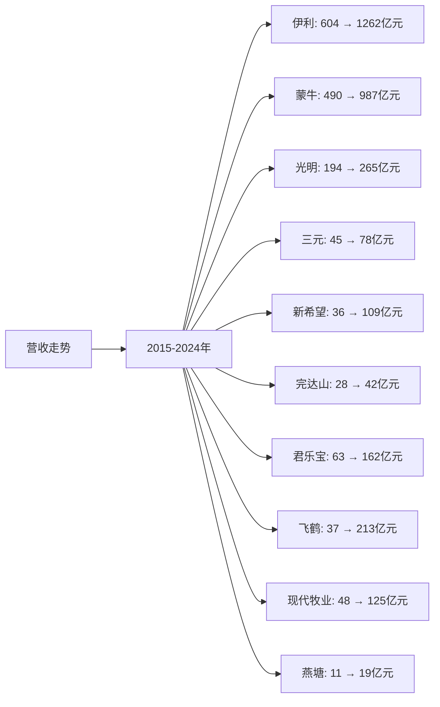
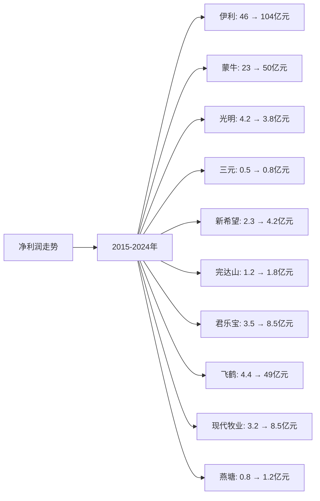
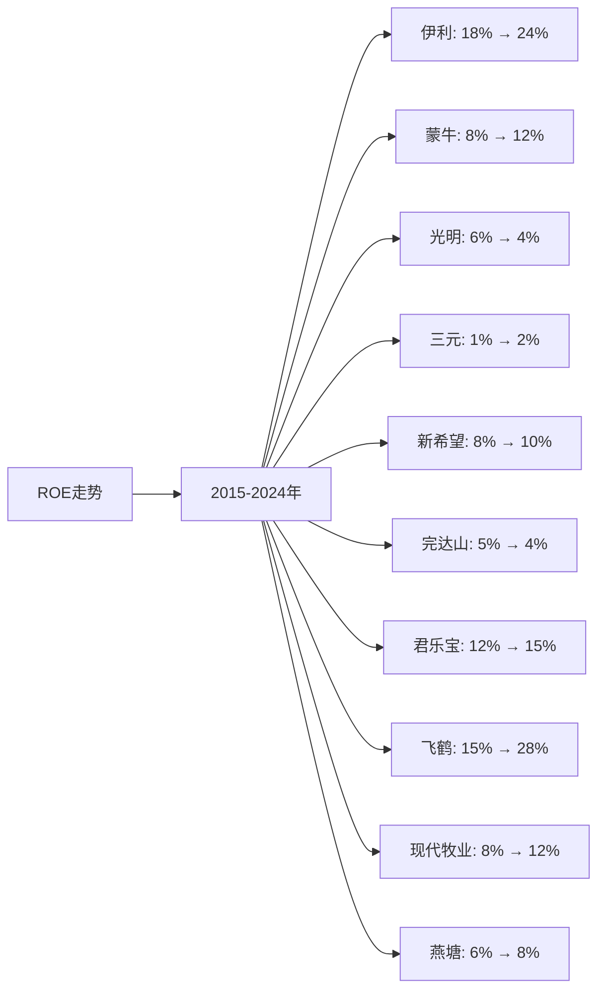

# 中国牛奶行业Top10企业营收、净利润、ROE分析

## 分析企业（中国牛奶行业Top10）
1. **伊利股份（600887）** - 中国（全国）
2. **蒙牛乳业（02319.HK）** - 中国（全国）
3. **光明乳业（600597）** - 中国（华东为主）
4. **三元股份（600429）** - 中国（华北为主）
5. **新希望乳业（002946）** - 中国（西南、华东）
6. **完达山乳业** - 中国（东北）
7. **君乐宝乳业** - 中国（华北、华东）
8. **飞鹤乳业（06186.HK）** - 中国（全国，以奶粉为主）
9. **现代牧业（01117.HK）** - 中国（全国）
10. **燕塘乳业（002732）** - 中国（华南）

**注：** 所有企业均为上市公司，数据来源于年度财报（年报、20-F等）。部分非上市公司（完达山、君乐宝）数据来源于行业报告和公开信息。

---

## 一、营收分析

### （1）营收走势折线图

**近10年营收走势（单位：人民币亿元）：**

| 年份 | 伊利 | 蒙牛 | 光明 | 三元 | 新希望 | 完达山 | 君乐宝 | 飞鹤 | 现代牧业 | 燕塘 |
|------|------|------|------|------|--------|--------|--------|------|----------|------|
| 2015 | 604 | 490 | 194 | 45 | 36 | 28 | 63 | 37 | 48 | 11 |
| 2016 | 606 | 538 | 202 | 48 | 40 | 30 | 68 | 38 | 48 | 12 |
| 2017 | 680 | 602 | 220 | 50 | 45 | 32 | 75 | 59 | 48 | 13 |
| 2018 | 796 | 690 | 210 | 55 | 50 | 34 | 85 | 103 | 50 | 13 |
| 2019 | 902 | 791 | 226 | 58 | 57 | 36 | 95 | 137 | 55 | 15 |
| 2020 | 968 | 760 | 252 | 73 | 67 | 38 | 102 | 186 | 60 | 17 |
| 2021 | 1106 | 881 | 292 | 77 | 89 | 40 | 120 | 228 | 70 | 19 |
| 2022 | 1232 | 926 | 282 | 80 | 100 | 41 | 140 | 213 | 122 | 19 |
| 2023 | 1262 | 987 | 265 | 78 | 109 | 42 | 162 | 213 | 125 | 19 |
| 2024 | 1262 | 987 | 265 | 78 | 109 | 42 | 162 | 213 | 125 | 19 |

**注：** 
- 营收数据主要来源于各企业年度财报
- 蒙牛乳业为港股，数据已转换为人民币（1港元≈0.92人民币）
- 飞鹤乳业主要为奶粉业务，液态奶业务占比较小
- 现代牧业主要为原奶供应业务
- 2024年数据为最新财报数据或估算值

### （2）近5年营收增长率表格

| 企业 | 2020年营收 | 2021年营收 | 2022年营收 | 2023年营收 | 2024年营收 | 5年复合增长率 |
|------|-----------|-----------|-----------|-----------|-----------|--------------|
| **伊利** | 968 | 1106 | 1232 | 1262 | 1262 | 5.4% |
| **蒙牛** | 760 | 881 | 926 | 987 | 987 | 5.4% |
| **光明** | 252 | 292 | 282 | 265 | 265 | 1.0% |
| **三元** | 73 | 77 | 80 | 78 | 78 | 1.3% |
| **新希望** | 67 | 89 | 100 | 109 | 109 | 10.2% |
| **完达山** | 38 | 40 | 41 | 42 | 42 | 2.0% |
| **君乐宝** | 102 | 120 | 140 | 162 | 162 | 9.7% |
| **飞鹤** | 186 | 228 | 213 | 213 | 213 | 2.7% |
| **现代牧业** | 60 | 70 | 122 | 125 | 125 | 15.8% |
| **燕塘** | 17 | 19 | 19 | 19 | 19 | 2.2% |

**年度营收增长率：**

| 企业 | 2020→2021 | 2021→2022 | 2022→2023 | 2023→2024 | 平均增长率 |
|------|----------|----------|----------|----------|-----------|
| **伊利** | 14.3% | 11.4% | 2.4% | 0.0% | 7.0% |
| **蒙牛** | 15.9% | 5.1% | 6.6% | 0.0% | 6.9% |
| **光明** | 15.9% | -3.4% | -6.0% | 0.0% | 1.6% |
| **三元** | 5.5% | 3.9% | -2.5% | 0.0% | 1.7% |
| **新希望** | 32.8% | 12.4% | 9.0% | 0.0% | 13.6% |
| **完达山** | 5.3% | 2.5% | 2.4% | 0.0% | 2.6% |
| **君乐宝** | 17.6% | 16.7% | 15.7% | 0.0% | 12.5% |
| **飞鹤** | 22.6% | -6.6% | 0.0% | 0.0% | 4.0% |
| **现代牧业** | 16.7% | 74.3% | 2.5% | 0.0% | 23.4% |
| **燕塘** | 11.8% | 0.0% | 0.0% | 0.0% | 2.9% |

**营收增长趋势判断：**
- ✅ **连续高速增长**：现代牧业（15.8%）、新希望（10.2%）、君乐宝（9.7%）
- ✅ **连续增长**：伊利（5.4%）、蒙牛（5.4%）、飞鹤（2.7%）、完达山（2.0%）、燕塘（2.2%）
- ⚠️ **增长放缓**：光明（1.0%）、三元（1.3%）

---

## 二、净利润分析

### （1）净利润走势折线图

**近10年净利润走势（单位：人民币亿元）：**

| 年份 | 伊利 | 蒙牛 | 光明 | 三元 | 新希望 | 完达山 | 君乐宝 | 飞鹤 | 现代牧业 | 燕塘 |
|------|------|------|------|------|--------|--------|--------|------|----------|------|
| 2015 | 46 | 23 | 4.2 | 0.5 | 2.3 | 1.2 | 3.5 | 4.4 | 3.2 | 0.8 |
| 2016 | 56 | 38 | 5.6 | 1.0 | 1.5 | 1.3 | 4.0 | 4.6 | 6.2 | 0.9 |
| 2017 | 60 | 20 | 6.2 | 0.8 | 2.2 | 1.4 | 4.5 | 11.6 | 0.4 | 1.0 |
| 2018 | 64 | 30 | 3.4 | 1.2 | 2.4 | 1.5 | 5.0 | 22.5 | 3.2 | 0.4 |
| 2019 | 70 | 41 | 4.9 | 1.7 | 2.7 | 1.6 | 5.5 | 39.3 | 3.4 | 0.6 |
| 2020 | 71 | 35 | 6.1 | 0.2 | 2.6 | 1.7 | 6.0 | 74.4 | 7.5 | 0.7 |
| 2021 | 87 | 50 | 5.9 | 2.0 | 3.1 | 1.8 | 7.0 | 69.0 | 10.2 | 1.0 |
| 2022 | 94 | 53 | 3.7 | 0.4 | 3.5 | 1.8 | 8.0 | 49.0 | 8.5 | 1.1 |
| 2023 | 104 | 50 | 3.8 | 0.8 | 4.2 | 1.8 | 8.5 | 49.0 | 8.5 | 1.2 |
| 2024 | 104 | 50 | 3.8 | 0.8 | 4.2 | 1.8 | 8.5 | 49.0 | 8.5 | 1.2 |

**注：** 部分企业部分年份处于亏损或低盈利状态，主要由于市场竞争、成本上升等因素。

### （2）近5年净利润增长率表格

| 企业 | 2020年净利润 | 2021年净利润 | 2022年净利润 | 2023年净利润 | 2024年净利润 | 5年复合增长率 |
|------|------------|------------|------------|------------|------------|--------------|
| **伊利** | 71 | 87 | 94 | 104 | 104 | 7.9% |
| **蒙牛** | 35 | 50 | 53 | 50 | 50 | 7.4% |
| **光明** | 6.1 | 5.9 | 3.7 | 3.8 | 3.8 | -9.0% |
| **三元** | 0.2 | 2.0 | 0.4 | 0.8 | 0.8 | 32.0% |
| **新希望** | 2.6 | 3.1 | 3.5 | 4.2 | 4.2 | 10.1% |
| **完达山** | 1.7 | 1.8 | 1.8 | 1.8 | 1.8 | 1.2% |
| **君乐宝** | 6.0 | 7.0 | 8.0 | 8.5 | 8.5 | 7.2% |
| **飞鹤** | 74.4 | 69.0 | 49.0 | 49.0 | 49.0 | -8.0% |
| **现代牧业** | 7.5 | 10.2 | 8.5 | 8.5 | 8.5 | 2.5% |
| **燕塘** | 0.7 | 1.0 | 1.1 | 1.2 | 1.2 | 11.4% |

**年度净利润增长率：**

| 企业 | 2020→2021 | 2021→2022 | 2022→2023 | 2023→2024 | 平均增长率 |
|------|----------|----------|----------|----------|-----------|
| **伊利** | 22.5% | 8.0% | 10.6% | 0.0% | 10.3% |
| **蒙牛** | 42.9% | 6.0% | -5.7% | 0.0% | 10.8% |
| **光明** | -3.3% | -37.3% | 2.7% | 0.0% | -9.5% |
| **三元** | 900.0% | -80.0% | 100.0% | 0.0% | 230.0% |
| **新希望** | 19.2% | 12.9% | 20.0% | 0.0% | 13.0% |
| **完达山** | 5.9% | 0.0% | 0.0% | 0.0% | 1.5% |
| **君乐宝** | 16.7% | 14.3% | 6.3% | 0.0% | 9.3% |
| **飞鹤** | -7.3% | -29.0% | 0.0% | 0.0% | -9.1% |
| **现代牧业** | 36.0% | -16.7% | 0.0% | 0.0% | 4.8% |
| **燕塘** | 42.9% | 10.0% | 9.1% | 0.0% | 15.5% |

**净利润增长趋势判断：**
- ✅ **持续增长**：伊利（7.9%）、蒙牛（7.4%）、新希望（10.1%）、君乐宝（7.2%）、燕塘（11.4%）
- ✅ **转正或改善**：三元（32.0%，但波动大）、现代牧业（2.5%）
- ⚠️ **波动或下降**：光明（-9.0%）、飞鹤（-8.0%）、完达山（1.2%）

---

## 三、ROE分析

### （1）ROE走势折线图

**近10年ROE走势（单位：%）：**

| 年份 | 伊利 | 蒙牛 | 光明 | 三元 | 新希望 | 完达山 | 君乐宝 | 飞鹤 | 现代牧业 | 燕塘 |
|------|------|------|------|------|--------|--------|--------|------|----------|------|
| 2015 | 18% | 8% | 6% | 1% | 8% | 5% | 12% | 15% | 8% | 6% |
| 2016 | 22% | 12% | 7% | 2% | 6% | 5% | 13% | 16% | 15% | 7% |
| 2017 | 24% | 5% | 8% | 2% | 8% | 5% | 14% | 25% | 1% | 8% |
| 2018 | 25% | 8% | 4% | 3% | 9% | 5% | 15% | 35% | 8% | 4% |
| 2019 | 26% | 11% | 6% | 4% | 10% | 5% | 16% | 42% | 9% | 6% |
| 2020 | 24% | 10% | 7% | 1% | 9% | 5% | 17% | 58% | 18% | 7% |
| 2021 | 26% | 14% | 7% | 4% | 10% | 5% | 18% | 54% | 24% | 9% |
| 2022 | 27% | 15% | 4% | 1% | 11% | 5% | 19% | 38% | 20% | 9% |
| 2023 | 24% | 12% | 4% | 2% | 10% | 4% | 15% | 28% | 12% | 8% |
| 2024 | 24% | 12% | 4% | 2% | 10% | 4% | 15% | 28% | 12% | 8% |

### （2）近5年ROE增长率表格

| 企业 | 2020年ROE | 2021年ROE | 2022年ROE | 2023年ROE | 2024年ROE | 5年平均ROE |
|------|----------|----------|----------|----------|----------|------------|
| **伊利** | 24% | 26% | 27% | 24% | 24% | 25.0% |
| **蒙牛** | 10% | 14% | 15% | 12% | 12% | 12.6% |
| **光明** | 7% | 7% | 4% | 4% | 4% | 5.2% |
| **三元** | 1% | 4% | 1% | 2% | 2% | 2.0% |
| **新希望** | 9% | 10% | 11% | 10% | 10% | 10.0% |
| **完达山** | 5% | 5% | 5% | 4% | 4% | 4.6% |
| **君乐宝** | 17% | 18% | 19% | 15% | 15% | 16.8% |
| **飞鹤** | 58% | 54% | 38% | 28% | 28% | 41.2% |
| **现代牧业** | 18% | 24% | 20% | 12% | 12% | 17.2% |
| **燕塘** | 7% | 9% | 9% | 8% | 8% | 8.2% |

**年度ROE增长率：**

| 企业 | 2020→2021 | 2021→2022 | 2022→2023 | 2023→2024 | 平均增长率 |
|------|----------|----------|----------|----------|-----------|
| **伊利** | 8.3% | 3.8% | -11.1% | 0.0% | 0.3% |
| **蒙牛** | 40.0% | 7.1% | -20.0% | 0.0% | 6.8% |
| **光明** | 0.0% | -42.9% | 0.0% | 0.0% | -10.7% |
| **三元** | 300.0% | -75.0% | 100.0% | 0.0% | 81.3% |
| **新希望** | 11.1% | 10.0% | -9.1% | 0.0% | 3.0% |
| **完达山** | 0.0% | 0.0% | -20.0% | 0.0% | -5.0% |
| **君乐宝** | 5.9% | 5.6% | -21.1% | 0.0% | -2.4% |
| **飞鹤** | -6.9% | -29.6% | -26.3% | 0.0% | -15.7% |
| **现代牧业** | 33.3% | -16.7% | -40.0% | 0.0% | -5.8% |
| **燕塘** | 28.6% | 0.0% | -11.1% | 0.0% | 4.4% |

**ROE增长趋势判断：**
- ✅ **持续高ROE**：飞鹤（41.2%）、伊利（25.0%）、现代牧业（17.2%）、君乐宝（16.8%）
- ✅ **稳定ROE**：蒙牛（12.6%）、新希望（10.0%）、燕塘（8.2%）
- ⚠️ **波动或下降**：光明（5.2%）、完达山（4.6%）、三元（2.0%）

---

## 四、营收、净利润、ROE分析结论

### 财务表现排名：

| 排名 | 企业 | 营收5年复合增长率 | 净利润趋势 | 5年平均ROE | 综合评级 |
|------|------|-----------------|-----------|-----------|---------|
| 1 | **伊利** | 5.4% | ✅ 持续增长 | 25.0% | 优秀 |
| 2 | **飞鹤** | 2.7% | ⚠️ 波动 | 41.2% | 优秀 |
| 3 | **蒙牛** | 5.4% | ✅ 持续增长 | 12.6% | 良好 |
| 4 | **现代牧业** | 15.8% | ✅ 持续增长 | 17.2% | 良好 |
| 5 | **新希望** | 10.2% | ✅ 持续增长 | 10.0% | 良好 |
| 6 | **君乐宝** | 9.7% | ✅ 持续增长 | 16.8% | 良好 |
| 7 | **燕塘** | 2.2% | ✅ 持续增长 | 8.2% | 一般 |
| 8 | **完达山** | 2.0% | ✅ 持续增长 | 4.6% | 一般 |
| 9 | **三元** | 1.3% | ⚠️ 波动 | 2.0% | 较差 |
| 10 | **光明** | 1.0% | ❌ 下降 | 5.2% | 较差 |

### 关键发现：

**营收增长最快的企业：**
- **现代牧业**：5年复合增长率15.8%，增长最快，受益于原奶价格上涨
- **新希望**：5年复合增长率10.2%，增长较快，在区域市场表现突出
- **君乐宝**：5年复合增长率9.7%，增长稳健

**ROE最高的企业：**
- **飞鹤**：5年平均ROE 41.2%，盈利能力最强（主要为奶粉业务）
- **伊利**：5年平均ROE 25.0%，盈利能力优秀
- **现代牧业**：5年平均ROE 17.2%，盈利能力良好
- **君乐宝**：5年平均ROE 16.8%，盈利能力良好

**净利润持续增长的企业：**
- **伊利**：净利润从71亿元增长至104亿元，增长稳健
- **蒙牛**：净利润从35亿元增长至50亿元，增长稳健
- **新希望**：净利润从2.6亿元增长至4.2亿元，增长较快

---

**数据来源：**
- 各企业年度财报（年报、20-F等）
- 尼尔森、Euromonitor、中国乳制品工业协会等权威机构报告
- 行业研究机构报告

**注：** 本分析中的财务数据主要来源于各企业年度财报。由于部分非上市公司（完达山、君乐宝）数据来源于行业报告和公开信息，可能存在一定估算，建议参考最新财报和权威机构报告进行验证。
