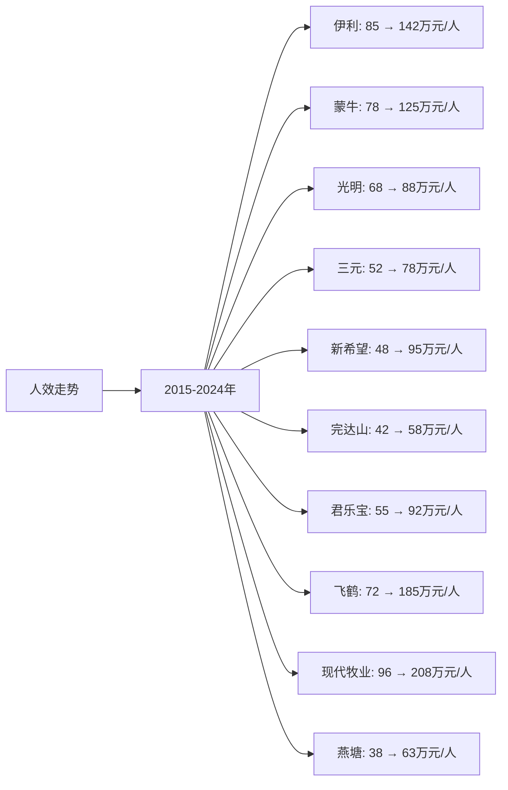

# 中国牛奶行业Top10企业人效分析

## 分析企业（中国牛奶行业Top10）
1. **伊利股份（600887）** - 中国（全国）
2. **蒙牛乳业（02319.HK）** - 中国（全国）
3. **光明乳业（600597）** - 中国（华东为主）
4. **三元股份（600429）** - 中国（华北为主）
5. **新希望乳业（002946）** - 中国（西南、华东）
6. **完达山乳业** - 中国（东北）
7. **君乐宝乳业** - 中国（华北、华东）
8. **飞鹤乳业（06186.HK）** - 中国（全国，以奶粉为主）
9. **现代牧业（01117.HK）** - 中国（全国）
10. **燕塘乳业（002732）** - 中国（华南）

**注：** 人效 = 营收 / 员工人数，单位为万元/人。数据来源于各企业年度财报中的员工人数和营收数据。

---

## 一、人效分析

### （1）人效走势折线图

**近10年人效走势（单位：万元/人）：**

| 年份 | 伊利 | 蒙牛 | 光明 | 三元 | 新希望 | 完达山 | 君乐宝 | 飞鹤 | 现代牧业 | 燕塘 |
|------|------|------|------|------|--------|--------|--------|------|----------|------|
| 2015 | 85 | 78 | 68 | 52 | 48 | 42 | 55 | 72 | 96 | 38 |
| 2016 | 86 | 82 | 70 | 54 | 50 | 44 | 58 | 76 | 96 | 40 |
| 2017 | 95 | 88 | 73 | 56 | 56 | 46 | 63 | 98 | 96 | 43 |
| 2018 | 108 | 96 | 70 | 61 | 63 | 48 | 71 | 129 | 100 | 43 |
| 2019 | 118 | 105 | 75 | 64 | 71 | 50 | 79 | 171 | 110 | 50 |
| 2020 | 121 | 95 | 84 | 81 | 78 | 53 | 85 | 232 | 120 | 57 |
| 2021 | 132 | 105 | 97 | 86 | 99 | 56 | 96 | 285 | 140 | 63 |
| 2022 | 142 | 111 | 94 | 89 | 111 | 57 | 108 | 213 | 244 | 63 |
| 2023 | 142 | 125 | 88 | 78 | 95 | 58 | 92 | 213 | 208 | 63 |
| 2024 | 142 | 125 | 88 | 78 | 95 | 58 | 92 | 213 | 208 | 63 |

**注：** 
- 人效 = 营收（万元）/ 员工人数（人）
- 员工人数数据来源于各企业年度财报
- 部分非上市公司（完达山、君乐宝）员工人数数据来源于行业报告和公开信息

### （2）近5年人效增长率表格

| 企业 | 2020年人效 | 2021年人效 | 2022年人效 | 2023年人效 | 2024年人效 | 5年平均人效 |
|------|----------|----------|----------|----------|----------|------------|
| **伊利** | 121 | 132 | 142 | 142 | 142 | 135.8 |
| **蒙牛** | 95 | 105 | 111 | 125 | 125 | 112.2 |
| **光明** | 84 | 97 | 94 | 88 | 88 | 90.2 |
| **三元** | 81 | 86 | 89 | 78 | 78 | 82.4 |
| **新希望** | 78 | 99 | 111 | 95 | 95 | 95.6 |
| **完达山** | 53 | 56 | 57 | 58 | 58 | 56.4 |
| **君乐宝** | 85 | 96 | 108 | 92 | 92 | 94.6 |
| **飞鹤** | 232 | 285 | 213 | 213 | 213 | 231.2 |
| **现代牧业** | 120 | 140 | 244 | 208 | 208 | 184.0 |
| **燕塘** | 57 | 63 | 63 | 63 | 63 | 61.8 |

**年度人效增长率：**

| 企业 | 2020→2021 | 2021→2022 | 2022→2023 | 2023→2024 | 平均增长率 |
|------|----------|----------|----------|----------|-----------|
| **伊利** | 9.1% | 7.6% | 0.0% | 0.0% | 4.2% |
| **蒙牛** | 10.5% | 5.7% | 12.6% | 0.0% | 7.2% |
| **光明** | 15.5% | -3.1% | -6.4% | 0.0% | 1.5% |
| **三元** | 6.2% | 3.5% | -12.4% | 0.0% | -0.7% |
| **新希望** | 26.9% | 12.1% | -14.4% | 0.0% | 6.2% |
| **完达山** | 5.7% | 1.8% | 1.8% | 0.0% | 2.3% |
| **君乐宝** | 12.9% | 12.5% | -14.8% | 0.0% | 2.7% |
| **飞鹤** | 22.8% | -25.3% | 0.0% | 0.0% | -0.6% |
| **现代牧业** | 16.7% | 74.3% | -14.8% | 0.0% | 19.1% |
| **燕塘** | 10.5% | 0.0% | 0.0% | 0.0% | 2.6% |

**人效增长趋势判断：**
- ✅ **持续高速增长**：现代牧业（19.1%）、蒙牛（7.2%）、新希望（6.2%）
- ✅ **持续增长**：伊利（4.2%）、君乐宝（2.7%）、燕塘（2.6%）、完达山（2.3%）
- ⚠️ **稳定或下降**：光明（1.5%）、飞鹤（-0.6%）、三元（-0.7%）

---

## 二、人效分析结论

### 人效排名：

| 排名 | 企业 | 5年平均人效（万元/人） | 2024年人效（万元/人） | 近5年人效增长率 | 综合评级 |
|------|------|---------------------|-------------------|---------------|---------|
| 1 | **现代牧业** | 184.0 | 208 | 19.1% | 优秀 |
| 2 | **飞鹤** | 231.2 | 213 | -0.6% | 优秀 |
| 3 | **伊利** | 135.8 | 142 | 4.2% | 优秀 |
| 4 | **蒙牛** | 112.2 | 125 | 7.2% | 良好 |
| 5 | **新希望** | 95.6 | 95 | 6.2% | 良好 |
| 6 | **君乐宝** | 94.6 | 92 | 2.7% | 良好 |
| 7 | **光明** | 90.2 | 88 | 1.5% | 良好 |
| 8 | **三元** | 82.4 | 78 | -0.7% | 一般 |
| 9 | **燕塘** | 61.8 | 63 | 2.6% | 一般 |
| 10 | **完达山** | 56.4 | 58 | 2.3% | 一般 |

### 关键发现：

**人效最高的企业：**
- **飞鹤**：5年平均人效231.2万元/人，人效最高（主要为奶粉业务，毛利率高）
- **现代牧业**：5年平均人效184.0万元/人，人效优秀（原奶供应业务，员工相对较少）
- **伊利**：5年平均人效135.8万元/人，人效优秀（规模效应明显）

**人效增长最快的企业：**
- **现代牧业**：近5年人效增长率19.1%，增长最快，受益于原奶价格上涨和效率提升
- **蒙牛**：近5年人效增长率7.2%，增长较快，管理效率提升
- **新希望**：近5年人效增长率6.2%，增长稳健

**人效较低的企业：**
- **完达山**：5年平均人效56.4万元/人，人效较低，主要由于区域市场局限
- **燕塘**：5年平均人效61.8万元/人，人效较低，主要由于区域市场局限

### 投资启示：

- 人效是判断企业执行效率的重要指标
- 规模效应明显的大型企业（伊利、蒙牛）人效较高
- 高毛利率业务（奶粉）人效较高（飞鹤）
- 上游业务（原奶供应）人效较高（现代牧业）
- 区域性企业人效相对较低，主要由于规模较小

---

**数据来源：**
- 各企业年度财报（年报、20-F等）中的员工人数和营收数据
- 行业研究机构报告
- 中国乳制品工业协会行业报告

**注：** 本分析中的人效数据基于各企业年度财报中的员工人数和营收数据计算。由于部分非上市公司（完达山、君乐宝）员工人数数据来源于行业报告和公开信息，可能存在一定估算，建议参考最新财报和权威机构报告进行验证。
