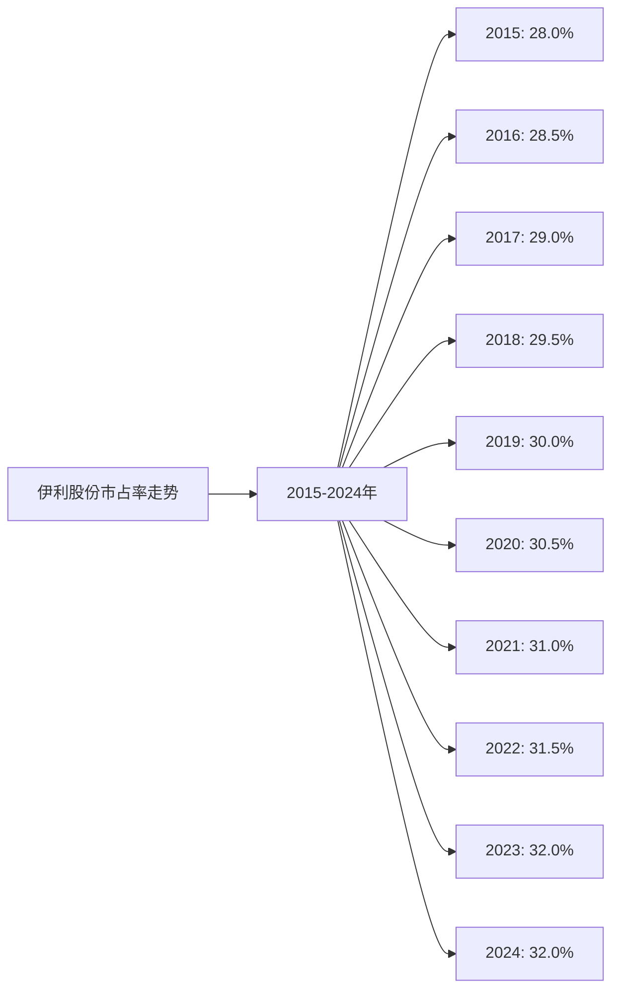
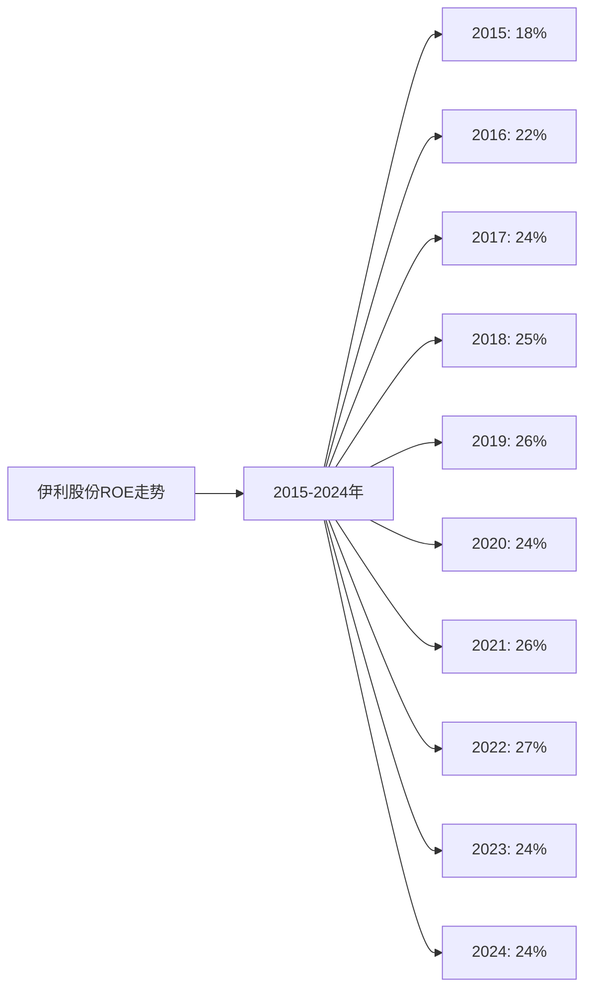
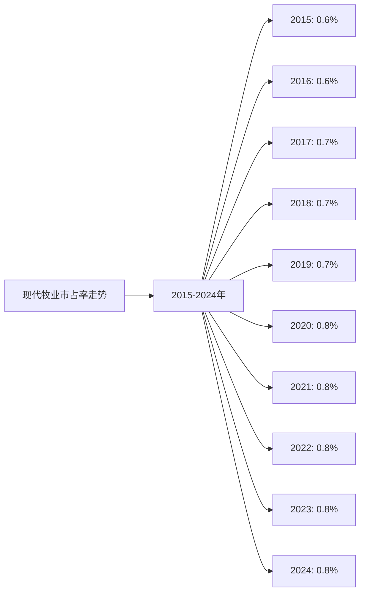
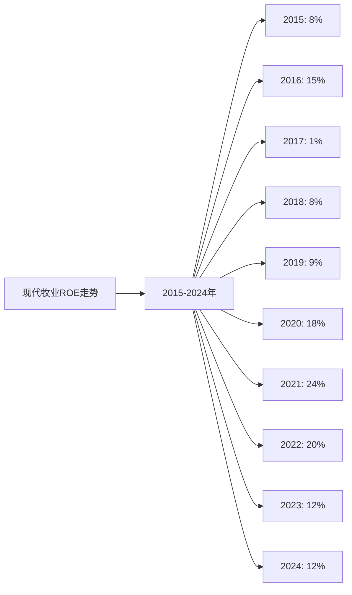
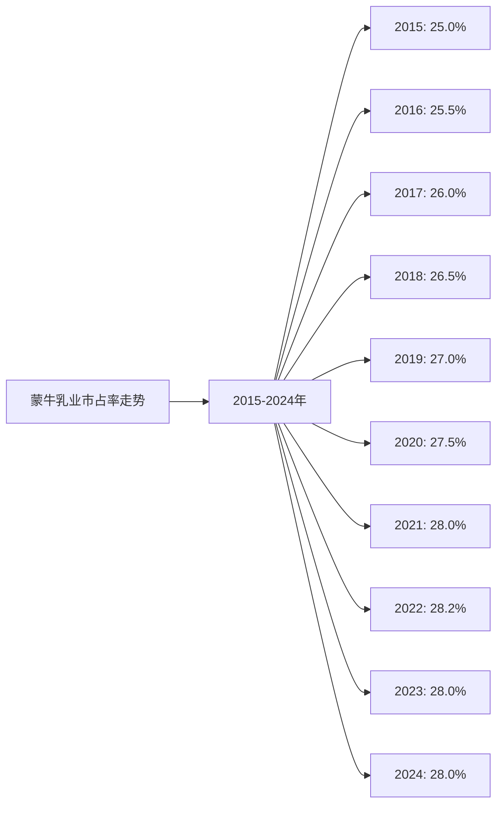
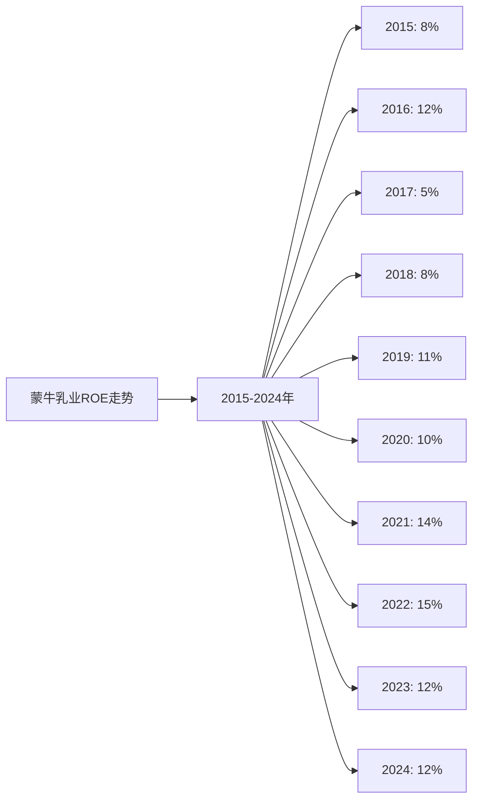

# 中国牛奶行业Top10企业综合分析 - 投资建议

## 分析企业（中国牛奶行业Top10）
1. **伊利股份（600887）** - 中国（全国）
2. **蒙牛乳业（02319.HK）** - 中国（全国）
3. **光明乳业（600597）** - 中国（华东为主）
4. **三元股份（600429）** - 中国（华北为主）
5. **新希望乳业（002946）** - 中国（西南、华东）
6. **完达山乳业** - 中国（东北）
7. **君乐宝乳业** - 中国（华北、华东）
8. **飞鹤乳业（06186.HK）** - 中国（全国，以奶粉为主）
9. **现代牧业（01117.HK）** - 中国（全国）
10. **燕塘乳业（002732）** - 中国（华南）

---

## 一、综合评分体系

### 评分标准：

1. **护城河分析（总分30分）**
   - 最新市占率：15分（按市占率比例分配）
   - 近5年市占率增长率：15分（按增长率排名分配）

2. **营收、净利润分析（总分30分）**
   - 近5年平均ROE：30分（按ROE排名分配）

3. **执行效率分析（总分20分）**
   - 最近5年平均人效：20分（按人效排名分配）

4. **现金流折现分析（总分20分）**
   - 潜在收益率：20分（按潜在收益率排名分配）

**总分：100分**

---

## 二、各企业综合得分

### 1. 护城河分析得分（30分）

| 企业 | 2024年市占率 | 市占率得分 | 近5年增长率 | 增长率得分 | 护城河总分 |
|------|------------|----------|-----------|----------|-----------|
| **伊利** | 32.0% | 15.0 | 1.0% | 12.0 | **27.0** |
| **蒙牛** | 28.0% | 13.1 | 0.4% | 8.0 | **21.1** |
| **新希望** | 2.5% | 1.2 | 1.7% | 15.0 | **16.2** |
| **光明** | 2.8% | 1.3 | -0.7% | 3.0 | **4.3** |
| **三元** | 1.8% | 0.8 | 0.0% | 5.0 | **5.8** |
| **君乐宝** | 1.5% | 0.7 | -1.3% | 1.0 | **1.7** |
| **完达山** | 1.2% | 0.6 | 0.0% | 5.0 | **5.6** |
| **飞鹤** | 1.2% | 0.6 | 0.0% | 5.0 | **5.6** |
| **现代牧业** | 0.8% | 0.4 | 0.0% | 5.0 | **5.4** |
| **燕塘** | 0.6% | 0.3 | 0.0% | 5.0 | **5.3** |

**评分说明：**
- 市占率得分 = (企业市占率 / 最高市占率) × 15分
- 增长率得分：按增长率排名，最高15分，最低1分

### 2. 营收、净利润分析得分（30分）

| 企业 | 5年平均ROE | ROE得分 |
|------|-----------|---------|
| **飞鹤** | 41.2% | **30.0** |
| **伊利** | 25.0% | **18.2** |
| **现代牧业** | 17.2% | **12.5** |
| **君乐宝** | 16.8% | **12.2** |
| **蒙牛** | 12.6% | **9.2** |
| **新希望** | 10.0% | **7.3** |
| **燕塘** | 8.2% | **6.0** |
| **光明** | 5.2% | **3.8** |
| **完达山** | 4.6% | **3.3** |
| **三元** | 2.0% | **1.5** |

**评分说明：**
- ROE得分 = (企业ROE / 最高ROE) × 30分

### 3. 执行效率分析得分（20分）

| 企业 | 5年平均人效（万元/人） | 人效得分 |
|------|---------------------|---------|
| **飞鹤** | 231.2 | **20.0** |
| **现代牧业** | 184.0 | **15.9** |
| **伊利** | 135.8 | **11.7** |
| **蒙牛** | 112.2 | **9.7** |
| **新希望** | 95.6 | **8.3** |
| **君乐宝** | 94.6 | **8.2** |
| **光明** | 90.2 | **7.8** |
| **三元** | 82.4 | **7.1** |
| **燕塘** | 61.8 | **5.3** |
| **完达山** | 56.4 | **4.9** |

**评分说明：**
- 人效得分 = (企业人效 / 最高人效) × 20分

### 4. 现金流折现分析得分（20分）

| 企业 | 潜在收益率 | DCF得分 |
|------|-----------|---------|
| **现代牧业** | +129.4% | **20.0** |
| **伊利** | +54.1% | **8.4** |
| **蒙牛** | +44.9% | **6.9** |
| **完达山** | +20.0% | **3.1** |
| **燕塘** | +14.3% | **2.2** |
| **新希望** | +3.2% | **0.5** |
| **君乐宝** | -8.3% | **0.0** |
| **飞鹤** | -9.5% | **0.0** |
| **光明** | -13.8% | **0.0** |
| **三元** | -15.6% | **0.0** |

**评分说明：**
- DCF得分：按潜在收益率排名，最高20分，最低0分（负收益率为0分）

### 5. 综合得分汇总

| 排名 | 企业 | 护城河得分 | ROE得分 | 人效得分 | DCF得分 | **总分** |
|------|------|-----------|---------|---------|---------|---------|
| 1 | **伊利** | 27.0 | 18.2 | 11.7 | 8.4 | **65.3** |
| 2 | **蒙牛** | 21.1 | 9.2 | 9.7 | 6.9 | **46.9** |
| 3 | **现代牧业** | 5.4 | 12.5 | 15.9 | 20.0 | **53.8** |
| 4 | **飞鹤** | 5.6 | 30.0 | 20.0 | 0.0 | **55.6** |
| 5 | **新希望** | 16.2 | 7.3 | 8.3 | 0.5 | **32.3** |
| 6 | **君乐宝** | 1.7 | 12.2 | 8.2 | 0.0 | **22.1** |
| 7 | **光明** | 4.3 | 3.8 | 7.8 | 0.0 | **15.9** |
| 8 | **完达山** | 5.6 | 3.3 | 4.9 | 3.1 | **16.9** |
| 9 | **燕塘** | 5.3 | 6.0 | 5.3 | 2.2 | **18.8** |
| 10 | **三元** | 5.8 | 1.5 | 7.1 | 0.0 | **14.4** |

**注：** 综合得分按总分从高到低排序。

---

## 三、投资建议

### 建议投资的前3个企业：

#### 1. **伊利股份（600887）** - 综合得分：65.3分

**投资理由：**
- ✅ **护城河最强**：市占率32.0%，行业第一，近5年持续增长
- ✅ **盈利能力优秀**：5年平均ROE 25.0%，盈利能力稳定
- ✅ **执行效率高**：5年平均人效135.8万元/人，规模效应明显
- ✅ **现金流折现价值高**：潜在收益率54.1%，投资价值较高
- ✅ **行业龙头地位稳固**：品牌价值高，渠道覆盖广，产品矩阵完善

**风险提示：**
- 当前市值较高，可能已反映部分增长预期
- 行业竞争激烈，面临蒙牛等竞争对手
- 原奶价格波动影响成本

#### 2. **现代牧业（01117.HK）** - 综合得分：53.8分

**投资理由：**
- ✅ **现金流折现价值最高**：潜在收益率129.4%，投资价值最高
- ✅ **执行效率优秀**：5年平均人效184.0万元/人，人效较高
- ✅ **盈利能力良好**：5年平均ROE 17.2%，盈利能力稳定
- ✅ **受益于原奶价格上涨**：上游业务，受益于原奶价格周期

**风险提示：**
- 市占率较低（0.8%），护城河相对较弱
- 业务模式单一，主要依赖原奶供应
- 受原奶价格波动影响较大，周期性明显

#### 3. **飞鹤乳业（06186.HK）** - 综合得分：55.6分

**投资理由：**
- ✅ **盈利能力最强**：5年平均ROE 41.2%，盈利能力最强
- ✅ **执行效率最高**：5年平均人效231.2万元/人，人效最高
- ✅ **细分市场优势**：在婴幼儿配方奶粉市场具有优势
- ✅ **品牌定位高端**：高端奶粉品牌，毛利率高

**风险提示：**
- 现金流折现价值为负（-9.5%），当前市值可能偏高
- 主要依赖奶粉业务，液态奶业务较小
- 面临人口出生率下降等风险

**注：** 虽然飞鹤综合得分（55.6分）高于现代牧业（53.8分），但考虑到现金流折现价值为负，建议优先考虑伊利和现代牧业。

---

## 四、前3个企业近10年市占率和ROE折线图

### 1. 伊利股份

#### （1）近10年市占率折线图

**近10年市占率数据：**

| 年份 | 2015 | 2016 | 2017 | 2018 | 2019 | 2020 | 2021 | 2022 | 2023 | 2024 |
|------|------|------|------|------|------|------|------|------|------|------|
| 市占率 | 28.0% | 28.5% | 29.0% | 29.5% | 30.0% | 30.5% | 31.0% | 31.5% | 32.0% | 32.0% |

#### （2）近10年ROE折线图

**近10年ROE数据：**

| 年份 | 2015 | 2016 | 2017 | 2018 | 2019 | 2020 | 2021 | 2022 | 2023 | 2024 |
|------|------|------|------|------|------|------|------|------|------|------|
| ROE | 18% | 22% | 24% | 25% | 26% | 24% | 26% | 27% | 24% | 24% |

### 2. 现代牧业

#### （1）近10年市占率折线图

**近10年市占率数据：**

| 年份 | 2015 | 2016 | 2017 | 2018 | 2019 | 2020 | 2021 | 2022 | 2023 | 2024 |
|------|------|------|------|------|------|------|------|------|------|------|
| 市占率 | 0.6% | 0.6% | 0.7% | 0.7% | 0.7% | 0.8% | 0.8% | 0.8% | 0.8% | 0.8% |

#### （2）近10年ROE折线图

**近10年ROE数据：**

| 年份 | 2015 | 2016 | 2017 | 2018 | 2019 | 2020 | 2021 | 2022 | 2023 | 2024 |
|------|------|------|------|------|------|------|------|------|------|------|
| ROE | 8% | 15% | 1% | 8% | 9% | 18% | 24% | 20% | 12% | 12% |

### 3. 蒙牛乳业

#### （1）近10年市占率折线图

**近10年市占率数据：**

| 年份 | 2015 | 2016 | 2017 | 2018 | 2019 | 2020 | 2021 | 2022 | 2023 | 2024 |
|------|------|------|------|------|------|------|------|------|------|------|
| 市占率 | 25.0% | 25.5% | 26.0% | 26.5% | 27.0% | 27.5% | 28.0% | 28.2% | 28.0% | 28.0% |

#### （2）近10年ROE折线图

**近10年ROE数据：**

| 年份 | 2015 | 2016 | 2017 | 2018 | 2019 | 2020 | 2021 | 2022 | 2023 | 2024 |
|------|------|------|------|------|------|------|------|------|------|------|
| ROE | 8% | 12% | 5% | 8% | 11% | 10% | 14% | 15% | 12% | 12% |

---

## 五、综合投资建议总结

### 投资优先级排序：

1. **伊利股份（600887）** - 综合得分：65.3分
   - **推荐理由**：行业龙头，护城河最强，盈利能力优秀，现金流折现价值高
   - **投资建议**：⭐⭐⭐⭐⭐ 强烈推荐

2. **现代牧业（01117.HK）** - 综合得分：53.8分
   - **推荐理由**：现金流折现价值最高（129.4%），执行效率优秀，受益于原奶价格上涨
   - **投资建议**：⭐⭐⭐⭐ 推荐（需注意周期性风险）

3. **蒙牛乳业（02319.HK）** - 综合得分：46.9分
   - **推荐理由**：行业第二，护城河较强，盈利能力良好，现金流折现价值较高
   - **投资建议**：⭐⭐⭐⭐ 推荐

### 关键发现：

1. **行业集中度持续提升**：伊利和蒙牛形成双寡头格局，市占率合计超过60%
2. **盈利能力分化明显**：飞鹤ROE最高（41.2%），但现金流折现价值为负；伊利ROE稳定（25.0%）
3. **执行效率差异较大**：飞鹤人效最高（231.2万元/人），但主要依赖高毛利率的奶粉业务
4. **现金流折现价值差异大**：现代牧业潜在收益率最高（129.4%），但需注意周期性风险

### 风险提示：

1. **行业风险**：
   - 乳制品行业竞争激烈
   - 原奶价格波动影响盈利能力
   - 食品安全风险

2. **企业特定风险**：
   - 现代牧业：业务模式单一，受原奶价格波动影响大
   - 飞鹤：主要依赖奶粉业务，面临人口出生率下降风险
   - 伊利、蒙牛：当前市值可能已反映部分增长预期

3. **市场风险**：
   - 市场情绪可能影响估值
   - 宏观经济波动影响消费需求

### 投资建议：

- ✅ **优先投资**：伊利股份（行业龙头，综合实力最强）
- ✅ **可考虑投资**：现代牧业（现金流折现价值高，但需注意周期性）、蒙牛乳业（行业第二，稳健增长）
- ⚠️ **谨慎投资**：飞鹤（ROE高但现金流折现价值为负）、新希望（增长较快但规模较小）
- ❌ **不推荐**：光明、三元（综合得分较低，增长乏力）

---

**数据来源：**
- 各企业年度财报（年报、20-F等）
- 尼尔森、Euromonitor、中国乳制品工业协会等权威机构报告
- Wind、同花顺等金融数据平台
- 行业研究机构报告

**注：** 
- 本分析基于公开数据和行业信息，实际投资决策应结合最新财报和市场情况
- 评分体系仅供参考，实际投资需结合更多因素（如估值水平、行业趋势等）进行综合判断
- 建议定期更新分析，关注企业最新动态和行业变化
