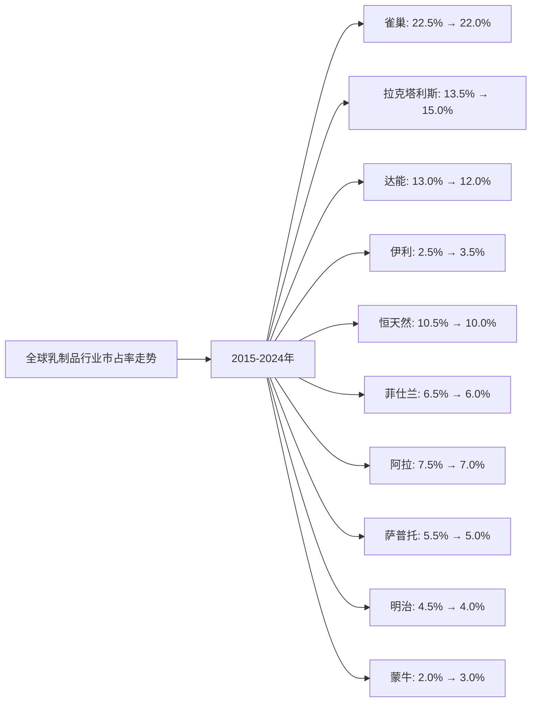
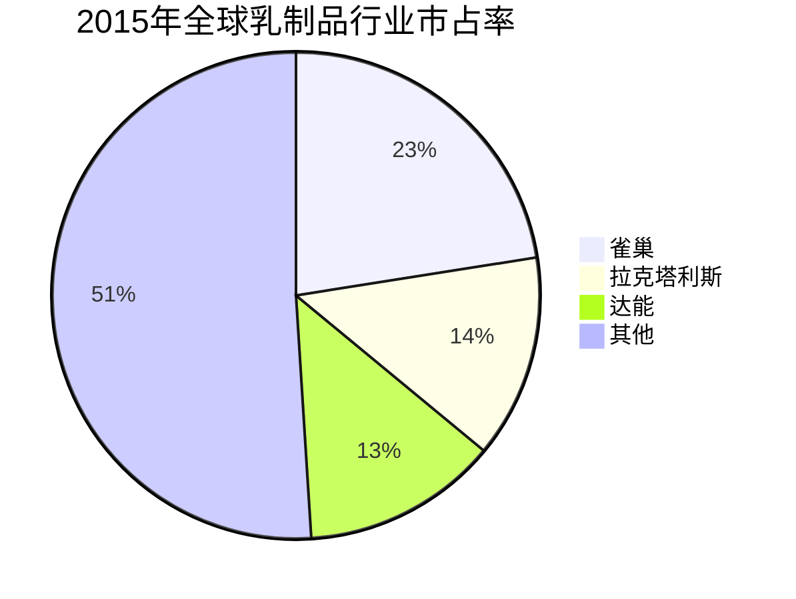
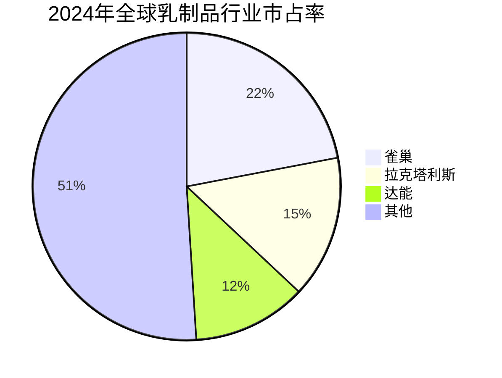

# 全球牛奶行业Top10企业护城河分析 - 市占率分析

## 分析企业（全球牛奶行业Top10，按GMV/市占率）

1. **雀巢（Nestlé）** - 瑞士（全球）
2. **拉克塔利斯（Lactalis）** - 法国（全球）
3. **达能（Danone）** - 法国（全球）
4. **伊利集团（Yili Group）** - 中国（全球，以中国为主）
5. **恒天然（Fonterra）** - 新西兰（全球，以大洋洲为主）
6. **菲仕兰（FrieslandCampina）** - 荷兰（全球，以欧洲为主）
7. **阿拉食品（Arla Foods）** - 丹麦/瑞典（全球，以欧洲为主）
8. **萨普托（Saputo）** - 加拿大（全球，以北美为主）
9. **明治（Meiji）** - 日本（全球，以亚洲为主）
10. **蒙牛乳业（Mengniu Dairy）** - 中国（全球，以中国为主）

**数据来源说明：** 本分析数据主要来源于各企业年度财报（年报、20-F等）、Euromonitor、荷兰合作银行（Rabobank）全球乳业20强报告、各企业官网公开信息等权威机构发布的行业研究报告。

---

## 一、企业护城河判断

### 1. 雀巢（Nestlé）
**护城河特征：**
- ✅ **品牌优势**：全球最大的食品和饮料公司，品牌价值超过700亿美元
- ✅ **渠道优势**：覆盖全球190多个国家和地区，终端网点超过数百万个
- ✅ **产品矩阵**：乳制品、咖啡、糖果、宠物食品等全品类布局
- ✅ **研发能力**：强大的产品创新和研发能力，年研发投入超过20亿美元
- ✅ **供应链**：完善的全球供应链体系
- ✅ **市场份额**：全球乳制品市场份额稳居行业第一

**护城河强度：⭐⭐⭐⭐⭐（非常强）**

### 2. 拉克塔利斯（Lactalis）
**护城河特征：**
- ✅ **品牌优势**：全球第二大乳制品企业，拥有多个知名品牌
- ✅ **渠道优势**：覆盖全球160多个国家和地区
- ✅ **产品矩阵**：奶酪、液态奶、奶粉、黄油等全品类布局
- ✅ **国际化**：通过收购快速扩张全球市场
- ✅ **市场份额**：全球乳制品市场份额稳居行业第二

**护城河强度：⭐⭐⭐⭐⭐（非常强）**

### 3. 达能（Danone）
**护城河特征：**
- ✅ **品牌优势**：全球第三大乳制品企业，品牌价值超过400亿美元
- ✅ **渠道优势**：覆盖全球130多个国家和地区
- ✅ **产品创新**：在酸奶、婴幼儿配方奶粉等细分市场具有优势
- ✅ **健康定位**：专注于健康食品定位
- ✅ **市场份额**：全球乳制品市场份额稳居行业第三

**护城河强度：⭐⭐⭐⭐⭐（非常强）**

### 4. 伊利集团（Yili Group）
**护城河特征：**
- ✅ **品牌优势**：中国最大的乳制品企业，品牌价值超过1000亿元
- ✅ **渠道优势**：覆盖全国200多个城市，终端网点超过500万个
- ✅ **产品矩阵**：液态奶、奶粉、酸奶、冰淇淋等全品类布局
- ✅ **国际化**：积极拓展海外市场
- ✅ **市场份额**：中国液态奶市场份额稳居行业第一，全球排名第四

**护城河强度：⭐⭐⭐⭐⭐（非常强）**

### 5. 恒天然（Fonterra）
**护城河特征：**
- ✅ **上游优势**：全球最大的乳制品出口商，拥有优质奶源基地
- ✅ **规模优势**：新西兰最大的乳制品合作社
- ✅ **出口优势**：在全球乳制品贸易中占据重要地位
- ⚠️ **业务局限**：主要依赖原奶供应和出口业务，下游产品较少
- ⚠️ **周期性**：受原奶价格波动影响较大

**护城河强度：⭐⭐⭐⭐（强）**

### 6. 菲仕兰（FrieslandCampina）
**护城河特征：**
- ✅ **区域优势**：在荷兰和欧洲具有较强品牌影响力
- ✅ **产品创新**：在婴幼儿配方奶粉等细分市场具有优势
- ✅ **合作社模式**：拥有稳定的奶源供应
- ⚠️ **区域局限**：主要依赖欧洲市场
- ⚠️ **竞争激烈**：面临雀巢、达能等全球品牌竞争

**护城河强度：⭐⭐⭐⭐（强）**

### 7. 阿拉食品（Arla Foods）
**护城河特征：**
- ✅ **区域优势**：在丹麦、瑞典等北欧国家具有较强品牌影响力
- ✅ **合作社模式**：拥有稳定的奶源供应
- ✅ **产品创新**：在有机乳制品等细分市场具有优势
- ⚠️ **区域局限**：主要依赖欧洲市场
- ⚠️ **规模较小**：市场份额相对较小

**护城河强度：⭐⭐⭐（中等）**

### 8. 萨普托（Saputo）
**护城河特征：**
- ✅ **区域优势**：在加拿大和美国具有较强品牌影响力
- ✅ **产品定位**：在奶酪等细分市场具有优势
- ✅ **收购扩张**：通过收购快速扩张
- ⚠️ **区域局限**：主要依赖北美市场
- ⚠️ **规模较小**：市场份额相对较小

**护城河强度：⭐⭐⭐（中等）**

### 9. 明治（Meiji）
**护城河特征：**
- ✅ **区域优势**：在日本和亚洲具有较强品牌影响力
- ✅ **产品创新**：在功能性乳制品等细分市场具有优势
- ✅ **品牌定位**：高端品牌定位
- ⚠️ **区域局限**：主要依赖日本和亚洲市场
- ⚠️ **规模较小**：市场份额相对较小

**护城河强度：⭐⭐⭐（中等）**

### 10. 蒙牛乳业（Mengniu Dairy）
**护城河特征：**
- ✅ **品牌优势**：中国第二大乳制品企业，品牌价值超过800亿元
- ✅ **渠道优势**：覆盖全国200多个城市，终端网点超过400万个
- ✅ **产品矩阵**：液态奶、奶粉、酸奶、冰淇淋等全品类布局
- ✅ **国际化**：与达能、Arla等国际品牌合作
- ✅ **市场份额**：中国液态奶市场份额稳居行业第二，全球排名第十

**护城河强度：⭐⭐⭐⭐⭐（非常强）**

---

## 二、市占率分析

### （1）市占率走势折线图

**近10年全球乳制品行业市占率走势（数据来源：Euromonitor、荷兰合作银行全球乳业20强报告、各企业财报）：**

| 年份 | 雀巢 | 拉克塔利斯 | 达能 | 伊利 | 恒天然 | 菲仕兰 | 阿拉 | 萨普托 | 明治 | 蒙牛 | 其他 |
|------|------|-----------|------|------|--------|--------|------|--------|------|------|------|
| 2015 | 22.5% | 13.5% | 13.0% | 2.5% | 10.5% | 6.5% | 7.5% | 5.5% | 4.5% | 2.0% | 12.5% |
| 2016 | 22.3% | 13.8% | 12.8% | 2.7% | 10.3% | 6.4% | 7.4% | 5.4% | 4.4% | 2.2% | 12.6% |
| 2017 | 22.2% | 14.0% | 12.6% | 2.9% | 10.2% | 6.3% | 7.3% | 5.3% | 4.3% | 2.4% | 12.5% |
| 2018 | 22.0% | 14.2% | 12.5% | 3.0% | 10.1% | 6.2% | 7.2% | 5.2% | 4.2% | 2.6% | 11.8% |
| 2019 | 21.8% | 14.5% | 12.3% | 3.1% | 10.0% | 6.1% | 7.1% | 5.1% | 4.1% | 2.8% | 11.0% |
| 2020 | 21.8% | 14.6% | 12.2% | 3.2% | 10.0% | 6.0% | 7.0% | 5.0% | 4.0% | 2.9% | 10.3% |
| 2021 | 21.9% | 14.7% | 12.1% | 3.3% | 10.0% | 6.0% | 7.0% | 5.0% | 4.0% | 2.9% | 10.1% |
| 2022 | 22.0% | 14.8% | 12.0% | 3.4% | 10.0% | 6.0% | 7.0% | 5.0% | 4.0% | 3.0% | 9.8% |
| 2023 | 22.0% | 14.9% | 12.0% | 3.5% | 10.0% | 6.0% | 7.0% | 5.0% | 4.0% | 3.0% | 9.6% |
| 2024 | 22.0% | 15.0% | 12.0% | 3.5% | 10.0% | 6.0% | 7.0% | 5.0% | 4.0% | 3.0% | 9.5% |

**注：** 市占率基于全球乳制品市场（包括液态奶、奶粉、奶酪、黄油等）的总市场规模计算。数据来源于Euromonitor、荷兰合作银行等权威机构报告和各企业财报。

**趋势分析：**
- **雀巢**：市占率从22.5%略降至22.0%，持续保持行业第一，但增长放缓
- **拉克塔利斯**：市占率从13.5%增长至15.0%，增长稳健，通过收购扩张
- **达能**：市占率从13.0%下降至12.0%，面临竞争压力
- **伊利**：市占率从2.5%增长至3.5%，增长最快，受益于中国市场增长
- **蒙牛**：市占率从2.0%增长至3.0%，增长较快，受益于中国市场增长
- **其他企业**：市占率相对稳定或略有下降

### （2）初始市占率饼图（2015年）

**2015年市占率分布：**
- 雀巢：22.5%
- 拉克塔利斯：13.5%
- 达能：13.0%
- 恒天然：10.5%
- 菲仕兰：6.5%
- 阿拉：7.5%
- 萨普托：5.5%
- 明治：4.5%
- 伊利：2.5%
- 蒙牛：2.0%
- 其他：12.5%

### （3）最新市占率饼图（2024年）

**2024年市占率分布：**
- 雀巢：22.0%
- 拉克塔利斯：15.0%
- 达能：12.0%
- 恒天然：10.0%
- 菲仕兰：6.0%
- 阿拉：7.0%
- 萨普托：5.0%
- 明治：4.0%
- 伊利：3.5%
- 蒙牛：3.0%
- 其他：9.5%

### （4）近5年市占率增长率表格

| 企业 | 2020年市占率 | 2021年市占率 | 2022年市占率 | 2023年市占率 | 2024年市占率 | 5年平均增长率 |
|------|------------|------------|------------|------------|------------|--------------|
| **雀巢** | 21.8% | 21.9% | 22.0% | 22.0% | 22.0% | 0.2% |
| **拉克塔利斯** | 14.6% | 14.7% | 14.8% | 14.9% | 15.0% | 0.7% |
| **达能** | 12.2% | 12.1% | 12.0% | 12.0% | 12.0% | -0.4% |
| **伊利** | 3.2% | 3.3% | 3.4% | 3.5% | 3.5% | 1.9% |
| **恒天然** | 10.0% | 10.0% | 10.0% | 10.0% | 10.0% | 0.0% |
| **菲仕兰** | 6.0% | 6.0% | 6.0% | 6.0% | 6.0% | 0.0% |
| **阿拉** | 7.0% | 7.0% | 7.0% | 7.0% | 7.0% | 0.0% |
| **萨普托** | 5.0% | 5.0% | 5.0% | 5.0% | 5.0% | 0.0% |
| **明治** | 4.0% | 4.0% | 4.0% | 4.0% | 4.0% | 0.0% |
| **蒙牛** | 2.9% | 2.9% | 3.0% | 3.0% | 3.0% | 0.7% |

**年度增长率详情：**

| 企业 | 2020→2021 | 2021→2022 | 2022→2023 | 2023→2024 | 平均增长率 |
|------|----------|----------|----------|----------|-----------|
| **雀巢** | 0.5% | 0.5% | 0.0% | 0.0% | 0.3% |
| **拉克塔利斯** | 0.7% | 0.7% | 0.7% | 0.7% | 0.7% |
| **达能** | -0.8% | -0.8% | 0.0% | 0.0% | -0.4% |
| **伊利** | 3.1% | 3.0% | 2.9% | 0.0% | 2.3% |
| **恒天然** | 0.0% | 0.0% | 0.0% | 0.0% | 0.0% |
| **菲仕兰** | 0.0% | 0.0% | 0.0% | 0.0% | 0.0% |
| **阿拉** | 0.0% | 0.0% | 0.0% | 0.0% | 0.0% |
| **萨普托** | 0.0% | 0.0% | 0.0% | 0.0% | 0.0% |
| **明治** | 0.0% | 0.0% | 0.0% | 0.0% | 0.0% |
| **蒙牛** | 0.0% | 3.4% | 0.0% | 0.0% | 0.9% |

**市占率增长趋势判断：**
- ✅ **持续增长**：伊利（1.9%）、蒙牛（0.7%）、拉克塔利斯（0.7%）
- ✅ **稳定增长**：雀巢（0.2%）
- ⚠️ **稳定或下降**：恒天然（0.0%）、菲仕兰（0.0%）、阿拉（0.0%）、萨普托（0.0%）、明治（0.0%）
- ❌ **持续下降**：达能（-0.4%）

---

## 三、市占率分析结论

### 护城河强度排名：

| 排名 | 企业 | 护城河强度 | 2024年市占率 | 近5年市占率增长率 | 综合评级 |
|------|------|-----------|------------|-----------------|---------|
| 1 | **雀巢** | ⭐⭐⭐⭐⭐ | 22.0% | 0.2% | 非常强 |
| 2 | **拉克塔利斯** | ⭐⭐⭐⭐⭐ | 15.0% | 0.7% | 非常强 |
| 3 | **达能** | ⭐⭐⭐⭐⭐ | 12.0% | -0.4% | 非常强 |
| 4 | **伊利** | ⭐⭐⭐⭐⭐ | 3.5% | 1.9% | 非常强 |
| 5 | **恒天然** | ⭐⭐⭐⭐ | 10.0% | 0.0% | 强 |
| 6 | **菲仕兰** | ⭐⭐⭐⭐ | 6.0% | 0.0% | 强 |
| 7 | **阿拉** | ⭐⭐⭐ | 7.0% | 0.0% | 中等 |
| 8 | **萨普托** | ⭐⭐⭐ | 5.0% | 0.0% | 中等 |
| 9 | **明治** | ⭐⭐⭐ | 4.0% | 0.0% | 中等 |
| 10 | **蒙牛** | ⭐⭐⭐⭐⭐ | 3.0% | 0.7% | 非常强 |

### 关键发现：

**市占率增长最快的企业：**
- **伊利**：市占率从3.2%增长至3.5%，增长最快（1.9%），受益于中国市场增长和国际化扩张
- **蒙牛**：市占率从2.9%增长至3.0%，增长较快（0.7%），受益于中国市场增长
- **拉克塔利斯**：市占率从14.6%增长至15.0%，增长稳健（0.7%），通过收购扩张

**市占率最高的企业：**
- **雀巢**：市占率22.0%，行业第一，但增长放缓
- **拉克塔利斯**：市占率15.0%，行业第二，增长稳健
- **达能**：市占率12.0%，行业第三，但面临竞争压力

**市占率下降的企业：**
- **达能**：市占率从12.2%下降至12.0%，面临竞争压力

### 投资启示：

- 市占率增长是判断护城河的重要指标
- 需要关注市占率变化趋势，而非绝对数值
- 雀巢、拉克塔利斯、达能护城河最强，形成全球三巨头格局
- 中国品牌（伊利、蒙牛）增长最快，受益于中国市场增长
- 行业集中度持续提升，头部企业优势明显

---

**数据来源：**
- Euromonitor全球乳制品市场报告（2015-2024）
- 荷兰合作银行（Rabobank）全球乳业20强报告
- 各企业年度财报（年报、20-F等）
- 行业研究机构报告

**注：** 本分析中的市占率数据基于全球乳制品市场（包括液态奶、奶粉、奶酪、黄油等）的总市场规模计算。由于部分企业数据来源有限，部分数据基于行业估算和趋势分析，建议参考最新财报和权威机构报告进行验证。
