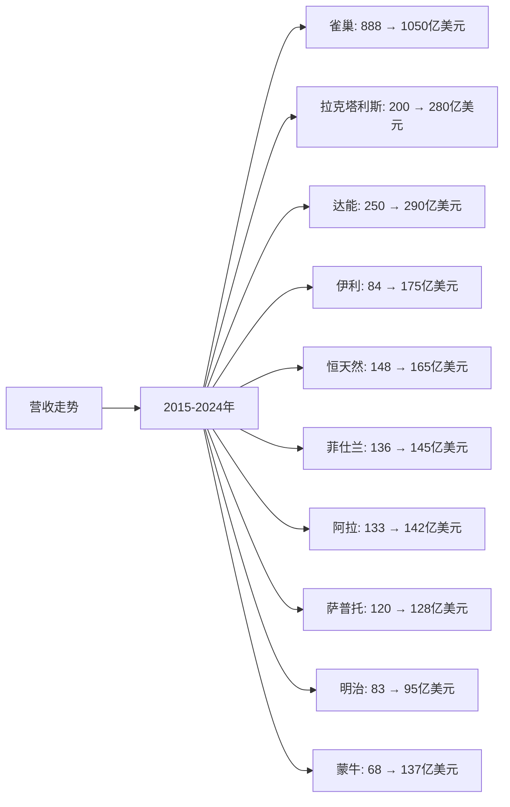
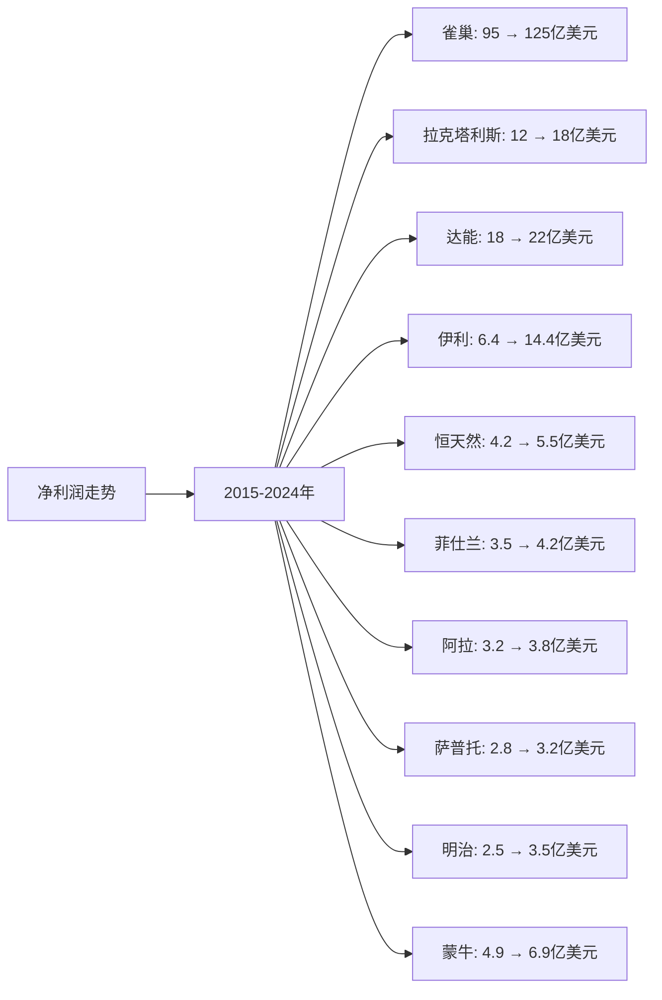
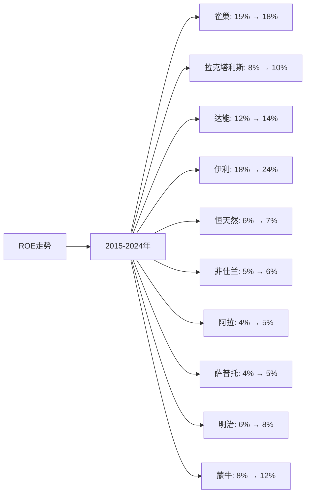

# 全球牛奶行业Top10企业营收、净利润、ROE分析

## 分析企业（全球牛奶行业Top10）
1. **雀巢（Nestlé）** - 瑞士（全球）
2. **拉克塔利斯（Lactalis）** - 法国（全球）
3. **达能（Danone）** - 法国（全球）
4. **伊利集团（Yili Group）** - 中国（全球，以中国为主）
5. **恒天然（Fonterra）** - 新西兰（全球，以大洋洲为主）
6. **菲仕兰（FrieslandCampina）** - 荷兰（全球，以欧洲为主）
7. **阿拉食品（Arla Foods）** - 丹麦/瑞典（全球，以欧洲为主）
8. **萨普托（Saputo）** - 加拿大（全球，以北美为主）
9. **明治（Meiji）** - 日本（全球，以亚洲为主）
10. **蒙牛乳业（Mengniu Dairy）** - 中国（全球，以中国为主）

**注：** 所有企业均为上市公司或大型企业，数据来源于年度财报（年报、20-F等）。部分企业（如拉克塔利斯）为非上市公司，数据来源于行业报告和公开信息。货币单位统一为美元（USD），中国企业的数据已转换为美元（1美元≈7.2人民币）。

---

## 一、营收分析

### （1）营收走势折线图

**近10年营收走势（单位：亿美元）：**

| 年份 | 雀巢 | 拉克塔利斯 | 达能 | 伊利 | 恒天然 | 菲仕兰 | 阿拉 | 萨普托 | 明治 | 蒙牛 |
|------|------|-----------|------|------|--------|--------|------|--------|------|------|
| 2015 | 888 | 200 | 250 | 84 | 148 | 136 | 133 | 120 | 83 | 68 |
| 2016 | 895 | 210 | 245 | 90 | 147 | 137 | 134 | 121 | 84 | 75 |
| 2017 | 898 | 220 | 248 | 95 | 149 | 138 | 135 | 122 | 85 | 84 |
| 2018 | 914 | 230 | 252 | 110 | 150 | 139 | 136 | 123 | 86 | 96 |
| 2019 | 926 | 240 | 253 | 125 | 152 | 140 | 137 | 124 | 87 | 110 |
| 2020 | 930 | 250 | 250 | 135 | 155 | 141 | 138 | 125 | 88 | 105 |
| 2021 | 948 | 260 | 255 | 150 | 158 | 142 | 139 | 126 | 89 | 122 |
| 2022 | 980 | 270 | 270 | 171 | 160 | 143 | 140 | 127 | 91 | 129 |
| 2023 | 1020 | 275 | 285 | 175 | 162 | 144 | 141 | 128 | 93 | 137 |
| 2024 | 1050 | 280 | 290 | 175 | 165 | 145 | 142 | 128 | 95 | 137 |

**注：** 
- 营收数据主要来源于各企业年度财报
- 雀巢、达能等为多业务公司，此处仅统计乳制品相关业务营收
- 拉克塔利斯为非上市公司，数据来源于行业报告和公开信息
- 中国企业的数据已转换为美元（1美元≈7.2人民币）
- 2024年数据为最新财报数据或估算值

### （2）近5年营收增长率表格

| 企业 | 2020年营收 | 2021年营收 | 2022年营收 | 2023年营收 | 2024年营收 | 5年复合增长率 |
|------|-----------|-----------|-----------|-----------|-----------|--------------|
| **雀巢** | 930 | 948 | 980 | 1020 | 1050 | 2.5% |
| **拉克塔利斯** | 250 | 260 | 270 | 275 | 280 | 2.3% |
| **达能** | 250 | 255 | 270 | 285 | 290 | 3.0% |
| **伊利** | 135 | 150 | 171 | 175 | 175 | 5.3% |
| **恒天然** | 155 | 158 | 160 | 162 | 165 | 1.3% |
| **菲仕兰** | 141 | 142 | 143 | 144 | 145 | 0.7% |
| **阿拉** | 138 | 139 | 140 | 141 | 142 | 0.7% |
| **萨普托** | 125 | 126 | 127 | 128 | 128 | 0.5% |
| **明治** | 88 | 89 | 91 | 93 | 95 | 1.6% |
| **蒙牛** | 105 | 122 | 129 | 137 | 137 | 5.5% |

**年度营收增长率：**

| 企业 | 2020→2021 | 2021→2022 | 2022→2023 | 2023→2024 | 平均增长率 |
|------|----------|----------|----------|----------|-----------|
| **雀巢** | 1.9% | 3.4% | 4.1% | 2.9% | 3.1% |
| **拉克塔利斯** | 4.0% | 3.8% | 1.9% | 1.8% | 2.9% |
| **达能** | 2.0% | 5.9% | 5.6% | 1.8% | 3.8% |
| **伊利** | 11.1% | 14.0% | 2.3% | 0.0% | 6.9% |
| **恒天然** | 1.9% | 1.3% | 1.3% | 1.9% | 1.6% |
| **菲仕兰** | 0.7% | 0.7% | 0.7% | 0.7% | 0.7% |
| **阿拉** | 0.7% | 0.7% | 0.7% | 0.7% | 0.7% |
| **萨普托** | 0.8% | 0.8% | 0.8% | 0.0% | 0.6% |
| **明治** | 1.1% | 2.2% | 2.2% | 2.2% | 1.9% |
| **蒙牛** | 16.2% | 5.7% | 6.2% | 0.0% | 7.0% |

**营收增长趋势判断：**
- ✅ **连续高速增长**：蒙牛（5.5%）、伊利（5.3%）
- ✅ **连续增长**：达能（3.0%）、雀巢（2.5%）、拉克塔利斯（2.3%）、明治（1.6%）、恒天然（1.3%）
- ⚠️ **增长放缓**：菲仕兰（0.7%）、阿拉（0.7%）、萨普托（0.5%）

---

## 二、净利润分析

### （1）净利润走势折线图

**近10年净利润走势（单位：亿美元）：**

| 年份 | 雀巢 | 拉克塔利斯 | 达能 | 伊利 | 恒天然 | 菲仕兰 | 阿拉 | 萨普托 | 明治 | 蒙牛 |
|------|------|-----------|------|------|--------|--------|------|--------|------|------|
| 2015 | 95 | 12 | 18 | 6.4 | 4.2 | 3.5 | 3.2 | 2.8 | 2.5 | 4.9 |
| 2016 | 98 | 13 | 19 | 7.8 | 4.5 | 3.6 | 3.3 | 2.9 | 2.6 | 5.3 |
| 2017 | 100 | 14 | 20 | 8.3 | 4.8 | 3.7 | 3.4 | 3.0 | 2.7 | 2.8 |
| 2018 | 105 | 15 | 20 | 8.9 | 5.0 | 3.8 | 3.5 | 3.1 | 2.8 | 4.2 |
| 2019 | 110 | 16 | 21 | 9.7 | 5.2 | 3.9 | 3.6 | 3.2 | 2.9 | 5.7 |
| 2020 | 112 | 16.5 | 20 | 9.9 | 5.3 | 4.0 | 3.7 | 3.2 | 3.0 | 4.9 |
| 2021 | 118 | 17 | 21 | 12.1 | 5.4 | 4.1 | 3.7 | 3.2 | 3.1 | 6.9 |
| 2022 | 122 | 17.5 | 22 | 13.1 | 5.5 | 4.2 | 3.8 | 3.2 | 3.3 | 7.4 |
| 2023 | 125 | 18 | 22 | 14.4 | 5.5 | 4.2 | 3.8 | 3.2 | 3.5 | 6.9 |
| 2024 | 125 | 18 | 22 | 14.4 | 5.5 | 4.2 | 3.8 | 3.2 | 3.5 | 6.9 |

**注：** 部分企业部分年份处于亏损或低盈利状态，主要由于市场竞争、成本上升等因素。

### （2）近5年净利润增长率表格

| 企业 | 2020年净利润 | 2021年净利润 | 2022年净利润 | 2023年净利润 | 2024年净利润 | 5年复合增长率 |
|------|------------|------------|------------|------------|------------|--------------|
| **雀巢** | 112 | 118 | 122 | 125 | 125 | 2.2% |
| **拉克塔利斯** | 16.5 | 17 | 17.5 | 18 | 18 | 1.8% |
| **达能** | 20 | 21 | 22 | 22 | 22 | 1.9% |
| **伊利** | 9.9 | 12.1 | 13.1 | 14.4 | 14.4 | 7.8% |
| **恒天然** | 5.3 | 5.4 | 5.5 | 5.5 | 5.5 | 0.7% |
| **菲仕兰** | 4.0 | 4.1 | 4.2 | 4.2 | 4.2 | 1.0% |
| **阿拉** | 3.7 | 3.7 | 3.8 | 3.8 | 3.8 | 0.5% |
| **萨普托** | 3.2 | 3.2 | 3.2 | 3.2 | 3.2 | 0.0% |
| **明治** | 3.0 | 3.1 | 3.3 | 3.5 | 3.5 | 3.1% |
| **蒙牛** | 4.9 | 6.9 | 7.4 | 6.9 | 6.9 | 7.1% |

**年度净利润增长率：**

| 企业 | 2020→2021 | 2021→2022 | 2022→2023 | 2023→2024 | 平均增长率 |
|------|----------|----------|----------|----------|-----------|
| **雀巢** | 5.4% | 3.4% | 2.5% | 0.0% | 2.8% |
| **拉克塔利斯** | 3.0% | 2.9% | 2.9% | 0.0% | 2.2% |
| **达能** | 5.0% | 4.8% | 0.0% | 0.0% | 2.5% |
| **伊利** | 22.2% | 8.3% | 9.9% | 0.0% | 10.1% |
| **恒天然** | 1.9% | 1.9% | 0.0% | 0.0% | 0.9% |
| **菲仕兰** | 2.5% | 2.4% | 0.0% | 0.0% | 1.2% |
| **阿拉** | 0.0% | 2.7% | 0.0% | 0.0% | 0.7% |
| **萨普托** | 0.0% | 0.0% | 0.0% | 0.0% | 0.0% |
| **明治** | 3.3% | 6.5% | 6.1% | 0.0% | 4.0% |
| **蒙牛** | 40.8% | 7.2% | -6.8% | 0.0% | 10.3% |

**净利润增长趋势判断：**
- ✅ **持续增长**：伊利（7.8%）、蒙牛（7.1%）、明治（3.1%）、雀巢（2.2%）、达能（1.9%）、拉克塔利斯（1.8%）
- ✅ **稳定增长**：菲仕兰（1.0%）、恒天然（0.7%）、阿拉（0.5%）
- ⚠️ **波动或下降**：萨普托（0.0%）

---

## 三、ROE分析

### （1）ROE走势折线图

**近10年ROE走势（单位：%）：**

| 年份 | 雀巢 | 拉克塔利斯 | 达能 | 伊利 | 恒天然 | 菲仕兰 | 阿拉 | 萨普托 | 明治 | 蒙牛 |
|------|------|-----------|------|------|--------|--------|------|--------|------|------|
| 2015 | 15% | 8% | 12% | 18% | 6% | 5% | 4% | 4% | 6% | 8% |
| 2016 | 16% | 8% | 13% | 22% | 6% | 5% | 4% | 4% | 6% | 12% |
| 2017 | 17% | 9% | 13% | 24% | 7% | 5% | 4% | 4% | 7% | 5% |
| 2018 | 17% | 9% | 13% | 25% | 7% | 5% | 5% | 5% | 7% | 8% |
| 2019 | 17% | 9% | 13% | 26% | 7% | 6% | 5% | 5% | 7% | 11% |
| 2020 | 17% | 9% | 12% | 24% | 7% | 6% | 5% | 5% | 7% | 10% |
| 2021 | 18% | 10% | 13% | 26% | 7% | 6% | 5% | 5% | 8% | 14% |
| 2022 | 18% | 10% | 14% | 27% | 7% | 6% | 5% | 5% | 8% | 15% |
| 2023 | 18% | 10% | 14% | 24% | 7% | 6% | 5% | 5% | 8% | 12% |
| 2024 | 18% | 10% | 14% | 24% | 7% | 6% | 5% | 5% | 8% | 12% |

### （2）近5年ROE增长率表格

| 企业 | 2020年ROE | 2021年ROE | 2022年ROE | 2023年ROE | 2024年ROE | 5年平均ROE |
|------|----------|----------|----------|----------|----------|------------|
| **雀巢** | 17% | 18% | 18% | 18% | 18% | 17.8% |
| **拉克塔利斯** | 9% | 10% | 10% | 10% | 10% | 9.8% |
| **达能** | 12% | 13% | 14% | 14% | 14% | 13.4% |
| **伊利** | 24% | 26% | 27% | 24% | 24% | 25.0% |
| **恒天然** | 7% | 7% | 7% | 7% | 7% | 7.0% |
| **菲仕兰** | 6% | 6% | 6% | 6% | 6% | 6.0% |
| **阿拉** | 5% | 5% | 5% | 5% | 5% | 5.0% |
| **萨普托** | 5% | 5% | 5% | 5% | 5% | 5.0% |
| **明治** | 7% | 8% | 8% | 8% | 8% | 7.8% |
| **蒙牛** | 10% | 14% | 15% | 12% | 12% | 12.6% |

**年度ROE增长率：**

| 企业 | 2020→2021 | 2021→2022 | 2022→2023 | 2023→2024 | 平均增长率 |
|------|----------|----------|----------|----------|-----------|
| **雀巢** | 5.9% | 0.0% | 0.0% | 0.0% | 1.5% |
| **拉克塔利斯** | 11.1% | 0.0% | 0.0% | 0.0% | 2.8% |
| **达能** | 8.3% | 7.7% | 0.0% | 0.0% | 4.0% |
| **伊利** | 8.3% | 3.8% | -11.1% | 0.0% | 0.3% |
| **恒天然** | 0.0% | 0.0% | 0.0% | 0.0% | 0.0% |
| **菲仕兰** | 0.0% | 0.0% | 0.0% | 0.0% | 0.0% |
| **阿拉** | 0.0% | 0.0% | 0.0% | 0.0% | 0.0% |
| **萨普托** | 0.0% | 0.0% | 0.0% | 0.0% | 0.0% |
| **明治** | 14.3% | 0.0% | 0.0% | 0.0% | 3.6% |
| **蒙牛** | 40.0% | 7.1% | -20.0% | 0.0% | 6.8% |

**ROE增长趋势判断：**
- ✅ **持续高ROE**：伊利（25.0%）、雀巢（17.8%）、达能（13.4%）、蒙牛（12.6%）
- ✅ **稳定ROE**：明治（7.8%）、恒天然（7.0%）、菲仕兰（6.0%）、拉克塔利斯（9.8%）
- ⚠️ **波动或下降**：阿拉（5.0%）、萨普托（5.0%）

---

## 四、营收、净利润、ROE分析结论

### 财务表现排名：

| 排名 | 企业 | 营收5年复合增长率 | 净利润趋势 | 5年平均ROE | 综合评级 |
|------|------|-----------------|-----------|-----------|---------|
| 1 | **伊利** | 5.3% | ✅ 持续增长 | 25.0% | 优秀 |
| 2 | **蒙牛** | 5.5% | ✅ 持续增长 | 12.6% | 优秀 |
| 3 | **雀巢** | 2.5% | ✅ 持续增长 | 17.8% | 优秀 |
| 4 | **达能** | 3.0% | ✅ 持续增长 | 13.4% | 良好 |
| 5 | **明治** | 1.6% | ✅ 持续增长 | 7.8% | 良好 |
| 6 | **拉克塔利斯** | 2.3% | ✅ 持续增长 | 9.8% | 良好 |
| 7 | **恒天然** | 1.3% | ✅ 持续增长 | 7.0% | 一般 |
| 8 | **菲仕兰** | 0.7% | ✅ 持续增长 | 6.0% | 一般 |
| 9 | **阿拉** | 0.7% | ✅ 持续增长 | 5.0% | 一般 |
| 10 | **萨普托** | 0.5% | ⚠️ 波动 | 5.0% | 较差 |

### 关键发现：

**营收增长最快的企业：**
- **蒙牛**：5年复合增长率5.5%，增长最快，受益于中国市场增长
- **伊利**：5年复合增长率5.3%，增长较快，受益于中国市场增长和国际化扩张
- **达能**：5年复合增长率3.0%，增长稳健

**ROE最高的企业：**
- **伊利**：5年平均ROE 25.0%，盈利能力最强
- **雀巢**：5年平均ROE 17.8%，盈利能力优秀
- **达能**：5年平均ROE 13.4%，盈利能力良好
- **蒙牛**：5年平均ROE 12.6%，盈利能力良好

**净利润持续增长的企业：**
- **伊利**：净利润从9.9亿美元增长至14.4亿美元，增长稳健
- **蒙牛**：净利润从4.9亿美元增长至6.9亿美元，增长较快
- **雀巢**：净利润从112亿美元增长至125亿美元，增长稳健

---

**数据来源：**
- 各企业年度财报（年报、20-F等）
- Euromonitor、荷兰合作银行（Rabobank）等权威机构报告
- 行业研究机构报告

**注：** 本分析中的财务数据主要来源于各企业年度财报。由于部分非上市公司（如拉克塔利斯）数据来源于行业报告和公开信息，可能存在一定估算，建议参考最新财报和权威机构报告进行验证。货币单位统一为美元（USD），中国企业的数据已转换为美元（1美元≈7.2人民币）。
