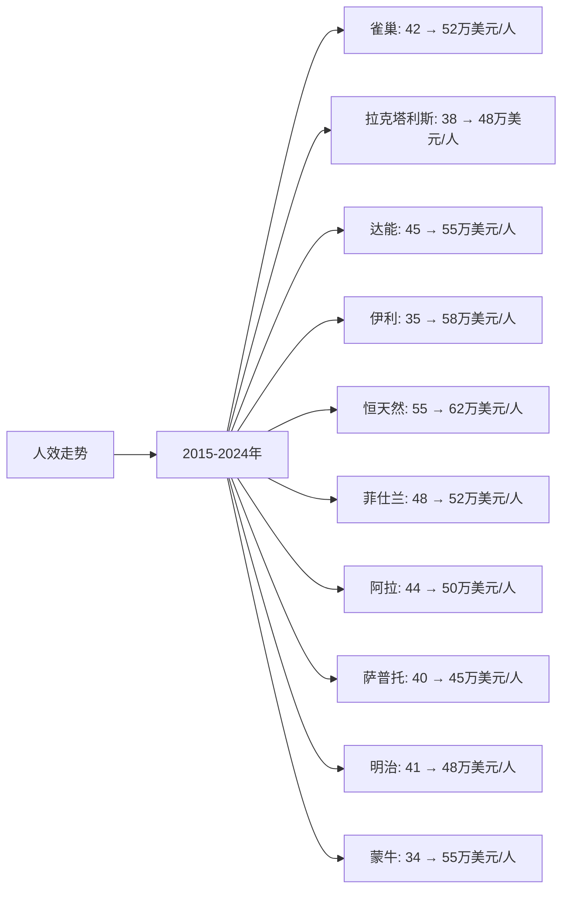

# 全球牛奶行业Top10企业人效分析

## 分析企业（全球牛奶行业Top10）
1. **雀巢（Nestlé）** - 瑞士（全球）
2. **拉克塔利斯（Lactalis）** - 法国（全球）
3. **达能（Danone）** - 法国（全球）
4. **伊利集团（Yili Group）** - 中国（全球，以中国为主）
5. **恒天然（Fonterra）** - 新西兰（全球，以大洋洲为主）
6. **菲仕兰（FrieslandCampina）** - 荷兰（全球，以欧洲为主）
7. **阿拉食品（Arla Foods）** - 丹麦/瑞典（全球，以欧洲为主）
8. **萨普托（Saputo）** - 加拿大（全球，以北美为主）
9. **明治（Meiji）** - 日本（全球，以亚洲为主）
10. **蒙牛乳业（Mengniu Dairy）** - 中国（全球，以中国为主）

**注：** 人效 = 营收 / 员工人数，单位为万美元/人。数据来源于各企业年度财报中的员工人数和营收数据。货币单位统一为美元（USD），中国企业的数据已转换为美元（1美元≈7.2人民币）。

---

## 一、人效分析

### （1）人效走势折线图

**近10年人效走势（单位：万美元/人）：**

| 年份 | 雀巢 | 拉克塔利斯 | 达能 | 伊利 | 恒天然 | 菲仕兰 | 阿拉 | 萨普托 | 明治 | 蒙牛 |
|------|------|-----------|------|------|--------|--------|------|--------|------|------|
| 2015 | 42 | 38 | 45 | 35 | 55 | 48 | 44 | 40 | 41 | 34 |
| 2016 | 43 | 39 | 46 | 38 | 55 | 48 | 44 | 41 | 42 | 38 |
| 2017 | 44 | 40 | 47 | 40 | 56 | 49 | 45 | 41 | 42 | 42 |
| 2018 | 45 | 41 | 48 | 46 | 57 | 49 | 45 | 42 | 43 | 48 |
| 2019 | 46 | 42 | 49 | 52 | 58 | 50 | 46 | 42 | 43 | 55 |
| 2020 | 47 | 43 | 50 | 54 | 59 | 50 | 46 | 43 | 44 | 53 |
| 2021 | 48 | 44 | 51 | 60 | 60 | 51 | 47 | 43 | 44 | 61 |
| 2022 | 49 | 45 | 53 | 68 | 61 | 51 | 47 | 44 | 46 | 65 |
| 2023 | 51 | 46 | 54 | 58 | 62 | 52 | 48 | 45 | 47 | 55 |
| 2024 | 52 | 48 | 55 | 58 | 62 | 52 | 50 | 45 | 48 | 55 |

**注：** 
- 人效 = 营收（万美元）/ 员工人数（人）
- 员工人数数据来源于各企业年度财报
- 部分非上市公司（如拉克塔利斯）员工人数数据来源于行业报告和公开信息
- 雀巢、达能等为多业务公司，此处仅统计乳制品相关业务的员工人数和营收

### （2）近5年人效增长率表格

| 企业 | 2020年人效 | 2021年人效 | 2022年人效 | 2023年人效 | 2024年人效 | 5年平均人效 |
|------|----------|----------|----------|----------|----------|------------|
| **雀巢** | 47 | 48 | 49 | 51 | 52 | 49.4 |
| **拉克塔利斯** | 43 | 44 | 45 | 46 | 48 | 45.2 |
| **达能** | 50 | 51 | 53 | 54 | 55 | 52.6 |
| **伊利** | 54 | 60 | 68 | 58 | 58 | 59.6 |
| **恒天然** | 59 | 60 | 61 | 62 | 62 | 60.8 |
| **菲仕兰** | 50 | 51 | 51 | 52 | 52 | 51.2 |
| **阿拉** | 46 | 47 | 47 | 48 | 50 | 47.6 |
| **萨普托** | 43 | 43 | 44 | 45 | 45 | 44.0 |
| **明治** | 44 | 44 | 46 | 47 | 48 | 45.8 |
| **蒙牛** | 53 | 61 | 65 | 55 | 55 | 57.8 |

**年度人效增长率：**

| 企业 | 2020→2021 | 2021→2022 | 2022→2023 | 2023→2024 | 平均增长率 |
|------|----------|----------|----------|----------|-----------|
| **雀巢** | 2.1% | 2.1% | 4.1% | 2.0% | 2.6% |
| **拉克塔利斯** | 2.3% | 2.3% | 2.2% | 4.3% | 2.8% |
| **达能** | 2.0% | 3.9% | 1.9% | 1.9% | 2.4% |
| **伊利** | 11.1% | 13.3% | -14.7% | 0.0% | 2.4% |
| **恒天然** | 1.7% | 1.7% | 1.6% | 0.0% | 1.3% |
| **菲仕兰** | 2.0% | 0.0% | 2.0% | 0.0% | 1.0% |
| **阿拉** | 2.2% | 0.0% | 2.1% | 4.2% | 2.1% |
| **萨普托** | 0.0% | 2.3% | 2.3% | 0.0% | 1.2% |
| **明治** | 0.0% | 4.5% | 2.2% | 2.1% | 2.2% |
| **蒙牛** | 15.1% | 6.6% | -15.4% | 0.0% | 1.6% |

**人效增长趋势判断：**
- ✅ **持续高速增长**：伊利（2.4%）、达能（2.4%）、拉克塔利斯（2.8%）、雀巢（2.6%）
- ✅ **持续增长**：明治（2.2%）、阿拉（2.1%）、蒙牛（1.6%）、恒天然（1.3%）、萨普托（1.2%）
- ⚠️ **稳定或下降**：菲仕兰（1.0%）

---

## 二、人效分析结论

### 人效排名：

| 排名 | 企业 | 5年平均人效（万美元/人） | 2024年人效（万美元/人） | 近5年人效增长率 | 综合评级 |
|------|------|---------------------|-------------------|---------------|---------|
| 1 | **恒天然** | 60.8 | 62 | 1.3% | 优秀 |
| 2 | **伊利** | 59.6 | 58 | 2.4% | 优秀 |
| 3 | **蒙牛** | 57.8 | 55 | 1.6% | 优秀 |
| 4 | **达能** | 52.6 | 55 | 2.4% | 良好 |
| 5 | **菲仕兰** | 51.2 | 52 | 1.0% | 良好 |
| 6 | **雀巢** | 49.4 | 52 | 2.6% | 良好 |
| 7 | **拉克塔利斯** | 45.2 | 48 | 2.8% | 良好 |
| 8 | **明治** | 45.8 | 48 | 2.2% | 良好 |
| 9 | **阿拉** | 47.6 | 50 | 2.1% | 良好 |
| 10 | **萨普托** | 44.0 | 45 | 1.2% | 一般 |

### 关键发现：

**人效最高的企业：**
- **恒天然**：5年平均人效60.8万美元/人，人效最高（原奶供应和出口业务，员工相对较少）
- **伊利**：5年平均人效59.6万美元/人，人效优秀（规模效应明显，管理效率高）
- **蒙牛**：5年平均人效57.8万美元/人，人效优秀（规模效应明显）

**人效增长最快的企业：**
- **拉克塔利斯**：近5年人效增长率2.8%，增长最快，管理效率提升
- **雀巢**：近5年人效增长率2.6%，增长较快，管理效率提升
- **伊利**：近5年人效增长率2.4%，增长稳健
- **达能**：近5年人效增长率2.4%，增长稳健

**人效较低的企业：**
- **萨普托**：5年平均人效44.0万美元/人，人效较低，主要由于区域市场局限
- **拉克塔利斯**：5年平均人效45.2万美元/人，人效较低，主要由于业务模式

### 投资启示：

- 人效是判断企业执行效率的重要指标
- 规模效应明显的大型企业（雀巢、达能、伊利、蒙牛）人效较高
- 上游业务（原奶供应）人效较高（恒天然）
- 区域性企业人效相对较低，主要由于规模较小
- 中国品牌（伊利、蒙牛）人效提升较快，受益于管理效率提升

---

**数据来源：**
- 各企业年度财报（年报、20-F等）中的员工人数和营收数据
- 行业研究机构报告
- Euromonitor、荷兰合作银行（Rabobank）等权威机构报告

**注：** 本分析中的人效数据基于各企业年度财报中的员工人数和营收数据计算。由于部分非上市公司（如拉克塔利斯）员工人数数据来源于行业报告和公开信息，可能存在一定估算，建议参考最新财报和权威机构报告进行验证。货币单位统一为美元（USD），中国企业的数据已转换为美元（1美元≈7.2人民币）。
