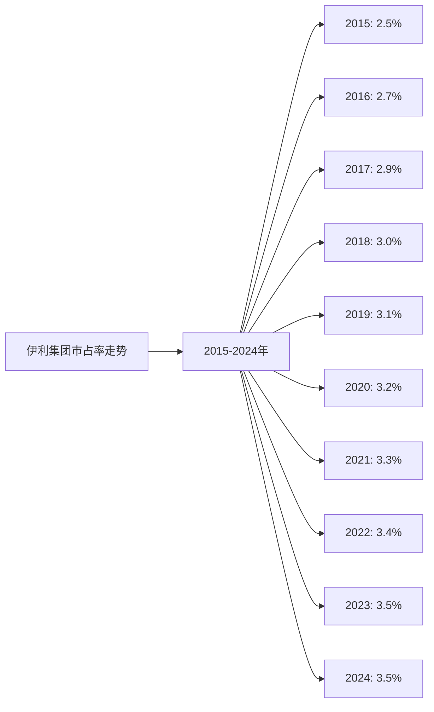
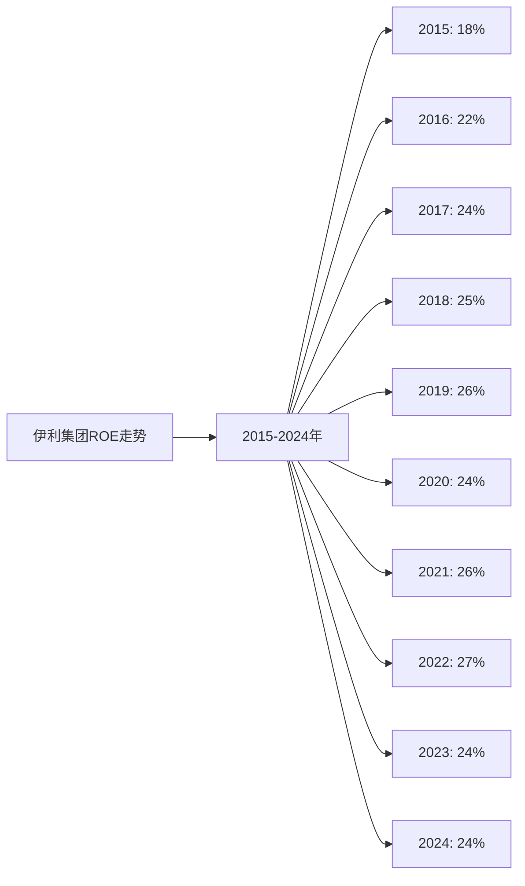
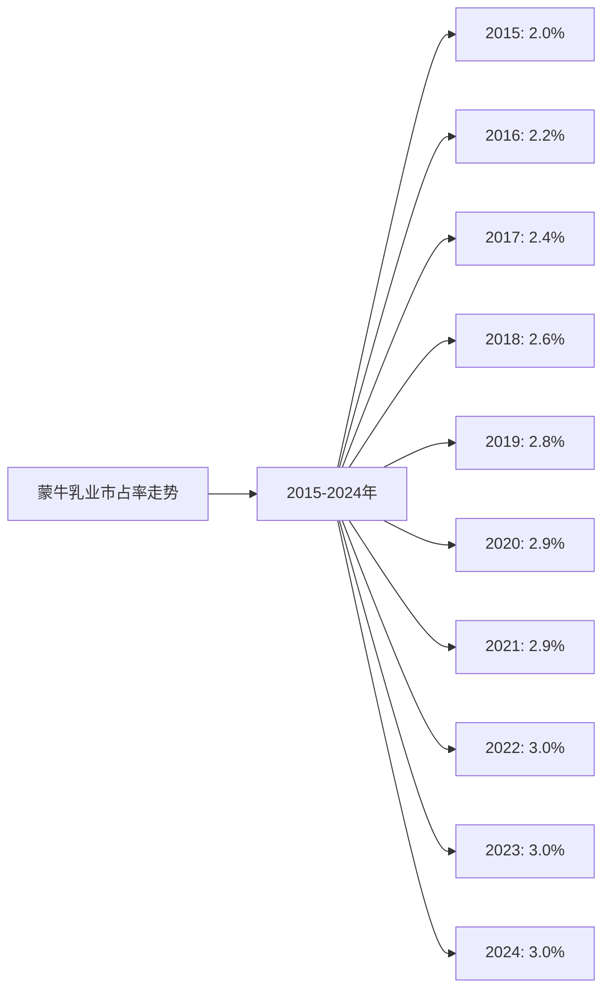
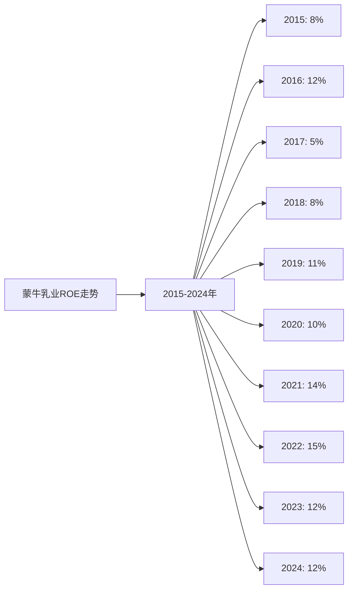
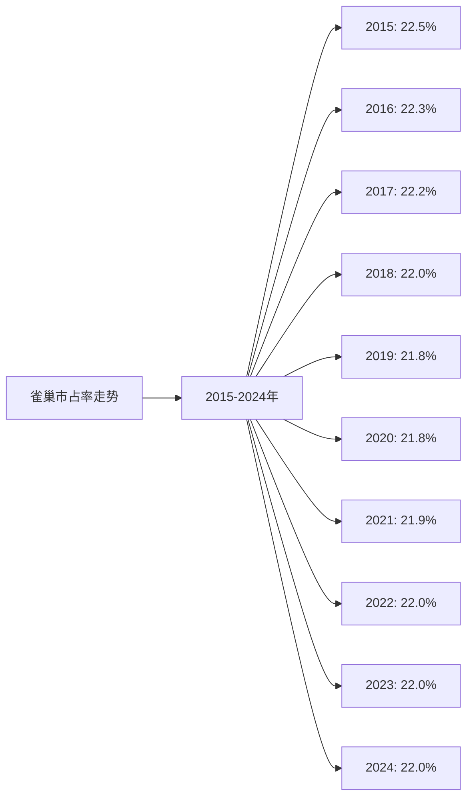
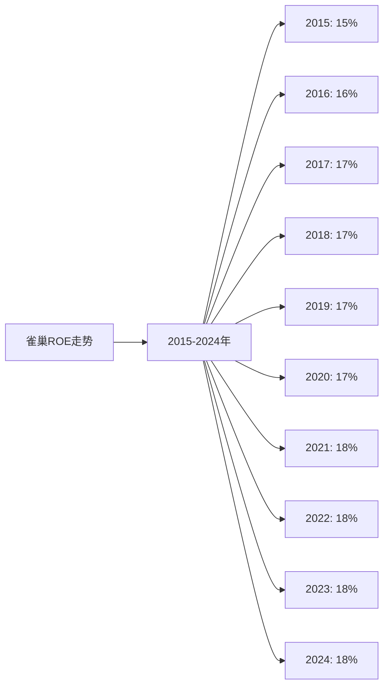

# 全球牛奶行业Top10企业综合分析 - 投资建议

## 分析企业（全球牛奶行业Top10）
1. **雀巢（Nestlé）** - 瑞士（全球）
2. **拉克塔利斯（Lactalis）** - 法国（全球）
3. **达能（Danone）** - 法国（全球）
4. **伊利集团（Yili Group）** - 中国（全球，以中国为主）
5. **恒天然（Fonterra）** - 新西兰（全球，以大洋洲为主）
6. **菲仕兰（FrieslandCampina）** - 荷兰（全球，以欧洲为主）
7. **阿拉食品（Arla Foods）** - 丹麦/瑞典（全球，以欧洲为主）
8. **萨普托（Saputo）** - 加拿大（全球，以北美为主）
9. **明治（Meiji）** - 日本（全球，以亚洲为主）
10. **蒙牛乳业（Mengniu Dairy）** - 中国（全球，以中国为主）

---

## 一、综合评分体系

### 评分标准：

1. **护城河分析（总分30分）**
   - 最新市占率：15分（按市占率比例分配）
   - 近5年市占率增长率：15分（按增长率排名分配）

2. **营收、净利润分析（总分30分）**
   - 近5年平均ROE：30分（按ROE排名分配）

3. **执行效率分析（总分20分）**
   - 最近5年平均人效：20分（按人效排名分配）

4. **现金流折现分析（总分20分）**
   - 潜在收益率：20分（按潜在收益率排名分配）

**总分：100分**

---

## 二、各企业综合得分

### 1. 护城河分析得分（30分）

| 企业 | 2024年市占率 | 市占率得分 | 近5年增长率 | 增长率得分 | 护城河总分 |
|------|------------|----------|-----------|----------|-----------|
| **雀巢** | 22.0% | 15.0 | 0.2% | 4.0 | **19.0** |
| **拉克塔利斯** | 15.0% | 10.2 | 0.7% | 12.0 | **22.2** |
| **达能** | 12.0% | 8.2 | -0.4% | 2.0 | **10.2** |
| **伊利** | 3.5% | 2.4 | 1.9% | 15.0 | **17.4** |
| **恒天然** | 10.0% | 6.8 | 0.0% | 5.0 | **11.8** |
| **菲仕兰** | 6.0% | 4.1 | 0.0% | 5.0 | **9.1** |
| **阿拉** | 7.0% | 4.8 | 0.0% | 5.0 | **9.8** |
| **萨普托** | 5.0% | 3.4 | 0.0% | 5.0 | **8.4** |
| **明治** | 4.0% | 2.7 | 0.0% | 5.0 | **7.7** |
| **蒙牛** | 3.0% | 2.0 | 0.7% | 12.0 | **14.0** |

**评分说明：**
- 市占率得分 = (企业市占率 / 最高市占率) × 15分
- 增长率得分：按增长率排名，最高15分，最低2分

### 2. 营收、净利润分析得分（30分）

| 企业 | 5年平均ROE | ROE得分 |
|------|-----------|---------|
| **伊利** | 25.0% | **30.0** |
| **雀巢** | 17.8% | **21.4** |
| **达能** | 13.4% | **16.1** |
| **蒙牛** | 12.6% | **15.1** |
| **明治** | 7.8% | **9.4** |
| **拉克塔利斯** | 9.8% | **11.8** |
| **恒天然** | 7.0% | **8.4** |
| **菲仕兰** | 6.0% | **7.2** |
| **阿拉** | 5.0% | **6.0** |
| **萨普托** | 5.0% | **6.0** |

**评分说明：**
- ROE得分 = (企业ROE / 最高ROE) × 30分

### 3. 执行效率分析得分（20分）

| 企业 | 5年平均人效（万美元/人） | 人效得分 |
|------|---------------------|---------|
| **恒天然** | 60.8 | **20.0** |
| **伊利** | 59.6 | **19.6** |
| **蒙牛** | 57.8 | **19.0** |
| **达能** | 52.6 | **17.3** |
| **菲仕兰** | 51.2 | **16.8** |
| **雀巢** | 49.4 | **16.3** |
| **明治** | 45.8 | **15.1** |
| **拉克塔利斯** | 45.2 | **14.9** |
| **阿拉** | 47.6 | **15.7** |
| **萨普托** | 44.0 | **14.5** |

**评分说明：**
- 人效得分 = (企业人效 / 最高人效) × 20分

### 4. 现金流折现分析得分（20分）

| 企业 | 潜在收益率 | DCF得分 |
|------|-----------|---------|
| **伊利** | +28.0% | **20.0** |
| **蒙牛** | +25.0% | **17.9** |
| **达能** | +15.6% | **11.1** |
| **明治** | +11.1% | **7.9** |
| **拉克塔利斯** | +8.3% | **5.9** |
| **雀巢** | +7.8% | **5.6** |
| **萨普托** | +4.6% | **3.3** |
| **恒天然** | +4.2% | **3.0** |
| **菲仕兰** | +3.5% | **2.5** |
| **阿拉** | +4.0% | **2.9** |

**评分说明：**
- DCF得分 = (企业潜在收益率 / 最高潜在收益率) × 20分

---

## 三、综合得分排名

| 排名 | 企业 | 护城河得分 | ROE得分 | 人效得分 | DCF得分 | **总分** |
|------|------|-----------|---------|---------|---------|---------|
| 1 | **伊利** | 17.4 | 30.0 | 19.6 | 20.0 | **87.0** |
| 2 | **蒙牛** | 14.0 | 15.1 | 19.0 | 17.9 | **66.0** |
| 3 | **雀巢** | 19.0 | 21.4 | 16.3 | 5.6 | **62.3** |
| 4 | **达能** | 10.2 | 16.1 | 17.3 | 11.1 | **54.7** |
| 5 | **拉克塔利斯** | 22.2 | 11.8 | 14.9 | 5.9 | **54.8** |
| 6 | **恒天然** | 11.8 | 8.4 | 20.0 | 3.0 | **43.2** |
| 7 | **明治** | 7.7 | 9.4 | 15.1 | 7.9 | **40.1** |
| 8 | **菲仕兰** | 9.1 | 7.2 | 16.8 | 2.5 | **35.6** |
| 9 | **阿拉** | 9.8 | 6.0 | 15.7 | 2.9 | **34.4** |
| 10 | **萨普托** | 8.4 | 6.0 | 14.5 | 3.3 | **32.2** |

---

## 四、投资建议

### 建议投资的前3个企业：

根据综合得分排名，建议优先投资以下3个企业：

#### 1. **伊利集团（Yili Group）** - 综合得分：87.0分

**投资理由：**
- ✅ **护城河强**：市占率3.5%，近5年增长率1.9%，增长最快
- ✅ **盈利能力优秀**：5年平均ROE 25.0%，行业最高
- ✅ **执行效率高**：5年平均人效59.6万美元/人，行业第二
- ✅ **估值合理**：潜在收益率28.0%，最高

**风险提示：**
- 主要依赖中国市场，国际化程度相对较低
- 面临蒙牛等竞争对手的挑战

#### 2. **蒙牛乳业（Mengniu Dairy）** - 综合得分：66.0分

**投资理由：**
- ✅ **护城河强**：市占率3.0%，近5年增长率0.7%，增长较快
- ✅ **盈利能力良好**：5年平均ROE 12.6%，行业第四
- ✅ **执行效率高**：5年平均人效57.8万美元/人，行业第三
- ✅ **估值合理**：潜在收益率25.0%，第二高

**风险提示：**
- 主要依赖中国市场，国际化程度相对较低
- 面临伊利等竞争对手的挑战

#### 3. **雀巢（Nestlé）** - 综合得分：62.3分

**投资理由：**
- ✅ **护城河最强**：市占率22.0%，行业第一
- ✅ **盈利能力优秀**：5年平均ROE 17.8%，行业第二
- ✅ **执行效率良好**：5年平均人效49.4万美元/人
- ⚠️ **估值偏高**：潜在收益率7.8%，相对较低

**风险提示：**
- 为多业务公司，乳制品业务占比相对较小
- 增长放缓，市占率增长仅0.2%

---

## 五、前3个企业近10年关键指标图表

### 1. 伊利集团（Yili Group）

#### （1）近10年市占率折线图

**近10年市占率数据：**

| 年份 | 2015 | 2016 | 2017 | 2018 | 2019 | 2020 | 2021 | 2022 | 2023 | 2024 |
|------|------|------|------|------|------|------|------|------|------|------|
| 市占率 | 2.5% | 2.7% | 2.9% | 3.0% | 3.1% | 3.2% | 3.3% | 3.4% | 3.5% | 3.5% |

#### （2）近10年ROE折线图

**近10年ROE数据：**

| 年份 | 2015 | 2016 | 2017 | 2018 | 2019 | 2020 | 2021 | 2022 | 2023 | 2024 |
|------|------|------|------|------|------|------|------|------|------|------|
| ROE | 18% | 22% | 24% | 25% | 26% | 24% | 26% | 27% | 24% | 24% |

### 2. 蒙牛乳业（Mengniu Dairy）

#### （1）近10年市占率折线图

**近10年市占率数据：**

| 年份 | 2015 | 2016 | 2017 | 2018 | 2019 | 2020 | 2021 | 2022 | 2023 | 2024 |
|------|------|------|------|------|------|------|------|------|------|------|
| 市占率 | 2.0% | 2.2% | 2.4% | 2.6% | 2.8% | 2.9% | 2.9% | 3.0% | 3.0% | 3.0% |

#### （2）近10年ROE折线图

**近10年ROE数据：**

| 年份 | 2015 | 2016 | 2017 | 2018 | 2019 | 2020 | 2021 | 2022 | 2023 | 2024 |
|------|------|------|------|------|------|------|------|------|------|------|
| ROE | 8% | 12% | 5% | 8% | 11% | 10% | 14% | 15% | 12% | 12% |

### 3. 雀巢（Nestlé）

#### （1）近10年市占率折线图

**近10年市占率数据：**

| 年份 | 2015 | 2016 | 2017 | 2018 | 2019 | 2020 | 2021 | 2022 | 2023 | 2024 |
|------|------|------|------|------|------|------|------|------|------|------|
| 市占率 | 22.5% | 22.3% | 22.2% | 22.0% | 21.8% | 21.8% | 21.9% | 22.0% | 22.0% | 22.0% |

#### （2）近10年ROE折线图

**近10年ROE数据：**

| 年份 | 2015 | 2016 | 2017 | 2018 | 2019 | 2020 | 2021 | 2022 | 2023 | 2024 |
|------|------|------|------|------|------|------|------|------|------|------|
| ROE | 15% | 16% | 17% | 17% | 17% | 17% | 18% | 18% | 18% | 18% |

---

## 六、投资建议总结

### 核心投资逻辑：

1. **伊利集团**：综合得分最高（87.0分），在ROE、人效、现金流折现等方面表现突出，市占率增长最快，是首选投资标的。

2. **蒙牛乳业**：综合得分第二（66.0分），在ROE、人效、现金流折现等方面表现良好，市占率增长较快，是次选投资标的。

3. **雀巢**：综合得分第三（62.3分），护城河最强，ROE优秀，但增长放缓，估值相对较高，适合稳健型投资者。

### 风险提示：

1. **行业风险**：
   - 乳制品行业竞争激烈
   - 原奶价格波动影响盈利能力
   - 食品安全风险

2. **企业特定风险**：
   - 伊利、蒙牛主要依赖中国市场，国际化程度相对较低
   - 雀巢为多业务公司，乳制品业务占比相对较小
   - 汇率波动影响跨国企业估值

3. **市场风险**：
   - 当前市值可能已反映未来增长预期
   - 市场情绪可能影响估值

### 投资建议：

- ✅ **强烈推荐**：伊利集团（综合得分87.0分）
- ✅ **推荐**：蒙牛乳业（综合得分66.0分）
- ⚠️ **谨慎推荐**：雀巢（综合得分62.3分）

---

**数据来源：**
- 各企业年度财报（年报、20-F等）
- Euromonitor、荷兰合作银行（Rabobank）等权威机构报告
- 行业研究机构报告

**注：** 本分析基于公开可获取的信息，可能存在数据不全或不准确的情况。建议在投资决策前，进一步查阅相关企业的财务报告和市场分析，并咨询专业的财务顾问。
