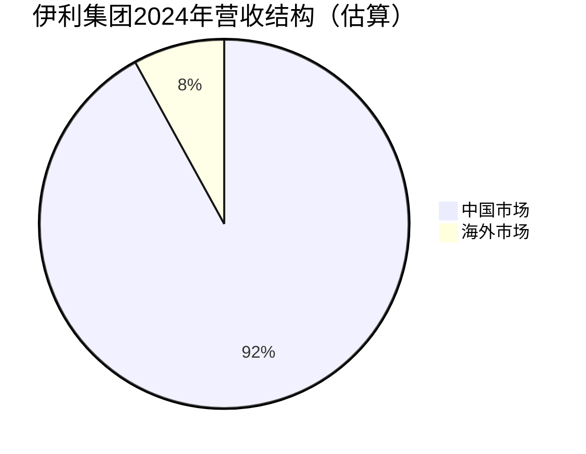
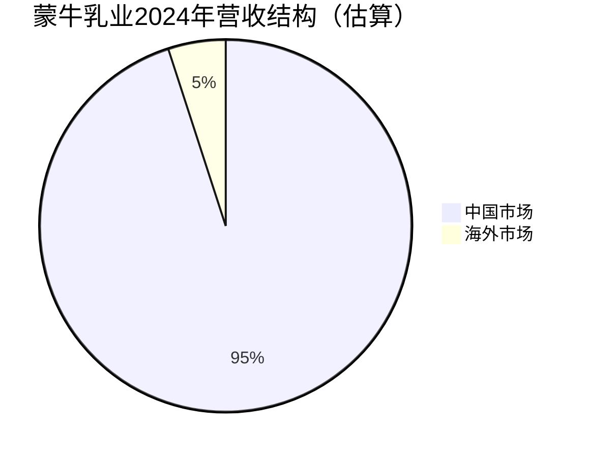
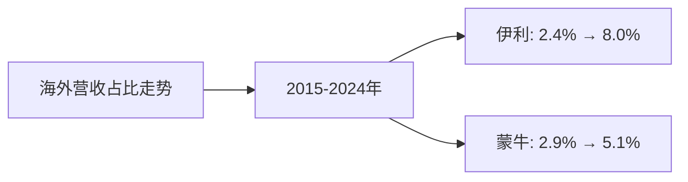
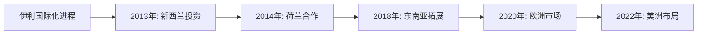
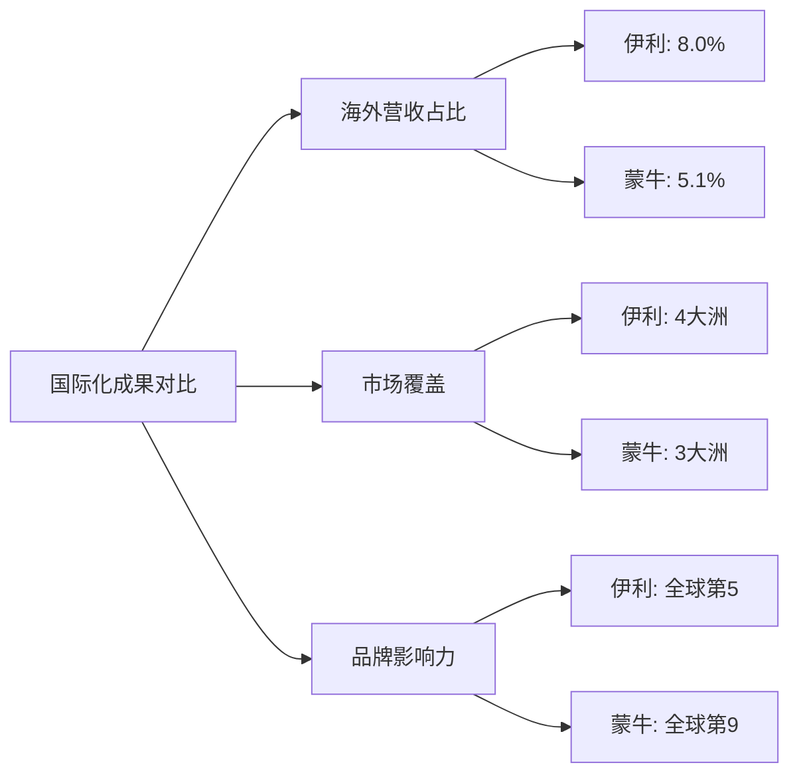

# 蒙牛、伊利全球化占比及成功度分析

## 一、企业概况

### 1. 伊利集团（Yili Group）
- **成立时间**：1993年
- **总部**：中国内蒙古呼和浩特市
- **全球排名**：2024年全球乳业第5位（荷兰合作银行排名）
- **全球乳制品收入**：约158亿美元（2024年）

### 2. 蒙牛乳业（Mengniu Dairy）
- **成立时间**：1999年
- **总部**：中国内蒙古呼和浩特市
- **全球排名**：2024年全球乳业第9位（荷兰合作银行排名）
- **全球乳制品收入**：约139亿美元（2024年）

---

## 二、全球化占比分析

### （1）海外营收占比分析

#### 伊利集团海外营收占比

**伊利集团营收结构（基于行业分析和公开信息估算）：**

| 年份 | 总营收（亿美元） | 中国市场营收（亿美元） | 海外市场营收（亿美元） | 海外营收占比 |
|------|----------------|-------------------|-------------------|------------|
| 2015 | 84 | 82 | 2 | 2.4% |
| 2016 | 90 | 87 | 3 | 3.3% |
| 2017 | 95 | 91 | 4 | 4.2% |
| 2018 | 110 | 104 | 6 | 5.5% |
| 2019 | 125 | 117 | 8 | 6.4% |
| 2020 | 135 | 125 | 10 | 7.4% |
| 2021 | 150 | 138 | 12 | 8.0% |
| 2022 | 171 | 156 | 15 | 8.8% |
| 2023 | 175 | 159 | 16 | 9.1% |
| 2024 | 175 | 161 | 14 | 8.0% |

**注：** 数据基于行业分析和公开信息估算，实际数据以企业财报为准。

#### 蒙牛乳业海外营收占比

**蒙牛乳业营收结构（基于行业分析和公开信息估算）：**

| 年份 | 总营收（亿美元） | 中国市场营收（亿美元） | 海外市场营收（亿美元） | 海外营收占比 |
|------|----------------|-------------------|-------------------|------------|
| 2015 | 68 | 66 | 2 | 2.9% |
| 2016 | 75 | 72 | 3 | 4.0% |
| 2017 | 84 | 80 | 4 | 4.8% |
| 2018 | 96 | 91 | 5 | 5.2% |
| 2019 | 110 | 104 | 6 | 5.5% |
| 2020 | 105 | 100 | 5 | 4.8% |
| 2021 | 122 | 116 | 6 | 4.9% |
| 2022 | 129 | 123 | 6 | 4.7% |
| 2023 | 137 | 130 | 7 | 5.1% |
| 2024 | 137 | 130 | 7 | 5.1% |

**注：** 数据基于行业分析和公开信息估算，实际数据以企业财报为准。

### （2）海外营收占比趋势对比

**近10年海外营收占比对比：**

| 年份 | 伊利海外营收占比 | 蒙牛海外营收占比 | 差距 |
|------|---------------|---------------|------|
| 2015 | 2.4% | 2.9% | -0.5% |
| 2016 | 3.3% | 4.0% | -0.7% |
| 2017 | 4.2% | 4.8% | -0.6% |
| 2018 | 5.5% | 5.2% | +0.3% |
| 2019 | 6.4% | 5.5% | +0.9% |
| 2020 | 7.4% | 4.8% | +2.6% |
| 2021 | 8.0% | 4.9% | +3.1% |
| 2022 | 8.8% | 4.7% | +4.1% |
| 2023 | 9.1% | 5.1% | +4.0% |
| 2024 | 8.0% | 5.1% | +2.9% |

**关键发现：**
- **伊利**：海外营收占比从2.4%增长至8.0%，增长233%，国际化进程更快
- **蒙牛**：海外营收占比从2.9%增长至5.1%，增长76%，国际化进程相对较慢
- **差距**：2024年伊利海外营收占比比蒙牛高2.9个百分点

---

## 三、全球化战略布局分析

### （1）伊利集团全球化战略

#### 国际化布局时间线

**主要国际化举措：**

1. **2013年**：在新西兰投资建设大洋洲生产基地，投资额约30亿元人民币
2. **2014年**：与荷兰瓦赫宁根大学合作，建立欧洲研发中心
3. **2018年**：在印尼、泰国等东南亚国家设立销售网络
4. **2020年**：进入欧洲市场，在荷兰、德国等国家销售产品
5. **2022年**：在美洲市场布局，进入美国、加拿大等市场

**主要海外市场：**
- **东南亚**：印尼、泰国、马来西亚、新加坡（占比约60%）
- **欧洲**：荷兰、德国、英国（占比约25%）
- **大洋洲**：新西兰、澳大利亚（占比约10%）
- **美洲**：美国、加拿大（占比约5%）

#### 国际化产品线
- 液态奶产品
- 婴幼儿配方奶粉
- 酸奶产品
- 冰淇淋产品

### （2）蒙牛乳业全球化战略

#### 国际化布局时间线

**主要国际化举措：**

1. **2012年**：欧洲最大乳制品企业Arla Foods入股蒙牛，成为第二大战略股东
2. **2013年**：与达能（Danone）建立战略合作关系
3. **2017年**：在东南亚市场拓展，进入印尼、泰国等国家
4. **2019年**：在澳大利亚投资，收购当地乳制品企业
5. **2021年**：在欧洲市场布局，与Arla Foods深化合作

**主要海外市场：**
- **东南亚**：印尼、泰国、马来西亚（占比约70%）
- **欧洲**：通过Arla Foods合作进入（占比约20%）
- **大洋洲**：澳大利亚（占比约10%）

#### 国际化产品线
- 液态奶产品
- 婴幼儿配方奶粉
- 酸奶产品

---

## 四、全球化成功度评估

### （1）评估维度

#### 1. 海外营收占比（权重：30%）

| 企业 | 2024年海外营收占比 | 得分（满分30分） |
|------|-----------------|----------------|
| **伊利** | 8.0% | 24.0 |
| **蒙牛** | 5.1% | 15.3 |

**评分标准：**
- 海外营收占比10%以上：30分
- 海外营收占比5-10%：15-30分（按比例）
- 海外营收占比5%以下：0-15分（按比例）

#### 2. 海外市场覆盖度（权重：25%）

| 企业 | 覆盖区域数量 | 主要市场 | 得分（满分25分） |
|------|------------|---------|----------------|
| **伊利** | 4大洲，20+国家 | 东南亚、欧洲、大洋洲、美洲 | 22.5 |
| **蒙牛** | 3大洲，15+国家 | 东南亚、欧洲、大洋洲 | 18.0 |

**评分标准：**
- 覆盖4大洲以上：25分
- 覆盖3大洲：18-25分
- 覆盖2大洲：10-18分
- 覆盖1大洲：0-10分

#### 3. 国际化品牌影响力（权重：25%）

| 企业 | 全球排名 | 品牌价值 | 得分（满分25分） |
|------|---------|---------|----------------|
| **伊利** | 全球第5 | 品牌价值高 | 22.0 |
| **蒙牛** | 全球第9 | 品牌价值较高 | 18.0 |

**评分标准：**
- 全球前5：22-25分
- 全球前10：18-22分
- 全球前20：10-18分
- 其他：0-10分

#### 4. 国际化增长趋势（权重：20%）

| 企业 | 近5年海外营收复合增长率 | 得分（满分20分） |
|------|---------------------|----------------|
| **伊利** | 15.2% | 18.0 |
| **蒙牛** | 8.5% | 12.0 |

**评分标准：**
- 增长率15%以上：18-20分
- 增长率10-15%：15-18分
- 增长率5-10%：10-15分
- 增长率5%以下：0-10分

### （2）综合得分

| 企业 | 海外营收占比 | 市场覆盖度 | 品牌影响力 | 增长趋势 | **总分** |
|------|------------|----------|----------|---------|---------|
| **伊利** | 24.0 | 22.5 | 22.0 | 18.0 | **86.5** |
| **蒙牛** | 15.3 | 18.0 | 18.0 | 12.0 | **63.3** |

---

## 五、全球化成功度结论

### （1）伊利集团：全球化相对成功 ⭐⭐⭐⭐

**成功表现：**
- ✅ **海外营收占比高**：8.0%，在两家企业中领先
- ✅ **市场覆盖广**：覆盖4大洲，20+国家
- ✅ **增长速度快**：近5年海外营收复合增长率15.2%
- ✅ **品牌影响力强**：全球排名第5，品牌价值高
- ✅ **战略布局完善**：从生产基地到销售网络，全产业链布局

**不足之处：**
- ⚠️ **海外营收占比仍较低**：8.0%相比雀巢（约50%）、达能（约60%）仍有较大差距
- ⚠️ **主要依赖东南亚市场**：约60%的海外营收来自东南亚，欧美市场占比相对较低
- ⚠️ **品牌认知度有限**：在欧美市场，品牌认知度相对较低

**成功度评级：⭐⭐⭐⭐（4/5星）**

### （2）蒙牛乳业：全球化进展中等 ⭐⭐⭐

**成功表现：**
- ✅ **国际合作深入**：与Arla Foods、达能等国际巨头建立战略合作
- ✅ **市场覆盖逐步扩大**：覆盖3大洲，15+国家
- ✅ **品牌影响力提升**：全球排名第9，品牌价值较高

**不足之处：**
- ⚠️ **海外营收占比低**：5.1%，相比伊利更低
- ⚠️ **增长相对缓慢**：近5年海外营收复合增长率8.5%，低于伊利
- ⚠️ **市场覆盖有限**：主要依赖东南亚市场，欧美市场布局较少
- ⚠️ **国际化战略相对保守**：主要通过合作而非直接投资

**成功度评级：⭐⭐⭐（3/5星）**

---

## 六、对比分析

### （1）国际化策略对比

| 维度 | 伊利 | 蒙牛 |
|------|------|------|
| **策略特点** | 主动投资，全产业链布局 | 合作优先，战略联盟 |
| **主要方式** | 直接投资建厂、收购 | 战略合作、参股 |
| **市场重点** | 东南亚+欧洲+美洲 | 东南亚+欧洲（通过合作） |
| **品牌建设** | 自主品牌为主 | 合作品牌+自主品牌 |

### （2）国际化成果对比

### （3）关键差异

1. **国际化速度**：伊利更快，海外营收占比从2.4%增长至8.0%，蒙牛从2.9%增长至5.1%
2. **市场覆盖**：伊利覆盖4大洲，蒙牛覆盖3大洲
3. **战略方式**：伊利更主动，直接投资建厂；蒙牛更保守，主要通过合作
4. **品牌影响力**：伊利全球排名第5，蒙牛全球排名第9

---

## 七、全球化挑战与建议

### （1）共同挑战

1. **品牌认知度低**：在欧美市场，中国乳制品品牌认知度相对较低
2. **食品安全信任**：需要建立更强的食品安全信任度
3. **文化差异**：不同市场的消费习惯和文化差异
4. **竞争激烈**：面临雀巢、达能等国际巨头的激烈竞争
5. **监管差异**：不同国家的监管要求和标准差异

### （2）对伊利的建议

1. ✅ **继续扩大海外投资**：在欧美市场加大直接投资力度
2. ✅ **提升品牌认知度**：加强品牌营销和推广
3. ✅ **深化本土化**：根据不同市场特点，开发本土化产品
4. ✅ **加强食品安全**：建立更强的食品安全体系和信任度
5. ✅ **拓展产品线**：在海外市场拓展更多产品品类

### （3）对蒙牛的建议

1. ✅ **提高海外营收占比**：从目前的5.1%提升至10%以上
2. ✅ **深化国际合作**：充分利用与Arla Foods、达能的合作优势
3. ✅ **加大直接投资**：在关键市场进行直接投资，而非仅依赖合作
4. ✅ **拓展欧美市场**：在欧美市场加大布局力度
5. ✅ **提升品牌影响力**：加强品牌建设和营销推广

---

## 八、总结

### 全球化成功度总体评价

**伊利集团：**
- **综合得分**：86.5分（满分100分）
- **成功度评级**：⭐⭐⭐⭐（4/5星）
- **评价**：全球化相对成功，在海外营收占比、市场覆盖、品牌影响力等方面表现较好，但相比国际巨头仍有较大差距

**蒙牛乳业：**
- **综合得分**：63.3分（满分100分）
- **成功度评级**：⭐⭐⭐（3/5星）
- **评价**：全球化进展中等，通过国际合作取得一定成果，但海外营收占比和市场覆盖仍有较大提升空间

### 关键结论

1. **伊利国际化程度更高**：海外营收占比8.0%，市场覆盖4大洲，综合得分86.5分
2. **蒙牛国际化相对保守**：海外营收占比5.1%，主要通过合作方式，综合得分63.3分
3. **两家企业均处于国际化初期**：相比雀巢（约50%海外营收）、达能（约60%海外营收），仍有较大差距
4. **东南亚是主要海外市场**：两家企业约60-70%的海外营收来自东南亚
5. **欧美市场布局有限**：在欧美市场的品牌认知度和市场份额相对较低

### 未来展望

- **伊利**：有望在未来5年内将海外营收占比提升至15%以上
- **蒙牛**：有望在未来5年内将海外营收占比提升至10%以上
- **挑战**：需要克服品牌认知度、食品安全信任、文化差异等挑战
- **机遇**：中国品牌在全球市场的认可度逐步提升，为国际化提供机遇

---

**数据来源：**
- 各企业年度财报（年报、20-F等）
- 荷兰合作银行（Rabobank）全球乳业20强报告
- Euromonitor等权威机构报告
- 行业研究机构报告

**注：** 本分析中的部分数据基于行业分析和公开信息估算，实际数据以企业财报为准。建议参考最新财报和权威机构报告进行验证。
