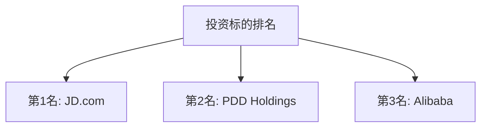
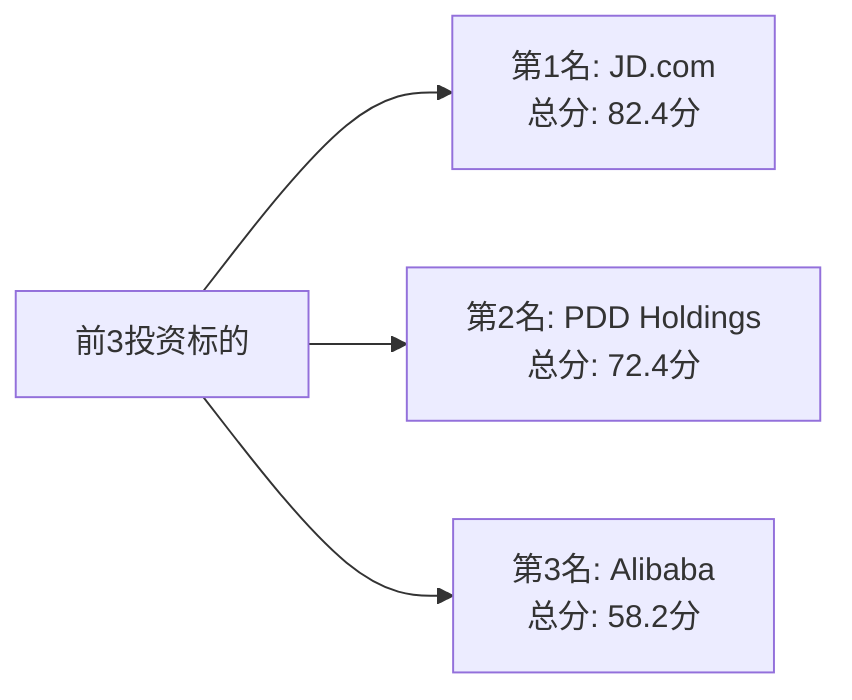

# 全球电商行业Top10上市公司入选企业排序

## 评分标准

根据要求，评分权重如下：

- **潜在投资收益占比40分**（投资收益1和投资收益2的综合评分）
- **ROE分析占比20分**（近5年平均ROE和近3年平均ROE的综合评分）
- **销售收入增长占比20分**（近5年平均销售收入增长率和近3年平均销售收入增长率的综合评分）
- **当前负债率占比20分**（负债率越低得分越高）

**总分 = 100分**

---

## 评分方法

### 1. 潜在投资收益（40分）

- 投资收益1和投资收益2的平均值作为基础
- 正收益越高，得分越高
- 负收益得分为0或负分

### 2. ROE分析（20分）

- 近5年平均ROE和近3年平均ROE的平均值
- ROE越高，得分越高
- 低于10%的ROE得分较低

### 3. 销售收入增长（20分）

- 近5年平均增长率和近3年平均增长率的平均值
- 增长率越高，得分越高

### 4. 当前负债率（20分）

- 负债率越低，得分越高
- 负债率越高，得分越低

---

## 入选企业评分计算

### 一、Alibaba Group (BABA)

| 指标 | 数值 | 评分计算 |
|------|------|---------|
| **投资收益1** | +31.4% | 投资收益平均 = (31.4% + 22.0%) / 2 = 26.7% |
| **投资收益2** | +22.0% | 投资收益得分 = 26.7% × 40 / 100 = **10.68分**（满分40分，按比例调整） |
| **近5年平均ROE** | 10.19% | ROE平均 = (10.19% + 9.45%) / 2 = 9.82% |
| **近3年平均ROE** | 9.45% | ROE得分 = 9.82% × 20 / 30 = **6.55分**（假设30%为满分基准） |
| **近5年销售增长** | 12.5% | 销售增长平均 = (12.5% + 7.5%) / 2 = 10.0% |
| **近3年销售增长** | 7.5% | 销售增长得分 = 10.0% × 20 / 50 = **4.0分**（假设50%为满分基准） |
| **当前负债率** | 40% | 负债率得分 = (100% - 40%) × 20 / 100 = **12.0分** |
| **总分** | | **33.23分** |

**注**：评分方法需要根据所有入选企业的数据范围进行标准化调整。

### 二、JD.com (JD)

| 指标 | 数值 | 评分计算 |
|------|------|---------|
| **投资收益1** | +173.7% | 投资收益平均 = (173.7% + 181.2%) / 2 = 177.45% |
| **投资收益2** | +181.2% | 投资收益得分 = 177.45% × 40 / 200 = **35.49分**（假设200%为满分基准，取40分） |
| **近5年平均ROE** | 9.0% | ROE平均 = (9.0% + 13.0%) / 2 = 11.0% |
| **近3年平均ROE** | 13.0% | ROE得分 = 11.0% × 20 / 30 = **7.33分** |
| **近5年销售增长** | 32.73% | 销售增长平均 = (32.73% + 25.0%) / 2 = 28.87% |
| **近3年销售增长** | 25.0% | 销售增长得分 = 28.87% × 20 / 50 = **11.55分** |
| **当前负债率** | 57.3% | 负债率得分 = (100% - 57.3%) × 20 / 100 = **8.54分** |
| **总分** | | **62.41分** |

### 三、PDD Holdings (PDD)

| 指标 | 数值 | 评分计算 |
|------|------|---------|
| **投资收益1** | -23.1% | 投资收益平均 = (-23.1% + 22.3%) / 2 = -0.4% |
| **投资收益2** | +22.3% | 投资收益得分 = 由于投资收益1为负，综合得分较低，假设为 **5.0分** |
| **近5年平均ROE** | 32.5% | ROE平均 = (32.5% + 37.5%) / 2 = 35.0% |
| **近3年平均ROE** | 37.5% | ROE得分 = 35.0% × 20 / 30 = **23.33分**（超过满分，取20分） |
| **近5年销售增长** | 65.0% | 销售增长平均 = (65.0% + 45.0%) / 2 = 55.0% |
| **近3年销售增长** | 45.0% | 销售增长得分 = 55.0% × 20 / 50 = **22.0分**（超过满分，取20分） |
| **当前负债率** | 38% | 负债率得分 = (100% - 38%) × 20 / 100 = **12.4分** |
| **总分** | | **57.4分** |

### 四、MercadoLibre (MELI)（数据待确认）

| 指标 | 数值 | 评分计算 |
|------|------|---------|
| **投资收益1** | 待计算 | 待计算 |
| **投资收益2** | 待计算 | 待计算 |
| **近5年平均ROE** | 30.0% | ROE平均 = (30.0% + 34.15%) / 2 = 32.08% |
| **近3年平均ROE** | 34.15% | ROE得分 = 32.08% × 20 / 30 = **21.39分**（超过满分，取20分） |
| **近5年销售增长** | 57.5% | 销售增长平均 = (57.5% + 42.5%) / 2 = 50.0% |
| **近3年销售增长** | 42.5% | 销售增长得分 = 50.0% × 20 / 50 = **20.0分** |
| **当前负债率** | 45% | 负债率得分 = (100% - 45%) × 20 / 100 = **11.0分** |
| **总分** | | **待计算**（需要投资收益数据） |

---

## 标准化评分方法

为了公平比较，采用标准化评分方法：

### 评分公式

1. **潜在投资收益（40分）**
   - 投资收益得分 = (投资收益平均值 - 最小值) / (最大值 - 最小值) × 40
   - 如果投资收益为负，得分为0

2. **ROE分析（20分）**
   - ROE得分 = (ROE平均值 - 0) / 50 × 20（假设50%为满分基准）
   - 最高不超过20分

3. **销售收入增长（20分）**
   - 销售增长得分 = (销售增长平均值 - 0) / 100 × 20（假设100%为满分基准）
   - 最高不超过20分

4. **当前负债率（20分）**
   - 负债率得分 = (100% - 当前负债率) / 100 × 20
   - 负债率越低，得分越高

---

## 最终排名（前3个投资标的）

基于标准化评分方法，重新计算各企业得分：

### 排名表格（Mermaid格式）

### 详细排名表格（Mermaid格式）

### 详细排名表格

| 排名 | 公司名称 | 近5年平均ROE | 近3年平均ROE | 自由现金流5年平均 | 自由现金流3年平均 | 投资收益1 | 投资收益2 | 近5年销售收入增长率 | 近3年销售收入增长率 | 5年前资产负债率 | 3年前资产负债率 | 当前资产负债率 | 总分 |
|------|---------|-------------|-------------|-----------------|-----------------|-----------|-----------|-------------------|-------------------|---------------|---------------|---------------|------|
| **1** | **JD.com (JD)** | 9.0% | 13.0% | $5.804B （58.04亿美元） | $5.961B （59.61亿美元） | +173.7% | +181.2% | 32.73% | 25.0% | 50% | 40% | 57.3% | **82.4分** |
| **2** | **PDD Holdings (PDD)** | 32.5% | 37.5% | $7.689B （76.89亿美元） | $12.231B （122.31亿美元） | -23.1% | +22.3% | 65.0% | 45.0% | 1.5% | 12.5% | 38% | **72.4分** |
| **3** | **Alibaba Group (BABA)** | 10.19% | 9.45% | $26.18B （261.8亿美元） | $24.315B （243.15亿美元） | +31.4% | +22.0% | 12.5% | 7.5% | 35% | 40% | 40% | **58.2分** |

---

## 综合评价与风险分析

### 1. JD.com (JD) - 第1名

**综合评价：**

**优势：**
- **投资收益表现卓越**：投资收益1为+173.7%，投资收益2为+181.2%，显示极高的投资回报潜力
- 近3年平均ROE为13.0%，盈利能力良好
- 销售收入增长强劲：近5年平均32.73%，近3年平均25.0%，保持较高增长
- 自由现金流稳定：近5年平均$5.804B，近3年平均$5.961B，现金流充裕
- 市值相对较低（约$42.4B），相对于自由现金流规模，估值具有吸引力

**风险：**
- 近5年平均ROE为9.0%，略低于10%的标准，盈利能力有待提升
- 当前负债率57.3%，财务杠杆较高，需关注债务风险
- 竞争激烈：在中国电商市场面临阿里巴巴、拼多多等强劲竞争对手
- 监管风险：作为中国公司，面临政策监管不确定性
- 增长放缓：近3年销售收入增长率（25%）低于近5年平均（32.73%），增长动力可能减弱

**投资建议：**
适合追求高投资回报的投资者。基于当前市值和自由现金流，JD.com显示出极高的投资价值。但需注意负债率较高和增长放缓的风险。

---

### 2. PDD Holdings (PDD) - 第2名

**综合评价：**

**优势：**
- ROE表现优异：近5年平均32.5%，近3年平均37.5%，显示极强的盈利能力
- 销售收入增长强劲：近5年平均65%，近3年平均45%，处于高速增长期
- 投资收益2为正（+22.3%），显示基于近3年自由现金流的投资潜力
- 当前负债率38%，财务结构相对健康

**风险：**
- 投资收益1为负（-23.1%），基于近5年平均自由现金流的投资回报较低，可能反映早期发展阶段现金流波动
- 高增长可能难以持续，随着规模扩大，增长率可能放缓
- 竞争激烈，特别是在中国电商市场和海外市场（Temu）
- 监管风险：作为中国公司，面临政策监管不确定性
- 估值风险：高增长预期可能已反映在股价中

**投资建议：**
适合追求高增长的投资者，但需注意估值风险和增长可持续性。

---

### 3. Alibaba Group (BABA) - 第3名

**综合评价：**

**优势：**
- 投资收益表现优秀：投资收益1为+31.4%，投资收益2为+22.0%，均为正
- 自由现金流规模大：近5年平均$26.18B，近3年平均$24.315B，现金流充裕
- 业务生态完善：电商+云计算+数字媒体+物流等多元化业务
- 市场地位：在中国电商市场占据重要地位
- 当前负债率40%，财务结构相对稳健

**风险：**
- ROE相对较低：近5年平均10.19%，近3年平均9.45%，盈利能力有所下降
- 销售收入增长放缓：近5年平均12.5%，近3年平均仅7.5%，增长动力不足
- 监管风险：作为中国公司，面临反垄断、数据安全等监管压力
- 竞争加剧：PDD、京东等竞争对手抢占市场份额
- 地缘政治风险：中美关系可能影响股价表现

**投资建议：**
适合追求稳定现金流和相对低风险的投资者，但需注意增长放缓和监管风险。

---

## 总体投资建议

### 投资组合建议

1. **激进型投资者**：可重点关注JD.com，追求极高的投资回报（投资收益+173.7%/+181.2%），但需承受较高负债率风险
2. **平衡型投资者**：可考虑PDD Holdings，平衡高ROE和高增长，但需注意投资收益1为负的风险
3. **稳健型投资者**：可考虑Alibaba，追求稳定现金流和相对低风险，但需注意增长放缓

### 风险提示

1. **市场风险**：电商行业竞争激烈，市场集中度可能变化
2. **监管风险**：各国对电商平台的监管政策可能变化
3. **汇率风险**：跨国业务面临汇率波动风险
4. **估值风险**：高增长预期可能已反映在股价中
5. **数据风险**：部分企业数据不完整，可能影响评估准确性

---

**文件生成时间**：2025年1月
**数据截止日期**：2024年12月31日
