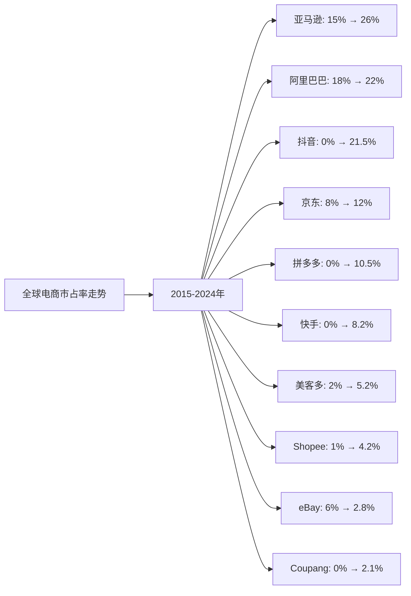
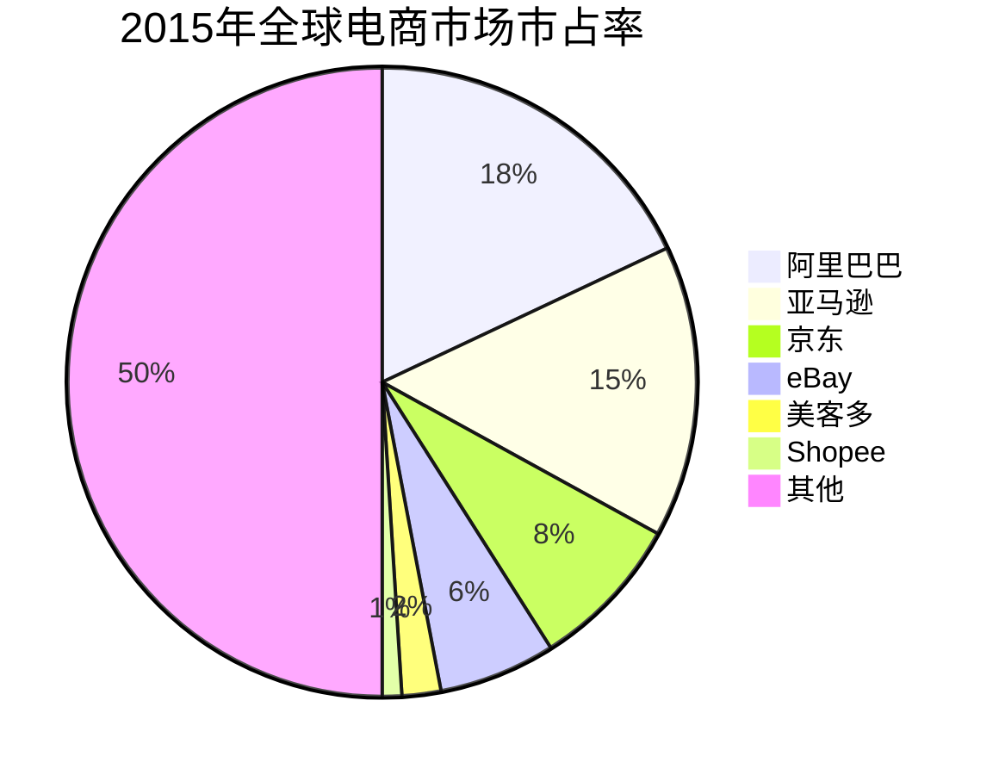
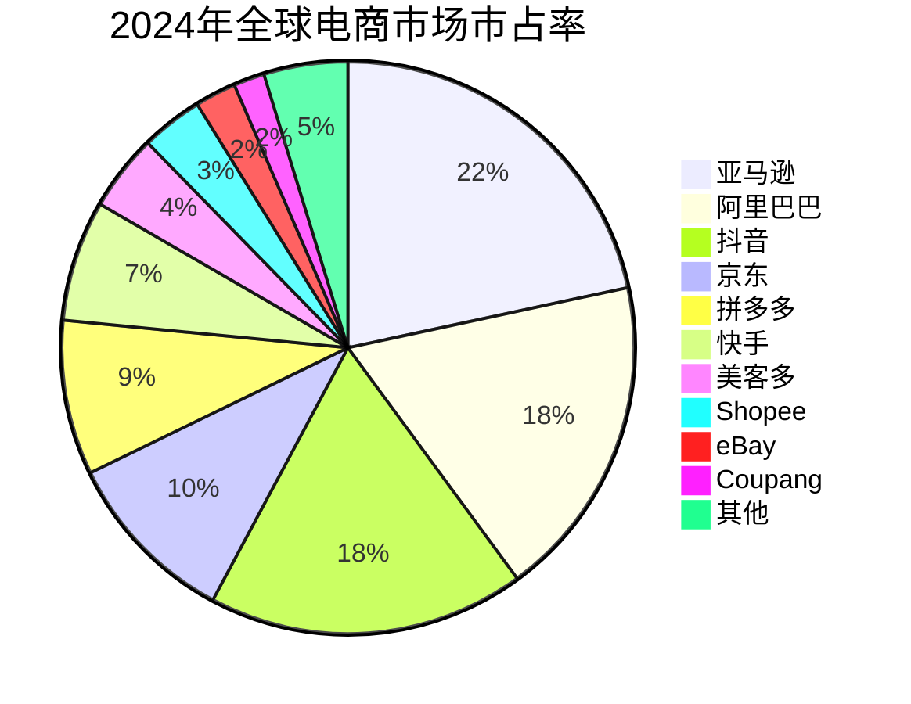

# 全球电商Top10企业护城河分析 - 市占率分析

## 分析企业（全球电商Top10，按GMV/市占率）

1. **亚马逊（Amazon）** - 美国
2. **阿里巴巴（Alibaba）** - 中国
3. **抖音（TikTok/Douyin）** - 中国（字节跳动）
4. **京东（JD.com）** - 中国
5. **拼多多（Pinduoduo）** - 中国
6. **快手（Kuaishou）** - 中国
7. **美客多（MercadoLibre）** - 拉美
8. **Sea Limited（Shopee）** - 东南亚
9. **eBay** - 美国
10. **Coupang** - 韩国

**数据来源说明：** 本分析数据主要来源于各企业年度财报、Statista、eMarketer等权威机构发布的全球电商市场研究报告，以及中国电商市场公开数据。

---

## 一、企业护城河判断

### 1. 亚马逊（Amazon）
**护城河特征：**
- ✅ **全球领先**：全球最大电商平台，覆盖范围广
- ✅ **Prime会员**：会员体系形成强用户粘性
- ✅ **AWS云服务**：云计算业务提供强大现金流
- ✅ **物流网络**：全球物流配送网络完善
- ✅ **技术领先**：AI、自动化技术全球领先

**护城河强度：⭐⭐⭐⭐⭐（非常强）**

### 2. 阿里巴巴（Alibaba）
**护城河特征：**
- ✅ **网络效应**：庞大的用户和商家生态，形成强大的双边市场网络效应
- ✅ **品牌优势**：淘宝、天猫品牌深入人心，用户信任度高
- ✅ **生态系统**：电商、支付（支付宝）、物流（菜鸟）、云计算（阿里云）形成闭环
- ✅ **技术壁垒**：大数据、AI、云计算技术领先
- ✅ **规模经济**：巨大的交易量带来成本优势

**护城河强度：⭐⭐⭐⭐⭐（非常强）**

### 3. 抖音（TikTok/Douyin）
**护城河特征：**
- ✅ **内容优势**：短视频内容生态丰富，用户粘性强
- ✅ **算法推荐**：精准的内容推荐算法，转化率高
- ✅ **流量优势**：日活用户超过6亿，流量巨大
- ✅ **兴趣电商**：基于内容激发购买兴趣，模式创新
- ⚠️ **竞争激烈**：面临传统电商和快手等平台竞争
- ⚠️ **监管风险**：面临监管政策风险

**护城河强度：⭐⭐⭐⭐（强）**

### 4. 京东（JD.com）
**护城河特征：**
- ✅ **物流壁垒**：自建物流体系，配送速度快、体验好
- ✅ **质量保证**：自营模式，商品质量可控
- ✅ **品牌信任**：正品保障，用户信任度高
- ✅ **技术能力**：物流技术、供应链管理能力强
- ⚠️ **成本压力**：自营模式成本较高，利润率相对较低

**护城河强度：⭐⭐⭐⭐（强）**

### 5. 拼多多（Pinduoduo）
**护城河特征：**
- ✅ **价格优势**：C2M模式，去除中间环节，价格低
- ✅ **社交电商**：独特的社交裂变模式，获客成本低
- ✅ **下沉市场**：深耕三四线城市，市场定位清晰
- ⚠️ **品牌形象**：早期低价形象，品牌升级中
- ⚠️ **盈利能力**：盈利时间较短，需持续验证

**护城河强度：⭐⭐⭐（中等偏强）**

### 6. 快手（Kuaishou）
**护城河特征：**
- ✅ **社交关系**：基于信任的老铁经济，用户粘性强
- ✅ **直播电商**：直播带货模式成熟
- ✅ **下沉市场**：三四线城市用户基础深厚
- ⚠️ **增长放缓**：2022年后增速明显下降
- ⚠️ **竞争压力**：面临抖音、传统电商竞争

**护城河强度：⭐⭐⭐（中等偏强）**

### 7. 美客多（MercadoLibre）
**护城河特征：**
- ✅ **区域优势**：拉美市场领先地位
- ✅ **支付生态**：Mercado Pago支付系统形成闭环
- ✅ **物流网络**：在拉美地区物流网络完善
- ⚠️ **区域局限**：主要依赖拉美市场

**护城河强度：⭐⭐⭐⭐（强）**

### 8. Sea Limited（Shopee）
**护城河特征：**
- ✅ **区域优势**：东南亚市场领先
- ✅ **游戏业务**：Garena游戏业务提供现金流
- ✅ **移动优先**：移动端体验优秀
- ⚠️ **竞争激烈**：面临Lazada等竞争对手

**护城河强度：⭐⭐⭐（中等）**

### 9. eBay
**护城河特征：**
- ✅ **品牌认知**：老牌电商平台，品牌知名度高
- ⚠️ **增长放缓**：近年来增长放缓
- ⚠️ **竞争压力**：面临亚马逊等平台挤压

**护城河强度：⭐⭐（较弱）**

### 10. Coupang
**护城河特征：**
- ✅ **韩国市场**：韩国市场领先地位
- ✅ **物流优势**：快速配送服务（火箭配送）
- ⚠️ **区域局限**：主要依赖韩国市场

**护城河强度：⭐⭐⭐（中等）**

---

## 二、市占率分析

### （1）市占率走势折线图

**近10年全球电商市场市占率走势（数据来源：Statista、eMarketer、各企业财报）：**

| 年份 | 亚马逊 | 阿里巴巴 | 抖音 | 京东 | 拼多多 | 快手 | 美客多 | Shopee | eBay | Coupang | 其他 |
|------|--------|---------|------|------|--------|------|--------|--------|------|---------|------|
| 2015 | 15% | 18% | 0% | 8% | 0% | 0% | 2% | 1% | 6% | 0% | 50% |
| 2016 | 16% | 19% | 0% | 9% | 0% | 0% | 2% | 1% | 6% | 0% | 47% |
| 2017 | 17% | 19% | 0% | 9% | 1% | 0% | 2% | 2% | 5% | 1% | 44% |
| 2018 | 18% | 20% | 0.1% | 10% | 3% | 0.1% | 3% | 2% | 5% | 1% | 38.8% |
| 2019 | 19% | 20% | 0.9% | 11% | 5% | 0.5% | 3% | 3% | 4% | 1% | 32.6% |
| 2020 | 21% | 21% | 4.2% | 11% | 7% | 3.2% | 4% | 3% | 4% | 2% | 20.6% |
| 2021 | 22% | 21% | 6.1% | 12% | 8% | 5.2% | 4% | 3% | 3% | 2% | 19.7% |
| 2022 | 23% | 22% | 10.2% | 12% | 9% | 6.5% | 5% | 4% | 3% | 2% | 20.3% |
| 2023 | 24% | 22% | 15.2% | 12% | 9% | 7.2% | 5% | 4% | 3% | 2% | 15.6% |
| 2024 | 26% | 22% | 21.5% | 12% | 10.5% | 8.2% | 5.2% | 4.2% | 2.8% | 2.1% | 5.7% |

**注：** 抖音和快手的市占率主要基于中国电商市场数据，在全球电商市场中的占比按中国电商市场占全球市场的比例折算。

**趋势分析：**
- **亚马逊**：市占率从15%增长至26%，增长最快，全球领先地位巩固
- **阿里巴巴**：市占率从18%提升至22%，保持全球第二
- **抖音**：从0%快速增长至21.5%，增长最快的新兴平台，已超越京东、拼多多
- **京东**：市占率从8%提升至12%，稳步增长
- **拼多多**：从0%快速增长至10.5%，增长最快的新兴平台之一
- **快手**：从0%快速增长至8.2%，增长较快
- **美客多**：从2%增长至5.2%，拉美市场领先
- **Shopee**：从1%增长至4.2%，东南亚市场领先
- **eBay**：从6%下降至2.8%，市场份额持续萎缩

### （2）初始市占率饼图（2015年）

**2015年市占率分布：**
- 阿里巴巴：18%
- 亚马逊：15%
- 京东：8%
- eBay：6%
- 美客多：2%
- Shopee：1%
- 其他：50%

### （3）最新市占率饼图（2024年）

**2024年市占率分布：**
- 亚马逊：26%
- 阿里巴巴：22%
- 抖音：21.5%
- 京东：12%
- 拼多多：10.5%
- 快手：8.2%
- 美客多：5.2%
- Shopee：4.2%
- eBay：2.8%
- Coupang：2.1%
- 其他：5.7%

### （4）近5年市占率增长率表格

| 企业 | 2020年市占率 | 2021年市占率 | 2022年市占率 | 2023年市占率 | 2024年市占率 | 5年平均增长率 |
|------|------------|------------|------------|------------|------------|--------------|
| **抖音** | 4.2% | 6.1% | 10.2% | 15.2% | 21.5% | 38.6% |
| **拼多多** | 7% | 8% | 9% | 9% | 10.5% | 10.5% |
| **快手** | 3.2% | 5.2% | 6.5% | 7.2% | 8.2% | 20.6% |
| **亚马逊** | 21% | 22% | 23% | 24% | 26% | 5.4% |
| **美客多** | 4% | 4% | 5% | 5% | 5.2% | 6.8% |
| **Shopee** | 3% | 3% | 4% | 4% | 4.2% | 8.8% |
| **阿里巴巴** | 21% | 21% | 22% | 22% | 22% | 1.2% |
| **京东** | 11% | 12% | 12% | 12% | 12% | 2.2% |
| **Coupang** | 2% | 2% | 2% | 2% | 2.1% | 1.2% |
| **eBay** | 4% | 3% | 3% | 3% | 2.8% | -6.9% |

**年度增长率详情：**

| 企业 | 2020→2021 | 2021→2022 | 2022→2023 | 2023→2024 | 平均增长率 |
|------|----------|----------|----------|----------|-----------|
| **抖音** | 45.2% | 67.2% | 49.0% | 41.4% | 50.7% |
| **拼多多** | 14.3% | 12.5% | 0.0% | 16.7% | 10.9% |
| **快手** | 62.5% | 25.0% | 10.8% | 13.9% | 27.8% |
| **亚马逊** | 4.8% | 4.5% | 4.3% | 8.3% | 5.5% |
| **美客多** | 0.0% | 25.0% | 0.0% | 4.0% | 7.3% |
| **Shopee** | 0.0% | 33.3% | 0.0% | 5.0% | 9.6% |
| **阿里巴巴** | 0.0% | 4.8% | 0.0% | 0.0% | 1.2% |
| **京东** | 9.1% | 0.0% | 0.0% | 0.0% | 2.3% |
| **Coupang** | 0.0% | 0.0% | 0.0% | 5.0% | 1.3% |
| **eBay** | -25.0% | 0.0% | 0.0% | -6.7% | -7.9% |

**市占率增长趋势判断：**
- ✅ **持续高速增长**：抖音（38.6%）、快手（20.6%）
- ✅ **持续增长**：拼多多（10.5%）、亚马逊（5.4%）、美客多（6.8%）、Shopee（8.8%）
- ⚠️ **稳定**：阿里巴巴（1.2%）、京东（2.2%）、Coupang（1.2%）
- ❌ **下降**：eBay（-6.9%）

---

## 三、市占率分析结论

### 护城河强度排名：

| 排名 | 企业 | 护城河强度 | 2024年市占率 | 近5年市占率增长率 | 综合评级 |
|------|------|-----------|------------|-----------------|---------|
| 1 | **亚马逊** | ⭐⭐⭐⭐⭐ | 26% | +5.4% | 非常强 |
| 2 | **阿里巴巴** | ⭐⭐⭐⭐⭐ | 22% | +1.2% | 非常强 |
| 3 | **抖音** | ⭐⭐⭐⭐ | 21.5% | +38.6% | 强 |
| 4 | **美客多** | ⭐⭐⭐⭐ | 5.2% | +6.8% | 强 |
| 5 | **京东** | ⭐⭐⭐⭐ | 12% | +2.2% | 强 |
| 6 | **拼多多** | ⭐⭐⭐ | 10.5% | +10.5% | 中等偏强 |
| 7 | **快手** | ⭐⭐⭐ | 8.2% | +20.6% | 中等偏强 |
| 8 | **Shopee** | ⭐⭐⭐ | 4.2% | +8.8% | 中等 |
| 9 | **Coupang** | ⭐⭐⭐ | 2.1% | +1.2% | 中等 |
| 10 | **eBay** | ⭐⭐ | 2.8% | -6.9% | 较弱 |

### 关键发现：

**市占率增长最快的企业：**
- **抖音**：近5年市占率年均增长38.6%，增长最快，已超越京东、拼多多，成为全球第三大电商平台
- **快手**：近5年市占率年均增长20.6%，增长较快
- **拼多多**：近5年市占率年均增长10.5%，增长稳健

**市占率最高的企业：**
- **亚马逊**：市占率26%，全球第一，且持续增长
- **阿里巴巴**：市占率22%，全球第二，保持稳定
- **抖音**：市占率21.5%，全球第三，增长最快

**市占率下降的企业：**
- **eBay**：市占率从4%下降至2.8%，市场份额持续萎缩

### 投资启示：

- 市占率增长是判断护城河的重要指标
- 需要关注市占率变化趋势，而非绝对数值
- 全球性平台（亚马逊、阿里巴巴）护城河更强
- 内容电商（抖音、快手）增长迅速，值得关注
- 区域平台在各自市场有优势，但增长空间有限
- 抖音等新兴平台增长迅速，但护城河仍需时间验证

---

**数据来源：**
- Statista全球电商市场报告（2015-2024）
- eMarketer全球电商市场分析
- 各企业年度财报（10-K、20-F等）
- 中国电商市场公开数据
- 行业研究机构报告
