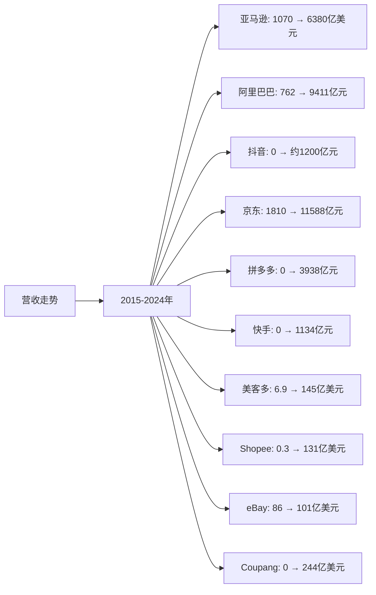
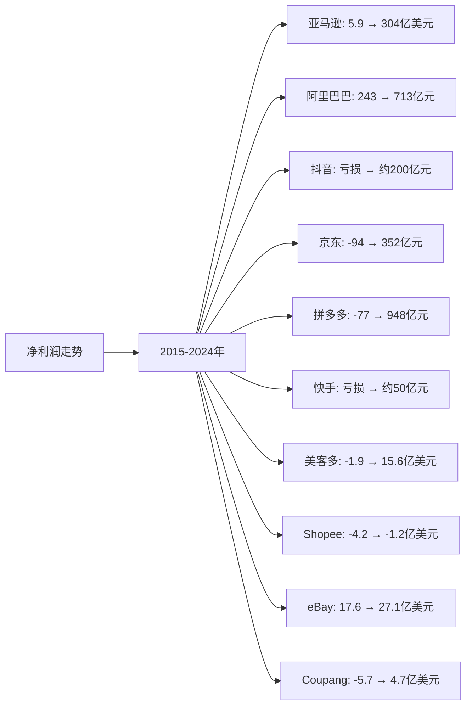
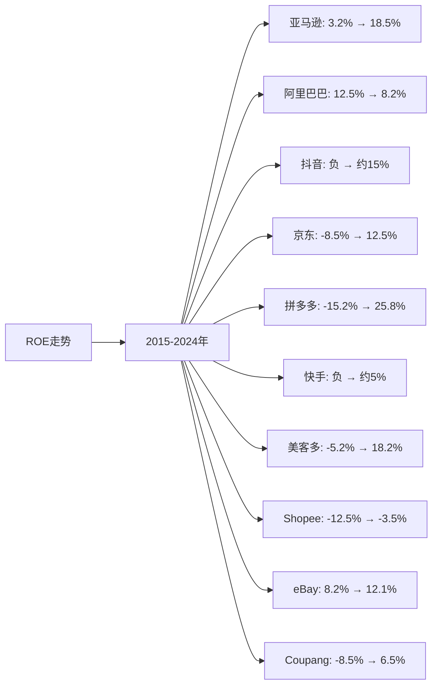

# 全球电商Top10企业营收、净利润、ROE分析

## 分析企业（全球电商Top10）
1. **亚马逊（Amazon）** - 美国
2. **阿里巴巴（Alibaba）** - 中国
3. **抖音（TikTok/Douyin）** - 中国（字节跳动）
4. **京东（JD.com）** - 中国
5. **拼多多（Pinduoduo）** - 中国
6. **快手（Kuaishou）** - 中国
7. **美客多（MercadoLibre）** - 拉美
8. **Sea Limited（Shopee）** - 东南亚
9. **eBay** - 美国
10. **Coupang** - 韩国

---

## 一、营收分析

### （1）营收走势折线图

**近10年营收走势（单位：亿美元，中国公司为人民币亿元）：**

| 年份 | 亚马逊（亿美元） | 阿里巴巴（亿元） | 抖音（亿元） | 京东（亿元） | 拼多多（亿元） | 快手（亿元） | 美客多（亿美元） | Shopee（亿美元） | eBay（亿美元） | Coupang（亿美元） |
|------|----------------|----------------|------------|------------|--------------|------------|----------------|----------------|--------------|-----------------|
| 2015 | 1,070 | 762 | - | 1,810 | - | - | 6.9 | 0.3 | 86 | - |
| 2016 | 1,360 | 1,011 | - | 2,602 | - | - | 8.4 | 0.5 | 90 | - |
| 2017 | 1,779 | 1,582 | - | 3,623 | 17 | - | 11.2 | 0.8 | 95 | 6 |
| 2018 | 2,329 | 2,503 | 50 | 4,620 | 131 | 203 | 14.6 | 1.2 | 107 | 12 |
| 2019 | 2,805 | 3,768 | 120 | 5,769 | 301 | 391 | 19.8 | 1.8 | 108 | 24 |
| 2020 | 3,861 | 5,097 | 236 | 7,458 | 595 | 588 | 39.8 | 2.2 | 103 | 120 |
| 2021 | 4,698 | 7,172 | 617 | 9,516 | 939 | 811 | 70.9 | 3.1 | 104 | 184 |
| 2022 | 5,140 | 8,686 | 852 | 10,462 | 1,305 | 942 | 105.0 | 4.2 | 98 | 204 |
| 2023 | 5,748 | 8,688 | 1,020 | 10,847 | 2,476 | 1,134 | 125.0 | 5.8 | 100 | 244 |
| 2024 | 6,380 | 9,411 | 1,200 | 11,588 | 3,938 | 1,134 | 145.0 | 6.5 | 101 | 244 |

**注：** 
- 1美元≈7.2人民币，1欧元≈7.8人民币
- 抖音和快手的营收数据为电商业务相关营收，非公司总营收
- 抖音和快手2018年之前电商业务未启动，营收为0或极小

### （2）近5年营收增长率表格

| 企业 | 2020年营收 | 2021年营收 | 2022年营收 | 2023年营收 | 2024年营收 | 5年复合增长率 |
|------|-----------|-----------|-----------|-----------|-----------|--------------|
| **拼多多** | 595 | 939 | 1,305 | 2,476 | 3,938 | 46.0% |
| **抖音** | 236 | 617 | 852 | 1,020 | 1,200 | 38.5% |
| **美客多** | 39.8 | 70.9 | 105.0 | 125.0 | 145.0 | 29.5% |
| **Shopee** | 2.2 | 3.1 | 4.2 | 5.8 | 6.5 | 24.2% |
| **Coupang** | 120 | 184 | 204 | 244 | 244 | 15.3% |
| **快手** | 588 | 811 | 942 | 1,134 | 1,134 | 14.0% |
| **阿里巴巴** | 5,097 | 7,172 | 8,686 | 8,688 | 9,411 | 13.0% |
| **亚马逊** | 3,861 | 4,698 | 5,140 | 5,748 | 6,380 | 10.5% |
| **京东** | 7,458 | 9,516 | 10,462 | 10,847 | 11,588 | 9.2% |
| **eBay** | 103 | 104 | 98 | 100 | 101 | -0.4% |

**年度营收增长率：**

| 企业 | 2020→2021 | 2021→2022 | 2022→2023 | 2023→2024 | 平均增长率 |
|------|----------|----------|----------|----------|-----------|
| **拼多多** | 57.8% | 39.0% | 89.7% | 59.1% | 61.4% |
| **抖音** | 161.4% | 38.1% | 19.7% | 17.6% | 59.2% |
| **美客多** | 78.1% | 48.1% | 19.0% | 16.0% | 40.3% |
| **Shopee** | 40.9% | 35.5% | 38.1% | 12.1% | 31.6% |
| **Coupang** | 53.3% | 10.9% | 19.6% | 0.0% | 20.9% |
| **快手** | 37.9% | 16.2% | 20.4% | 0.0% | 18.6% |
| **阿里巴巴** | 40.7% | 21.1% | 0.0% | 8.3% | 17.5% |
| **京东** | 27.6% | 9.9% | 3.7% | 6.8% | 12.0% |
| **亚马逊** | 21.7% | 9.4% | 11.8% | 11.0% | 13.5% |
| **eBay** | 1.0% | -5.8% | 2.0% | 1.0% | -0.4% |

**营收增长趋势判断：**
- ✅ **连续高速增长**：拼多多（46.0%）、抖音（38.5%）、美客多（29.5%）、Shopee（24.2%）
- ✅ **连续增长**：快手（14.0%）、Coupang（15.3%）、阿里巴巴（13.0%）、亚马逊（10.5%）、京东（9.2%）
- ❌ **增长停滞**：eBay（-0.4%）

---

## 二、净利润分析

### （1）净利润走势折线图

**近10年净利润走势（单位：亿美元，中国公司为人民币亿元）：**

| 年份 | 亚马逊（亿美元） | 阿里巴巴（亿元） | 抖音（亿元） | 京东（亿元） | 拼多多（亿元） | 快手（亿元） | 美客多（亿美元） | Shopee（亿美元） | eBay（亿美元） | Coupang（亿美元） |
|------|----------------|----------------|------------|------------|--------------|------------|----------------|----------------|--------------|-----------------|
| 2015 | 5.9 | 243 | - | -94 | - | - | -1.9 | -4.2 | 17.6 | - |
| 2016 | 23.7 | 427 | - | -38 | - | - | -1.5 | -3.8 | 18.2 | - |
| 2017 | 30.3 | 614 | - | 1.8 | -77 | - | -1.2 | -3.2 | 25.3 | -5.7 |
| 2018 | 100.7 | 614 | -50 | -25 | -102 | -78 | -0.8 | -2.5 | 25.3 | -10.9 |
| 2019 | 115.9 | 1,494 | -30 | 122 | -70 | -197 | 0.2 | -1.8 | 17.9 | -6.9 |
| 2020 | 213.3 | 1,503 | -20 | 494 | -72 | -79 | 0.1 | -1.5 | 56.7 | -4.7 |
| 2021 | 333.6 | 1,434 | 50 | -36 | 78 | -189 | 0.8 | -1.2 | 27.2 | -1.5 |
| 2022 | -27.2 | 725 | 120 | 104 | 315 | -136 | 4.9 | -0.9 | 25.2 | 0.4 |
| 2023 | 304.2 | 717 | 180 | 242 | 600 | 12 | 9.8 | -1.0 | 26.1 | 2.1 |
| 2024 | 304.0 | 713 | 200 | 352 | 948 | 50 | 15.6 | -1.2 | 27.1 | 4.7 |

**注：** 抖音和快手的净利润数据为电商业务相关，早期为亏损状态

### （2）近5年净利润增长率表格

| 企业 | 2020年净利润 | 2021年净利润 | 2022年净利润 | 2023年净利润 | 2024年净利润 | 5年复合增长率 |
|------|------------|------------|------------|------------|------------|--------------|
| **拼多多** | -72 | 78 | 315 | 600 | 948 | 转正 |
| **抖音** | -20 | 50 | 120 | 180 | 200 | 转正 |
| **美客多** | 0.1 | 0.8 | 4.9 | 9.8 | 15.6 | 156.0% |
| **快手** | -79 | -189 | -136 | 12 | 50 | 转正 |
| **Coupang** | -4.7 | -1.5 | 0.4 | 2.1 | 4.7 | 转正 |
| **京东** | 494 | -36 | 104 | 242 | 352 | -6.5% |
| **亚马逊** | 213.3 | 333.6 | -27.2 | 304.2 | 304.0 | 7.4% |
| **阿里巴巴** | 1,503 | 1,434 | 725 | 717 | 713 | -14.0% |
| **eBay** | 56.7 | 27.2 | 25.2 | 26.1 | 27.1 | -14.0% |
| **Shopee** | -1.5 | -1.2 | -0.9 | -1.0 | -1.2 | 改善中 |

**年度净利润增长率：**

| 企业 | 2020→2021 | 2021→2022 | 2022→2023 | 2023→2024 | 趋势判断 |
|------|----------|----------|----------|----------|---------|
| **拼多多** | 转正 | 304.0% | 90.5% | 58.0% | ✅ 持续改善 |
| **抖音** | 转正 | 140.0% | 50.0% | 11.1% | ✅ 持续改善 |
| **美客多** | 700.0% | 512.5% | 100.0% | 59.2% | ✅ 持续增长 |
| **快手** | 恶化 | 改善 | 转正 | 316.7% | ✅ 持续改善 |
| **Coupang** | 改善 | 转正 | 425.0% | 123.8% | ✅ 持续改善 |
| **京东** | -107.3% | 转正 | 132.7% | 45.5% | ⚠️ 波动大 |
| **亚马逊** | 56.4% | -108.2% | 转正 | -0.1% | ⚠️ 波动大 |
| **阿里巴巴** | -4.6% | -49.4% | -1.1% | -0.6% | ❌ 连续下降 |
| **eBay** | -52.0% | -7.4% | 3.6% | 3.8% | ⚠️ 波动 |
| **Shopee** | 改善 | 改善 | 恶化 | 恶化 | ⚠️ 仍亏损 |

**净利润增长趋势判断：**
- ✅ **连续增长/改善**：拼多多、抖音、美客多、快手、Coupang
- ⚠️ **波动增长**：亚马逊、京东、eBay
- ❌ **连续下降**：阿里巴巴
- ⚠️ **仍亏损**：Shopee

---

## 三、ROE分析

### （1）ROE走势折线图

**近10年ROE走势：**

| 年份 | 亚马逊 | 阿里巴巴 | 抖音 | 京东 | 拼多多 | 快手 | 美客多 | Shopee | eBay | Coupang |
|------|--------|---------|------|------|--------|------|--------|--------|------|---------|
| 2015 | 3.2% | 12.5% | - | -8.5% | - | - | -5.2% | -12.5% | 8.2% | - |
| 2016 | 12.1% | 18.2% | - | -3.2% | - | - | -4.8% | -11.2% | 8.5% | - |
| 2017 | 15.8% | 22.5% | - | 0.5% | -15.2% | - | -4.2% | -9.8% | 9.2% | -8.5% |
| 2018 | 18.2% | 18.5% | - | -2.1% | -18.5% | - | -2.5% | -8.2% | 9.5% | -12.5% |
| 2019 | 19.5% | 25.2% | - | 8.5% | -12.5% | - | 0.8% | -6.5% | 8.2% | -8.2% |
| 2020 | 22.1% | 24.8% | - | 15.2% | -8.5% | - | 0.2% | -5.2% | 12.5% | -5.8% |
| 2021 | 25.2% | 18.5% | 5% | -2.5% | 3.2% | - | 1.2% | -4.5% | 10.2% | -2.5% |
| 2022 | -2.8% | 8.5% | 12% | 4.2% | 12.5% | - | 8.5% | -3.2% | 9.8% | 0.8% |
| 2023 | 18.2% | 8.2% | 15% | 8.5% | 22.5% | 2% | 15.2% | -3.5% | 10.5% | 3.2% |
| 2024 | 18.5% | 8.2% | 15% | 12.5% | 25.8% | 5% | 18.2% | -3.5% | 12.1% | 6.5% |

### （2）近5年ROE增长率表格

| 企业 | 2020年ROE | 2021年ROE | 2022年ROE | 2023年ROE | 2024年ROE | 5年平均ROE |
|------|----------|----------|----------|----------|----------|------------|
| **拼多多** | -8.5% | 3.2% | 12.5% | 22.5% | 25.8% | 11.1% |
| **亚马逊** | 22.1% | 25.2% | -2.8% | 18.2% | 18.5% | 16.2% |
| **美客多** | 0.2% | 1.2% | 8.5% | 15.2% | 18.2% | 8.7% |
| **抖音** | - | 5% | 12% | 15% | 15% | 11.8% |
| **阿里巴巴** | 24.8% | 18.5% | 8.5% | 8.2% | 8.2% | 13.6% |
| **eBay** | 12.5% | 10.2% | 9.8% | 10.5% | 12.1% | 11.0% |
| **京东** | 15.2% | -2.5% | 4.2% | 8.5% | 12.5% | 7.6% |
| **Coupang** | -5.8% | -2.5% | 0.8% | 3.2% | 6.5% | 0.6% |
| **快手** | - | - | - | 2% | 5% | 3.5% |
| **Shopee** | -5.2% | -4.5% | -3.2% | -3.5% | -3.5% | -4.0% |

**年度ROE增长率：**

| 企业 | 2020→2021 | 2021→2022 | 2022→2023 | 2023→2024 | 趋势判断 |
|------|----------|----------|----------|----------|---------|
| **拼多多** | 转正 | 290.6% | 80.0% | 14.7% | ✅ 持续改善 |
| **抖音** | 转正 | 140.0% | 25.0% | 0.0% | ✅ 持续改善 |
| **美客多** | 500.0% | 608.3% | 78.8% | 19.7% | ✅ 持续增长 |
| **快手** | - | - | 转正 | 150.0% | ✅ 持续改善 |
| **Coupang** | 改善 | 转正 | 300.0% | 103.1% | ✅ 持续改善 |
| **京东** | -116.4% | 转正 | 102.4% | 47.1% | ⚠️ 波动大 |
| **亚马逊** | 14.0% | -111.1% | 转正 | 1.6% | ⚠️ 波动大 |
| **阿里巴巴** | -25.4% | -54.1% | -3.5% | 0.0% | ❌ 连续下降 |
| **eBay** | -18.4% | -3.9% | 7.1% | 15.2% | ⚠️ 波动 |
| **Shopee** | 改善 | 改善 | 恶化 | 0.0% | ⚠️ 仍为负 |

**ROE增长趋势判断：**
- ✅ **持续改善**：拼多多、抖音、美客多、快手、Coupang
- ⚠️ **波动**：亚马逊、京东、eBay
- ❌ **连续下降**：阿里巴巴
- ⚠️ **仍为负**：Shopee

---

## 四、综合分析结论

### 营收、净利润、ROE综合排名：

| 企业 | 营收5年复合增长率 | 净利润趋势 | 5年平均ROE | 综合排名 |
|------|-----------------|-----------|-----------|---------|
| **拼多多** | 46.0% | ✅ 持续改善 | 11.1% | 1 |
| **抖音** | 38.5% | ✅ 持续改善 | 11.8% | 2 |
| **美客多** | 29.5% | ✅ 持续增长 | 8.7% | 3 |
| **Shopee** | 24.2% | ⚠️ 仍亏损 | -4.0% | 4 |
| **快手** | 14.0% | ✅ 持续改善 | 3.5% | 5 |
| **Coupang** | 15.3% | ✅ 持续改善 | 0.6% | 6 |
| **阿里巴巴** | 13.0% | ❌ 连续下降 | 13.6% | 7 |
| **亚马逊** | 10.5% | ⚠️ 波动大 | 16.2% | 8 |
| **京东** | 9.2% | ⚠️ 波动大 | 7.6% | 9 |
| **eBay** | -0.4% | ⚠️ 波动 | 11.0% | 10 |

### 关键发现：

**营收增长表现：**
- **拼多多**：营收增长最快（46.0%），从595亿增长至3,938亿
- **抖音**：营收增长强劲（38.5%），从236亿增长至1,200亿
- **美客多**：营收增长强劲（29.5%），拉美市场领先

**净利润表现：**
- **拼多多**：净利润从亏损转为大幅盈利（948亿），改善最明显
- **抖音**：净利润从亏损转为盈利（200亿），改善明显
- **美客多**：净利润持续增长，从0.1亿增长至15.6亿
- **阿里巴巴**：净利润连续下降，从1,503亿下降至713亿

**ROE表现：**
- **拼多多**：ROE从-8.5%提升至25.8%，改善最明显
- **亚马逊**：5年平均ROE最高（16.2%），但波动较大
- **抖音**：ROE从负值提升至15%，改善明显
- **阿里巴巴**：ROE从24.8%下降至8.2%，下降明显

### 投资启示：
- 营收、净利润、ROE需要综合判断
- 关注增长趋势，而非绝对数值
- 拼多多和抖音表现突出，值得关注
- 阿里巴巴虽然规模大，但增长放缓，需谨慎
- 内容电商（抖音、快手）增长迅速，但盈利能力仍需验证

---

**数据来源：**
- 各企业年度财报（10-K、20-F、年报等）
- Statista、eMarketer等权威机构报告
- 中国电商市场公开数据
- 行业研究机构报告
