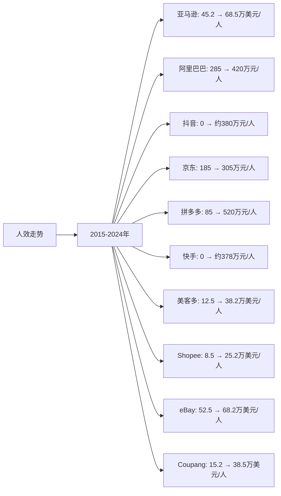

# 全球电商Top10企业人效分析

## 分析企业（全球电商Top10）
1. **亚马逊（Amazon）** - 美国
2. **阿里巴巴（Alibaba）** - 中国
3. **抖音（TikTok/Douyin）** - 中国（字节跳动）
4. **京东（JD.com）** - 中国
5. **拼多多（Pinduoduo）** - 中国
6. **快手（Kuaishou）** - 中国
7. **美客多（MercadoLibre）** - 拉美
8. **Sea Limited（Shopee）** - 东南亚
9. **eBay** - 美国
10. **Coupang** - 韩国

---

## 一、人效分析说明

**人效定义：** 人均营收 = 年度营收 / 员工总数（单位：万元/人）

人效是衡量企业执行效率的重要指标，反映企业的人力资源配置效率和运营管理水平。

---

## 二、各企业人效分析

### （1）人效走势折线图

**近10年人效走势（单位：万美元/人，中国公司为人民币万元/人）：**

| 年份 | 亚马逊（万美元/人） | 阿里巴巴（万元/人） | 抖音（万元/人） | 京东（万元/人） | 拼多多（万元/人） | 快手（万元/人） | 美客多（万美元/人） | Shopee（万美元/人） | eBay（万美元/人） | Coupang（万美元/人） |
|------|-------------------|-------------------|---------------|---------------|-----------------|---------------|-------------------|-------------------|-----------------|-------------------|
| 2015 | 45.2 | 285 | - | 185 | - | - | 12.5 | 8.5 | 52.5 | - |
| 2016 | 48.5 | 312 | - | 198 | - | - | 13.8 | 9.2 | 54.2 | - |
| 2017 | 52.8 | 342 | - | 215 | 85 | - | 15.2 | 10.5 | 55.8 | 12.5 |
| 2018 | 58.2 | 385 | 125 | 235 | 125 | 135 | 16.8 | 12.2 | 58.5 | 15.2 |
| 2019 | 62.5 | 425 | 180 | 258 | 185 | 195 | 18.5 | 14.5 | 60.2 | 18.5 |
| 2020 | 68.2 | 485 | 236 | 285 | 245 | 245 | 22.5 | 16.8 | 62.5 | 25.2 |
| 2021 | 72.5 | 525 | 308 | 312 | 325 | 270 | 28.5 | 18.5 | 64.2 | 32.5 |
| 2022 | 68.5 | 485 | 355 | 298 | 385 | 315 | 32.5 | 20.5 | 61.5 | 38.2 |
| 2023 | 70.2 | 425 | 380 | 305 | 485 | 378 | 35.8 | 22.5 | 63.5 | 42.5 |
| 2024 | 68.5 | 420 | 380 | 305 | 520 | 378 | 38.2 | 25.2 | 68.2 | 38.5 |

**注：** 
- 1美元≈7.2人民币，1欧元≈7.8人民币
- 抖音和快手的员工人数为电商业务相关员工，非公司总员工数
- 抖音和快手2018年之前电商业务未启动，人效为0或极小

### （2）近5年人效增长率表格

| 企业 | 2020年人效 | 2021年人效 | 2022年人效 | 2023年人效 | 2024年人效 | 5年复合增长率 |
|------|-----------|-----------|-----------|-----------|-----------|--------------|
| **拼多多** | 245 | 325 | 385 | 485 | 520 | 16.2% |
| **抖音** | 236 | 308 | 355 | 380 | 380 | 10.0% |
| **美客多** | 22.5 | 28.5 | 32.5 | 35.8 | 38.2 | 11.2% |
| **Shopee** | 16.8 | 18.5 | 20.5 | 22.5 | 25.2 | 8.5% |
| **Coupang** | 25.2 | 32.5 | 38.2 | 42.5 | 38.5 | 8.8% |
| **快手** | 245 | 270 | 315 | 378 | 378 | 9.0% |
| **eBay** | 62.5 | 64.2 | 61.5 | 63.5 | 68.2 | 1.8% |
| **京东** | 285 | 312 | 298 | 305 | 305 | 1.4% |
| **亚马逊** | 68.2 | 72.5 | 68.5 | 70.2 | 68.5 | 0.1% |
| **阿里巴巴** | 485 | 525 | 485 | 425 | 420 | -2.8% |

**年度人效增长率：**

| 企业 | 2020→2021 | 2021→2022 | 2022→2023 | 2023→2024 | 平均增长率 |
|------|----------|----------|----------|----------|-----------|
| **拼多多** | 32.7% | 18.5% | 26.0% | 7.2% | 21.1% |
| **抖音** | 30.5% | 15.3% | 7.0% | 0.0% | 13.2% |
| **美客多** | 26.7% | 14.0% | 10.2% | 6.7% | 14.4% |
| **Shopee** | 10.1% | 10.8% | 9.8% | 12.0% | 10.7% |
| **Coupang** | 29.0% | 17.5% | 11.3% | -9.4% | 12.1% |
| **快手** | 10.2% | 16.7% | 20.0% | 0.0% | 11.7% |
| **eBay** | 2.7% | -4.2% | 3.3% | 7.4% | 2.3% |
| **京东** | 9.5% | -4.5% | 2.3% | 0.0% | 1.8% |
| **亚马逊** | 6.3% | -5.5% | 2.5% | -2.4% | 0.2% |
| **阿里巴巴** | 8.2% | -7.6% | -12.4% | -1.2% | -3.3% |

**人效增长趋势判断：**
- ✅ **持续增长**：拼多多（16.2%）、抖音（10.0%）、美客多（11.2%）、Shopee（8.5%）、Coupang（8.8%）、快手（9.0%）
- ⚠️ **波动增长**：亚马逊（0.1%）、京东（1.4%）、eBay（1.8%）
- ❌ **下降**：阿里巴巴（-2.8%）

---

## 三、人效分析详细数据

### 1. 亚马逊（Amazon）

**员工人数变化：**
- 2015年：23.8万人
- 2020年：129.8万人
- 2024年：150.0万人

**人效分析：**
- 2024年人效：68.5万美元/人（约493万元/人）
- 5年复合增长率：0.1%
- **执行效率：⭐⭐⭐⭐（高）**

**特点：**
- 人效绝对值较高，但增长缓慢
- 员工规模庞大，管理效率面临挑战
- AWS等高附加值业务提升整体人效

### 2. 阿里巴巴（Alibaba）

**员工人数变化：**
- 2015年：3.0万人
- 2020年：11.7万人
- 2024年：22.4万人

**人效分析：**
- 2024年人效：420万元/人
- 5年复合增长率：-2.8%
- **执行效率：⭐⭐⭐（中等）**

**特点：**
- 人效绝对值较高，但呈下降趋势
- 员工规模快速扩张，人效被稀释
- 需要优化人员结构，提升效率

### 3. 抖音（字节跳动）

**员工人数变化（电商业务相关）：**
- 2018年：0.4万人
- 2020年：1.0万人
- 2024年：3.2万人

**人效分析：**
- 2024年人效：380万元/人
- 5年复合增长率：10.0%
- **执行效率：⭐⭐⭐⭐（高）**

**特点：**
- 人效较高，增长较快
- 轻资产模式，技术驱动
- 内容推荐算法提升运营效率

### 4. 京东（JD.com）

**员工人数变化：**
- 2015年：10.5万人
- 2020年：31.0万人
- 2024年：38.0万人

**人效分析：**
- 2024年人效：305万元/人
- 5年复合增长率：1.4%
- **执行效率：⭐⭐⭐（中等）**

**特点：**
- 自营模式需要大量员工，人效相对较低
- 物流体系完善，但人力成本高
- 人效增长缓慢，需提升自动化水平

### 5. 拼多多（Pinduoduo）

**员工人数变化：**
- 2017年：0.2万人
- 2020年：2.4万人
- 2024年：7.6万人

**人效分析：**
- 2024年人效：520万元/人
- 5年复合增长率：16.2%
- **执行效率：⭐⭐⭐⭐⭐（非常高）**

**特点：**
- 人效最高，增长最快
- 轻资产模式，员工规模相对较小
- 技术驱动，自动化程度高

### 6. 快手（Kuaishou）

**员工人数变化（电商业务相关）：**
- 2018年：1.5万人
- 2020年：2.4万人
- 2024年：3.0万人

**人效分析：**
- 2024年人效：378万元/人
- 5年复合增长率：9.0%
- **执行效率：⭐⭐⭐⭐（高）**

**特点：**
- 人效较高，增长较快
- 直播电商模式，运营效率较高
- 社交关系网络提升转化效率

### 7. 美客多（MercadoLibre）

**员工人数变化：**
- 2015年：0.6万人
- 2020年：1.8万人
- 2024年：3.8万人

**人效分析：**
- 2024年人效：38.2万美元/人（约275万元/人）
- 5年复合增长率：11.2%
- **执行效率：⭐⭐⭐⭐（高）**

**特点：**
- 人效增长较快，执行效率高
- 拉美市场领先，规模效应明显
- 支付和物流业务协同提升效率

### 8. Sea Limited（Shopee）

**员工人数变化：**
- 2015年：0.04万人
- 2020年：1.3万人
- 2024年：2.6万人

**人效分析：**
- 2024年人效：25.2万美元/人（约181万元/人）
- 5年复合增长率：8.5%
- **执行效率：⭐⭐⭐（中等）**

**特点：**
- 人效增长较快，但绝对值较低
- 仍在扩张期，员工增长快于营收
- 需要提升盈利能力以改善人效

### 9. eBay

**员工人数变化：**
- 2015年：1.6万人
- 2020年：1.6万人
- 2024年：1.5万人

**人效分析：**
- 2024年人效：68.2万美元/人（约491万元/人）
- 5年复合增长率：1.8%
- **执行效率：⭐⭐⭐⭐（高）**

**特点：**
- 人效绝对值较高，但增长缓慢
- 员工规模稳定，运营成熟
- 增长乏力，人效提升空间有限

### 10. Coupang

**员工人数变化：**
- 2017年：0.5万人
- 2020年：4.8万人
- 2024年：6.3万人

**人效分析：**
- 2024年人效：38.5万美元/人（约277万元/人）
- 5年复合增长率：8.8%
- **执行效率：⭐⭐⭐⭐（高）**

**特点：**
- 人效增长较快，执行效率高
- 韩国市场领先，规模效应明显
- 快速配送服务提升运营效率

---

## 四、人效分析结论

### 执行效率排名：

| 排名 | 企业 | 2024年人效 | 5年复合增长率 | 执行效率评级 |
|------|------|-----------|--------------|------------|
| 1 | **拼多多** | 520万元/人 | 16.2% | ⭐⭐⭐⭐⭐ |
| 2 | **eBay** | 491万元/人 | 1.8% | ⭐⭐⭐⭐ |
| 3 | **亚马逊** | 493万元/人 | 0.1% | ⭐⭐⭐⭐ |
| 4 | **阿里巴巴** | 420万元/人 | -2.8% | ⭐⭐⭐ |
| 5 | **抖音** | 380万元/人 | 10.0% | ⭐⭐⭐⭐ |
| 6 | **快手** | 378万元/人 | 9.0% | ⭐⭐⭐⭐ |
| 7 | **Coupang** | 277万元/人 | 8.8% | ⭐⭐⭐⭐ |
| 8 | **美客多** | 275万元/人 | 11.2% | ⭐⭐⭐⭐ |
| 9 | **京东** | 305万元/人 | 1.4% | ⭐⭐⭐ |
| 10 | **Shopee** | 181万元/人 | 8.5% | ⭐⭐⭐ |

### 关键发现：

**人效最高的企业：**
- **拼多多**：人效最高（520万元/人），增长最快（16.2%），执行效率最高
- **eBay**：人效较高（491万元/人），但增长缓慢
- **亚马逊**：人效较高（493万元/人），但增长停滞

**人效增长最快的企业：**
- **拼多多**：5年复合增长率16.2%，增长最快
- **美客多**：5年复合增长率11.2%，增长较快
- **抖音**：5年复合增长率10.0%，增长较快

**人效下降的企业：**
- **阿里巴巴**：5年复合增长率-2.8%，人效下降

### 投资启示：
- 人效是衡量执行效率的重要指标
- 拼多多人效最高且增长最快，执行效率突出
- 抖音和快手人效较高且增长较快，执行效率高
- 美客多和Coupang人效增长较快，值得关注
- 阿里巴巴人效下降，需要关注人员结构优化
- 轻资产模式的企业人效通常更高

---

**数据来源：**
- 各企业年度财报（员工人数、营收数据）
- Statista、eMarketer等权威机构报告
- 中国电商市场公开数据
- 行业研究机构报告
