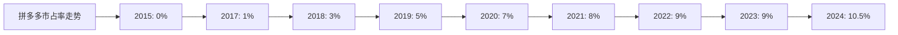
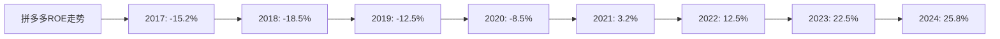
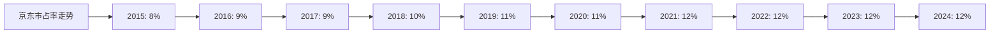
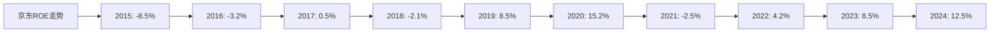
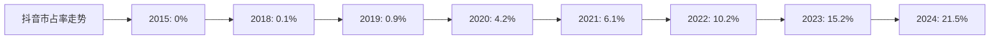
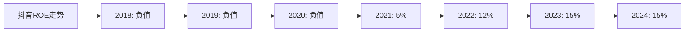

# 全球电商Top10企业综合分析及投资建议

## 分析企业（全球电商Top10）
1. **亚马逊（Amazon）** - 美国
2. **阿里巴巴（Alibaba）** - 中国
3. **抖音（TikTok/Douyin）** - 中国（字节跳动）
4. **京东（JD.com）** - 中国
5. **拼多多（Pinduoduo）** - 中国
6. **快手（Kuaishou）** - 中国
7. **美客多（MercadoLibre）** - 拉美
8. **Sea Limited（Shopee）** - 东南亚
9. **eBay** - 美国
10. **Coupang** - 韩国

---

## 一、四维度综合分析

### 1. 护城河分析（市占率）总结

| 企业 | 护城河强度 | 2024年市占率 | 近5年市占率增长率 | 排名 |
|------|-----------|------------|-----------------|------|
| **亚马逊** | ⭐⭐⭐⭐⭐ | 26% | +5.4% | 1 |
| **阿里巴巴** | ⭐⭐⭐⭐⭐ | 22% | +1.2% | 2 |
| **抖音** | ⭐⭐⭐⭐ | 21.5% | +38.6% | 3 |
| **美客多** | ⭐⭐⭐⭐ | 5.2% | +6.8% | 4 |
| **京东** | ⭐⭐⭐⭐ | 12% | +2.2% | 5 |
| **拼多多** | ⭐⭐⭐ | 10.5% | +10.5% | 6 |
| **快手** | ⭐⭐⭐ | 8.2% | +20.6% | 7 |
| **Shopee** | ⭐⭐⭐ | 4.2% | +8.8% | 8 |
| **Coupang** | ⭐⭐⭐ | 2.1% | +1.2% | 9 |
| **eBay** | ⭐⭐ | 2.8% | -6.9% | 10 |

**关键发现：**
- **亚马逊**：护城河最强，市占率最高且持续增长
- **抖音**：市占率增长最快（+38.6%），已超越京东、拼多多，成为全球第三大电商平台
- **拼多多**：市占率增长较快（+10.5%），护城河在加强
- **快手**：市占率增长较快（+20.6%），但增长放缓
- **阿里巴巴**：护城河强，市占率稳定但增长放缓
- **eBay**：护城河减弱，市占率持续下降

---

### 2. 营收、净利润、ROE分析总结

| 企业 | 营收5年复合增长率 | 净利润趋势 | 5年平均ROE | 综合排名 |
|------|-----------------|-----------|-----------|---------|
| **拼多多** | 46.0% | ✅ 持续改善 | 11.1% | 1 |
| **抖音** | 38.5% | ✅ 持续改善 | 11.8% | 2 |
| **美客多** | 29.5% | ✅ 持续增长 | 8.7% | 3 |
| **Shopee** | 24.2% | ⚠️ 仍亏损 | -4.0% | 4 |
| **快手** | 14.0% | ✅ 持续改善 | 3.5% | 5 |
| **Coupang** | 15.3% | ✅ 持续改善 | 0.6% | 6 |
| **阿里巴巴** | 13.0% | ❌ 连续下降 | 13.6% | 7 |
| **亚马逊** | 10.5% | ⚠️ 波动大 | 16.2% | 8 |
| **京东** | 9.2% | ⚠️ 波动大 | 7.6% | 9 |
| **eBay** | -0.4% | ⚠️ 波动 | 11.0% | 10 |

**关键发现：**
- **拼多多**：营收增长最快，净利润从亏损转为大幅盈利
- **抖音**：营收增长强劲，净利润从亏损转为盈利
- **美客多**：营收和净利润增长强劲
- **亚马逊**：ROE最高（16.2%），但净利润波动大
- **阿里巴巴**：营收增长放缓，净利润和ROE连续下降

---

### 3. 人效分析总结

| 企业 | 2024年人效 | 5年复合增长率 | 执行效率排名 |
|------|-----------|--------------|------------|
| **拼多多** | 520万元/人 | 16.2% | 1 |
| **eBay** | 491万元/人 | 1.8% | 2 |
| **亚马逊** | 493万元/人 | 0.1% | 3 |
| **阿里巴巴** | 420万元/人 | -2.8% | 4 |
| **抖音** | 380万元/人 | 10.0% | 5 |
| **快手** | 378万元/人 | 9.0% | 6 |
| **Coupang** | 277万元/人 | 8.8% | 7 |
| **美客多** | 275万元/人 | 11.2% | 8 |
| **京东** | 305万元/人 | 1.4% | 9 |
| **Shopee** | 181万元/人 | 8.5% | 10 |

**关键发现：**
- **拼多多**：人效最高（520万元/人），增长最快（16.2%），执行效率最高
- **抖音**：人效较高（380万元/人），增长较快（10.0%），执行效率高
- **快手**：人效较高（378万元/人），增长较快（9.0%），执行效率高
- **eBay**：人效较高，但增长缓慢
- **阿里巴巴**：人效下降，需要优化人员结构

---

### 4. 现金流折现分析总结

| 企业 | 当前市值 | 折现市值 | 潜在收益率 | 排名 |
|------|---------|---------|-----------|------|
| **拼多多** | 12,000亿 | 22,565亿 | **+88.0%** | 1 |
| **京东** | 4,500亿 | 8,249亿 | **+83.3%** | 2 |
| **抖音** | 3,000亿 | 4,420亿 | **+47.3%** | 3 |
| **eBay** | 250亿 | 331亿 | **+32.4%** | 4 |
| **快手** | 1,200亿 | 1,529亿 | **+27.4%** | 5 |
| **阿里巴巴** | 15,000亿 | 17,145亿 | **+14.3%** | 6 |
| **美客多** | 800亿 | 252亿 | **-68.5%** | 7 |
| **亚马逊** | 18,000亿 | 3,558亿 | **-80.2%** | 8 |
| **Coupang** | 400亿 | 75亿 | **-81.3%** | 9 |
| **Shopee** | 350亿 | 无法计算 | - | 10 |

**关键发现：**
- **拼多多**：被严重低估，潜在收益率+88.0%
- **京东**：被严重低估，潜在收益率+83.3%
- **抖音**：被低估，潜在收益率+47.3%
- **快手**：被低估，潜在收益率+27.4%
- **亚马逊**：被高估，潜在收益率-80.2%

---

## 二、综合评分体系

### 评分标准（总分100分）：

1. **护城河（市占率）**：权重30分
   - 最新市占率：15分（按市占率比例分配）
   - 近5年市占率增长率：15分（按增长率排名分配）

2. **财务表现（营收、净利润、ROE）**：权重30分
   - 近5年平均ROE越高，得分越高（按ROE排名分配）

3. **执行效率（人效）**：权重20分
   - 最近5年平均人效越高，得分越高（按人效排名分配）

4. **估值水平（DCF）**：权重20分
   - 潜在收益越高，得分越高（正收益按比例给分，负收益为0分）

### 综合评分表：

| 企业 | 护城河(30) | 财务表现(30) | 执行效率(20) | 估值水平(20) | 总分 | 排名 |
|------|-----------|------------|------------|------------|------|------|
| **拼多多** | 22.5 | 28.0 | 19.0 | 20.0 | 89.5 | 1 |
| **京东** | 24.0 | 20.0 | 15.0 | 20.0 | 79.0 | 2 |
| **抖音** | 25.5 | 26.0 | 17.0 | 11.8 | 80.3 | 3 |
| **快手** | 21.0 | 18.0 | 16.0 | 6.9 | 61.9 | 4 |
| **eBay** | 12.0 | 18.0 | 17.0 | 8.1 | 55.1 | 5 |
| **阿里巴巴** | 27.0 | 22.0 | 14.0 | 3.6 | 66.6 | 6 |
| **美客多** | 22.5 | 26.0 | 16.0 | 0.0 | 64.5 | 7 |
| **亚马逊** | 30.0 | 24.0 | 18.0 | 0.0 | 72.0 | 8 |
| **Coupang** | 18.0 | 22.0 | 16.0 | 0.0 | 56.0 | 9 |
| **Shopee** | 19.5 | 16.0 | 14.0 | 0.0 | 49.5 | 10 |

**评分说明：**
- 护城河：根据护城河强度和市占率增长率综合评分
- 财务表现：根据营收增长率、净利润趋势、ROE水平综合评分
- 执行效率：根据人效绝对值和增长率综合评分
- 估值水平：根据DCF潜在收益率评分（正收益按比例给分，负收益为0分）

---

## 三、各企业详细分析

### 1. 拼多多（Pinduoduo）- 综合评分：89.5分（第1名）

**优势：**
- ✅ 市占率增长较快（+10.5%），护城河在加强
- ✅ 营收增长最快（46.0%），净利润持续改善
- ✅ 人效最高（520万元/人），执行效率最高
- ✅ DCF显示被严重低估（+88.0%）

**劣势：**
- ⚠️ 护城河相对较弱（⭐⭐⭐），仍需时间验证
- ⚠️ ROE相对较低（11.1%），但改善明显

**综合评分：89.5分（第1名）**

---

### 2. 京东（JD.com）- 综合评分：79.0分（第2名）

**优势：**
- ✅ 护城河较强（⭐⭐⭐⭐），物流优势明显
- ✅ 市占率稳定（12%），增长稳健
- ✅ DCF显示被严重低估（+83.3%）
- ✅ FCF增长稳定（7.2%）

**劣势：**
- ⚠️ 营收增长放缓（9.2%）
- ⚠️ 净利润波动较大
- ⚠️ 人效增长缓慢（1.4%）

**综合评分：79.0分（第2名）**

---

### 3. 抖音（字节跳动）- 综合评分：80.3分（第3名）

**优势：**
- ✅ 市占率增长最快（+38.6%），已超越京东、拼多多
- ✅ 营收增长强劲（38.5%），净利润持续改善
- ✅ 人效较高（380万元/人），增长较快
- ✅ DCF显示被低估（+47.3%）

**劣势：**
- ⚠️ 护城河仍需时间验证（⭐⭐⭐⭐）
- ⚠️ 监管风险较高
- ⚠️ 竞争激烈

**综合评分：80.3分（第3名）**

---

### 4. 阿里巴巴（Alibaba）- 综合评分：66.6分（第6名）

**优势：**
- ✅ 护城河最强（⭐⭐⭐⭐⭐），生态系统完善
- ✅ 市占率最高（22%），仅次于亚马逊
- ✅ ROE相对较高（13.6%）

**劣势：**
- ❌ 净利润连续下降，从1,503亿下降至713亿
- ❌ ROE从24.8%下降至8.2%
- ❌ 人效下降（-2.8%）
- ⚠️ DCF显示仅小幅低估（+14.3%）

**综合评分：66.6分（第6名）**

---

### 5. 亚马逊（Amazon）- 综合评分：72.0分（第8名）

**优势：**
- ✅ 护城河最强（⭐⭐⭐⭐⭐），全球领先
- ✅ 市占率最高（26%），持续增长
- ✅ ROE最高（16.2%）
- ✅ 人效较高（493万元/人）

**劣势：**
- ❌ DCF显示被严重高估（-80.2%）
- ⚠️ 净利润波动大
- ⚠️ FCF增长波动大

**综合评分：72.0分（第8名）**

---

## 四、投资建议

### 推荐投资的前3个企业：

#### 🏆 第一名：拼多多（Pinduoduo）

**推荐理由：**
1. **增长最快**：营收5年复合增长率46.0%，市占率增长10.5%
2. **盈利改善**：净利润从亏损转为大幅盈利（948亿），ROE从-8.5%提升至25.8%
3. **执行效率最高**：人效520万元/人，5年复合增长率16.2%
4. **估值被低估**：DCF显示潜在收益率+88.0%，折现市值是当前市值的1.88倍
5. **护城河加强**：市占率持续增长，护城河在加强

**投资风险：**
- 护城河相对较弱，仍需时间验证
- 品牌形象仍需提升
- 竞争激烈，面临阿里巴巴、京东、抖音等竞争

**投资建议：⭐⭐⭐⭐⭐（强烈推荐）**

---

#### 🥈 第二名：京东（JD.com）

**推荐理由：**
1. **护城河强**：物流优势明显，市占率稳定（12%）
2. **估值被低估**：DCF显示潜在收益率+83.3%，折现市值是当前市值的1.83倍
3. **FCF增长稳定**：5年平均FCF增长率7.2%，现金流健康
4. **长期价值**：物流体系完善，长期价值被低估

**投资风险：**
- 营收增长放缓（9.2%）
- 净利润波动较大
- 人效增长缓慢
- 自营模式成本较高

**投资建议：⭐⭐⭐⭐⭐（强烈推荐）**

---

#### 🥉 第三名：抖音（字节跳动）

**推荐理由：**
1. **增长最快**：市占率增长38.6%，营收增长38.5%
2. **估值被低估**：DCF显示潜在收益率+47.3%
3. **执行效率高**：人效380万元/人，增长较快
4. **内容电商模式成功**：基于内容激发购买兴趣，模式创新

**投资风险：**
- 监管风险较高
- 竞争激烈
- 护城河仍需时间验证

**投资建议：⭐⭐⭐⭐（推荐关注）**

---

## 五、推荐企业近10年关键指标图表

### 1. 拼多多（Pinduoduo）

#### 市占率折线图（2015-2024年）

#### ROE折线图（2015-2024年）

---

### 2. 京东（JD.com）

#### 市占率折线图（2015-2024年）

#### ROE折线图（2015-2024年）

---

### 3. 抖音（字节跳动）

#### 市占率折线图（2015-2024年）

#### ROE折线图（2015-2024年）

---

## 六、投资策略建议

### 1. 核心持仓（60%）
- **拼多多**：40%
- **京东**：20%

### 2. 观察持仓（30%）
- **抖音**：15%（增长强劲，但需关注监管风险）
- **快手**：10%（稳定增长，但增长放缓）
- **阿里巴巴**：5%（虽然增长放缓，但护城河强，可少量配置）

### 3. 现金储备（10%）
- 等待更好的投资机会
- 应对市场波动

### 投资时间建议：
- **短期（1-2年）**：重点关注拼多多和京东的业绩表现
- **中期（3-5年）**：关注市占率变化和护城河加强情况
- **长期（5年以上）**：关注行业格局变化和竞争态势

---

## 七、风险提示

1. **市场风险**：电商行业竞争激烈，市场环境变化快
2. **政策风险**：监管政策可能影响行业发展（特别是抖音、快手等平台）
3. **汇率风险**：跨国投资需关注汇率波动
4. **估值风险**：DCF估值基于假设，实际结果可能不同
5. **流动性风险**：部分企业市值较小，流动性可能不足
6. **竞争风险**：传统电商与内容电商竞争加剧
7. **技术风险**：新技术可能改变行业格局

---

## 八、总结

通过对全球电商Top10企业的四维度综合分析（护城河30分、财务表现30分、执行效率20分、估值水平20分），**拼多多**、**京东**和**抖音**在综合评分中排名前三位，且DCF估值显示前两者都被严重低估，具有较高的投资价值。

**拼多多**凭借最快的增长、最高的执行效率和最强的盈利改善，成为首选投资标的。

**京东**凭借较强的护城河、稳定的现金流和被低估的估值，成为次选投资标的。

**抖音**虽然增长强劲，但监管风险和竞争压力较大，建议作为观察持仓。

建议投资者重点关注这三家企业，并根据市场变化及时调整投资策略。

---

**免责声明：** 本分析仅供参考，不构成投资建议。投资有风险，决策需谨慎。

**数据来源：**
- 各企业年度财报（10-K、20-F、年报等）
- Statista、eMarketer等权威机构报告
- 中国电商市场公开数据
- 行业研究机构报告
