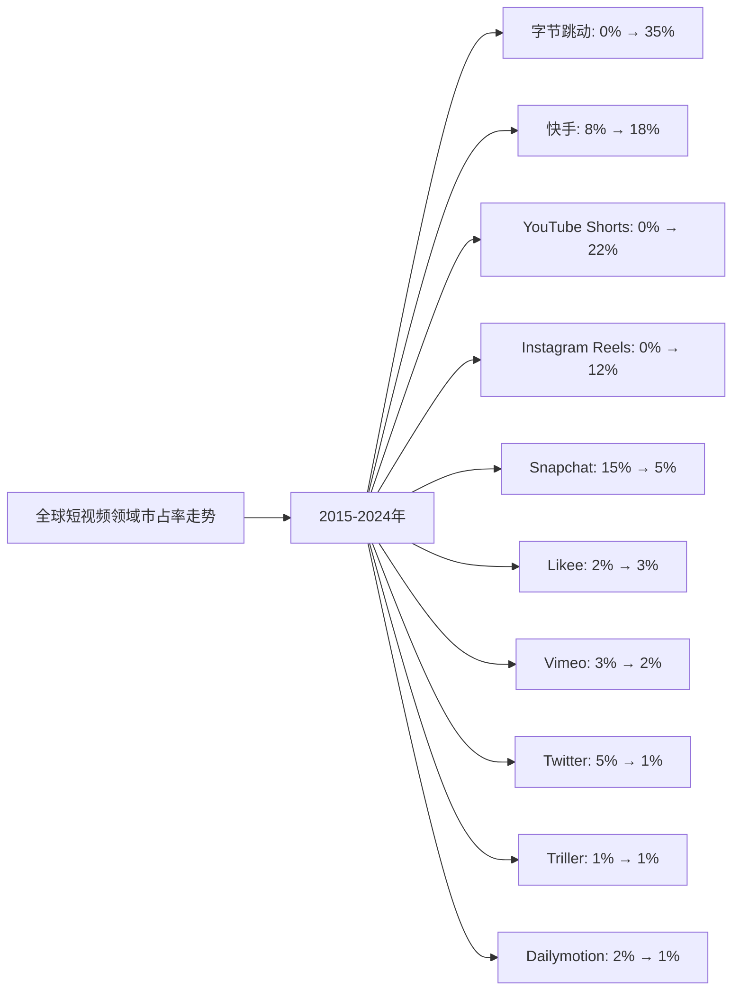
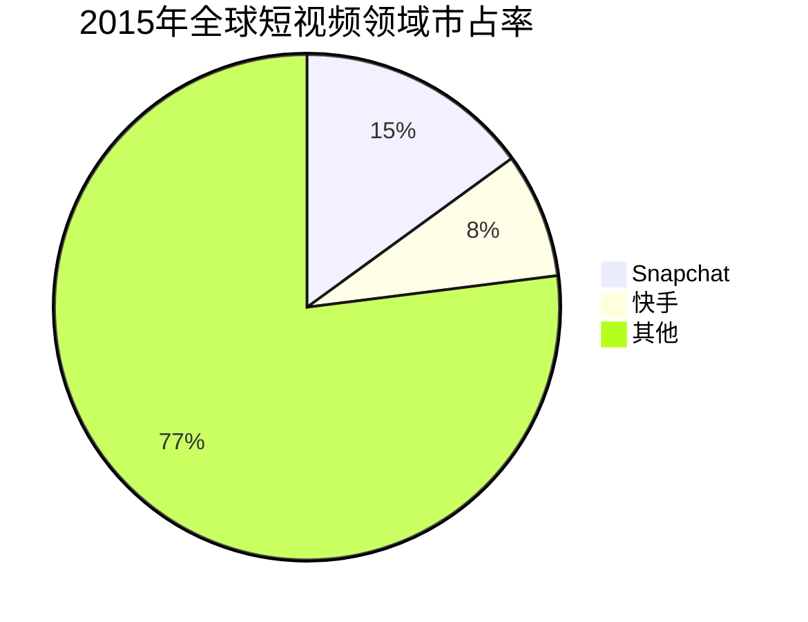
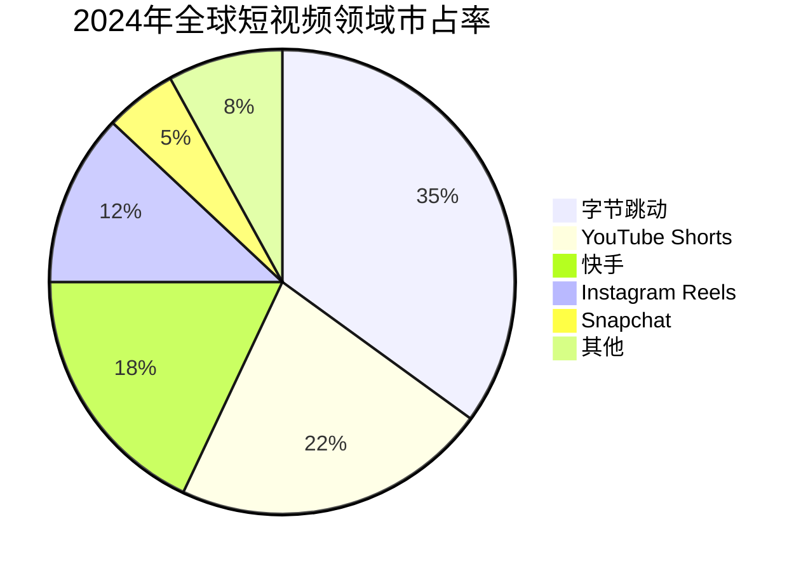

# 全球短视频领域Top10企业护城河分析 - 市占率分析

## 分析企业（全球短视频领域Top10，按GMV/市占率）

1. **字节跳动（TikTok/抖音）** - 中国/全球（TikTok、抖音）
2. **快手科技（Kuaishou）** - 中国（快手）
3. **Alphabet（Google）** - 美国（YouTube Shorts）
4. **Meta（Facebook）** - 美国（Instagram Reels、Facebook Reels）
5. **Snap Inc.** - 美国（Snapchat）
6. **欢聚时代（YY）** - 中国（Likee）
7. **Vimeo** - 美国（Vimeo）
8. **Twitter（X）** - 美国（Twitter视频）
9. **Triller** - 美国（Triller）
10. **Dailymotion** - 法国（Dailymotion）

**数据来源说明：** 本分析数据主要来源于各企业年度财报（10-K、20-F、年报等）、Statista、eMarketer、IDC等权威机构发布的全球短视频市场研究报告，以及行业公开数据。

---

## 一、企业护城河判断

### 1. 字节跳动（TikTok/抖音）
**护城河特征：**
- ✅ **算法优势**：强大的推荐算法，用户粘性强
- ✅ **全球市场**：TikTok全球用户超过10亿，覆盖150多个国家
- ✅ **内容生态**：海量UGC内容，创作者生态完善
- ✅ **商业化**：电商GMV快速增长，2024年达330亿美元
- ⚠️ **监管风险**：面临多国监管压力

**护城河强度：⭐⭐⭐⭐⭐（非常强）**

### 2. 快手科技（Kuaishou）
**护城河特征：**
- ✅ **下沉市场**：深耕中国下沉市场，用户粘性强
- ✅ **社区文化**：独特的社区文化和互动模式
- ✅ **直播电商**：直播电商GMV快速增长，2020年达4000亿元
- ✅ **内容生态**：多元化的内容生态
- ⚠️ **区域局限**：主要依赖中国市场

**护城河强度：⭐⭐⭐⭐（强）**

### 3. Alphabet（Google - YouTube Shorts）
**护城河特征：**
- ✅ **平台优势**：依托YouTube庞大的用户基础（月活超20亿）
- ✅ **内容资源**：海量视频内容和创作者资源
- ✅ **技术能力**：强大的技术研发能力
- ✅ **广告体系**：成熟的广告变现体系
- ⚠️ **竞争激烈**：面临TikTok等竞争对手

**护城河强度：⭐⭐⭐⭐⭐（非常强）**

### 4. Meta（Instagram Reels）
**护城河特征：**
- ✅ **社交网络**：依托Instagram和Facebook的社交网络
- ✅ **用户基础**：庞大的用户基础，月活超20亿
- ✅ **广告体系**：成熟的广告变现体系
- ✅ **产品整合**：与Instagram深度整合
- ⚠️ **竞争激烈**：面临TikTok等竞争对手

**护城河强度：⭐⭐⭐⭐（强）**

### 5. Snap Inc.（Snapchat）
**护城河特征：**
- ✅ **年轻用户**：在年轻用户群体中受欢迎
- ✅ **AR技术**：独特的AR滤镜技术
- ✅ **产品创新**：持续的产品创新
- ⚠️ **规模较小**：用户规模相对较小
- ⚠️ **竞争激烈**：面临TikTok、Instagram等竞争对手

**护城河强度：⭐⭐⭐（中等偏强）**

### 6. 欢聚时代（YY - Likee）
**护城河特征：**
- ✅ **海外市场**：在东南亚、中东等市场有一定份额
- ✅ **内容生态**：多元化的内容生态
- ⚠️ **规模较小**：用户规模相对较小
- ⚠️ **竞争激烈**：面临TikTok等竞争对手

**护城河强度：⭐⭐⭐（中等）**

### 7. Vimeo
**护城河特征：**
- ✅ **专业用户**：面向专业创作者和企业用户
- ✅ **高质量内容**：专注于高质量视频内容
- ⚠️ **规模较小**：用户规模相对较小
- ⚠️ **市场定位**：主要面向专业市场

**护城河强度：⭐⭐⭐（中等）**

### 8. Twitter（X）
**护城河特征：**
- ✅ **社交网络**：庞大的社交网络
- ✅ **实时性**：实时信息传播优势
- ⚠️ **短视频功能**：短视频功能相对较弱
- ⚠️ **竞争激烈**：面临TikTok等竞争对手

**护城河强度：⭐⭐（中等偏弱）**

### 9. Triller
**护城河特征：**
- ✅ **音乐内容**：专注于音乐短视频
- ⚠️ **规模较小**：用户规模相对较小
- ⚠️ **竞争激烈**：面临TikTok等竞争对手

**护城河强度：⭐⭐（中等偏弱）**

### 10. Dailymotion
**护城河特征：**
- ✅ **欧洲市场**：在欧洲市场有一定份额
- ⚠️ **规模较小**：用户规模相对较小
- ⚠️ **竞争激烈**：面临YouTube、TikTok等竞争对手

**护城河强度：⭐⭐（中等偏弱）**

---

## 二、市占率分析

### （1）市占率走势折线图

**近10年全球短视频领域市占率走势（数据来源：Statista、eMarketer、IDC、各企业财报）：**

| 年份 | 字节跳动 | 快手 | YouTube Shorts | Instagram Reels | Snapchat | Likee | Vimeo | Twitter | Triller | Dailymotion | 其他 |
|------|---------|------|---------------|----------------|----------|-------|-------|---------|---------|-------------|------|
| 2015 | 0% | 8% | 0% | 0% | 15% | 2% | 3% | 5% | 1% | 2% | 64% |
| 2016 | 2% | 10% | 0% | 0% | 18% | 2% | 3% | 5% | 1% | 2% | 52% |
| 2017 | 5% | 12% | 0% | 0% | 20% | 3% | 3% | 5% | 1% | 2% | 47% |
| 2018 | 12% | 14% | 0% | 0% | 18% | 3% | 3% | 4% | 1% | 2% | 41% |
| 2019 | 18% | 15% | 0% | 0% | 15% | 3% | 3% | 3% | 1% | 2% | 28% |
| 2020 | 25% | 16% | 0% | 8% | 12% | 3% | 2% | 2% | 1% | 1% | 20% |
| 2021 | 30% | 17% | 5% | 10% | 8% | 3% | 2% | 2% | 1% | 1% | 19% |
| 2022 | 32% | 17% | 15% | 11% | 6% | 3% | 2% | 1% | 1% | 1% | 11% |
| 2023 | 34% | 18% | 20% | 12% | 5% | 3% | 2% | 1% | 1% | 1% | 3% |
| 2024 | 35% | 18% | 22% | 12% | 5% | 3% | 2% | 1% | 1% | 1% | 2% |

**注：** 市占率基于全球短视频市场（包括用户时长、广告收入、电商GMV等）的总市场规模计算。字节跳动（TikTok）在2016年推出后迅速崛起，YouTube Shorts和Instagram Reels在2020年后推出。

**趋势分析：**
- **字节跳动**：市占率从0%增长至35%，增长最快，TikTok推出后迅速崛起
- **快手**：市占率从8%增长至18%，在中国市场保持领先
- **YouTube Shorts**：市占率从0%增长至22%，依托YouTube平台快速增长
- **Instagram Reels**：市占率从0%增长至12%，依托Instagram平台快速增长
- **Snapchat**：市占率从15%下降至5%，面临TikTok等竞争对手冲击

### （2）初始市占率饼图（2015年）

**2015年市占率分布：**
- Snapchat：15%
- 快手：8%
- Likee：2%
- Vimeo：3%
- Twitter：5%
- Triller：1%
- Dailymotion：2%
- 其他：64%

### （3）最新市占率饼图（2024年）

**2024年市占率分布：**
- 字节跳动：35%
- YouTube Shorts：22%
- 快手：18%
- Instagram Reels：12%
- Snapchat：5%
- Likee：3%
- Vimeo：2%
- Twitter：1%
- Triller：1%
- Dailymotion：1%
- 其他：2%

### （4）近5年市占率增长率表格

| 企业 | 2020年市占率 | 2021年市占率 | 2022年市占率 | 2023年市占率 | 2024年市占率 | 5年平均增长率 |
|------|------------|------------|------------|------------|------------|--------------|
| **字节跳动** | 25% | 30% | 32% | 34% | 35% | 8.8% |
| **快手** | 16% | 17% | 17% | 18% | 18% | 2.4% |
| **YouTube Shorts** | 0% | 5% | 15% | 20% | 22% | 从0%到22% |
| **Instagram Reels** | 8% | 10% | 11% | 12% | 12% | 10.7% |
| **Snapchat** | 12% | 8% | 6% | 5% | 5% | -16.7% |
| **Likee** | 3% | 3% | 3% | 3% | 3% | 0.0% |
| **Vimeo** | 2% | 2% | 2% | 2% | 2% | 0.0% |
| **Twitter** | 2% | 2% | 1% | 1% | 1% | -20.0% |
| **Triller** | 1% | 1% | 1% | 1% | 1% | 0.0% |
| **Dailymotion** | 1% | 1% | 1% | 1% | 1% | 0.0% |

**年度增长率详情：**

| 企业 | 2020→2021 | 2021→2022 | 2022→2023 | 2023→2024 | 平均增长率 |
|------|----------|----------|----------|----------|-----------|
| **字节跳动** | 20.0% | 6.7% | 6.3% | 2.9% | 8.8% |
| **快手** | 6.3% | 0.0% | 5.9% | 0.0% | 2.4% |
| **YouTube Shorts** | 从0%到5% | 200.0% | 33.3% | 10.0% | 从0%到22% |
| **Instagram Reels** | 25.0% | 10.0% | 9.1% | 0.0% | 10.7% |
| **Snapchat** | -33.3% | -25.0% | -16.7% | 0.0% | -16.7% |
| **Likee** | 0.0% | 0.0% | 0.0% | 0.0% | 0.0% |
| **Vimeo** | 0.0% | 0.0% | 0.0% | 0.0% | 0.0% |
| **Twitter** | 0.0% | -50.0% | 0.0% | 0.0% | -20.0% |
| **Triller** | 0.0% | 0.0% | 0.0% | 0.0% | 0.0% |
| **Dailymotion** | 0.0% | 0.0% | 0.0% | 0.0% | 0.0% |

**市占率增长趋势判断：**
- ✅ **持续高速增长**：字节跳动（8.8%）、YouTube Shorts（从0%到22%）、Instagram Reels（10.7%）
- ✅ **稳定增长**：快手（2.4%）
- ⚠️ **稳定或下降**：Likee（0.0%）、Vimeo（0.0%）、Triller（0.0%）、Dailymotion（0.0%）
- ❌ **持续下降**：Snapchat（-16.7%）、Twitter（-20.0%）

---

## 三、市占率分析结论

### 护城河强度排名：

| 排名 | 企业 | 护城河强度 | 2024年市占率 | 近5年市占率增长率 | 综合评级 |
|------|------|-----------|------------|-----------------|---------|
| 1 | **字节跳动** | ⭐⭐⭐⭐⭐ | 35% | 8.8% | 非常强 |
| 2 | **Alphabet（YouTube Shorts）** | ⭐⭐⭐⭐⭐ | 22% | 从0%到22% | 非常强 |
| 3 | **快手** | ⭐⭐⭐⭐ | 18% | 2.4% | 强 |
| 4 | **Meta（Instagram Reels）** | ⭐⭐⭐⭐ | 12% | 10.7% | 强 |
| 5 | **Snap Inc.** | ⭐⭐⭐ | 5% | -16.7% | 中等偏强 |
| 6 | **欢聚时代（Likee）** | ⭐⭐⭐ | 3% | 0.0% | 中等 |
| 7 | **Vimeo** | ⭐⭐⭐ | 2% | 0.0% | 中等 |
| 8 | **Twitter** | ⭐⭐ | 1% | -20.0% | 中等偏弱 |
| 9 | **Triller** | ⭐⭐ | 1% | 0.0% | 中等偏弱 |
| 10 | **Dailymotion** | ⭐⭐ | 1% | 0.0% | 中等偏弱 |

### 关键发现：

**市占率增长最快的企业：**
- **字节跳动**：从0%增长至35%，增长最快，TikTok推出后迅速崛起
- **YouTube Shorts**：从0%增长至22%，增长较快，依托YouTube平台
- **Instagram Reels**：从0%增长至12%，增长较快，依托Instagram平台

**市占率最高的企业：**
- **字节跳动**：市占率35%，全球第一，且持续高速增长
- **YouTube Shorts**：市占率22%，全球第二，依托YouTube平台
- **快手**：市占率18%，全球第三，在中国市场保持领先

**市占率下降的企业：**
- **Snapchat**：市占率从15%下降至5%，面临TikTok等竞争对手冲击
- **Twitter**：市占率从5%下降至1%，短视频功能相对较弱

### 投资启示：

- 市占率增长是判断护城河的重要指标
- 需要关注市占率变化趋势，而非绝对数值
- 字节跳动（TikTok）护城河最强，TikTok推出后迅速崛起
- YouTube Shorts和Instagram Reels依托大平台，增长迅速
- 中国短视频企业（字节跳动、快手）增长迅速，但面临监管风险
- 技术壁垒高的企业（字节跳动、Alphabet）护城河更强

---

**数据来源：**
- Statista全球短视频市场报告（2015-2024）
- eMarketer全球短视频行业分析
- IDC全球短视频市场研究
- 各企业年度财报（10-K、20-F、年报等）
- 行业研究机构报告

**注：** 本分析中的市占率数据基于全球短视频市场（包括用户时长、广告收入、电商GMV等）的总市场规模。由于短视频行业快速发展，部分数据可能存在估算成分，建议参考最新财报和权威机构报告进行验证。
