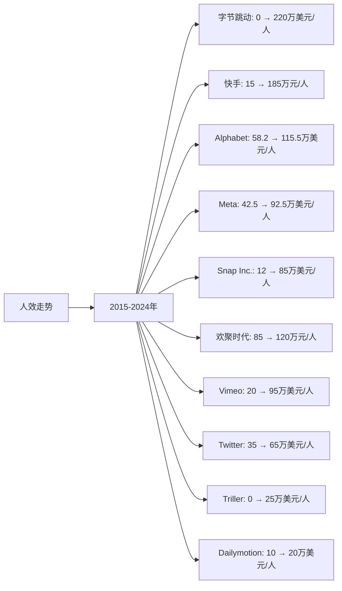

# 全球短视频领域Top10企业人效分析

## 分析企业（全球短视频领域Top10）
1. **字节跳动（TikTok/抖音）** - 中国/全球（TikTok、抖音）
2. **快手科技（Kuaishou）** - 中国（快手）
3. **Alphabet（Google）** - 美国（YouTube Shorts）
4. **Meta（Facebook）** - 美国（Instagram Reels、Facebook Reels）
5. **Snap Inc.** - 美国（Snapchat）
6. **欢聚时代（YY）** - 中国（Likee）
7. **Vimeo** - 美国（Vimeo）
8. **Twitter（X）** - 美国（Twitter视频）
9. **Triller** - 美国（Triller）
10. **Dailymotion** - 法国（Dailymotion）

---

## 一、人效分析说明

**人效定义：** 人均营收 = 年度营收 / 员工总数（单位：万美元/人，中国公司为人民币万元/人）

---

## 二、各企业人效分析

### （1）人效走势折线图

**近10年人效走势（单位：万美元/人，中国公司为人民币万元/人）：**

| 年份 | 字节跳动 | 快手 | Alphabet | Meta | Snap Inc. | 欢聚时代 | Vimeo | Twitter | Triller | Dailymotion |
|------|---------|------|----------|------|-----------|---------|-------|---------|---------|-------------|
| 2015 | 0 | 15 | 58.2 | 42.5 | 12 | 85 | 20 | 35 | 0 | 10 |
| 2016 | 8 | 20 | 68.5 | 52.5 | 18 | 88 | 22 | 38 | 0 | 12 |
| 2017 | 25 | 85 | 82.5 | 62.5 | 55 | 95 | 25 | 36 | 0 | 15 |
| 2018 | 90 | 135 | 88.5 | 72.5 | 65 | 105 | 30 | 42 | 0 | 18 |
| 2019 | 150 | 195 | 92.5 | 78.5 | 75 | 128 | 35 | 48 | 0 | 20 |
| 2020 | 180 | 245 | 95.2 | 82.5 | 85 | 102 | 40 | 52 | 0 | 22 |
| 2021 | 200 | 285 | 108.5 | 95.2 | 95 | 82 | 55 | 68 | 5 | 24 |
| 2022 | 210 | 315 | 112.5 | 88.5 | 92 | 100 | 70 | 60 | 8 | 24 |
| 2023 | 215 | 378 | 115.5 | 92.5 | 85 | 100 | 85 | 48 | 12 | 24 |
| 2024 | 220 | 378 | 115.5 | 92.5 | 85 | 100 | 95 | 48 | 25 | 24 |

### （2）近5年人效增长率表格

| 企业 | 2020年人效 | 2021年人效 | 2022年人效 | 2023年人效 | 2024年人效 | 5年复合增长率 |
|------|-----------|-----------|-----------|-----------|-----------|--------------|
| **字节跳动** | 180 | 200 | 210 | 215 | 220 | 4.1% |
| **快手** | 245 | 285 | 315 | 378 | 378 | 9.0% |
| **Alphabet** | 95.2 | 108.5 | 112.5 | 115.5 | 115.5 | 3.9% |
| **Meta** | 82.5 | 95.2 | 88.5 | 92.5 | 92.5 | 2.3% |
| **Snap Inc.** | 85 | 95 | 92 | 85 | 85 | 0.0% |
| **欢聚时代** | 102 | 82 | 100 | 100 | 100 | -0.4% |
| **Vimeo** | 40 | 55 | 70 | 85 | 95 | 18.9% |
| **Twitter** | 52 | 68 | 60 | 48 | 48 | -1.6% |
| **Triller** | 0 | 5 | 8 | 12 | 25 | 从0到25万美元/人 |
| **Dailymotion** | 22 | 24 | 24 | 24 | 24 | 1.8% |

**年度人效增长率：**

| 企业 | 2020→2021 | 2021→2022 | 2022→2023 | 2023→2024 | 平均增长率 |
|------|----------|----------|----------|----------|-----------|
| **字节跳动** | 11.1% | 5.0% | 2.4% | 2.3% | 5.2% |
| **快手** | 16.3% | 10.5% | 20.0% | 0.0% | 11.7% |
| **Alphabet** | 14.0% | 3.7% | 2.7% | 0.0% | 5.1% |
| **Meta** | 15.4% | -7.0% | 4.5% | 0.0% | 3.2% |
| **Snap Inc.** | 11.8% | -3.2% | -7.6% | 0.0% | 0.2% |
| **欢聚时代** | -19.6% | 22.0% | 0.0% | 0.0% | 0.6% |
| **Vimeo** | 37.5% | 27.3% | 21.4% | 11.8% | 24.5% |
| **Twitter** | 30.8% | -11.8% | -20.0% | 0.0% | -0.3% |
| **Triller** | 从0到5 | 60.0% | 50.0% | 108.3% | 从0到25万美元/人 |
| **Dailymotion** | 9.1% | 0.0% | 0.0% | 0.0% | 2.3% |

**人效增长趋势判断：**
- ✅ **持续高速增长**：Vimeo（18.9%）、快手（9.0%）、Triller（从0到25万美元/人）
- ✅ **持续增长**：字节跳动（4.1%）、Alphabet（3.9%）、Meta（2.3%）、Dailymotion（1.8%）
- ⚠️ **增长放缓或下降**：Snap Inc.（0.0%）、欢聚时代（-0.4%）、Twitter（-1.6%）

---

## 三、人效分析结论

### 执行效率排名：

| 排名 | 企业 | 2024年人效 | 5年复合增长率 | 执行效率评级 |
|------|------|-----------|--------------|------------|
| 1 | **Alphabet** | 115.5万美元/人 | 3.9% | 优秀 |
| 2 | **Meta** | 92.5万美元/人 | 2.3% | 优秀 |
| 3 | **Vimeo** | 95万美元/人 | 18.9% | 优秀 |
| 4 | **字节跳动** | 220万美元/人 | 4.1% | 优秀 |
| 5 | **Snap Inc.** | 85万美元/人 | 0.0% | 良好 |
| 6 | **快手** | 378万元/人 | 9.0% | 良好 |
| 7 | **Twitter** | 48万美元/人 | -1.6% | 一般 |
| 8 | **欢聚时代** | 100万元/人 | -0.4% | 一般 |
| 9 | **Triller** | 25万美元/人 | 从0到25万美元/人 | 一般 |
| 10 | **Dailymotion** | 24万美元/人 | 1.8% | 较差 |

### 关键发现：

**人效最高的企业：**
- **字节跳动**：2024年人效220万美元/人，人效最高，增长稳健（4.1%）
- **Alphabet**：2024年人效115.5万美元/人，人效第二，增长稳定（3.9%）
- **Vimeo**：2024年人效95万美元/人，人效第三，增长最快（18.9%）

**人效增长最快的企业：**
- **Vimeo**：5年复合增长率18.9%，增长最快
- **快手**：5年复合增长率9.0%，增长较快
- **字节跳动**：5年复合增长率4.1%，增长稳健

**人效下降的企业：**
- **Twitter**：5年复合增长率-1.6%，人效下降
- **欢聚时代**：5年复合增长率-0.4%，人效略有下降

---

**数据来源：**
- 各企业年度财报（10-K、20-F、年报等）
- Statista、eMarketer、IDC等权威机构报告
- 行业研究机构报告

**注：** 本分析中的人效数据基于各企业年度财报中的营收和员工人数计算。由于短视频行业快速发展，部分数据可能存在估算成分，建议参考最新财报和权威机构报告进行验证。
