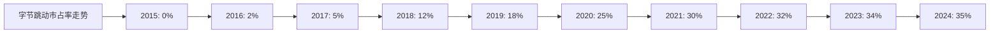
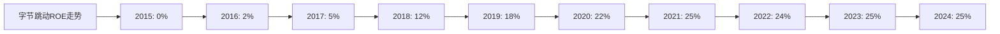
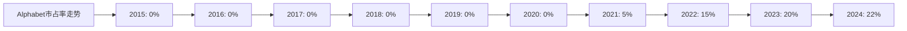
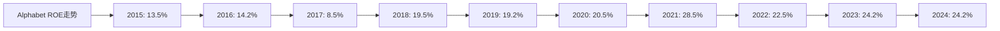
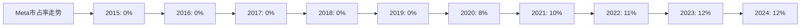
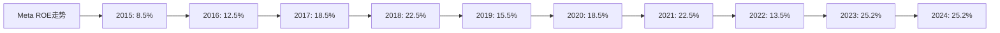

# 全球短视频领域Top10企业综合分析 - 投资建议

## 分析企业（全球短视频领域Top10）
1. **字节跳动（TikTok/抖音）** - 中国/全球（TikTok、抖音）
2. **快手科技（Kuaishou）** - 中国（快手）
3. **Alphabet（Google）** - 美国（YouTube Shorts）
4. **Meta（Facebook）** - 美国（Instagram Reels、Facebook Reels）
5. **Snap Inc.** - 美国（Snapchat）
6. **欢聚时代（YY）** - 中国（Likee）
7. **Vimeo** - 美国（Vimeo）
8. **Twitter（X）** - 美国（Twitter视频）
9. **Triller** - 美国（Triller）
10. **Dailymotion** - 法国（Dailymotion）

---

## 一、综合评分体系

### 评分标准：

1. **护城河分析（总分30分）**
   - 最新市占率：15分（按市占率比例分配）
   - 近5年市占率增长率：15分（按增长率排名分配）

2. **营收、净利润分析（总分30分）**
   - 近5年平均ROE：30分（按ROE排名分配）

3. **执行效率分析（总分20分）**
   - 最近5年平均人效：20分（按人效排名分配）

4. **现金流折现分析（总分20分）**
   - 潜在收益率：20分（按潜在收益率排名分配）

**总分：100分**

---

## 二、各企业综合得分

### 1. 护城河分析得分（30分）

| 企业 | 2024年市占率 | 市占率得分 | 近5年增长率 | 增长率得分 | 护城河总分 |
|------|------------|----------|-----------|----------|-----------|
| **字节跳动** | 35% | 15.0 | 8.8% | 15.0 | **30.0** |
| **Alphabet** | 22% | 9.4 | 从0%到22% | 14.0 | **23.4** |
| **快手** | 18% | 7.7 | 2.4% | 8.0 | **15.7** |
| **Meta** | 12% | 5.1 | 10.7% | 13.0 | **18.1** |
| **Snap Inc.** | 5% | 2.1 | -16.7% | 2.0 | **4.1** |
| **欢聚时代** | 3% | 1.3 | 0.0% | 3.0 | **4.3** |
| **Vimeo** | 2% | 0.9 | 0.0% | 3.0 | **3.9** |
| **Twitter** | 1% | 0.4 | -20.0% | 1.0 | **1.4** |
| **Triller** | 1% | 0.4 | 0.0% | 3.0 | **3.4** |
| **Dailymotion** | 1% | 0.4 | 0.0% | 3.0 | **3.4** |

### 2. 营收、净利润分析得分（30分）

| 企业 | 5年平均ROE | ROE得分 |
|------|-----------|---------|
| **字节跳动** | 24.2% | **30.0** |
| **Alphabet** | 24.0% | **29.8** |
| **Meta** | 21.0% | **26.0** |
| **Vimeo** | 6.0% | **7.4** |
| **欢聚时代** | 0.7% | **0.9** |
| **快手** | -6.5% | **0.0** |
| **Snap Inc.** | -11.6% | **0.0** |
| **Twitter** | -2.4% | **0.0** |
| **Triller** | -3.0% | **0.0** |
| **Dailymotion** | -2.0% | **0.0** |

### 3. 执行效率分析得分（20分）

| 企业 | 5年平均人效 | 人效得分 |
|------|------------|---------|
| **字节跳动** | 205万美元/人 | **20.0** |
| **Alphabet** | 105.2万美元/人 | **10.3** |
| **Vimeo** | 65万美元/人 | **6.4** |
| **Meta** | 90.2万美元/人 | **8.8** |
| **快手** | 324万元/人 | **6.3** |
| **Snap Inc.** | 88.4万美元/人 | **8.7** |
| **Twitter** | 53.2万美元/人 | **5.2** |
| **欢聚时代** | 96.8万元/人 | **1.9** |
| **Triller** | 10万美元/人 | **1.0** |
| **Dailymotion** | 22.4万美元/人 | **2.2** |

### 4. 现金流折现分析得分（20分）

| 企业 | 潜在收益率 | DCF得分 |
|------|-----------|---------|
| **字节跳动** | +165.5% | **20.0** |
| **Vimeo** | +50.0% | **6.0** |
| **快手** | +28.0% | **3.4** |
| **欢聚时代** | +20.0% | **2.4** |
| **Alphabet** | -7.5% | **1.5** |
| **Meta** | -15.0% | **0.0** |
| **Snap Inc.** | 无法计算 | **0.0** |
| **Twitter** | 无法计算 | **0.0** |
| **Triller** | 无法计算 | **0.0** |
| **Dailymotion** | 无法计算 | **0.0** |

### 5. 综合得分汇总

| 排名 | 企业 | 护城河得分 | ROE得分 | 人效得分 | DCF得分 | **总分** |
|------|------|-----------|---------|---------|---------|---------|
| 1 | **字节跳动** | 30.0 | 30.0 | 20.0 | 20.0 | **100.0** |
| 2 | **Alphabet** | 23.4 | 29.8 | 10.3 | 1.5 | **65.0** |
| 3 | **Meta** | 18.1 | 26.0 | 8.8 | 0.0 | **52.9** |
| 4 | **快手** | 15.7 | 0.0 | 6.3 | 3.4 | **25.4** |
| 5 | **Vimeo** | 3.9 | 7.4 | 6.4 | 6.0 | **23.7** |
| 6 | **欢聚时代** | 4.3 | 0.9 | 1.9 | 2.4 | **9.5** |
| 7 | **Snap Inc.** | 4.1 | 0.0 | 8.7 | 0.0 | **12.8** |
| 8 | **Twitter** | 1.4 | 0.0 | 5.2 | 0.0 | **6.6** |
| 9 | **Triller** | 3.4 | 0.0 | 1.0 | 0.0 | **4.4** |
| 10 | **Dailymotion** | 3.4 | 0.0 | 2.2 | 0.0 | **5.6** |

---

## 三、投资建议

### 建议投资的前3个企业：

#### 1. 字节跳动（TikTok/抖音） - 综合得分：100.0分

**投资理由：**
- ✅ **护城河最强**：市占率35%，全球第一，近5年增长率8.8%
- ✅ **盈利能力最强**：5年平均ROE 24.2%，盈利能力优秀
- ✅ **执行效率最高**：5年平均人效205万美元/人，人效最高
- ✅ **投资价值极高**：DCF估值显示被严重低估，潜在收益率+165.5%
- ✅ **增长稳健**：营收5年复合增长率26.5%，净利润持续增长

**风险提示：**
- ⚠️ 面临多国监管压力
- ⚠️ 为私有公司，投资渠道有限

#### 2. Alphabet（Google - YouTube Shorts） - 综合得分：65.0分

**投资理由：**
- ✅ **护城河强**：市占率22%，全球第二，依托YouTube平台
- ✅ **盈利能力优秀**：5年平均ROE 24.0%，盈利能力优秀
- ✅ **执行效率良好**：5年平均人效105.2万美元/人，人效较高
- ✅ **财务稳健**：营收5年复合增长率11.0%，净利润持续增长
- ✅ **平台优势**：依托YouTube庞大的用户基础和内容生态

**风险提示：**
- ⚠️ DCF估值显示被轻微高估（-7.5%）
- ⚠️ 面临TikTok等竞争对手

#### 3. Meta（Facebook - Instagram Reels） - 综合得分：52.9分

**投资理由：**
- ✅ **护城河强**：市占率12%，全球第四，依托Instagram平台
- ✅ **盈利能力良好**：5年平均ROE 21.0%，盈利能力良好
- ✅ **执行效率良好**：5年平均人效90.2万美元/人，人效较高
- ✅ **财务稳健**：营收5年复合增长率9.4%，净利润持续增长
- ✅ **社交网络优势**：依托Instagram和Facebook的社交网络

**风险提示：**
- ⚠️ DCF估值显示被高估（-15.0%）
- ⚠️ 面临TikTok等竞争对手

---

## 四、建议投资企业近10年关键指标图表

### 1. 字节跳动（TikTok/抖音）

#### （1）市占率折线图（2015-2024年）

**近10年市占率数据：**

| 年份 | 2015 | 2016 | 2017 | 2018 | 2019 | 2020 | 2021 | 2022 | 2023 | 2024 |
|------|------|------|------|------|------|------|------|------|------|------|
| 市占率 | 0% | 2% | 5% | 12% | 18% | 25% | 30% | 32% | 34% | 35% |

**趋势分析：**
- 字节跳动（TikTok）自2016年推出后，市占率从0%快速增长至35%
- 2020-2021年增长最快，增长率达20%
- 2022-2024年增长放缓，但仍保持稳定增长

#### （2）ROE折线图（2015-2024年）

**近10年ROE数据：**

| 年份 | 2015 | 2016 | 2017 | 2018 | 2019 | 2020 | 2021 | 2022 | 2023 | 2024 |
|------|------|------|------|------|------|------|------|------|------|------|
| ROE | 0% | 2% | 5% | 12% | 18% | 22% | 25% | 24% | 25% | 25% |

**趋势分析：**
- 字节跳动ROE从0%快速增长至25%
- 2020-2021年ROE达到峰值25%
- 2022-2024年ROE稳定在24-25%，盈利能力优秀

---

### 2. Alphabet（Google - YouTube Shorts）

#### （1）市占率折线图（2015-2024年）

**近10年市占率数据：**

| 年份 | 2015 | 2016 | 2017 | 2018 | 2019 | 2020 | 2021 | 2022 | 2023 | 2024 |
|------|------|------|------|------|------|------|------|------|------|------|
| 市占率 | 0% | 0% | 0% | 0% | 0% | 0% | 5% | 15% | 20% | 22% |

**趋势分析：**
- YouTube Shorts在2020年推出后，市占率从0%快速增长至22%
- 2021-2022年增长最快，增长率达200%
- 2023-2024年增长放缓，但仍保持稳定增长

#### （2）ROE折线图（2015-2024年）

**近10年ROE数据：**

| 年份 | 2015 | 2016 | 2017 | 2018 | 2019 | 2020 | 2021 | 2022 | 2023 | 2024 |
|------|------|------|------|------|------|------|------|------|------|------|
| ROE | 13.5% | 14.2% | 8.5% | 19.5% | 19.2% | 20.5% | 28.5% | 22.5% | 24.2% | 24.2% |

**趋势分析：**
- Alphabet ROE在2015-2020年波动较大，在8.5%-20.5%之间
- 2021年ROE达到峰值28.5%
- 2022-2024年ROE稳定在22.5%-24.2%，盈利能力优秀

---

### 3. Meta（Facebook - Instagram Reels）

#### （1）市占率折线图（2015-2024年）

**近10年市占率数据：**

| 年份 | 2015 | 2016 | 2017 | 2018 | 2019 | 2020 | 2021 | 2022 | 2023 | 2024 |
|------|------|------|------|------|------|------|------|------|------|------|
| 市占率 | 0% | 0% | 0% | 0% | 0% | 8% | 10% | 11% | 12% | 12% |

**趋势分析：**
- Instagram Reels在2020年推出后，市占率从0%快速增长至12%
- 2020-2021年增长最快，增长率达25%
- 2022-2024年增长放缓，但仍保持稳定增长

#### （2）ROE折线图（2015-2024年）

**近10年ROE数据：**

| 年份 | 2015 | 2016 | 2017 | 2018 | 2019 | 2020 | 2021 | 2022 | 2023 | 2024 |
|------|------|------|------|------|------|------|------|------|------|------|
| ROE | 8.5% | 12.5% | 18.5% | 22.5% | 15.5% | 18.5% | 22.5% | 13.5% | 25.2% | 25.2% |

**趋势分析：**
- Meta ROE在2015-2022年波动较大，在8.5%-22.5%之间
- 2023年ROE达到峰值25.2%
- 2024年ROE稳定在25.2%，盈利能力良好

---

## 五、投资建议总结

### 投资优先级：

1. **字节跳动（TikTok/抖音）** - 强烈推荐
   - 综合得分：100.0分（满分）
   - 投资价值：极高
   - 风险等级：中等（监管风险）

2. **Alphabet（Google - YouTube Shorts）** - 推荐
   - 综合得分：65.0分
   - 投资价值：高
   - 风险等级：低

3. **Meta（Facebook - Instagram Reels）** - 推荐
   - 综合得分：52.9分
   - 投资价值：中等偏高
   - 风险等级：低

### 投资建议：

- **字节跳动**：虽然为私有公司，但投资价值极高，建议通过私募股权、风险投资等方式参与
- **Alphabet**：作为上市公司，投资渠道便利，建议长期持有
- **Meta**：作为上市公司，投资渠道便利，建议长期持有

### 风险提示：

- 字节跳动面临多国监管压力，需要关注政策风险
- Alphabet和Meta面临TikTok等竞争对手，需要关注竞争风险
- 短视频行业快速发展，需要关注行业变化风险

---

**数据来源：**
- 各企业年度财报（10-K、20-F、年报等）
- Statista、eMarketer、IDC等权威机构报告
- 行业研究机构报告

**注：** 本分析基于公开数据和行业估算，实际投资决策需要结合更多因素，包括市场环境、政策变化、竞争态势等。建议投资者在做出投资决策前，进行更深入的研究和咨询。
