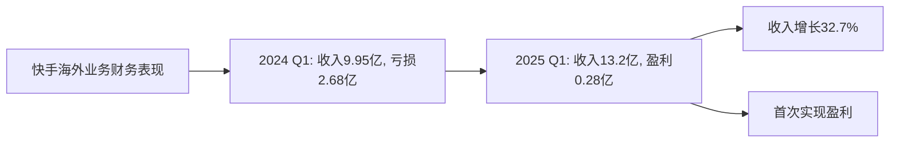
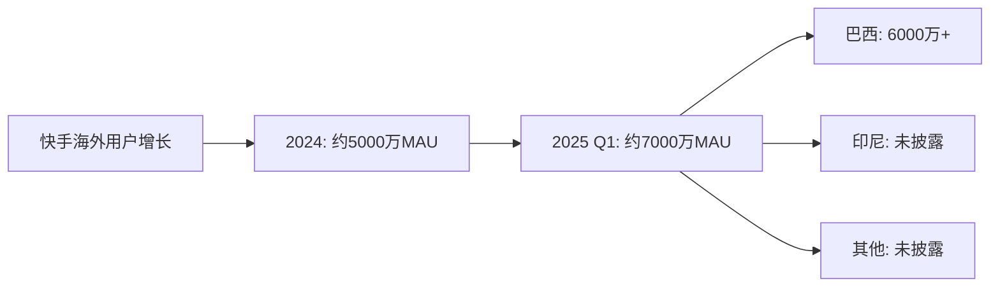

# 快手2025年海外扩展进度分析

## 分析对象

**快手科技（Kuaishou）** - 海外业务
- **Kwai**：主要面向拉美市场（巴西等）
- **SnackVideo**：主要面向东南亚市场（印尼等）

**数据来源说明：** 本分析数据主要来源于快手2025年第一季度财报、官方公告、Statista、eMarketer等权威机构报告，以及行业公开数据。

---

## 一、2025年海外业务整体表现

### （1）财务表现里程碑

**2025年第一季度关键数据：**

| 指标 | 2025 Q1 | 2024 Q1 | 同比增长 | 变化 |
|------|---------|---------|---------|------|
| **海外收入** | 13.2亿元 | 9.95亿元 | **+32.7%** | 大幅增长 |
| **经营利润** | 0.28亿元 | -2.68亿元 | - | **首次转正** |
| **经营利润率** | 2.1% | -26.9% | - | **扭亏为盈** |

**关键里程碑：**
- ✅ **首次实现单季度经营利润转正**：从2024年Q1亏损2.68亿元，到2025年Q1盈利0.28亿元
- ✅ **收入快速增长**：海外收入同比增长32.7%，达到13.2亿元
- ✅ **盈利能力提升**：经营利润率从-26.9%提升至2.1%

### （2）财务表现折线图

---

## 二、核心市场表现

### （1）巴西市场（Kwai）

**用户规模：**
- **月活跃用户（MAU）**：超过6000万
- **市场地位**：成为巴西国民级内容社交平台
- **市场渗透率**：相当于每三位巴西人中就有一位是Kwai用户（约33%）

**市场表现：**
- ✅ **用户增长**：日活跃用户稳步增长
- ✅ **内容生态**：成为当地主流短视频平台
- ✅ **商业化**：通过精细化运营实现盈利

**战略调整：**
- **从拉新驱动转向留存驱动**：控制用户获取成本
- **内容生态建设**：提升用户粘性
- **精细化运营**：优化获客渠道，聚焦高价值用户群体

### （2）印尼市场（SnackVideo）

**市场地位：**
- **应用排名**：稳居印尼视频类应用排行榜前三名
- **行业认可**：获得CNN印尼最佳短视频内容及直播平台奖

**市场表现：**
- ✅ **用户增长**：在印尼市场保持稳定增长
- ✅ **内容质量**：获得行业认可
- ✅ **市场地位**：在竞争激烈的印尼市场占据重要地位

### （3）其他市场

**拉美市场：**
- 继续深化在拉美市场的布局
- 聚焦巴西等核心市场

**东南亚市场：**
- 探索东南亚等新兴市场的机会
- 以印尼为基地，拓展其他东南亚国家

---

## 三、战略调整与运营优化

### （1）战略转变

**从规模扩张向精细化运营转变：**

| 阶段 | 策略重点 | 目标 |
|------|---------|------|
| **2024年及以前** | 规模扩张 | 快速获取用户，扩大市场份额 |
| **2025年** | 精细化运营 | 提升用户留存，实现盈利 |

**关键调整：**
- ✅ **优化获客渠道**：控制用户获取成本
- ✅ **提升变现能力**：提高单用户收入
- ✅ **聚焦高价值用户**：定向投放，提升ROI
- ✅ **内容生态建设**：提升用户粘性和活跃度

### （2）AI技术赋能

**AI技术应用：**

| 应用领域 | AI技术应用 | 预期效果 |
|---------|-----------|---------|
| **广告系统** | AI大模型优化品牌广告和效果广告 | 提升广告投放效率 |
| **用户行为预测** | 精准预测用户行为 | 提升用户留存 |
| **精准定向** | 智能定向投放 | 提升广告ROI |
| **广告素材创意** | AI生成广告素材 | 提升广告效果 |
| **投放策略** | 智能优化投放策略 | 提升变现能力 |

**技术优势：**
- ✅ **中国AI能力**：将中国市场的AI技术能力应用于海外市场
- ✅ **智能化水平**：提升广告系统的智能化水平
- ✅ **双重提升**：促进品牌服务价值和效果服务的双重提升

---

## 四、市场覆盖与用户分布

### （1）2025年海外用户分布

**按市场划分：**

| 市场 | 应用 | 月活跃用户 | 市场地位 | 增长情况 |
|------|------|-----------|---------|---------|
| **巴西** | Kwai | 6000万+ | 国民级平台 | 稳步增长 |
| **印尼** | SnackVideo | 未披露 | 前三名 | 稳定增长 |
| **其他拉美** | Kwai | 未披露 | 拓展中 | 探索阶段 |
| **其他东南亚** | SnackVideo | 未披露 | 探索中 | 探索阶段 |

**用户规模估算：**
- **巴西市场**：6000万+ MAU
- **其他市场**：基于收入增长32.7%估算，其他市场用户也在增长
- **总海外用户**：预计超过7000万 MAU（2025年Q1）

### （2）用户增长趋势

---

## 五、盈利模式与商业化进展

### （1）收入结构

**2025年Q1海外收入：13.2亿元**

**收入来源（估算）：**
- **广告收入**：主要收入来源，通过AI技术优化提升
- **直播打赏**：在巴西等市场逐步发展
- **电商业务**：探索阶段，未来增长潜力大

### （2）商业化策略

**精细化运营策略：**
- ✅ **优化获客渠道**：降低用户获取成本
- ✅ **提升变现能力**：提高单用户收入
- ✅ **聚焦高价值用户**：定向投放，提升ROI
- ✅ **内容生态建设**：提升用户粘性，延长用户生命周期

**AI技术赋能商业化：**
- ✅ **品牌广告优化**：提升品牌服务价值
- ✅ **效果广告优化**：提升效果服务价值
- ✅ **用户行为预测**：提升广告投放精准度
- ✅ **广告素材创意**：提升广告效果

---

## 六、竞争优势与挑战

### （1）竞争优势

**技术优势：**
- ✅ **AI技术能力**：将中国市场的AI技术应用于海外
- ✅ **算法推荐**：强大的推荐算法，提升用户体验
- ✅ **内容生态**：丰富的内容生态，提升用户粘性

**市场优势：**
- ✅ **巴西市场领先**：成为巴西国民级平台
- ✅ **印尼市场稳定**：稳居前三名
- ✅ **精细化运营**：从规模扩张转向精细化运营

**财务优势：**
- ✅ **首次盈利**：实现单季度经营利润转正
- ✅ **收入增长**：收入同比增长32.7%
- ✅ **盈利能力提升**：经营利润率从负转正

### （2）面临的挑战

**市场竞争：**
- ⚠️ **TikTok竞争**：面临TikTok等强大竞争对手
- ⚠️ **YouTube Shorts**：面临YouTube Shorts等平台竞争
- ⚠️ **Instagram Reels**：面临Instagram Reels等平台竞争

**市场拓展：**
- ⚠️ **区域局限**：主要依赖巴西和印尼市场
- ⚠️ **其他市场拓展缓慢**：其他拉美和东南亚市场拓展缓慢
- ⚠️ **欧美市场缺失**：在欧美市场影响力有限

**监管风险：**
- ⚠️ **政策风险**：面临各国政策监管风险
- ⚠️ **数据安全**：面临数据安全和隐私保护要求

---

## 七、未来展望与战略规划

### （1）短期目标（2025年）

**财务目标：**
- ✅ **持续盈利**：保持海外业务季度盈利
- ✅ **收入增长**：继续提升海外收入
- ✅ **盈利能力**：进一步提升经营利润率

**市场目标：**
- ✅ **巴西市场**：继续深化巴西市场布局
- ✅ **印尼市场**：巩固印尼市场地位
- ✅ **其他市场**：探索其他拉美和东南亚市场

**技术目标：**
- ✅ **AI技术应用**：继续深化AI技术应用
- ✅ **广告系统优化**：提升广告系统智能化水平
- ✅ **用户体验**：提升用户体验和用户粘性

### （2）中长期战略（2026-2027年）

**市场拓展：**
- 📍 **拉美市场**：继续深化拉美市场布局
- 📍 **东南亚市场**：拓展东南亚其他市场
- 📍 **其他新兴市场**：探索其他新兴市场机会

**业务拓展：**
- 📍 **电商业务**：发展海外电商业务
- 📍 **直播业务**：发展海外直播业务
- 📍 **内容生态**：建设海外内容生态

**技术发展：**
- 📍 **AI技术**：继续深化AI技术应用
- 📍 **算法优化**：优化推荐算法
- 📍 **产品创新**：持续产品创新

---

## 八、关键发现与投资启示

### 关键发现：

1. **首次实现盈利**
   - 2025年Q1海外业务首次实现单季度经营利润转正
   - 从亏损2.68亿元到盈利0.28亿元，实现扭亏为盈

2. **收入快速增长**
   - 海外收入同比增长32.7%，达到13.2亿元
   - 显示海外业务增长潜力

3. **巴西市场成功**
   - Kwai在巴西月活跃用户超过6000万
   - 成为巴西国民级内容社交平台

4. **战略调整见效**
   - 从规模扩张转向精细化运营
   - 通过优化获客渠道、提升变现能力实现盈利

5. **AI技术赋能**
   - 将中国市场的AI技术应用于海外
   - 提升广告系统智能化水平

### 投资启示：

**积极因素：**
- ✅ **首次盈利**：海外业务首次实现盈利，显示业务模式可行
- ✅ **收入增长**：收入快速增长，显示市场潜力
- ✅ **市场地位**：在巴西和印尼市场占据重要地位
- ✅ **技术优势**：AI技术赋能，提升竞争力

**风险因素：**
- ⚠️ **市场竞争**：面临TikTok等强大竞争对手
- ⚠️ **区域局限**：主要依赖巴西和印尼市场
- ⚠️ **监管风险**：面临各国政策监管风险

**投资建议：**
- 📈 **短期看好**：海外业务首次盈利，短期看好
- 📈 **长期关注**：需要关注市场拓展和竞争态势
- 📈 **风险控制**：需要关注监管风险和市场风险

---

## 九、数据对比分析

### （1）2024年 vs 2025年Q1对比

| 指标 | 2024 Q1 | 2025 Q1 | 变化 |
|------|---------|---------|------|
| **海外收入** | 9.95亿元 | 13.2亿元 | +32.7% |
| **经营利润** | -2.68亿元 | 0.28亿元 | 转正 |
| **经营利润率** | -26.9% | 2.1% | +29.0% |
| **巴西MAU** | 未披露 | 6000万+ | 增长 |
| **印尼排名** | 未披露 | 前三名 | 稳定 |

### （2）与竞争对手对比

**与TikTok对比：**
- **用户规模**：TikTok全球MAU 15.8亿，快手海外MAU约7000万
- **市场覆盖**：TikTok覆盖150+国家，快手主要覆盖巴西和印尼
- **盈利能力**：快手海外业务首次盈利，TikTok盈利能力更强

**与YouTube Shorts对比：**
- **用户规模**：YouTube Shorts依托YouTube平台，用户规模更大
- **市场覆盖**：YouTube Shorts覆盖更广泛
- **盈利能力**：YouTube Shorts依托YouTube广告体系，盈利能力更强

---

**数据来源：**
- 快手2025年第一季度财报
- 快手官方公告和投资者关系材料
- Statista、eMarketer等权威机构报告
- 行业研究机构报告
- 公开媒体报道（EqualOcean、搜狐、新浪财经等）

**注：** 本分析基于快手2025年第一季度财报和公开信息。由于海外业务数据披露有限，部分数据可能存在估算成分，建议参考最新财报和官方公告进行验证。
