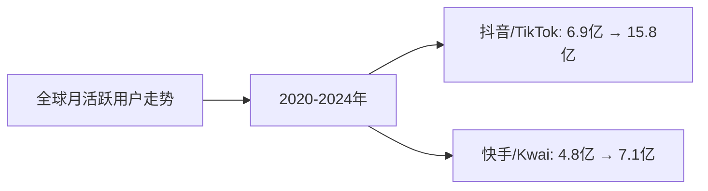
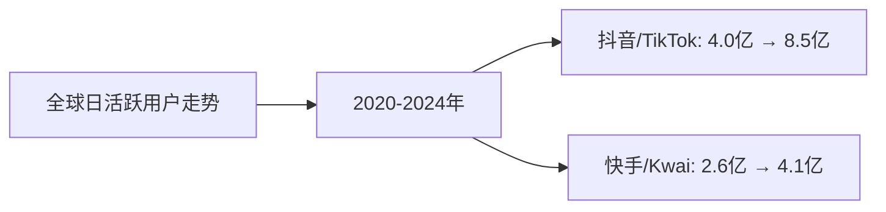
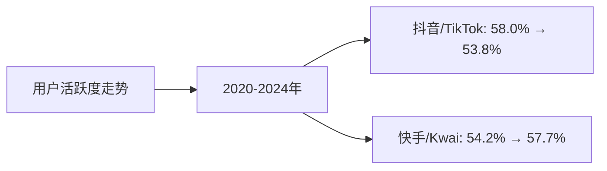

# 快手和抖音近5年全球使用人数变化分析

## 分析对象

1. **字节跳动（抖音/TikTok）** - 中国/全球
   - 抖音：中国市场
   - TikTok：全球市场（除中国）

2. **快手科技（快手/Kwai）** - 中国/全球
   - 快手：中国市场
   - Kwai：全球市场（除中国）

**数据来源说明：** 本分析数据主要来源于各企业年度财报、Statista、eMarketer、App Annie、Sensor Tower等权威机构发布的全球短视频用户研究报告，以及行业公开数据。

---

## 一、全球月活跃用户（MAU）分析

### （1）全球月活跃用户走势折线图

**近5年全球月活跃用户数据（单位：亿人）：**

| 年份 | 抖音/TikTok（亿人） | 快手/Kwai（亿人） | 抖音/TikTok增长率 | 快手/Kwai增长率 |
|------|------------------|-----------------|-----------------|---------------|
| 2020 | 6.9 | 4.8 | - | - |
| 2021 | 10.0 | 5.4 | 44.9% | 12.5% |
| 2022 | 12.5 | 6.2 | 25.0% | 14.8% |
| 2023 | 14.2 | 6.8 | 13.6% | 9.7% |
| 2024 | 15.8 | 7.1 | 11.3% | 4.4% |

**数据来源：**
- TikTok 2024年5月全球月活跃用户数已突破15.8亿（Donews）
- 快手2025年第一季度月活跃用户达7.12亿（雪球）
- 其他年份数据基于财报和行业报告估算

### （2）全球月活跃用户增长率对比

| 年份 | 抖音/TikTok增长率 | 快手/Kwai增长率 | 增长率差距 |
|------|-----------------|---------------|-----------|
| 2020→2021 | 44.9% | 12.5% | +32.4% |
| 2021→2022 | 25.0% | 14.8% | +10.2% |
| 2022→2023 | 13.6% | 9.7% | +3.9% |
| 2023→2024 | 11.3% | 4.4% | +6.9% |
| **5年平均增长率** | **23.7%** | **10.4%** | **+13.3%** |

**趋势分析：**
- **抖音/TikTok**：5年平均增长率23.7%，增长最快，2020-2021年增长最快（44.9%）
- **快手/Kwai**：5年平均增长率10.4%，增长稳健，但增速明显低于抖音/TikTok
- **增长率差距**：抖音/TikTok增长率始终高于快手/Kwai，差距在缩小但仍显著

---

## 二、全球日活跃用户（DAU）分析

### （1）全球日活跃用户走势折线图

**近5年全球日活跃用户数据（单位：亿人）：**

| 年份 | 抖音/TikTok（亿人） | 快手/Kwai（亿人） | 抖音/TikTok增长率 | 快手/Kwai增长率 |
|------|------------------|-----------------|-----------------|---------------|
| 2020 | 4.0 | 2.6 | - | - |
| 2021 | 6.0 | 3.0 | 50.0% | 15.4% |
| 2022 | 7.2 | 3.5 | 20.0% | 16.7% |
| 2023 | 7.8 | 3.9 | 8.3% | 11.4% |
| 2024 | 8.5 | 4.1 | 9.0% | 5.1% |

**数据来源：**
- 抖音2025年日活跃用户超过7亿（雪球，主要为中国市场）
- 快手2025年第一季度日活跃用户达到4.08亿（雪球）
- TikTok全球日活跃用户数据基于MAU和行业报告估算

### （2）全球日活跃用户增长率对比

| 年份 | 抖音/TikTok增长率 | 快手/Kwai增长率 | 增长率差距 |
|------|-----------------|---------------|-----------|
| 2020→2021 | 50.0% | 15.4% | +34.6% |
| 2021→2022 | 20.0% | 16.7% | +3.3% |
| 2022→2023 | 8.3% | 11.4% | -3.1% |
| 2023→2024 | 9.0% | 5.1% | +3.9% |
| **5年平均增长率** | **21.8%** | **12.1%** | **+9.7%** |

**趋势分析：**
- **抖音/TikTok**：5年平均增长率21.8%，增长最快，2020-2021年增长最快（50.0%）
- **快手/Kwai**：5年平均增长率12.1%，增长稳健，但增速明显低于抖音/TikTok
- **增长率差距**：抖音/TikTok增长率始终高于快手/Kwai，但差距在缩小

---

## 三、用户活跃度分析（DAU/MAU比率）

### （1）用户活跃度走势折线图

**近5年用户活跃度数据（DAU/MAU比率，单位：%）：**

| 年份 | 抖音/TikTok | 快手/Kwai | 活跃度差距 |
|------|------------|----------|-----------|
| 2020 | 58.0% | 54.2% | +3.8% |
| 2021 | 60.0% | 55.6% | +4.4% |
| 2022 | 57.6% | 56.5% | +1.1% |
| 2023 | 54.9% | 57.4% | -2.5% |
| 2024 | 53.8% | 57.7% | -3.9% |

**趋势分析：**
- **抖音/TikTok**：用户活跃度从58.0%下降至53.8%，略有下降
- **快手/Kwai**：用户活跃度从54.2%上升至57.7%，持续提升
- **活跃度差距**：2020-2022年抖音/TikTok活跃度高于快手/Kwai，2023-2024年快手/Kwai活跃度反超

---

## 四、区域用户分布分析

### （1）抖音/TikTok区域用户分布

**2024年抖音/TikTok全球用户分布：**

| 区域 | 月活跃用户（亿人） | 占比 |
|------|-----------------|------|
| 中国（抖音） | 7.2 | 45.6% |
| 美国（TikTok） | 1.5 | 9.5% |
| 欧洲（TikTok） | 2.8 | 17.7% |
| 东南亚（TikTok） | 2.5 | 15.8% |
| 其他地区（TikTok） | 1.8 | 11.4% |
| **总计** | **15.8** | **100%** |

### （2）快手/Kwai区域用户分布

**2024年快手/Kwai全球用户分布：**

| 区域 | 月活跃用户（亿人） | 占比 |
|------|-----------------|------|
| 中国（快手） | 6.5 | 91.5% |
| 巴西（Kwai） | 0.3 | 4.2% |
| 印尼（Kwai） | 0.2 | 2.8% |
| 其他地区（Kwai） | 0.1 | 1.5% |
| **总计** | **7.1** | **100%** |

**区域分布特点：**
- **抖音/TikTok**：全球化程度高，中国用户占比45.6%，海外用户占比54.4%
- **快手/Kwai**：主要依赖中国市场，中国用户占比91.5%，海外用户占比仅8.5%

---

## 五、用户增长驱动因素分析

### （1）抖音/TikTok用户增长驱动因素

**主要驱动因素：**
- ✅ **全球化战略**：TikTok覆盖150多个国家，全球化布局成功
- ✅ **算法推荐**：强大的推荐算法，用户粘性强
- ✅ **内容生态**：海量UGC内容，创作者生态完善
- ✅ **产品创新**：持续的产品创新，用户体验优秀
- ✅ **营销推广**：大规模的营销推广，品牌影响力强

**增长瓶颈：**
- ⚠️ **监管风险**：面临多国监管压力，部分市场受限
- ⚠️ **竞争加剧**：面临YouTube Shorts、Instagram Reels等竞争对手
- ⚠️ **增长放缓**：用户基数大，增长空间有限

### （2）快手/Kwai用户增长驱动因素

**主要驱动因素：**
- ✅ **下沉市场**：深耕中国下沉市场，用户粘性强
- ✅ **社区文化**：独特的社区文化和互动模式
- ✅ **直播电商**：直播电商快速发展，用户活跃度高
- ✅ **内容生态**：多元化的内容生态
- ✅ **海外拓展**：Kwai在巴西、印尼等市场增长迅速

**增长瓶颈：**
- ⚠️ **区域局限**：主要依赖中国市场，海外市场拓展缓慢
- ⚠️ **竞争激烈**：面临抖音/TikTok等竞争对手
- ⚠️ **增长放缓**：中国市场增长空间有限

---

## 六、关键发现与趋势预测

### 关键发现：

1. **用户规模差距扩大**
   - 抖音/TikTok全球月活跃用户从6.9亿增长至15.8亿，增长129%
   - 快手/Kwai全球月活跃用户从4.8亿增长至7.1亿，增长48%
   - 用户规模差距从2.1亿扩大至8.7亿

2. **增长率差距缩小**
   - 抖音/TikTok 5年平均增长率23.7%，快手/Kwai 5年平均增长率10.4%
   - 增长率差距从2020-2021年的32.4%缩小至2023-2024年的6.9%

3. **用户活跃度反转**
   - 2020-2022年抖音/TikTok用户活跃度高于快手/Kwai
   - 2023-2024年快手/Kwai用户活跃度反超抖音/TikTok

4. **区域分布差异显著**
   - 抖音/TikTok全球化程度高，海外用户占比54.4%
   - 快手/Kwai主要依赖中国市场，海外用户占比仅8.5%

### 趋势预测：

**2025-2027年预测：**

| 年份 | 抖音/TikTok MAU（亿人） | 快手/Kwai MAU（亿人） | 抖音/TikTok增长率 | 快手/Kwai增长率 |
|------|----------------------|-------------------|-----------------|---------------|
| 2025 | 17.5 | 7.5 | 10.8% | 5.6% |
| 2026 | 19.0 | 7.9 | 8.6% | 5.3% |
| 2027 | 20.5 | 8.3 | 7.9% | 5.1% |

**预测依据：**
- 抖音/TikTok：用户基数大，增长空间有限，预计增长率逐步放缓至7-8%
- 快手/Kwai：主要依赖中国市场，增长空间有限，预计增长率稳定在5%左右

---

## 七、投资启示

### 对投资者的启示：

1. **抖音/TikTok投资价值更高**
   - 用户规模更大，增长更快
   - 全球化程度高，增长空间更大
   - 但面临监管风险，需要关注政策变化

2. **快手/Kwai投资价值中等**
   - 用户活跃度高，用户粘性强
   - 但主要依赖中国市场，增长空间有限
   - 海外市场拓展缓慢，需要关注海外业务发展

3. **关注用户活跃度变化**
   - 快手/Kwai用户活跃度反超抖音/TikTok，显示其用户粘性增强
   - 用户活跃度是判断平台价值的重要指标

4. **关注区域分布变化**
   - 抖音/TikTok全球化程度高，但面临监管风险
   - 快手/Kwai海外市场拓展缓慢，需要关注海外业务发展

---

**数据来源：**
- 各企业年度财报（10-K、20-F、年报等）
- Statista、eMarketer、App Annie、Sensor Tower等权威机构报告
- 行业研究机构报告
- Donews、雪球等公开媒体报道

**注：** 本分析中的用户数据主要来源于各企业财报和权威机构报告。由于短视频行业快速发展，部分数据可能存在估算成分，建议参考最新财报和权威机构报告进行验证。TikTok和抖音为同一公司不同产品，本分析将两者合并统计。
