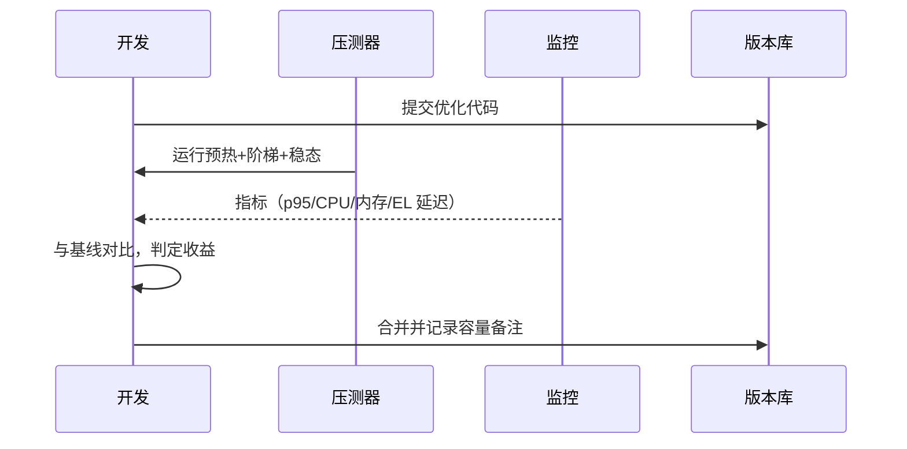

# Node 项目性能分析与压测指南（通用）

本文提供一套可落地的方法论：如何系统化定位 Node 应用的 CPU、内存、事件循环与 I/O 瓶颈，并配套标准化压测场景与工具清单，支持日常排障与上线前容量评估。

## 一、先定目标与基线
- **SLO/指标**：
  - 延迟：p50/p95/p99，最大可接受尾延迟
  - 吞吐：RPS、带宽
  - 稳定性：错误率、超时率、可用性
  - 资源：CPU、内存、事件循环延迟、GC 时间占比
- **基线**：记录当前版本在固定数据集与场景下的指标，作为回归对照。

## 二、性能定位方法论（总览）


### 2.1 接入可观测性（必备）
- 日志：结构化日志，带 traceId；关键路径埋点耗时
- 指标：
  - 响应时间直方图（p50/p95/p99）
  - `process.cpuUsage`、`process.memoryUsage`、GC 次数与耗时
  - 事件循环延迟 `perf_hooks.monitorEventLoopDelay()`
- Tracing：OpenTelemetry（HTTP/DB/外部服务链路）

### 2.2 快速判断问题类型
- CPU 高：进程 CPU 占满、尾延迟上升、事件循环延迟变大
- 内存高/泄漏：RSS/Heap 持续上升、GC 频繁或 Full GC 时间长
- I/O 慢：DB/缓存/外部 API RT 升高、等待时间占比大
- 事件循环阻塞：`monitorEventLoopDelay` 飙升、吞吐骤降

## 三、CPU 性能分析
- DevTools 采样分析：
  - `node --inspect index.js` → Chrome DevTools Performance → 采样 CPU
- Clinic.js Flame：
  - `npx clinic flame -- node server.js`
  - 生成火焰图，可直观看到热点函数
- 低开销采样（Linux）：
  - `0x server.js` 生成火焰图
  - `perf` + `0x`/`speedscope`
- V8 分析：`--cpu-prof` 生成 `.cpuprofile`，用 DevTools 打开
- 常见 CPU 瓶颈：
  - 大对象 JSON 序列化/反序列化
  - 重度同步计算（加密、压缩、图像/视频处理）
  - 低效正则、热路径上的 `await` 串行
  - 热点循环中的隐式类型转换/创建过多临时对象

## 四、内存与泄漏分析
- Heap 快照（DevTools）：
  - `node --inspect` → Memory → Take heap snapshot → 对比多次快照
- Heap Profiler：`--heap-prof`，结合 speedscope/DevTools
- Clinic.js Heapprof：`npx clinic heapprof -- node server.js`
- 观察 RSS/Heap：`process.memoryUsage()` 指标上报
- 常见泄漏模式：
  - 全局缓存/LRU 不收敛；Map/Set 未清理
  - 事件监听未移除；长生命周期闭包引用大对象
  - 请求级缓存写成进程级；重复定时器/Interval 未清理
- GC 相关：
  - `--max-old-space-size=...` 调整可用堆
  - 关注 GC Stop-The-World 时间与频率

## 五、事件循环与异步瓶颈
- 事件循环延迟：
  - `const { monitorEventLoopDelay } = require('perf_hooks')`
  - 将平均/最大延迟上报到指标
- 异步拓扑分析：Clinic.js Bubbleprof → 找出过度串行化/错误并发模型
- 避免阻塞：
  - 将重 CPU 任务移到 `worker_threads` 或外部服务
  - 使用流/背压（stream & pipeline），避免一次性读写大块

## 六、I/O 与数据存取
- 数据库：建立慢查询日志与可视化；索引/查询计划；批量与分页
- 缓存：热点读写命中率、穿透/击穿保护；合理 TTL 与键空间设计
- 外部服务：超时/重试/熔断/限流；连接池参数校准

## 七、优化策略目录（按性价比排序）
1) 快速 wins：缓存、分页、懒加载、压缩、Keep-Alive、HTTP/2、Gzip/Brotli
2) 并发与批量：Promise.allSettled、批量接口、流式处理
3) 数据结构：避免重复 JSON.parse/stringify；复用 Buffer；对象池
4) 计算下沉：worker_threads/子进程/原生扩展/服务拆分
5) 代码热路径：移除不必要的日志/校验；预编译正则；减少闭包捕获

## 八、压测方法与场景设计

### 8.1 压测工具
- Autocannon（Node 原生、轻量）
- k6（脚本化、云/本地均可）
- wrk / wrk2（高性能 C 工具）
- Artillery（场景化/到处 JSON/YAML）

### 8.2 标准场景
- 预热：稳定连接与 JIT
- 阶梯上升（Ramp-up）：容量曲线与拐点
- 峰值冲击（Spike）：突发抗压
- 稳态耐久（Soak）：内存泄漏/句柄泄漏暴露
- 回归对比：新旧版本同场景指标对照

### 8.3 关键指标
- 延迟：p50/p95/p99、最大
- 吞吐：RPS、成功率
- 稳定性：错误率、超时率、断言失败
- 资源：CPU、RSS/Heap、GC 时间、事件循环延迟、FD/句柄数量

### 8.4 示例命令
Autocannon：
```bash
npx autocannon -c 200 -p 10 -d 60 --latency http://localhost:3000/api/foo
# -c 并发连接，-p 每连接管道并行度，-d 持续时间
```

k6：`load.js`
```javascript
import http from 'k6/http';
import { check, sleep } from 'k6';
export const options = {
  thresholds: { http_req_duration: ['p(95)<300'] },
  stages: [
    { duration: '1m', target: 100 },
    { duration: '3m', target: 300 },
    { duration: '1m', target: 0 },
  ],
};
export default function () {
  const res = http.get('http://localhost:3000/api/foo');
  check(res, { 'status is 200': (r) => r.status === 200 });
  sleep(1);
}
```
运行：
```bash
k6 run load.js
```

wrk：
```bash
wrk -t8 -c256 -d60s --latency http://localhost:3000/api/foo
```

Artillery（`scenario.yml`）：
```yaml
config:
  target: "http://localhost:3000"
  phases:
    - duration: 60
      arrivalRate: 100
scenarios:
  - flow:
      - get:
          url: "/api/foo"
```
运行：
```bash
npx artillery run scenario.yml
```

## 九、测试规范与隔离
- 预热 1–3 分钟再记指标；固定测试数据与版本
- 单机 vs 分布式压测工具隔离；不要在业务机器上自压自己
- 观察端与被测端时间同步（NTP），避免时钟漂移
- 记录资源限制与环境信息（CPU/内存/内核参数/Node 版本）

## 十、在代码中埋点关键指标（示例）
事件循环延迟：
```javascript
const { monitorEventLoopDelay } = require('perf_hooks');
const h = monitorEventLoopDelay({ resolution: 20 });
h.enable();
setInterval(() => {
  const p95 = h.percentile(95) / 1e6; // ms
  // 上报到指标系统
}, 10000);
```

路由耗时直方图（伪代码）：
```javascript
const histogram = new Histogram(['route']);
app.use(async (req, res, next) => {
  const start = process.hrtime.bigint();
  res.on('finish', () => {
    const durMs = Number(process.hrtime.bigint() - start) / 1e6;
    histogram.observe(durMs, { route: req.path });
  });
  next();
});
```

## 十一、优化闭环（压测回归）


---

速查清单
- 先基线，后优化；所有变更必须回归对比
- CPU 用 Flame/DevTools；内存用 Heap；异步用 Bubbleprof
- 指标四件套：延迟直方图、CPU、内存、事件循环延迟
- 压测四件套：预热、阶梯、峰值、稳态

