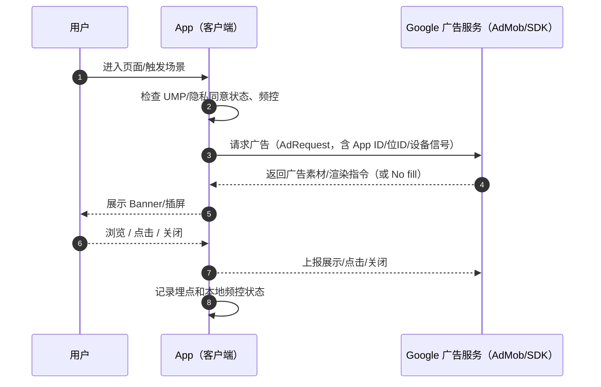
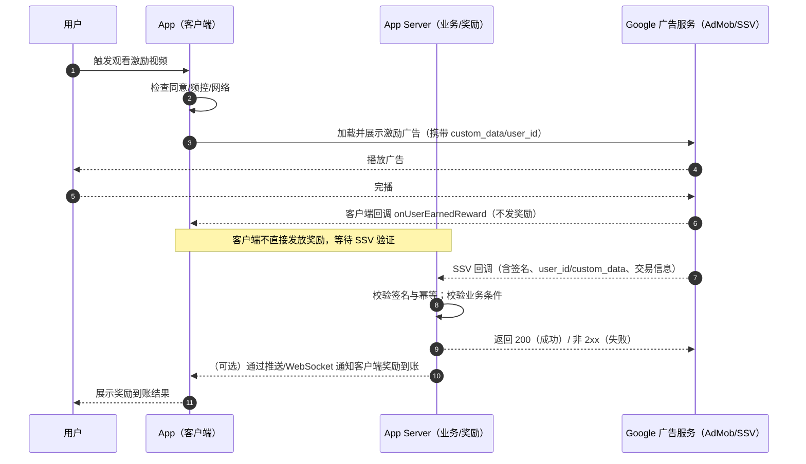
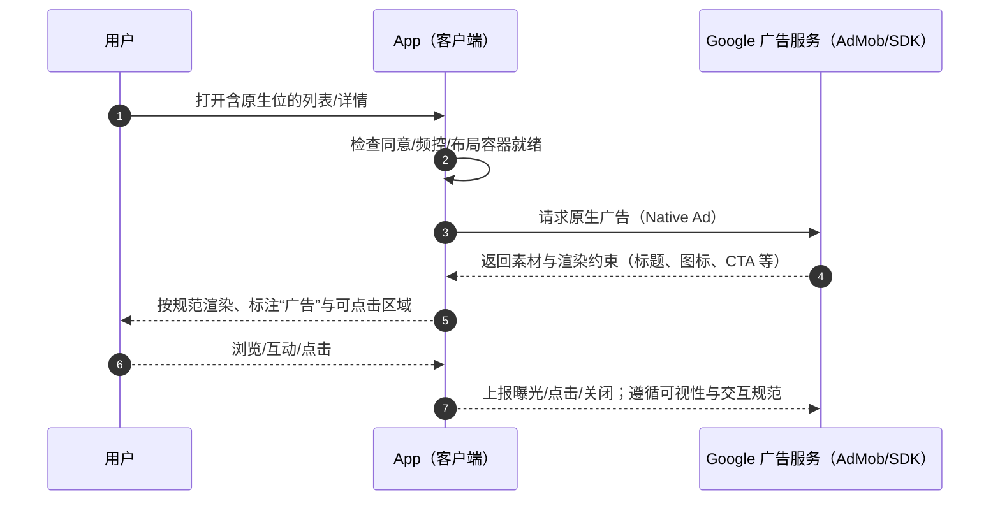

## App 接入 Google 广告系统（AdMob/Ad Manager）完整流程

> 目标：为 iOS/Android App 完成从账号、合规、SDK 集成到测试与上线的全流程落地。以下以 Google AdMob 为主（多数独立应用场景），如你使用 Google Ad Manager，除控制台配置差异外，SDK 集成与合规步骤基本一致。

---

### 0. 前置条件与角色分工
- **账号**：Google 账号（访问 AdMob/Ad Manager）、开发者账号（上架用）。
- **应用**：iOS 包名（Bundle ID）、Android 包名（ApplicationId）。
- **隐私**：隐私政策页 URL、数据使用说明（商店页与应用内）。
- **分工**：
  - 开发：SDK 集成、事件上报、调试与埋点。
  - 产品/合规：同意弹窗文案、政策合规自检。
  - 变现/运营：广告位策略、底价策略、频控与版本灰度。

---

### 1. 控制台创建应用与广告位
1) 登录 [AdMob 控制台](https://apps.admob.com)（或 Google Ad Manager）。
2) 添加 App：输入 iOS Bundle ID / Android 包名（保持与上架一致）。
3) 获取并记录：
   - AdMob App ID（iOS/Android 各一）
   - 广告单元 ID（Banner/Interstitial/Rewarded/Native 等）
4) 若有多渠道变现场景，提前规划广告位命名规范（平台_页面_位置_形态_序号）。

---

### 2. 合规与隐私（上线必备）
- **Google UMP（用户消息平台）同意**：
  - 针对欧盟/英国等地区展示 GDPR 同意对话框；
  - 对儿童/青少年内容需遵从家庭/儿童政策；
  - 加载广告前应先处理同意状态。
- **COPPA/儿童隐私**：面向儿童的应用需在控制台打标，SDK 请求需设置面向儿童参数。
- **ATT（iOS 14+）**：如需访问 IDFA，用 `AppTrackingTransparency` 请求授权，注意弹窗时机与合规文案。
- **隐私政策**：
  - 在应用内“设置/关于”能访问；
  - 商店介绍页提供链接；
  - 说明广告与数据使用场景。
- **数据删除/数据导出**：提供用户请求通道（邮箱/表单）。

---

### 2A. 认证与授权（账号、API、域名、权限）

#### 2A.1 账号与付款资料认证
- 在 AdMob/Ad Manager 控制台完成以下验证：
  - 付款资料（公司/个人信息、税务、收款方式）；
  - 地址 PIN 验证（邮寄明信片，收达后在控制台输入 PIN）；
  - 如需开票/税务合规，按照当地法规补齐材料；
  - 账号状态需为“良好/可投放”，避免被政策限制。

#### 2A.2 应用归属与商店一致性
- 包名/Bundle ID 必须与 Play Console / App Store Connect 上架一致；
- 儿童/家庭相关应用需在各控制台正确标注；
- 建议在商店页与应用内呈现同一隐私政策 URL，确保可访问性。

#### 2A.3 域名与 app-ads.txt 所有权
- 若你在站外或自有域名上分发内容并承接流量，需配置 `app-ads.txt`：
  - 将 `app-ads.txt` 放置在根域：`https://yourdomain.com/app-ads.txt`；
  - 添加 AdMob/Ad Manager 官方行（示例）：
    - `google.com, pub-xxxxxxxxxxxxxxxx, DIRECT, f08c47fec0942fa0`
  - 在 AdMob 控制台“app-ads.txt”页验证状态，修正警告直至通过；
  - 建议在 Search Console 验证域名所有权，便于运维管理。

#### 2A.4 报表与服务端集成的 API 授权
- AdMob API（报表/收益自动化）：
  - 在 Google Cloud Console 创建项目并启用“AdMob API”；
  - 创建 OAuth 2.0 客户端（Web/桌面应用），使用用户授权流（AdMob API 不支持服务账号）；
  - 申请范围（Scopes）：
    - 只读：`https://www.googleapis.com/auth/admob.readonly`
    - 报表：`https://www.googleapis.com/auth/admob.report`
  - 通过 OAuth 获取 `refresh_token`，服务端用 `client_id`/`client_secret` 定期换取 `access_token` 拉取报表；
  - API 文档参考：`https://developers.google.com/admob/api`。
- Google Ad Manager API（如使用 GAM 变现）：
  - 启用 Ad Manager API，可使用服务账号或 OAuth；
  - 为服务账号在 GAM 中授予角色（如 Network Admin/Report）并绑定网络代码；
  - 使用官方客户端库生成报表/管理库存（注意配额与速率限制）。
- GA4（Google Analytics）关联：
  - 在 AdMob 控制台关联 GA4 属性，或在 GA4 中关联 AdMob；
  - 授权后可在 GA4 维度中分析广告变现与漏斗表现；
  - 确保团队成员在两侧属性中有相应读写权限。

#### 2A.5 平台权限与授权弹窗
- iOS（IDFA/ATT）：
  - 若需访问 IDFA，在 `Info.plist` 添加用途说明，并在合适时机请求授权：
  ```xml
  <key>NSUserTrackingUsageDescription</key>
  <string>我们使用设备标识符用于个性化广告与效果统计。</string>
  ```
  - 使用 `ATTrackingManager.requestTrackingAuthorization` 触发 ATT 弹窗；
  - 未授权时默认无法读取 IDFA，应确保广告请求逻辑在 UMP/ATT 流程后执行。
- Android（Advertising ID）：
  - Android 13+ 无需声明权限即可访问 Ads ID，但建议兼容旧版：
  ```xml
  <uses-permission android:name="com.google.android.gms.permission.AD_ID" />
  ```
  - 在 Play Console “数据安全”中准确申报数据用途；
  - 若用户选择“限制广告个性化”，SDK 会自动遵循 `limit ad tracking` 设置。

---

### 3. Android 集成

#### 3.1 依赖与初始化
1) `project/build.gradle` 与 `settings.gradle` 使用最新 AGP 与 Google Maven 仓库。
2) `app/build.gradle` 添加：
```gradle
dependencies {
    implementation 'com.google.android.gms:play-services-ads:23.3.0'
    implementation 'com.google.android.ump:user-messaging-platform:3.0.0'
}
```
3) 在 `AndroidManifest.xml` 声明 AdMob App ID：
```xml
<application>
    <meta-data
        android:name="com.google.android.gms.ads.APPLICATION_ID"
        android:value="ca-app-pub-xxxxxxxx~yyyyyyyy" />
</application>
```
4) 应用启动时初始化：
```kotlin
MobileAds.initialize(this) { }
```

#### 3.2 UMP 同意（GDPR）
```kotlin
val params = ConsentRequestParameters.Builder()
    .setTagForUnderAgeOfConsent(false)
    .build()

val consentInformation = UserMessagingPlatform.getConsentInformation(this)
consentInformation.requestConsentInfoUpdate(
    this,
    params,
    { // success
        UserMessagingPlatform.loadAndShowConsentFormIfRequired(this) { loadError ->
            // 可记录 loadError
        }
    },
    { requestError ->
        // 记录错误，不阻断流程
    }
)
```
在加载广告前检查 `consentInformation.canRequestAds()` 再进行拉取。

#### 3.3 常用广告加载示例
- Banner：
```kotlin
val adView = AdView(this)
adView.adUnitId = "ca-app-pub-xxx/zzz"
adView.setAdSize(AdSize.BANNER)
adView.loadAd(AdRequest.Builder().build())
```
- 插屏：
```kotlin
InterstitialAd.load(
    this,
    "ca-app-pub-xxx/zzz",
    AdRequest.Builder().build(),
    object : InterstitialAdLoadCallback() {
        override fun onAdLoaded(ad: InterstitialAd) {
            ad.show(this@MainActivity)
        }
    }
)
```
- 激励视频：
```kotlin
RewardedAd.load(
    this,
    "ca-app-pub-xxx/zzz",
    AdRequest.Builder().build(),
    object : RewardedAdLoadCallback() {
        override fun onAdLoaded(ad: RewardedAd) {
            ad.show(this@MainActivity) { rewardItem ->
                // 结算奖励 rewardItem.amount
            }
        }
    }
)
```

#### 3.4 调试与测试 ID
- 开发阶段务必使用测试广告位或添加测试设备：
```kotlin
val requestConfiguration = RequestConfiguration.Builder()
    .setTestDeviceIds(listOf("TEST_DEVICE_ID"))
    .build()
MobileAds.setRequestConfiguration(requestConfiguration)
```
- 官方测试广告位：
  - Banner：`ca-app-pub-3940256099942544/6300978111`
  - 插屏：`ca-app-pub-3940256099942544/1033173712`
  - 激励视频：`ca-app-pub-3940256099942544/5224354917`
  - 原生：`ca-app-pub-3940256099942544/2247696110`

---

### 4. iOS 集成

#### 4.1 依赖与初始化
- 使用 CocoaPods：
```ruby
pod 'Google-Mobile-Ads-SDK'
pod 'GoogleUserMessagingPlatform'
```
- 或 Swift Package Manager：添加 `https://github.com/googleads/swift-package-manager-google-mobile-ads`
- 在 `Info.plist` 添加：
```xml
<key>GADApplicationIdentifier</key>
<string>ca-app-pub-xxxxxxxx~yyyyyyyy</string>
```
- 可选：添加 `SKAdNetworkItems`（提升归因覆盖，参考官方文档定期更新名单）。
- App 启动初始化：
```swift
import GoogleMobileAds

GADMobileAds.sharedInstance().start(completionHandler: nil)
```

#### 4.2 UMP 同意（GDPR）
```swift
let parameters = UMPRequestParameters()
parameters.tagForUnderAgeOfConsent = false

UMPConsentInformation.sharedInstance.requestConsentInfoUpdate(with: parameters) { error in
  guard error == nil else { return }
  UMPConsentForm.load { form, loadError in
    guard loadError == nil else { return }
    if UMPConsentInformation.sharedInstance.formStatus == .available {
      form?.present(from: self) { _ in
        // 依状态决定是否可请求广告
      }
    }
  }
}
```
加载广告前检查 `UMPConsentInformation.sharedInstance.canRequestAds`。

#### 4.3 常用广告加载示例
- Banner：
```swift
let banner = GADBannerView(adSize: GADAdSizeBanner)
banner.adUnitID = "ca-app-pub-xxx/zzz"
banner.rootViewController = self
banner.load(GADRequest())
```
- 插屏：
```swift
GADInterstitialAd.load(withAdUnitID: "ca-app-pub-xxx/zzz", request: GADRequest()) { ad, error in
  guard let ad = ad, error == nil else { return }
  ad.present(fromRootViewController: self)
}
```
- 激励视频：
```swift
GADRewardedAd.load(withAdUnitID: "ca-app-pub-xxx/zzz", request: GADRequest()) { ad, error in
  guard let ad = ad, error == nil else { return }
  ad.present(fromRootViewController: self) {
    let reward = ad.adReward
    // 发放奖励 reward.amount
  }
}
```

#### 4.4 测试广告位（iOS 通用）
- 与 Android 相同：
  - Banner：`ca-app-pub-3940256099942544/2934735716`
  - 插屏：`ca-app-pub-3940256099942544/4411468910`
  - 激励视频：`ca-app-pub-3940256099942544/1712485313`
  - 原生：`ca-app-pub-3940256099942544/3986624511`

---

### 5. 频控、场景与产品策略
- 控制展示节奏：同一位置插屏/激励设定冷却时间与触发条件；
- 首次启动与关键路径（注册、付费、任务关键步骤）避免强打扰；
- A/B 测试不同广告位密度、形态组合；
- 新用户冷启动期降低广告强度（配合留存策略）。

---

### 6. Mediation 与 Bidding（可选进阶）
- 若需多平台变现，可接入 AdMob Mediation：
  - 在 AdMob 控制台为每个广告单元配置第三方网络与 eCPM；
  - App 侧添加相应适配器与网络 SDK；
  - 推荐使用开放竞价（bidding）以减少瀑布管理成本。
- 常见第三方：Meta Audience Network、AppLovin、Unity Ads、Pangle、IronSource 等。

---

### 7. 常见问题与排查
- 未展示广告：
  - 检查同意状态与是否在可请求广告地区；
  - 确认使用测试广告位或测试设备；
  - 确认网络与设备时间正确，VPN 可能影响填充；
  - 控制台新建广告单元生效可能需数小时。
- 频繁 `No fill`：
  - 流量规模小/定向严格；
  - 调整瀑布 eCPM/开启竞价；
  - 提高可视性，优化位置信噪比。
- 崩溃/编译错误：
  - 版本不兼容，升级到最新 SDK；
  - 清理缓存/Pods/Gradle 重建。
- 审核拒绝：
  - 检查隐私政策链接、同意弹窗、误触诱导布局；
  - 儿童内容与用户生成内容（UGC）政策特别严格。

---

### 8. 上线自检清单（必看）
- 合规
  - 已集成 UMP 并在欧盟地区弹窗；
  - iOS 如使用 IDFA，已展示 ATT；
  - 应用与商店页提供隐私政策链接；
  - 如涉及儿童，已在控制台正确标注与代码设置。
- 功能
  - 初始化与广告请求仅在同意后进行；
  - 使用真实广告位 ID（发布前移除测试配置）；
  - 频控/节流逻辑生效且无打断核心流程；
  - 激励奖励结算有防重入与异常回滚。
- 监控
  - 埋点：请求、展示、点击、奖励发放、关闭原因；
  - Crash 与 ANR 监控；
  - 版本灰度与快速回滚预案。

---

### 9. 时间计划建议
- D1：控制台与隐私准备；
- D2-D3：Android 集成 + UMP；
- D3-D4：iOS 集成 + UMP；
- D5：联调测试、A/B 配置、埋点校验；
- D6：小流量灰度与指标观测；
- D7：全量发布与持续优化。

---

### 10. 参考与链接
- 官方文档（请按平台版本选择最新）：
  - AdMob Android：`https://developers.google.com/admob/android/quick-start`
  - AdMob iOS：`https://developers.google.com/admob/ios/quick-start`
  - UMP：`https://developers.google.com/admob/ump`
  - 测试广告：`https://developers.google.com/admob/android/test-ads` / `https://developers.google.com/admob/ios/test-ads`
- 政策：
  - Google Play 用户数据政策、广告与变现政策；
  - App Store 隐私营养标签与 ATT 指南。

---

### 11. 附录：常用占位代码片段

#### Android Manifest 片段
```xml
<manifest>
  <application>
    <meta-data
      android:name="com.google.android.gms.ads.APPLICATION_ID"
      android:value="ca-app-pub-xxxxxxxx~yyyyyyyy" />
  </application>
</manifest>
```

#### iOS Info.plist 片段
```xml
<key>GADApplicationIdentifier</key>
<string>ca-app-pub-xxxxxxxx~yyyyyyyy</string>
```

---

### 12. 广告交互时序图（用户 - App - App Server - Google）

#### 12.1 Banner / 插屏（客户端直连）


要点：
- 该流程不依赖 App Server；
- 合规前置（同意/ATT）决定是否可请求广告；
- 频控与策略在 App 内实现（或通过远程配置）。

#### 12.2 激励广告（含服务端回调 SSV）


要点：
- 奖励必须以服务端 SSV 为准，并做幂等；
- 自定义字段应绑定用户/会话，防重放；
- 失败时不发奖并记录风控日志。

#### 12.3 原生广告（客户端渲染）


要点：
- 严格遵循原生广告渲染规范与可点击区域约束；
- 与内容混排时，保持清晰的“广告”标识与防误触距离；
- 列表复用需注意回收与释放，避免内存泄漏与误上报。

---

附：如需 Mediation/Bidding 时序，可在上述基础上在 App 与 Google 之间增加“聚合层/竞价请求-响应”往返；在客户端仍保持一次 `load/show` 的抽象。

—— 完 ——


