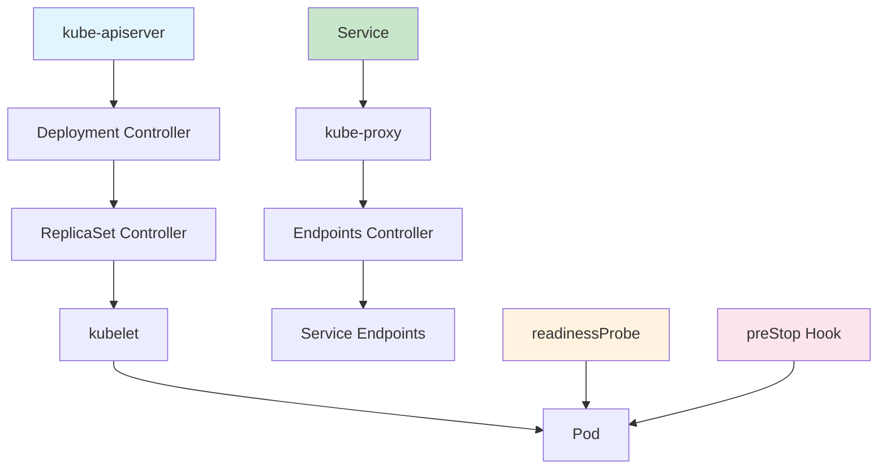
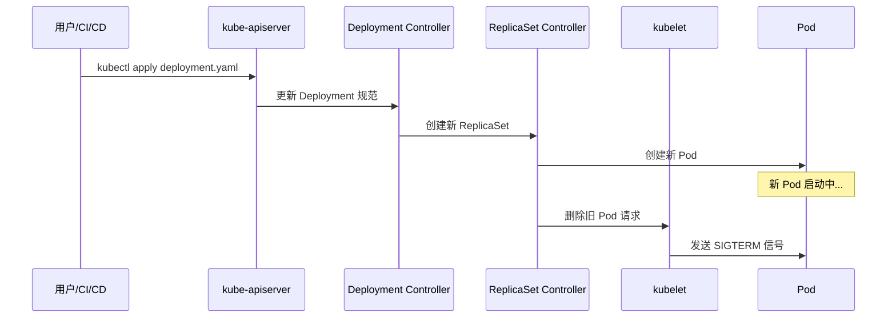
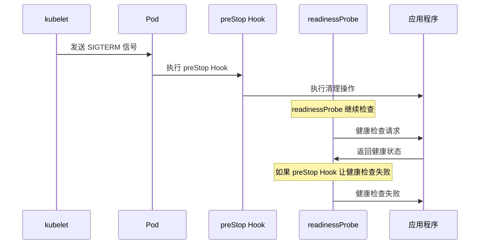
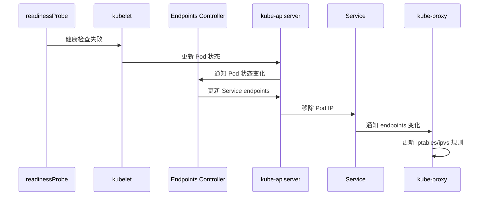
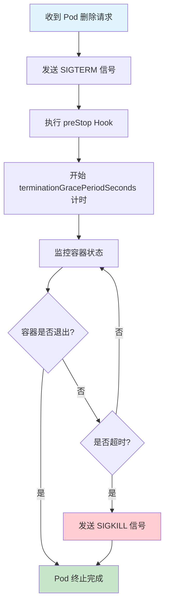
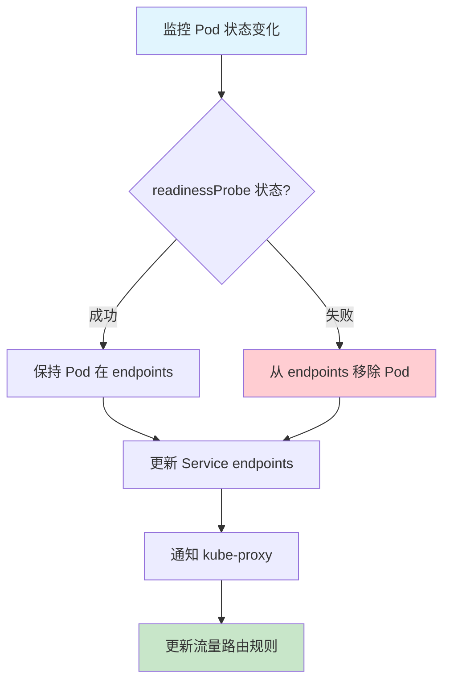
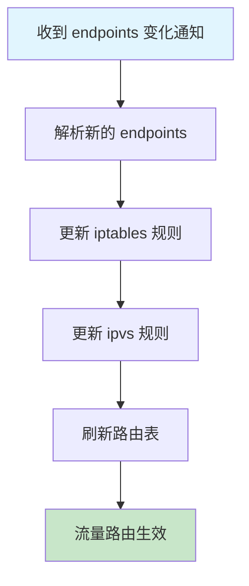
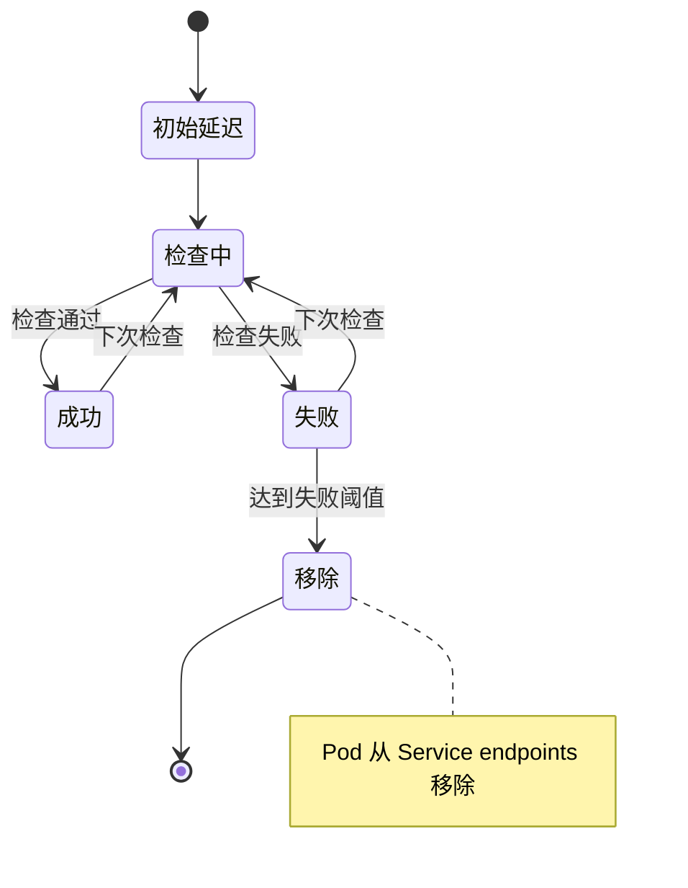
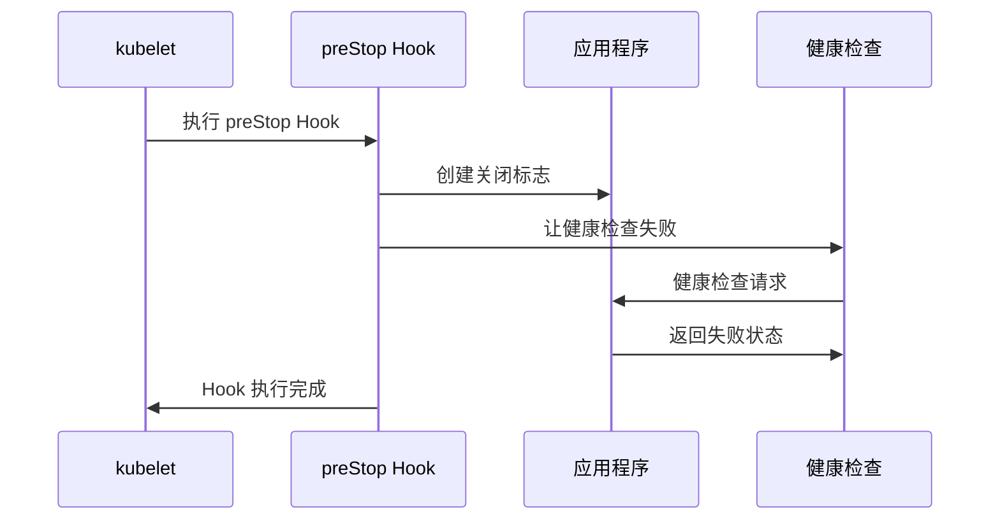

# Kubernetes Pod 从 Service Endpoints 移除的完整过程详解

## 概述

当 Kubernetes Pod 需要被删除时，从 Service endpoints 中移除 Pod 是一个关键步骤，它确保流量不再路由到正在关闭的 Pod。理解这个过程对于实现零停机部署和避免请求失败至关重要。

## 核心组件和职责

### 1. 主要组件



### 2. 组件职责

| 组件 | 职责 |
|------|------|
| **kube-apiserver** | 接收 Pod 删除请求，更新 etcd |
| **Deployment Controller** | 管理滚动更新，决定删除哪些 Pod |
| **ReplicaSet Controller** | 执行 Pod 的创建和删除 |
| **kubelet** | 在节点上管理 Pod 生命周期 |
| **Endpoints Controller** | 监控 Pod 状态，更新 Service endpoints |
| **kube-proxy** | 更新 iptables/ipvs 规则，控制流量路由 |
| **readinessProbe** | 检查 Pod 是否准备好接收流量 |
| **preStop Hook** | 在 Pod 终止前执行清理操作 |

## 完整移除流程

### 1. 触发阶段



### 2. Pod 终止阶段



### 3. Endpoints 更新阶段



## 详细时间轴分析

### 1. 正常移除流程

```mermaid
gantt
    title Pod 从 Service Endpoints 移除时间轴
    dateFormat X
    axisFormat %s
    
    section 信号发送
    SIGTERM 发送    :0, 1
    
    section preStop Hook
    Hook 执行       :1, 5
    
    section 健康检查
    第1次检查       :5, 6
    第2次检查       :10, 11
    第3次检查       :15, 16
    检查失败        :16, 17
    
    section Endpoints 更新
    状态更新        :17, 18
    规则更新        :18, 20
    
    section 应用关闭
    优雅关闭        :20, 45
    
    section 强制终止
    SIGKILL 发送    :60, 61
```



### 2. 关键时间点

| 时间点 | 事件 | 说明 |
|--------|------|------|
| **T+0s** | SIGTERM 发送 | kubelet 向容器发送终止信号 |
| **T+1s** | preStop Hook 开始 | 执行预停止钩子 |
| **T+5s** | preStop Hook 完成 | 钩子执行完毕 |
| **T+5s** | readinessProbe 检查 | 开始健康检查 |
| **T+10s** | readinessProbe 检查 | 第二次健康检查 |
| **T+15s** | readinessProbe 失败 | 健康检查开始失败 |
| **T+17s** | 从 endpoints 移除 | Pod 从 Service 移除 |
| **T+20s** | 流量停止 | 不再接收新请求 |
| **T+45s** | 应用关闭完成 | 优雅关闭完成 |
| **T+60s** | Pod 终止 | 容器完全停止 |

## 各组件详细工作流程

### 1. kubelet 的工作流程



### 2. Endpoints Controller 的工作流程



### 3. kube-proxy 的工作流程



## readinessProbe 的关键作用

### 1. readinessProbe 配置

```yaml
readinessProbe:
  httpGet:
    path: /actuator/health
    port: 8080
  periodSeconds: 5        # 检查间隔
  timeoutSeconds: 3       # 超时时间
  failureThreshold: 2     # 失败阈值
  successThreshold: 1     # 成功阈值
  initialDelaySeconds: 10 # 初始延迟
```

### 2. readinessProbe 状态转换



### 3. 失败阈值的影响

| 配置 | 移除时间 | 说明 |
|------|----------|------|
| `failureThreshold: 1` | 5秒 | 1次失败就移除 |
| `failureThreshold: 2` | 10秒 | 2次失败才移除 |
| `failureThreshold: 3` | 15秒 | 3次失败才移除 |

## preStop Hook 的作用

### 1. preStop Hook 配置

```yaml
lifecycle:
  preStop:
    exec:
      command: ["/bin/sh", "-c", "echo 'Starting graceful shutdown...'; touch /tmp/shutdown-flag; sleep 10; echo 'Shutdown flag created'"]
```

### 2. preStop Hook 执行流程



### 3. preStop Hook 最佳实践

```yaml
# 方案1：使用文件标志
lifecycle:
  preStop:
    exec:
      command: ["/bin/sh", "-c", "touch /tmp/shutdown-flag; sleep 5"]

# 方案2：调用应用接口
lifecycle:
  preStop:
    exec:
      command: ["/bin/sh", "-c", "curl -X POST http://localhost:8080/actuator/health/readiness/down || true; sleep 5"]

# 方案3：简单延迟
lifecycle:
  preStop:
    exec:
      command: ["/bin/sh", "-c", "sleep 10"]
```

## 实际案例分析

### 案例1：正常移除流程

```
时间轴：
16:12:12 - SIGTERM 发送
16:12:12 - preStop Hook 执行
16:12:17 - preStop Hook 完成
16:12:17 - readinessProbe 开始失败
16:12:22 - 达到失败阈值
16:12:22 - 从 Service endpoints 移除
16:12:25 - 流量停止
16:12:45 - 应用优雅关闭完成
16:13:12 - Pod 终止
```

### 案例2：您遇到的问题

```
时间轴：
16:12:12 - SIGTERM 发送
16:12:12 - preStop Hook 执行（如果没有配置）
16:12:17 - readinessProbe 检查（仍然成功）
16:12:22 - readinessProbe 检查（仍然成功）
16:12:27 - readinessProbe 检查（仍然成功）
16:13:12 - 仍有请求到达（问题发生）
16:13:13 - Pod 被删除
```

**问题分析：**
- readinessProbe 一直没有失败
- Pod 没有从 Service endpoints 移除
- 流量仍然路由到正在关闭的 Pod

### 案例3：超时强制终止

```
时间轴：
16:12:12 - SIGTERM 发送
16:12:12 - preStop Hook 执行
16:12:17 - preStop Hook 完成
16:12:17 - readinessProbe 开始失败
16:12:22 - 从 Service endpoints 移除
16:12:25 - 流量停止
16:13:12 - 应用仍在运行
16:13:12 - 发送 SIGKILL
16:13:12 - Pod 强制终止
```

## 常见问题和解决方案

### 1. Pod 卡在 Terminating 状态

**原因：**
- terminationGracePeriodSeconds 设置过长
- 应用没有响应 SIGTERM 信号
- preStop Hook 执行时间过长

**解决方案：**
```yaml
spec:
  terminationGracePeriodSeconds: 30  # 适当减少时间
  containers:
  - name: app
    lifecycle:
      preStop:
        exec:
          command: ["/bin/sh", "-c", "sleep 5"]  # 简化 preStop Hook
```

### 2. 请求仍在访问已终止的 Pod

**原因：**
- readinessProbe 配置不当
- preStop Hook 没有让健康检查失败
- Service endpoints 更新延迟

**解决方案：**
```yaml
readinessProbe:
  httpGet:
    path: /actuator/health
    port: 8080
  periodSeconds: 2      # 更频繁的检查
  timeoutSeconds: 1     # 更短的超时时间
  failureThreshold: 1   # 1次失败就移除

lifecycle:
  preStop:
    exec:
      command: ["/bin/sh", "-c", "touch /tmp/shutdown-flag; sleep 5"]
```

### 3. 应用数据丢失

**原因：**
- 优雅关闭时间不足
- 应用没有正确处理 SIGTERM 信号
- 没有等待现有请求完成

**解决方案：**
```yaml
spec:
  terminationGracePeriodSeconds: 60  # 增加关闭时间
  containers:
  - name: app
    lifecycle:
      preStop:
        exec:
          command: ["/bin/sh", "-c", "sleep 10"]  # 给应用更多时间
```

## 最佳实践

### 1. 完整的 Pod 配置

```yaml
apiVersion: apps/v1
kind: Deployment
metadata:
  name: capricornus
spec:
  replicas: 1
  selector:
    matchLabels:
      app: capricornus
  template:
    metadata:
      labels:
        app: capricornus
    spec:
      terminationGracePeriodSeconds: 60
      containers:
      - name: capricornus
        image: capricornus:latest
        ports:
        - containerPort: 7081
        lifecycle:
          preStop:
            exec:
              command: ["/bin/sh", "-c", "echo 'Starting graceful shutdown...'; touch /tmp/shutdown-flag; sleep 10; echo 'Shutdown flag created'"]
        readinessProbe:
          httpGet:
            path: /actuator/health
            port: 7081
          periodSeconds: 2
          timeoutSeconds: 1
          failureThreshold: 1
          initialDelaySeconds: 10
        livenessProbe:
          httpGet:
            path: /actuator/health
            port: 7081
          periodSeconds: 10
          timeoutSeconds: 3
          failureThreshold: 3
          initialDelaySeconds: 30
```

### 2. Spring Boot 应用配置

```yaml
# application.yml
server:
  shutdown: graceful

spring:
  lifecycle:
    timeout-per-shutdown-phase: 45s

management:
  endpoints:
    web:
      exposure:
        include: health,shutdown
  endpoint:
    health:
      show-details: always
  health:
    readiness-state:
      enabled: true
    liveness-state:
      enabled: true
```

### 3. 应用代码实现

```java
@Component
public class ShutdownHealthIndicator implements HealthIndicator {
    
    @Override
    public Health health() {
        if (new File("/tmp/shutdown-flag").exists()) {
            return Health.down()
                .withDetail("reason", "Shutdown flag detected")
                .build();
        }
        return Health.up().build();
    }
}

@PreDestroy
public void shutdown() {
    // 1. 停止接收新请求
    server.stopAcceptingRequests();
    
    // 2. 等待现有请求完成
    waitForActiveRequests(30, TimeUnit.SECONDS);
    
    // 3. 关闭连接池
    dataSource.close();
    
    // 4. 保存状态
    saveApplicationState();
}
```

## 监控和调试

### 1. 查看 Pod 状态

```bash
# 查看 Pod 详细信息
kubectl describe pod <pod-name>

# 查看 Pod 事件
kubectl get events --field-selector involvedObject.name=<pod-name>

# 查看 Pod 日志
kubectl logs <pod-name> --previous
```

### 2. 查看 Service endpoints

```bash
# 查看 Service 的 endpoints
kubectl get endpoints <service-name> -o yaml

# 监控 endpoints 变化
kubectl get endpoints <service-name> -w

# 查看 Service 详细信息
kubectl describe service <service-name>
```

### 3. 查看 kube-proxy 状态

```bash
# 查看 iptables 规则
iptables -t nat -L KUBE-SERVICES

# 查看 ipvs 规则
ipvsadm -ln

# 查看 kube-proxy 日志
kubectl logs -n kube-system <kube-proxy-pod-name>
```

### 4. 查看 kubelet 日志

```bash
# 在节点上查看 kubelet 日志
journalctl -u kubelet -f

# 查看特定时间段的日志
journalctl -u kubelet --since "2025-09-15 16:12:00" --until "2025-09-15 16:13:15"
```

## 总结

Kubernetes Pod 从 Service endpoints 移除是一个复杂的多组件协作过程，涉及：

1. **信号发送**：kubelet 发送 SIGTERM 信号
2. **preStop Hook**：执行预停止钩子
3. **健康检查**：readinessProbe 状态变化
4. **endpoints 更新**：Endpoints Controller 更新 Service
5. **流量路由**：kube-proxy 更新路由规则

**关键要点：**

1. **readinessProbe 是控制移除的关键**：只有 readinessProbe 失败，Pod 才会从 endpoints 移除
2. **preStop Hook 可以主动触发失败**：通过让健康检查失败来加速移除过程
3. **时间配置很重要**：合理的超时时间和检查间隔确保平滑的移除过程
4. **应用配合是必须的**：应用需要正确处理 SIGTERM 信号和健康检查

通过理解这个过程并正确配置相关参数，可以实现真正的零停机部署和优雅的服务更新。
