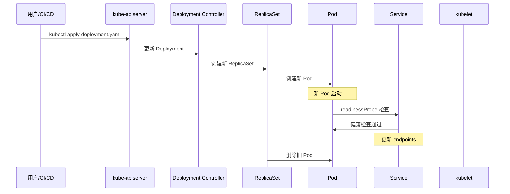
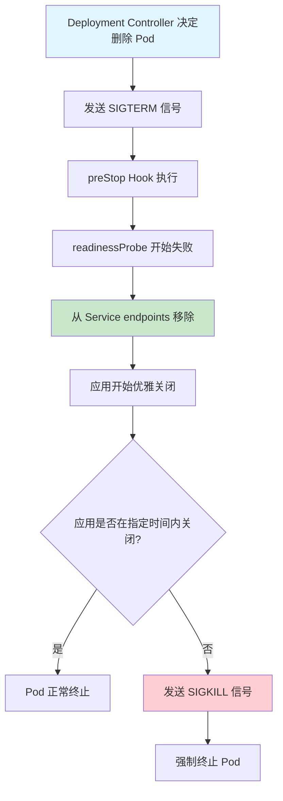
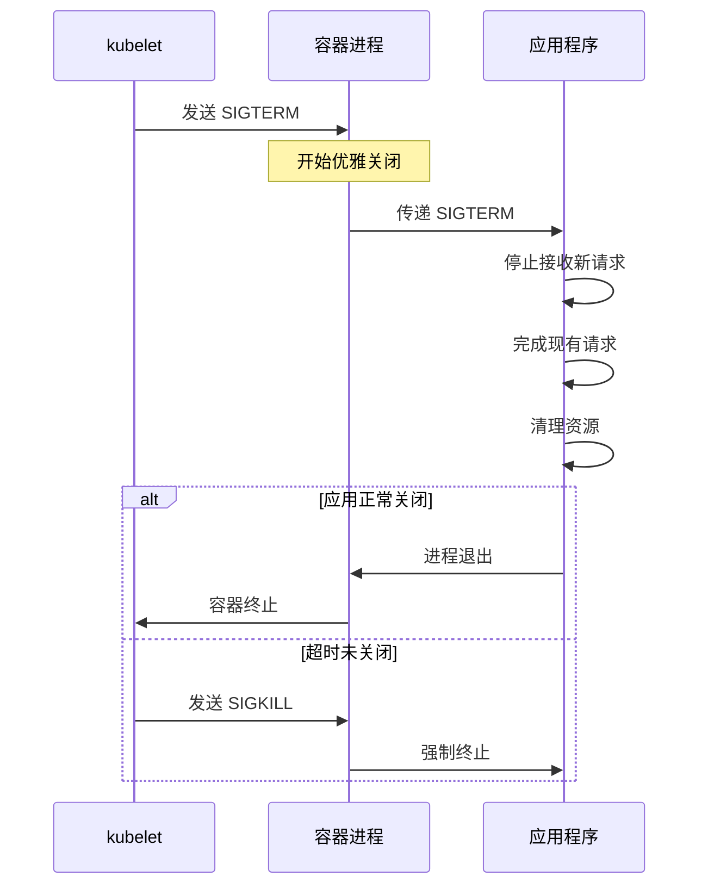
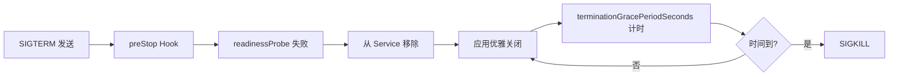

# Kubernetes terminationGracePeriodSeconds 详解

## 概述

`terminationGracePeriodSeconds` 是 Kubernetes Pod 规范中的一个重要参数，它控制着 Pod 在收到终止信号后的优雅关闭时间。理解这个参数对于确保应用的无缝部署和零停机更新至关重要。

## 基本概念

### 定义
```yaml
spec:
  terminationGracePeriodSeconds: 30  # 默认值，单位：秒
```

### 作用
- 控制从发送 SIGTERM 信号到发送 SIGKILL 信号之间的最大等待时间
- 为应用提供优雅关闭的机会
- 防止 Pod 永远卡在 Terminating 状态

## Kubernetes 组件协作流程

### 1. 滚动更新触发



### 2. Pod 终止详细流程



### 3. 时间轴分析

```mermaid
gantt
    title Pod 终止时间轴
    dateFormat X
    axisFormat %s
    
    section 信号发送
    SIGTERM 发送    :0, 1
    
    section preStop Hook
    Hook 执行       :1, 4
    
    section Service 移除
    健康检查失败    :4, 7
    从 Service 移除 :7, 8
    
    section 应用关闭
    优雅关闭        :8, 25
    
    section 强制终止
    SIGKILL 发送    :30, 31
```



## 各组件详细工作流程

### 1. kube-apiserver
- 接收 Deployment 更新请求
- 将变更写入 etcd
- 通知相关控制器

### 2. Deployment Controller
- 监控 Deployment 状态变化
- 创建新的 ReplicaSet
- 管理滚动更新策略

### 3. ReplicaSet Controller
- 监控 ReplicaSet 状态
- 创建新 Pod
- 删除旧 Pod（发送删除请求）

### 4. kubelet
- 接收 Pod 删除请求
- 执行 Pod 终止流程
- 管理 terminationGracePeriodSeconds

### 5. kube-proxy
- 监控 Service endpoints 变化
- 更新 iptables/ipvs 规则
- 控制流量路由

## terminationGracePeriodSeconds 工作原理

### 1. 信号处理机制



### 2. 时间控制逻辑

```yaml
# 伪代码逻辑
if (current_time - sigterm_time) >= terminationGracePeriodSeconds:
    send_sigkill()
else:
    wait_for_graceful_shutdown()
```

### 3. 与 readinessProbe 的配合



## 实际案例分析

### 案例1：正常关闭
```
时间轴：
00:00 - 发送 SIGTERM
00:01 - preStop Hook 完成
00:03 - 从 Service 移除
00:15 - 应用优雅关闭完成
00:15 - Pod 终止
```

### 案例2：超时强制终止
```
时间轴：
00:00 - 发送 SIGTERM
00:01 - preStop Hook 完成
00:03 - 从 Service 移除
00:25 - 应用仍在运行
00:30 - 发送 SIGKILL
00:30 - Pod 强制终止
```

### 案例3：您遇到的问题
```
时间轴：
16:12:12 - 发送 SIGTERM
16:12:12 - readinessProbe 仍在成功
16:13:12 - 仍在接收请求（问题发生）
16:13:13 - Pod 被删除
```

## 最佳实践

### 1. 配置建议

```yaml
spec:
  terminationGracePeriodSeconds: 30  # 根据应用调整
  containers:
  - name: app
    lifecycle:
      preStop:
        exec:
          command: ["/bin/sh", "-c", "sleep 5"]
    readinessProbe:
      httpGet:
        path: /actuator/health
        port: 8080
      periodSeconds: 5
      timeoutSeconds: 3
      failureThreshold: 2
```

### 2. 应用层面优化

```java
@PreDestroy
public void shutdown() {
    // 1. 停止接收新请求
    server.stopAcceptingRequests();
    
    // 2. 等待现有请求完成
    waitForActiveRequests(10, TimeUnit.SECONDS);
    
    // 3. 关闭连接池
    dataSource.close();
    
    // 4. 保存状态
    saveApplicationState();
}
```

### 3. 监控和调试

```bash
# 查看 Pod 终止状态
kubectl get pods -w

# 查看 Service endpoints
kubectl get endpoints

# 查看 Pod 事件
kubectl describe pod <pod-name>

# 查看 kubelet 日志
journalctl -u kubelet -f
```

## 常见问题和解决方案

### 1. Pod 卡在 Terminating 状态
**原因：** terminationGracePeriodSeconds 设置过长
**解决：** 适当减少时间，或检查应用是否正常响应 SIGTERM

### 2. 请求仍在访问已终止的 Pod
**原因：** readinessProbe 配置不当
**解决：** 优化 preStop Hook 和 readinessProbe 配置

### 3. 应用数据丢失
**原因：** 优雅关闭时间不足
**解决：** 增加 terminationGracePeriodSeconds 或优化应用关闭逻辑

## 总结

`terminationGracePeriodSeconds` 是 Kubernetes 优雅关闭机制的核心参数，它需要与 readinessProbe、preStop Hook 等配置协同工作，才能实现真正的零停机部署。理解各组件之间的协作流程，有助于我们更好地配置和优化应用的部署策略。

关键要点：
1. **Service 移除时间** 由 readinessProbe 控制
2. **应用关闭时间** 由 terminationGracePeriodSeconds 控制
3. **preStop Hook** 可以主动触发 readinessProbe 失败
4. **各组件协作** 确保平滑的滚动更新