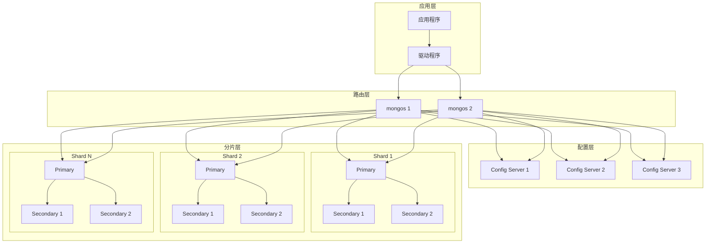
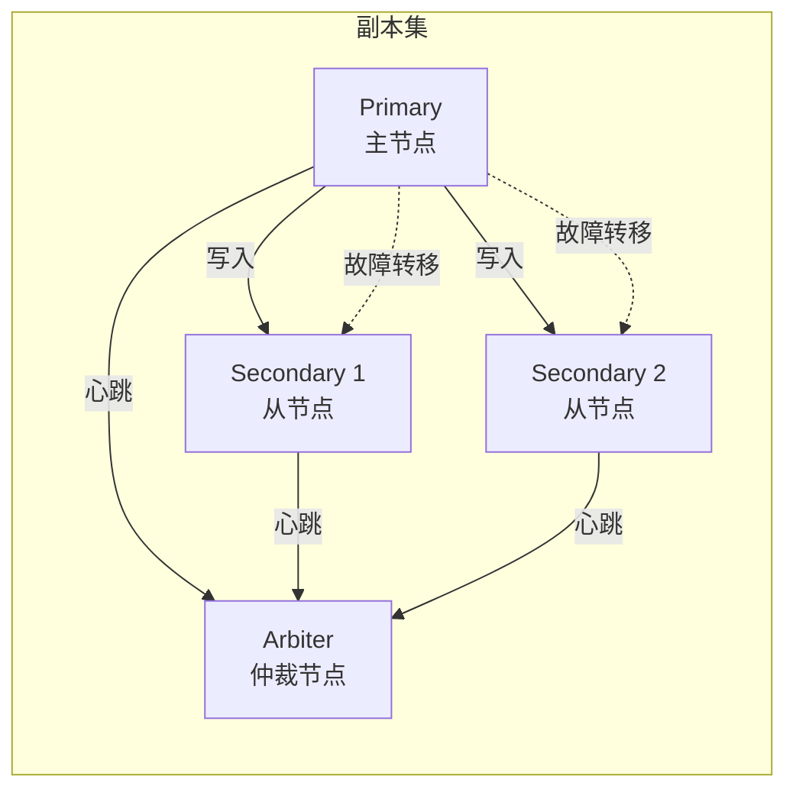
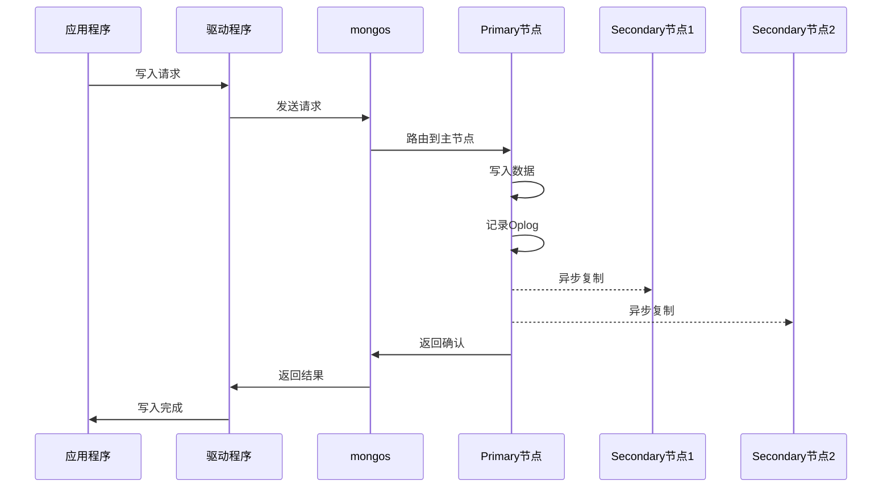
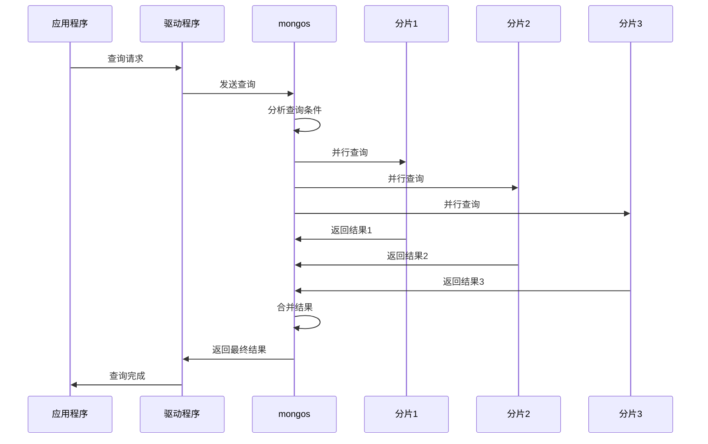
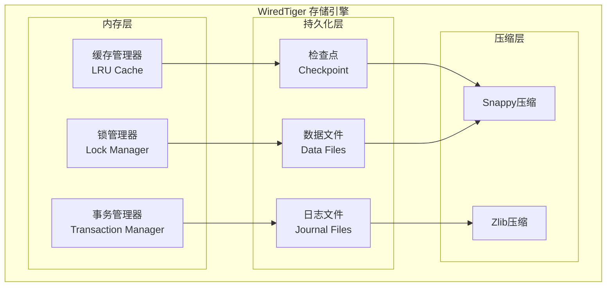
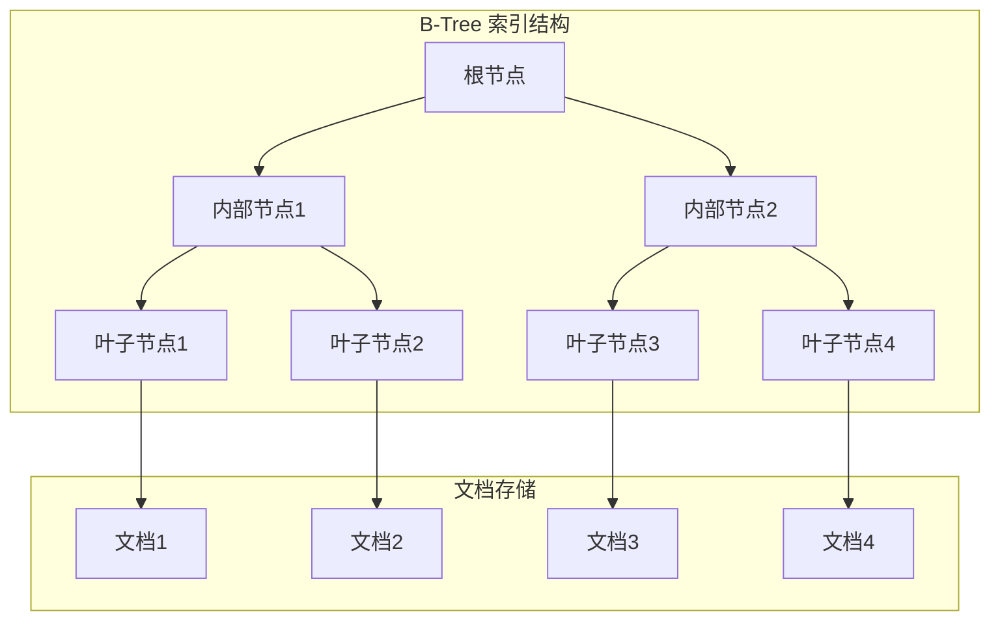
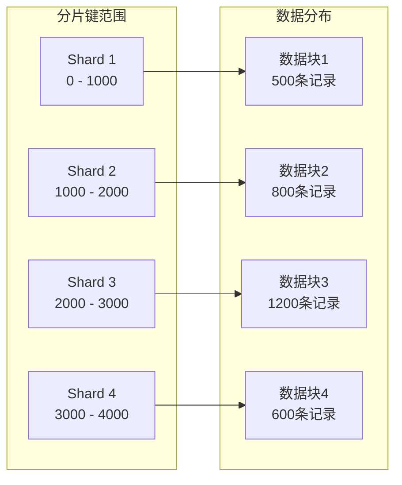
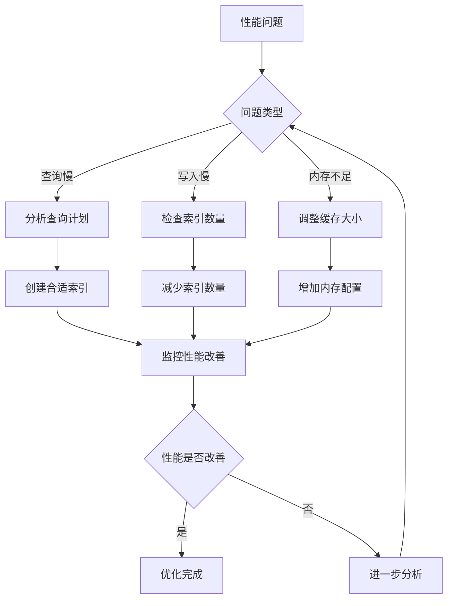
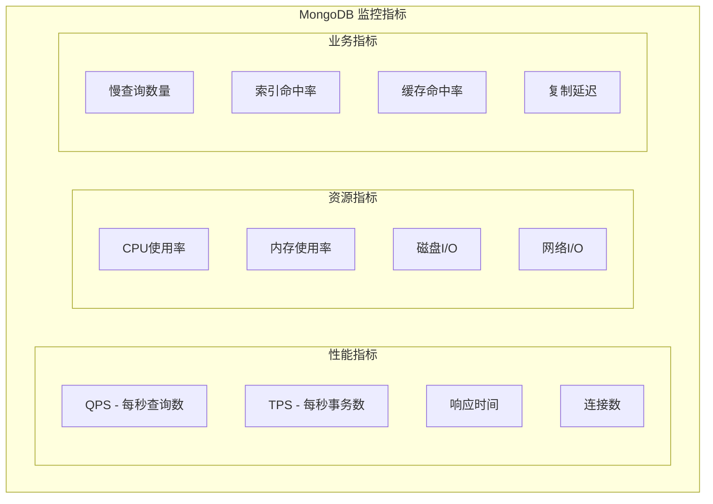
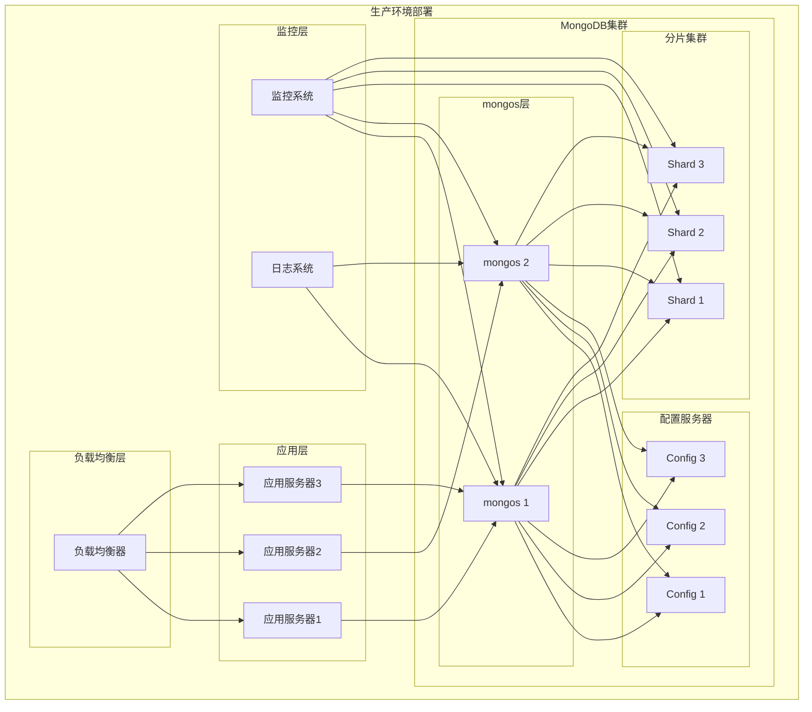

# MongoDB 架构图表

## 1. MongoDB 整体架构图

```mermaid
graph TB
    subgraph "应用层"
        A[应用程序]
        B[驱动程序]
    end
    
    subgraph "路由层"
        C[mongos 1]
        D[mongos 2]
    end
    
    subgraph "配置层"
        E[Config Server 1]
        F[Config Server 2]
        G[Config Server 3]
    end
    
    subgraph "分片层"
        subgraph "Shard 1"
            H1[Primary]
            H2[Secondary 1]
            H3[Secondary 2]
        end
        
        subgraph "Shard 2"
            I1[Primary]
            I2[Secondary 1]
            I3[Secondary 2]
        end
        
        subgraph "Shard N"
            J1[Primary]
            J2[Secondary 1]
            J3[Secondary 2]
        end
    end
    
    A --> B
    B --> C
    B --> D
    C --> E
    C --> F
    C --> G
    D --> E
    D --> F
    D --> G
    C --> H1
    C --> I1
    C --> J1
    D --> H1
    D --> I1
    D --> J1
    
    H1 --> H2
    H1 --> H3
    I1 --> I2
    I1 --> I3
    J1 --> J2
    J1 --> J3
```

## 2. 副本集架构图

```mermaid
graph LR
    subgraph "副本集"
        P[Primary<br/>主节点]
        S1[Secondary 1<br/>从节点]
        S2[Secondary 2<br/>从节点]
        A[Arbiter<br/>仲裁节点]
    end
    
    P -->|写入| S1
    P -->|写入| S2
    P -->|心跳| A
    S1 -->|心跳| A
    S2 -->|心跳| A
    
    P -.->|故障转移| S1
    P -.->|故障转移| S2
```

## 3. 写入流程时序图

```mermaid
sequenceDiagram
    participant App as 应用程序
    participant Driver as 驱动程序
    participant Mongos as mongos
    participant Primary as Primary节点
    participant Secondary1 as Secondary节点1
    participant Secondary2 as Secondary节点2
    
    App->>Driver: 写入请求
    Driver->>Mongos: 发送请求
    Mongos->>Primary: 路由到主节点
    Primary->>Primary: 写入数据
    Primary->>Primary: 记录Oplog
    Primary-->>Secondary1: 异步复制
    Primary-->>Secondary2: 异步复制
    Primary->>Mongos: 返回确认
    Mongos->>Driver: 返回结果
    Driver->>App: 写入完成
```

## 4. 读取流程时序图

```mermaid
sequenceDiagram
    participant App as 应用程序
    participant Driver as 驱动程序
    participant Mongos as mongos
    participant Shard1 as 分片1
    participant Shard2 as 分片2
    participant Shard3 as 分片3
    
    App->>Driver: 查询请求
    Driver->>Mongos: 发送查询
    Mongos->>Mongos: 分析查询条件
    Mongos->>Shard1: 并行查询
    Mongos->>Shard2: 并行查询
    Mongos->>Shard3: 并行查询
    Shard1->>Mongos: 返回结果1
    Shard2->>Mongos: 返回结果2
    Shard3->>Mongos: 返回结果3
    Mongos->>Mongos: 合并结果
    Mongos->>Driver: 返回最终结果
    Driver->>App: 查询完成
```

## 5. WiredTiger 存储引擎架构

```mermaid
graph TB
    subgraph "WiredTiger 存储引擎"
        subgraph "内存层"
            A[缓存管理器<br/>LRU Cache]
            B[事务管理器<br/>Transaction Manager]
            C[锁管理器<br/>Lock Manager]
        end
        
        subgraph "持久化层"
            D[检查点<br/>Checkpoint]
            E[日志文件<br/>Journal Files]
            F[数据文件<br/>Data Files]
        end
        
        subgraph "压缩层"
            G[Snappy压缩]
            H[Zlib压缩]
        end
    end
    
    A --> D
    B --> E
    C --> F
    D --> G
    E --> H
    F --> G
```

## 6. 索引结构图

```mermaid
graph TB
    subgraph "B-Tree 索引结构"
        A[根节点]
        B[内部节点1]
        C[内部节点2]
        D[叶子节点1]
        E[叶子节点2]
        F[叶子节点3]
        G[叶子节点4]
        
        A --> B
        A --> C
        B --> D
        B --> E
        C --> F
        C --> G
    end
    
    subgraph "文档存储"
        H[文档1]
        I[文档2]
        J[文档3]
        K[文档4]
    end
    
    D --> H
    E --> I
    F --> J
    G --> K
```

## 7. 分片键分布图

```mermaid
graph LR
    subgraph "分片键范围"
        A[Shard 1<br/>0 - 1000]
        B[Shard 2<br/>1000 - 2000]
        C[Shard 3<br/>2000 - 3000]
        D[Shard 4<br/>3000 - 4000]
    end
    
    subgraph "数据分布"
        E[数据块1<br/>500条记录]
        F[数据块2<br/>800条记录]
        G[数据块3<br/>1200条记录]
        H[数据块4<br/>600条记录]
    end
    
    A --> E
    B --> F
    C --> G
    D --> H
```

## 8. 性能优化流程图

```mermaid
flowchart TD
    A[性能问题] --> B{问题类型}
    
    B -->|查询慢| C[分析查询计划]
    B -->|写入慢| D[检查索引数量]
    B -->|内存不足| E[调整缓存大小]
    
    C --> F[创建合适索引]
    D --> G[减少索引数量]
    E --> H[增加内存配置]
    
    F --> I[监控性能改善]
    G --> I
    H --> I
    
    I --> J{性能是否改善}
    J -->|是| K[优化完成]
    J -->|否| L[进一步分析]
    L --> B
```

## 9. 监控指标图

```mermaid
graph TB
    subgraph "MongoDB 监控指标"
        subgraph "性能指标"
            A[QPS - 每秒查询数]
            B[TPS - 每秒事务数]
            C[响应时间]
            D[连接数]
        end
        
        subgraph "资源指标"
            E[CPU使用率]
            F[内存使用率]
            G[磁盘I/O]
            H[网络I/O]
        end
        
        subgraph "业务指标"
            I[慢查询数量]
            J[索引命中率]
            K[缓存命中率]
            L[复制延迟]
        end
    end
```

## 10. 部署架构图

```mermaid
graph TB
    subgraph "生产环境部署"
        subgraph "负载均衡层"
            LB[负载均衡器]
        end
        
        subgraph "应用层"
            APP1[应用服务器1]
            APP2[应用服务器2]
            APP3[应用服务器3]
        end
        
        subgraph "MongoDB集群"
            subgraph "mongos层"
                MS1[mongos 1]
                MS2[mongos 2]
            end
            
            subgraph "配置服务器"
                CFG1[Config 1]
                CFG2[Config 2]
                CFG3[Config 3]
            end
            
            subgraph "分片集群"
                SH1[Shard 1]
                SH2[Shard 2]
                SH3[Shard 3]
            end
        end
        
        subgraph "监控层"
            MON[监控系统]
            LOG[日志系统]
        end
    end
    
    LB --> APP1
    LB --> APP2
    LB --> APP3
    
    APP1 --> MS1
    APP2 --> MS2
    APP3 --> MS1
    
    MS1 --> CFG1
    MS1 --> CFG2
    MS1 --> CFG3
    MS2 --> CFG1
    MS2 --> CFG2
    MS2 --> CFG3
    
    MS1 --> SH1
    MS1 --> SH2
    MS1 --> SH3
    MS2 --> SH1
    MS2 --> SH2
    MS2 --> SH3
    
    MON --> MS1
    MON --> MS2
    MON --> SH1
    MON --> SH2
    MON --> SH3
    LOG --> MS1
    LOG --> MS2
```
