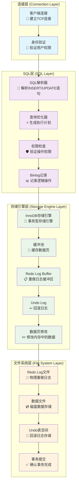
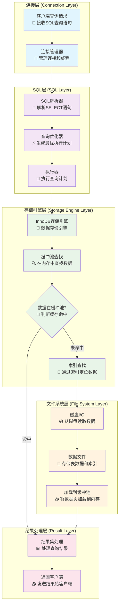
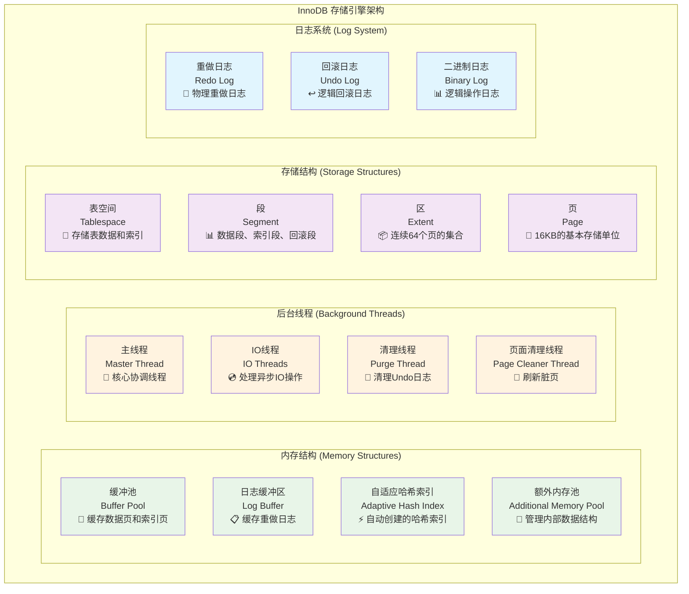
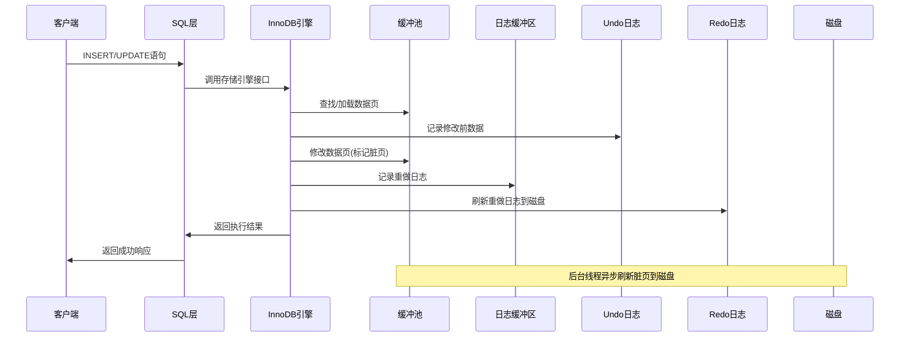
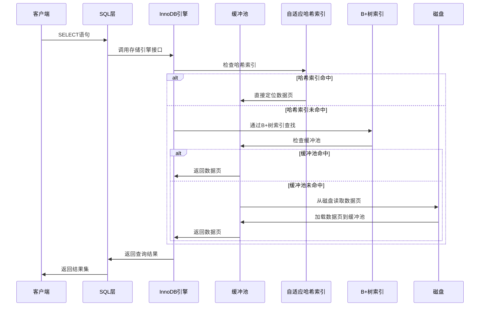

# MySQL 概述

## 1. MySQL 整体架构

MySQL 采用分层架构设计，主要包含以下几个核心层次：

### 1.1 连接层 (Connection Layer)
- **连接管理器**: 处理客户端连接请求，管理连接池
- **身份验证**: 验证用户身份和权限
- **SSL/TLS**: 提供加密连接支持
- **线程管理**: 为每个连接创建独立线程

### 1.2 SQL 层 (SQL Layer)
- **SQL 接口**: 接收 SQL 语句
- **解析器**: 将 SQL 语句解析为语法树
- **查询优化器**: 选择最优执行计划
- **查询缓存**: 缓存查询结果（MySQL 8.0 已移除）
- **权限检查**: 验证用户操作权限

### 1.3 存储引擎层 (Storage Engine Layer)
- **InnoDB**: 默认事务型存储引擎，支持行级锁、外键、崩溃恢复
- **MyISAM**: 非事务型存储引擎，适合读密集型应用
- **Memory**: 内存存储引擎，数据存储在内存中
- **其他引擎**: Archive、CSV、Federated 等

### 1.4 文件系统层 (File System Layer)
- **数据文件**: 存储表数据和索引
- **日志文件**: 事务日志、错误日志、慢查询日志等
- **配置文件**: my.cnf 配置文件
- **临时文件**: 临时表和排序操作产生的文件

## 2. MySQL 写入处理流程

### 2.1 写入处理架构图

### 2.2 写入流程详细说明

#### 2.2.1 连接层处理
- **客户端连接** 📡: 建立TCP连接，分配连接ID和线程
- **身份验证** 🔐: 验证用户名、密码和主机权限

#### 2.2.2 SQL层处理
- **SQL解析器** 📝: 将INSERT/UPDATE语句解析为语法树，检查语法正确性
- **查询优化器** ⚡: 生成最优执行计划，选择索引和访问路径
- **权限检查** 🛡️: 验证用户是否有权限对目标表进行写操作

#### 2.2.3 存储引擎层处理
- **缓冲池** 💾: 缓存最常用的数据页，避免频繁磁盘I/O
  - 使用LRU算法管理页面置换
  - 通过innodb_buffer_pool_size参数配置大小
- **Redo Log Buffer** 📋: 临时存储重做日志记录
  - 提高写入性能，避免每次修改都写磁盘
  - 事务提交时强制刷新到Redo Log文件
- **Undo Log** ↩️: 记录数据修改前的原始值
  - 支持事务回滚操作
  - 实现MVCC多版本并发控制
- **数据页修改** ✏️: 在内存中修改数据页内容
  - 将数据页标记为"脏页"
  - 由后台线程异步刷新到磁盘

#### 2.2.4 日志系统
- **Redo Log** 🔄: 物理重做日志
  - 记录数据页的物理修改操作
  - 支持崩溃恢复，确保数据持久性
  - 采用循环写入，固定大小
- **Binlog** 📊: 逻辑二进制日志
  - 记录SQL语句的逻辑修改
  - 支持主从复制和点时间恢复
  - 可选择不同的记录格式

#### 2.2.5 持久化处理
- **事务提交** ✅: 确认事务完成
  - 两阶段提交：先写Redo Log，再写Binlog
  - 确保数据一致性和持久性
- **数据文件** 💿: 最终的数据存储
  - 脏页由后台线程异步写入磁盘
  - 定期创建检查点，确保数据一致性

## 3. MySQL 查询处理流程

### 3.1 查询处理架构图

### 3.2 查询流程详细说明

#### 3.2.1 连接层处理
- **客户端查询请求** 📡: 接收客户端发送的SQL查询语句
- **连接管理器** 🔗: 管理客户端连接，为每个连接分配独立线程

#### 3.2.2 SQL层处理
- **SQL解析器** 📝: 解析SELECT语句
  - 词法分析：将SQL语句分解为词法单元（关键字、标识符、操作符等）
  - 语法分析：构建语法树，检查语法正确性
  - 语义分析：检查表名、列名是否存在，验证数据类型
- **查询优化器** ⚡: 生成最优执行计划
  - 基于成本的优化：估算不同执行计划的成本
  - 统计信息：使用表统计信息进行优化决策
  - 索引选择：选择最优的索引进行查询
  - 连接顺序：确定多表连接的最佳顺序
- **执行器** 🎯: 执行查询计划
  - 调用存储引擎接口获取数据
  - 处理JOIN、排序、分组等操作
  - 应用WHERE条件过滤数据

#### 3.2.3 存储引擎层处理
- **存储引擎接口** 🔌: 统一访问接口
  - 为不同存储引擎提供统一访问接口
  - 支持插件式架构，可切换不同存储引擎
  - 提供ACID事务特性支持
- **InnoDB存储引擎** 💾: 数据存储引擎
  - 支持行级锁和事务
  - 提供崩溃恢复能力
  - 支持外键约束

#### 3.2.4 缓存层处理
- **缓冲池查找** 🔍: 在内存中查找数据
  - 首先在缓冲池中查找所需的数据页
  - 缓冲池缓存最常用的数据页和索引页
  - 使用LRU算法管理页面置换
- **缓存命中判断** 💭: 判断数据是否在缓冲池中
  - 命中：直接从内存返回数据，性能最佳
  - 未命中：需要从磁盘读取数据
- **磁盘I/O** 💿: 从磁盘读取数据
  - 当缓冲池未命中时，从磁盘读取数据页
  - 这是查询过程中最耗时的操作
- **加载到缓冲池** 📥: 将数据页加载到内存
  - 将磁盘读取的数据页加载到缓冲池
  - 更新LRU链表，标记为最近使用

#### 3.2.5 结果处理
- **结果集处理** 📊: 处理查询结果
  - 应用SELECT列表中的列选择
  - 执行排序、分组、聚合等操作
  - 应用LIMIT限制结果数量
- **返回客户端** 📤: 发送结果给客户端
  - 将处理后的结果集发送给客户端
  - 释放相关资源，准备处理下一个查询

#### 3.2.6 索引机制详解
- **B+树索引**: 主要索引结构
  - 支持范围查询和排序
  - 叶子节点存储实际数据或数据指针
  - 高度平衡，查询效率稳定
- **哈希索引**: 等值查询优化
  - 仅支持等值查询，不支持范围查询
  - 查询速度极快，但内存消耗较大
- **全文索引**: 支持全文搜索
  - 支持MATCH AGAINST语法
  - 适用于文本内容的模糊搜索
- **复合索引**: 多列组合索引
  - 遵循最左前缀原则
  - 可以覆盖多个查询条件

## 4. InnoDB 存储引擎详解

### 4.1 InnoDB 整体架构

### 4.2 InnoDB 核心模块详解

#### 4.2.1 缓冲池 (Buffer Pool)
- **作用**: InnoDB最重要的内存结构，缓存数据页和索引页
- **管理机制**:
  - LRU算法：最近最少使用页面置换
  - 预读机制：预读相邻页面提高性能
  - 脏页管理：标记修改过的页面为脏页
- **配置参数**: `innodb_buffer_pool_size`
- **性能影响**: 直接影响数据库的读写性能

#### 4.2.2 日志缓冲区 (Log Buffer)
- **作用**: 缓存重做日志记录，减少磁盘I/O
- **刷新策略**:
  - 事务提交时强制刷新
  - 每秒自动刷新
  - 缓冲区满时刷新
- **配置参数**: `innodb_log_buffer_size`
- **性能优化**: 适当增大可提高写入性能

#### 4.2.3 自适应哈希索引 (Adaptive Hash Index)
- **作用**: 自动为频繁访问的索引页创建哈希索引
- **触发条件**: 同一索引页被连续访问17次
- **优势**: 等值查询性能提升
- **限制**: 仅支持等值查询，不支持范围查询

#### 4.2.4 后台线程系统
- **主线程 (Master Thread)**:
  - 负责缓冲池数据刷新
  - 管理脏页写入磁盘
  - 执行检查点操作
- **IO线程 (IO Threads)**:
  - 异步处理磁盘I/O操作
  - 包括读线程、写线程、插入缓冲线程等
- **清理线程 (Purge Thread)**:
  - 清理不再需要的Undo日志
  - 释放回滚段空间
- **页面清理线程 (Page Cleaner Thread)**:
  - 专门负责脏页刷新
  - 减轻主线程负担

### 4.3 InnoDB 存储结构

#### 4.3.1 表空间 (Tablespace)
- **系统表空间**: 存储系统元数据、Undo日志
- **独立表空间**: 每个表独立的.ibd文件
- **通用表空间**: 多个表共享的表空间
- **临时表空间**: 存储临时表数据

#### 4.3.2 段 (Segment)
- **数据段**: 存储B+树叶子节点数据
- **索引段**: 存储B+树非叶子节点数据
- **回滚段**: 存储Undo日志数据

#### 4.3.3 区 (Extent) 和页 (Page)
- **区**: 连续64个页的集合，大小1MB
- **页**: 16KB的基本存储单位
- **页类型**: 数据页、索引页、Undo页、系统页等

### 4.4 InnoDB 写入处理流程

### 4.5 InnoDB 查询处理流程

## 5. 性能优化要点

### 5.1 写入优化
- 合理配置缓冲池大小
- 优化 Redo Log 配置
- 使用批量插入
- 选择合适的存储引擎

### 5.2 查询优化
- 创建合适的索引
- 优化 SQL 语句
- 使用 EXPLAIN 分析执行计划
- 合理配置查询缓存

### 5.3 系统配置
- 调整内存参数
- 优化磁盘 I/O 配置
- 配置合适的连接数
- 监控系统性能指标

## 6. 总结

MySQL 通过分层架构设计，实现了高性能、高可靠性的数据库系统。写入流程通过缓冲池、日志机制等组件确保数据一致性和性能；查询流程通过优化器、索引等机制提供高效的查询能力。理解这些核心组件和工作流程，有助于更好地进行 MySQL 的性能调优和问题排查。
