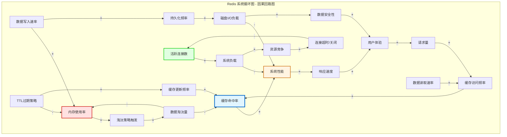
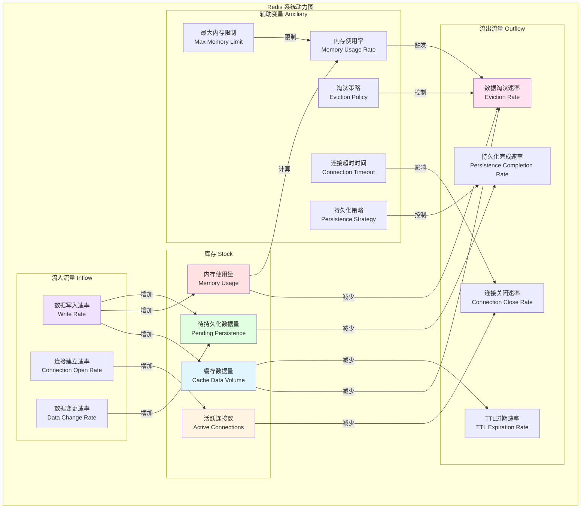

# Redis 系统循环图与系统动力图

## 1. 系统循环图（因果回路图 - Causal Loop Diagram）

系统循环图展示了 Redis 系统中各组件之间的因果关系和反馈循环。



### 关键反馈循环说明

#### 增强循环 R1：性能提升循环（正反馈）
- **路径**：缓存命中率 ↑ → 系统性能 ↑ → 响应速度 ↑ → 用户体验 ↑ → 请求量 ↑ → 缓存访问频率 ↑ → 缓存命中率 ↑
- **特点**：自我强化，形成良性循环
- **影响**：系统性能持续提升，但需要防止过度依赖缓存

#### 平衡循环 B1：内存管理循环（负反馈）
- **路径**：内存使用率 ↑ → 淘汰策略触发 ↑ → 数据淘汰量 ↑ → 缓存命中率 ↓ → 内存使用率 ↓
- **特点**：自我调节，维持内存使用在合理范围
- **影响**：防止内存溢出，但可能影响缓存效果

#### 平衡循环 B2：连接管理循环（负反馈）
- **路径**：活跃连接数 ↑ → 系统负载 ↑ → 系统性能 ↓ → 资源竞争 ↑ → 连接超时/关闭 ↑ → 活跃连接数 ↓
- **特点**：自动控制连接数量
- **影响**：防止连接数过多导致系统崩溃

#### 平衡循环 B3：持久化平衡（负反馈）
- **路径**：持久化频率 ↑ → 磁盘I/O负载 ↑ → 系统性能 ↓（但数据安全性 ↑ → 用户体验 ↑）
- **特点**：在性能和数据安全之间平衡
- **影响**：需要根据业务需求调整持久化策略

---

## 2. 系统动力图（库存流量图 - Stock and Flow Diagram）

系统动力图展示了 Redis 系统中的库存（状态变量）和流量（变化速率）。



### 库存变量（Stock）说明

| 库存变量 | 说明 | 单位 |
|---------|------|------|
| **缓存数据量** | Redis 中存储的键值对数量 | 个 |
| **活跃连接数** | 当前与 Redis 建立的客户端连接数 | 个 |
| **内存使用量** | Redis 实际占用的内存大小 | MB/GB |
| **待持久化数据量** | 已修改但尚未持久化到磁盘的数据量 | MB/GB |

### 流量变量（Flow）说明

| 流量类型 | 流量变量 | 说明 |
|---------|---------|------|
| **流入** | 数据写入速率 | 每秒写入的键值对数量 |
| **流入** | 连接建立速率 | 每秒新建立的连接数 |
| **流入** | 数据变更速率 | 每秒数据修改量 |
| **流出** | 数据淘汰速率 | 每秒因内存不足被淘汰的数据量 |
| **流出** | 连接关闭速率 | 每秒关闭的连接数 |
| **流出** | TTL过期速率 | 每秒因过期而删除的数据量 |
| **流出** | 持久化完成速率 | 每秒完成持久化的数据量 |

### 辅助变量（Auxiliary）说明

| 辅助变量 | 说明 | 影响 |
|---------|------|------|
| **内存使用率** | 当前内存使用量 / 最大内存限制 | 触发淘汰策略 |
| **淘汰策略** | LRU/LFU/TTL/Random 等 | 控制淘汰速率 |
| **最大内存限制** | maxmemory 配置值 | 限制内存使用 |
| **连接超时时间** | timeout 配置值 | 影响连接关闭速率 |
| **持久化策略** | RDB/AOF/混合模式 | 控制持久化速率 |

---

## 3. 系统动力学方程示例

### 库存方程（积分方程）

```
缓存数据量(t) = 缓存数据量(t0) + ∫[数据写入速率 - 数据淘汰速率 - TTL过期速率] dt

活跃连接数(t) = 活跃连接数(t0) + ∫[连接建立速率 - 连接关闭速率] dt

内存使用量(t) = 内存使用量(t0) + ∫[数据写入速率 × 平均数据大小 - 数据淘汰速率 × 平均数据大小] dt
```

### 流量方程（速率方程）

```
数据淘汰速率 = IF(内存使用率 > 阈值) THEN (内存使用率 - 阈值) × 淘汰策略系数 ELSE 0

连接关闭速率 = 活跃连接数 / 连接超时时间

TTL过期速率 = 缓存数据量 × 平均过期率
```

---

## 4. 关键系统行为模式

### 模式 1：缓存预热阶段
- **特征**：数据写入速率 > 数据淘汰速率 + TTL过期速率
- **结果**：缓存数据量持续增长，缓存命中率逐步提升

### 模式 2：稳定运行阶段
- **特征**：数据写入速率 ≈ 数据淘汰速率 + TTL过期速率
- **结果**：缓存数据量保持稳定，系统性能最优

### 模式 3：内存压力阶段
- **特征**：内存使用率接近上限，淘汰策略频繁触发
- **结果**：数据淘汰速率增加，可能影响缓存命中率

### 模式 4：连接风暴阶段
- **特征**：连接建立速率 > 连接关闭速率
- **结果**：活跃连接数快速增长，系统负载增加，性能下降

---

## 5. 优化建议

基于系统动力学分析，以下优化策略可以改善系统行为：

1. **内存管理优化**
   - 合理设置 `maxmemory` 和淘汰策略
   - 监控内存使用率，提前预警

2. **连接管理优化**
   - 设置合理的连接超时时间
   - 使用连接池限制最大连接数

3. **持久化策略优化**
   - 根据业务需求选择 RDB/AOF/混合模式
   - 调整持久化频率，平衡性能和数据安全

4. **缓存策略优化**
   - 合理设置 TTL，避免数据过期过快
   - 实施缓存预热，提升初始命中率

