# 如何成长为技术大拿 - 全景指南

## 技术大拿成长全景图

```mermaid
graph TB
    A[技术大拿成长路径] --> B[技术能力]
    A --> C[软技能]
    A --> D[学习能力]
    A --> E[实践经验]
    A --> F[影响力建设]

    B --> B1[编程基础]
    B --> B2[系统设计]
    B --> B3[架构能力]
    B --> B4[性能优化]
    B --> B5[安全防护]
    B --> B6[DevOps/运维]

    B1 --> B1a[算法与数据结构]
    B1 --> B1b[编程语言精通]
    B1 --> B1c[设计模式]
    B1 --> B1d[代码质量]

    B2 --> B2a[分布式系统]
    B2 --> B2b[微服务架构]
    B2 --> B2c[数据库设计]
    B2 --> B2d[缓存策略]

    B3 --> B3a[技术选型]
    B3 --> B3b[架构演进]
    B3 --> B3c[技术债务管理]
    B3 --> B3d[可扩展性设计]

    C --> C1[沟通能力]
    C --> C2[领导力]
    C --> C3[团队协作]
    C --> C4[项目管理]
    C --> C5[问题解决]

    D --> D1[持续学习]
    D --> D2[技术趋势把握]
    D --> D3[知识体系构建]
    D --> D4[学习效率]

    E --> E1[项目经验]
    E --> E2[问题解决经验]
    E --> E3[技术决策经验]
    E --> E4[团队管理经验]

    F --> F1[技术分享]
    F --> F2[开源贡献]
    F --> F3[技术写作]
    F --> F4[行业影响力]

    style A fill:#e1f5fe
    style B fill:#f3e5f5
    style C fill:#e8f5e8
    style D fill:#fff3e0
    style E fill:#fce4ec
    style F fill:#f1f8e9
```

## 详细成长路径

### 1. 技术能力建设

#### 1.1 编程基础 (0-2年)
- **算法与数据结构**
  - 掌握常见算法：排序、搜索、动态规划
  - 理解时间复杂度与空间复杂度
  - 熟练使用各种数据结构：数组、链表、树、图、哈希表
  - 刷题平台：LeetCode、牛客网、Codeforces

- **编程语言精通**
  - 选择1-2门主流语言深入学习
  - 理解语言特性、内存管理、并发模型
  - 掌握语言生态和最佳实践
  - 推荐：Java、Python、Go、JavaScript、Rust

- **设计模式**
  - 掌握23种经典设计模式
  - 理解模式的应用场景和权衡
  - 能够识别和重构代码中的设计问题

- **代码质量**
  - 编写可读、可维护的代码
  - 掌握单元测试、集成测试
  - 理解代码审查的重要性
  - 使用静态代码分析工具

#### 1.2 系统设计 (2-4年)
- **分布式系统**
  - 理解CAP定理、BASE理论
  - 掌握分布式一致性算法
  - 了解分布式事务处理
  - 学习分布式存储系统

- **微服务架构**
  - 理解微服务的优缺点
  - 掌握服务拆分策略
  - 了解服务治理、服务发现
  - 学习容器化技术(Docker、Kubernetes)

- **数据库设计**
  - 掌握关系型数据库设计
  - 了解NoSQL数据库选型
  - 理解数据库优化和索引设计
  - 学习数据库分库分表策略

- **缓存策略**
  - 理解缓存的作用和原理
  - 掌握缓存更新策略
  - 了解分布式缓存
  - 学习缓存穿透、击穿、雪崩问题

#### 1.3 架构能力 (4-6年)
- **技术选型**
  - 能够根据业务需求选择合适的技术栈
  - 理解技术选型的权衡和风险
  - 关注技术发展趋势
  - 建立技术选型决策框架

- **架构演进**
  - 理解架构演进的必要性
  - 掌握架构重构的方法
  - 能够设计可演进的架构
  - 平衡技术债务和业务需求

- **可扩展性设计**
  - 设计高并发、高可用的系统
  - 理解性能瓶颈和优化策略
  - 掌握负载均衡、限流、熔断等技术
  - 学习监控和告警系统设计

### 2. 软技能发展

#### 2.1 沟通能力
- **技术沟通**
  - 能够向非技术人员解释技术概念
  - 掌握技术文档写作
  - 学会制作技术演示
  - 参与技术讨论和决策

- **跨部门协作**
  - 与产品、运营、测试等团队有效协作
  - 理解业务需求和技术实现的平衡
  - 建立良好的工作关系

#### 2.2 领导力
- **技术领导**
  - 指导初级开发人员
  - 制定技术标准和规范
  - 推动技术改进和创新
  - 建立技术团队文化

- **项目管理**
  - 掌握敏捷开发方法
  - 能够估算项目工作量
  - 管理项目风险和进度
  - 协调资源分配

#### 2.3 问题解决
- **系统性思维**
  - 从全局角度分析问题
  - 识别问题的根本原因
  - 制定系统性的解决方案
  - 评估解决方案的影响

### 3. 学习能力建设

#### 3.1 持续学习
- **学习计划**
  - 制定年度、季度学习计划
  - 关注技术发展趋势
  - 定期评估学习效果
  - 调整学习策略

- **学习方法**
  - 理论与实践相结合
  - 通过项目实践巩固知识
  - 参与开源项目
  - 建立知识管理系统

#### 3.2 技术趋势把握
- **信息获取**
  - 关注技术博客、论坛
  - 参加技术会议和meetup
  - 订阅技术期刊和新闻
  - 加入技术社区

- **技术评估**
  - 评估新技术的成熟度
  - 分析技术应用场景
  - 理解技术发展趋势
  - 做出前瞻性技术决策

### 4. 实践经验积累

#### 4.1 项目经验
- **项目类型**
  - 参与大型项目开发
  - 主导技术架构设计
  - 解决复杂技术问题
  - 优化系统性能

- **项目角色**
  - 从开发者到架构师
  - 从个人贡献者到团队领导
  - 从技术执行到技术决策
  - 从局部优化到全局规划

#### 4.2 问题解决经验
- **故障处理**
  - 快速定位和解决生产问题
  - 建立故障处理流程
  - 总结经验教训
  - 预防类似问题

- **性能优化**
  - 识别性能瓶颈
  - 制定优化策略
  - 实施优化方案
  - 验证优化效果

### 5. 影响力建设

#### 5.1 技术分享
- **内部分享**
  - 团队技术分享
  - 跨部门技术交流
  - 技术培训
  - 知识传承

- **外部分享**
  - 技术会议演讲
  - 技术博客写作
  - 开源项目贡献
  - 技术社区参与

#### 5.2 行业影响力
- **技术写作**
  - 维护技术博客
  - 发表技术文章
  - 编写技术书籍
  - 参与技术标准制定

- **开源贡献**
  - 贡献开源项目
  - 维护开源项目
  - 推广开源文化
  - 建立开源社区

## 成长时间线

### 初级阶段 (0-2年)
- 掌握编程基础
- 熟悉开发工具和流程
- 参与项目开发
- 建立学习习惯

### 中级阶段 (2-5年)
- 深入理解系统设计
- 掌握架构设计能力
- 开始技术分享
- 承担更多责任

### 高级阶段 (5-8年)
- 成为技术专家
- 具备架构设计能力
- 影响技术决策
- 培养技术团队

### 专家阶段 (8年+)
- 行业技术领袖
- 推动技术发展
- 建立技术影响力
- 传承技术经验

## 关键成功因素

1. **持续学习** - 技术发展迅速，需要不断学习新知识
2. **实践应用** - 将理论知识应用到实际项目中
3. **深度思考** - 不仅要知道怎么做，更要知道为什么这么做
4. **分享交流** - 通过分享和交流提升影响力
5. **团队协作** - 技术大拿需要具备良好的团队协作能力
6. **业务理解** - 理解业务需求，做出合适的技术决策

## 学习资源推荐

### 在线课程
- Coursera、edX、Udacity
- 极客时间、拉勾教育
- 慕课网、实验楼

### 技术书籍
- 《设计模式》
- 《系统设计面试》
- 《高性能MySQL》
- 《深入理解计算机系统》

### 技术社区
- GitHub、Stack Overflow
- 掘金、CSDN、博客园
- InfoQ、极客邦

### 技术会议
- QCon、ArchSummit
- 各技术栈的官方大会
- 本地技术meetup

## 总结

成为技术大拿是一个长期的过程，需要：
- 扎实的技术基础
- 持续的学习能力
- 丰富的实践经验
- 良好的软技能
- 积极的影响力建设

关键是要保持学习的热情，不断挑战自己，在实践中成长，在分享中提升影响力。记住，技术大拿不仅仅是技术专家，更是能够推动技术发展、影响团队和行业的领导者。
