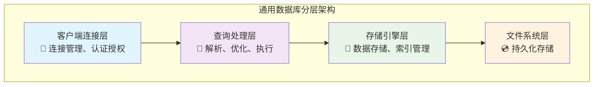
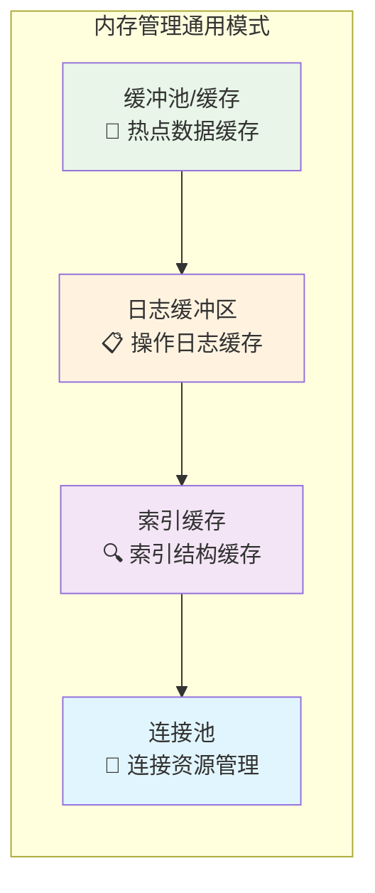
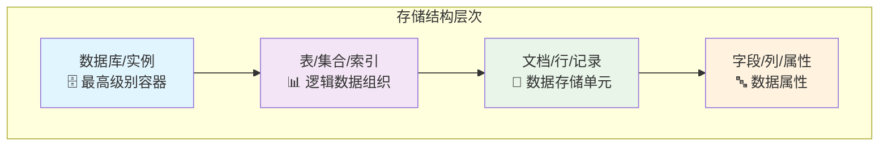
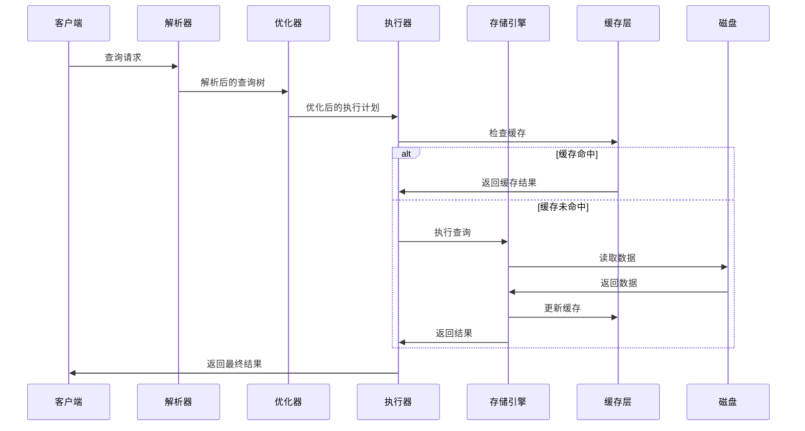
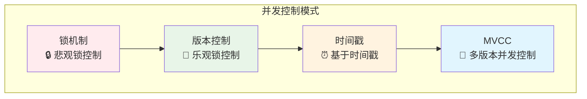
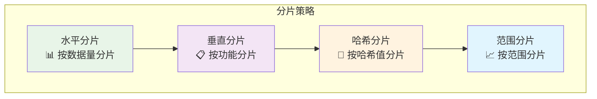
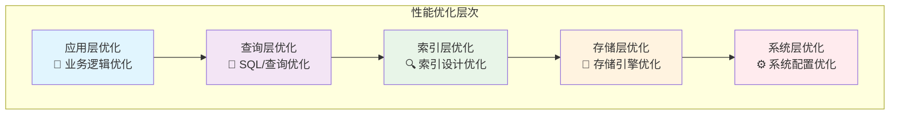
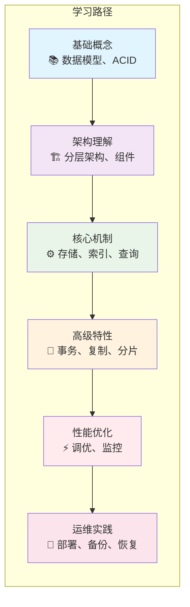

# 数据库中间件通用模式与学习范式

## 概述

Elasticsearch、MongoDB、MySQL、Redis 这四种数据库系统虽然各有特色，但在架构设计、核心概念和优化思路上存在许多通用范式。掌握这些通用模式，可以让你在学习新数据库时举一反三，快速理解其设计理念和最佳实践。

---

## 1. 通用架构模式

### 1.1 分层架构设计

所有现代数据库系统都采用分层架构，虽然具体实现不同，但核心思想一致：



#### 各系统分层对比

| 层次 | MySQL | MongoDB | Elasticsearch | Redis |
|------|-------|---------|---------------|-------|
| **连接层** | 连接管理器、线程池 | 连接池、认证 | HTTP/REST API | 单线程事件循环 |
| **查询层** | SQL解析器、优化器 | 查询解析器 | 查询DSL解析 | 命令解析器 |
| **存储层** | InnoDB/MyISAM | WiredTiger | Lucene引擎 | 内存+持久化 |
| **文件层** | 数据文件、日志 | 数据文件、日志 | 索引段、日志 | RDB/AOF |

### 1.2 内存管理通用模式



#### 内存管理对比

| 组件 | MySQL | MongoDB | Elasticsearch | Redis |
|------|-------|---------|---------------|-------|
| **数据缓存** | Buffer Pool | WiredTiger Cache | OS Page Cache | 全内存存储 |
| **日志缓冲** | Log Buffer | Journal Buffer | Translog Buffer | AOF Buffer |
| **索引缓存** | 自适应哈希索引 | 索引缓存 | 倒排索引缓存 | 无（全内存） |
| **管理策略** | LRU | LRU | LRU | 过期策略 |

---

## 2. 数据存储通用范式

### 2.1 存储结构层次



### 2.2 索引设计通用原则

#### 索引类型对比

| 索引类型 | MySQL | MongoDB | Elasticsearch | Redis |
|----------|-------|---------|---------------|-------|
| **主键索引** | PRIMARY KEY | _id | _id | Key |
| **唯一索引** | UNIQUE | unique: true | unique: true | 无 |
| **普通索引** | INDEX | index | field mapping | 无 |
| **复合索引** | 多列索引 | 多字段索引 | 多字段映射 | 无 |
| **全文索引** | FULLTEXT | text index | text analyzer | 无 |
| **地理索引** | 空间索引 | 2dsphere | geo_point | 无 |

#### 索引优化通用策略

1. **选择性原则**: 高选择性字段优先建索引
2. **覆盖索引**: 避免回表查询
3. **复合索引**: 遵循最左前缀原则
4. **索引维护**: 定期分析索引使用情况

---

## 3. 查询处理通用模式

### 3.1 查询执行流程



### 3.2 查询优化通用技术

#### 优化器技术对比

| 优化技术 | MySQL | MongoDB | Elasticsearch | Redis |
|----------|-------|---------|---------------|-------|
| **成本优化** | 基于成本 | 基于规则 | 基于相关性 | 无优化器 |
| **索引选择** | 自动选择 | 自动选择 | 自动选择 | 无 |
| **查询重写** | 支持 | 支持 | 支持 | 无 |
| **统计信息** | 表统计 | 集合统计 | 索引统计 | 无 |
| **执行计划** | EXPLAIN | explain() | profile | 无 |

---

## 4. 事务与一致性通用模式

### 4.1 ACID特性对比

| 特性 | MySQL | MongoDB | Elasticsearch | Redis |
|------|-------|---------|---------------|-------|
| **原子性** | 完全支持 | 单文档支持 | 单文档支持 | 单命令支持 |
| **一致性** | 强一致性 | 最终一致性 | 最终一致性 | 强一致性 |
| **隔离性** | 多级别 | 读已提交 | 无 | 无 |
| **持久性** | 完全支持 | 支持 | 支持 | 支持 |

### 4.2 并发控制通用模式



---

## 5. 高可用与扩展性通用模式

### 5.1 复制模式对比

| 复制类型 | MySQL | MongoDB | Elasticsearch | Redis |
|----------|-------|---------|---------------|-------|
| **主从复制** | 二进制日志 | Oplog | 无 | 主从复制 |
| **主主复制** | 双主模式 | 无 | 无 | 无 |
| **分片复制** | 无 | 分片+副本 | 分片+副本 | 集群模式 |
| **自动故障转移** | 手动/工具 | 自动 | 自动 | 哨兵模式 |

### 5.2 分片策略通用模式



---

## 6. 性能优化通用范式

### 6.1 性能优化层次



### 6.2 监控指标通用模式

| 监控维度 | 关键指标 | 通用阈值 |
|----------|----------|----------|
| **性能指标** | QPS、TPS、响应时间 | 响应时间 < 100ms |
| **资源指标** | CPU、内存、磁盘I/O | CPU < 80%, 内存 < 90% |
| **连接指标** | 连接数、连接池使用率 | 连接池使用率 < 80% |
| **缓存指标** | 命中率、缓存大小 | 命中率 > 95% |
| **错误指标** | 错误率、超时率 | 错误率 < 1% |

---

## 7. 学习范式：举一反三的方法

### 7.1 学习路径图



### 7.2 对比学习法

#### 学习新数据库时的对比维度

1. **数据模型对比**
   - 关系型 vs 文档型 vs 键值型 vs 列族型
   - 理解各自适用场景

2. **查询语言对比**
   - SQL vs MongoDB Query vs Elasticsearch DSL vs Redis Commands
   - 掌握语法差异和功能对应关系

3. **索引机制对比**
   - B+树 vs B树 vs 倒排索引 vs 哈希索引
   - 理解不同索引的优缺点

4. **事务模型对比**
   - ACID vs BASE vs 最终一致性
   - 理解一致性权衡

### 7.3 实践学习方法

#### 1. 环境搭建对比
```bash
# MySQL
docker run -d --name mysql -e MYSQL_ROOT_PASSWORD=123456 mysql:8.0

# MongoDB
docker run -d --name mongodb -p 27017:27017 mongo:latest

# Elasticsearch
docker run -d --name elasticsearch -p 9200:9200 elasticsearch:8.0

# Redis
docker run -d --name redis -p 6379:6379 redis:latest
```

#### 2. 基础操作对比
```sql
-- MySQL
CREATE TABLE users (id INT PRIMARY KEY, name VARCHAR(50));
INSERT INTO users VALUES (1, 'Alice');
SELECT * FROM users WHERE id = 1;
```

```javascript
// MongoDB
db.users.insertOne({_id: 1, name: "Alice"});
db.users.findOne({_id: 1});
```

```json
// Elasticsearch
PUT /users/_doc/1
{
  "name": "Alice"
}

GET /users/_doc/1
```

```bash
# Redis
SET user:1 "Alice"
GET user:1
```

#### 3. 性能测试对比
- 使用相同的测试数据集
- 对比读写性能指标
- 分析不同场景下的表现

---

## 8. 最佳实践总结

### 8.1 通用设计原则

1. **数据模型设计**
   - 根据业务特点选择合适的数据模型
   - 考虑查询模式和访问频率
   - 设计合理的索引策略

2. **架构设计**
   - 采用分层架构，职责分离
   - 合理使用缓存，提高性能
   - 设计高可用和可扩展方案

3. **性能优化**
   - 从应用层到系统层逐层优化
   - 建立完善的监控体系
   - 定期进行性能评估和调优

### 8.2 运维管理通用原则

1. **备份策略**
   - 定期全量备份
   - 实时增量备份
   - 跨地域备份

2. **监控告警**
   - 关键指标监控
   - 异常情况告警
   - 性能趋势分析

3. **容量规划**
   - 基于历史数据预测
   - 考虑业务增长趋势
   - 预留安全余量

---

## 9. 总结

通过掌握这些通用范式，你可以：

1. **快速学习新数据库**: 基于通用模式快速理解新系统的设计理念
2. **系统对比分析**: 从多个维度对比不同数据库的优劣
3. **架构设计指导**: 在系统设计时做出更合理的技术选型
4. **问题排查思路**: 基于通用模式快速定位和解决问题
5. **性能优化策略**: 应用通用的优化思路和最佳实践

记住：**理解通用模式比记忆具体命令更重要**。掌握了这些通用范式，你就具备了举一反三学习任何数据库系统的能力。
