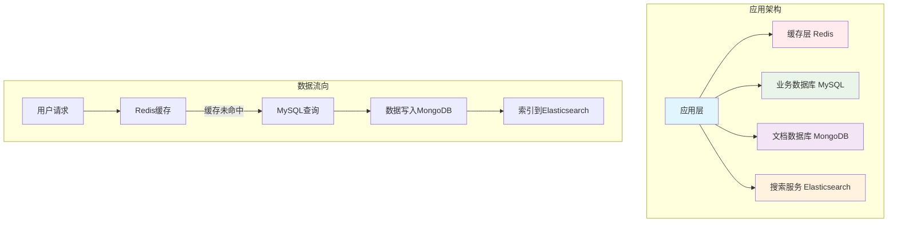

# ACID特性详解与数据库对比分析

## 1. ACID四个特性简介

ACID是数据库事务的四个基本特性，确保数据库操作的可靠性和一致性：

### 1.1 原子性（Atomicity）
**定义**: 事务中的所有操作要么全部成功，要么全部失败，不存在部分成功的情况。

**通俗理解**: 就像银行转账，要么转账成功（扣款+入账都成功），要么转账失败（扣款+入账都失败），不会出现只扣款不入账的情况。

### 1.2 一致性（Consistency）
**定义**: 事务执行前后，数据库从一个一致状态转换到另一个一致状态，不会违反任何完整性约束。

**通俗理解**: 数据库中的各种约束条件（如外键、唯一性、非空等）在事务执行前后都必须得到满足。

### 1.3 隔离性（Isolation）
**定义**: 并发执行的事务之间相互隔离，一个事务的执行不应该影响其他事务。

**通俗理解**: 多个用户同时操作数据库时，彼此之间不会相互干扰，就像每个用户都有自己独立的数据库副本。

### 1.4 持久性（Durability）
**定义**: 一旦事务提交成功，对数据库的修改就是永久性的，即使系统崩溃也不会丢失。

**通俗理解**: 数据一旦保存成功，就会永久存储，不会因为断电、系统故障等原因丢失。

---

## 2. 各数据库ACID特性支持分析

### 2.1 原子性（Atomicity）支持对比

| 数据库 | 支持程度 | 关键设计 | 具体实现 | 不支持的原因 |
|--------|----------|----------|----------|-------------|
| **MySQL** | ✅ 完全支持 | 事务日志、回滚机制 | Redo Log + Undo Log | - |
| **MongoDB** | ✅ 完全支持<br/>(4.0+) | WiredTiger事务引擎、快照隔离 | Journal日志、Oplog | 4.0版本前仅支持单文档原子性，4.0+支持多文档事务，4.2+支持分片集群事务 |
| **Elasticsearch** | ⚠️ 单文档支持 | 单文档原子更新 | Lucene段合并机制 | 搜索优化优先，多文档事务会引入锁机制，严重影响搜索性能 |
| **Redis** | ⚠️ 单命令支持 | 单命令原子执行 | 单线程事件循环 | 单线程设计无法实现真正的多命令原子性，设计目标是高性能而非复杂事务 |

#### 详细分析：

**MySQL - 完全支持**
```sql
-- 多表事务，要么全部成功，要么全部失败
START TRANSACTION;
UPDATE accounts SET balance = balance - 100 WHERE id = 1;
UPDATE accounts SET balance = balance + 100 WHERE id = 2;
-- 如果任何一步失败，整个事务回滚
COMMIT; -- 或 ROLLBACK;
```

**MongoDB - 多文档原子性（4.0+）**
```javascript
// 4.0+版本支持多文档事务
const session = db.getMongo().startSession();
session.startTransaction();
try {
    // 多文档操作，要么全部成功，要么全部失败
    await db.accounts.updateOne(
        {_id: 1, balance: {$gte: 100}},
        {$inc: {balance: -100}},
        {session: session}
    );
    
    await db.accounts.updateOne(
        {_id: 2},
        {$inc: {balance: 100}},
        {session: session}
    );
    
    await session.commitTransaction();
} catch (error) {
    await session.abortTransaction();
    throw error;
} finally {
    session.endSession();
}

// 4.2+版本支持分片集群事务
// 可以在分片集群中执行跨分片的多文档事务
```

**Elasticsearch - 单文档原子性**
```json
// 单文档更新是原子的
PUT /accounts/_doc/1
{
  "balance": 900
}

// 多文档操作不是原子的
POST /_bulk
{"update":{"_index":"accounts","_id":"1"}}
{"doc":{"balance":900}}
{"update":{"_index":"accounts","_id":"2"}}
{"doc":{"balance":1100}}
```

**Redis - 单命令原子性**
```bash
# 单命令是原子的
INCRBY user:1:balance -100

# 多命令不是原子的（除非使用MULTI/EXEC）
MULTI
INCRBY user:1:balance -100
INCRBY user:2:balance 100
EXEC  # 整个事务是原子的
```

### 2.2 一致性（Consistency）支持对比

#### 2.2.1 强一致性数据库

| 数据库 | 一致性类型 | 关键设计 | 具体实现 | 技术特点 |
|--------|------------|----------|----------|----------|
| **MySQL** | ✅ 强一致性 | ACID事务、约束检查 | 外键约束、触发器、事务锁 | 立即一致性，所有操作立即可见 |
| **MongoDB** | ✅ 强一致性<br/>(4.0+) | 事务一致性、快照隔离 | 文档验证、唯一索引、事务约束 | 4.0+支持强一致性，4.0前为应用层一致性 |

#### 2.2.2 最终一致性数据库

| 数据库 | 一致性类型 | 关键设计 | 具体实现 | 技术特点 |
|--------|------------|----------|----------|----------|
| **Elasticsearch** | ⚠️ 最终一致性 | 刷新机制、段合并 | 映射约束、分析器、Translog | 写入后需要刷新才能查询到，延迟可控 |

#### 2.2.3 不保证一致性数据库

| 数据库 | 一致性类型 | 关键设计 | 具体实现 | 技术特点 |
|--------|------------|----------|----------|----------|
| **Redis** | ❌ 不保证一致性 | 无内置约束 | 应用层保证 | 主要用于缓存，数据丢失可重新加载 |

#### 详细分析：

**1. 强一致性技术设计**

**MySQL - 强一致性**
```sql
-- 数据库层面保证一致性
CREATE TABLE accounts (
    id INT PRIMARY KEY,
    balance DECIMAL(10,2) CHECK (balance >= 0), -- 约束检查
    user_id INT,
    FOREIGN KEY (user_id) REFERENCES users(id) -- 外键约束
);

-- 事务保证强一致性
START TRANSACTION;
UPDATE accounts SET balance = balance - 100 WHERE id = 1;
UPDATE accounts SET balance = balance + 100 WHERE id = 2;
COMMIT; -- 所有操作立即可见

-- 违反约束的操作会被拒绝
INSERT INTO accounts VALUES (1, -100, 1); -- 错误：余额不能为负
```

**MongoDB - 强一致性（4.0+）**
```javascript
// 4.0+版本支持事务级强一致性
const session = db.getMongo().startSession();
session.startTransaction({
    readConcern: { level: "majority" },
    writeConcern: { w: "majority" }
});
try {
    // 在事务中保证强一致性
    await db.accounts.updateOne(
        {_id: 1, balance: {$gte: 100}},
        {$inc: {balance: -100}},
        {session: session}
    );
    
    await db.transactions.insertOne({
        from: 1,
        to: 2,
        amount: 100,
        timestamp: new Date()
    }, {session: session});
    
    await session.commitTransaction(); // 所有操作立即可见
} catch (error) {
    await session.abortTransaction();
    throw error;
} finally {
    session.endSession();
}

// 文档验证和约束
db.accounts.createIndex({user_id: 1}, {unique: true});
db.createCollection("accounts", {
  validator: {
    $jsonSchema: {
      properties: {
        balance: {bsonType: "decimal", minimum: 0}
      }
    }
  }
});
```

**2. 最终一致性技术设计**

**Elasticsearch - 最终一致性**
```json
// 写入操作
PUT /accounts/_doc/1
{
  "balance": 1000,
  "name": "John"
}

// 立即刷新（强制一致性）
PUT /accounts/_doc/1?refresh=true
{
  "balance": 900,
  "name": "John"
}

// 控制刷新策略
PUT /accounts/_settings
{
  "index": {
    "refresh_interval": "1s"  // 每秒刷新一次
  }
}

// 手动刷新
POST /accounts/_refresh

// 映射约束
PUT /accounts/_mapping
{
  "properties": {
    "balance": {
      "type": "float",
      "index": true
    }
  }
}
```

**3. 不保证一致性技术设计**

**Redis - 不保证一致性**
```bash
# 无内置约束，需要应用层保证
SET user:1:balance 100
SET user:1:balance -50  # 应用层需要检查

# 使用Lua脚本保证原子性（但不保证一致性）
EVAL "
local balance = redis.call('GET', KEYS[1])
if tonumber(balance) >= tonumber(ARGV[1]) then
    redis.call('DECRBY', KEYS[1], ARGV[1])
    return 'success'
else
    return 'insufficient_balance'
end
" 1 user:1:balance 50

# 应用层一致性检查
MULTI
GET user:1:balance
DECRBY user:1:balance 50
EXEC
```

#### 一致性技术设计对比

| 一致性类型 | 数据库 | 核心技术 | 实现机制 | 适用场景 |
|------------|--------|----------|----------|----------|
| **强一致性** | MySQL | ACID事务、约束检查 | 外键约束、触发器、事务锁、立即提交 | 金融、电商、关键业务数据 |
| **强一致性** | MongoDB 4.0+ | 事务一致性、快照隔离 | 文档验证、唯一索引、事务约束、多数确认 | 文档数据库、需要ACID的场景 |
| **最终一致性** | Elasticsearch | 刷新机制、段合并 | 映射约束、分析器、Translog、可配置刷新 | 搜索、日志分析、可接受延迟的场景 |
| **不保证一致性** | Redis | 无内置约束 | 应用层保证、Lua脚本、原子操作 | 缓存、会话存储、高性能场景 |

### 2.3 隔离性（Isolation）支持对比

| 数据库 | 支持程度 | 关键设计 | 具体实现 | 不支持的原因 |
|--------|----------|----------|----------|-------------|
| **MySQL** | ✅ 多级别支持 | 锁机制、MVCC | 行锁、表锁、隔离级别 | - |
| **MongoDB** | ✅ 多级别支持<br/>(4.0+) | 快照隔离、MVCC | WiredTiger锁管理器、事务快照、Oplog复制 | 4.0版本前仅支持读已提交，4.0+支持快照隔离，4.2+支持分片集群隔离 |
| **Elasticsearch** | ❌ 无隔离性 | 无锁机制 | 乐观并发控制 | 搜索优化优先，隔离性会引入锁机制，严重影响搜索性能；分布式搜索架构下实现隔离性需要跨分片协调 |
| **Redis** | ❌ 无隔离性 | 单线程执行 | 单线程事件循环 | 单线程设计无法实现真正的隔离性，内存数据库特性下锁机制会成为性能瓶颈 |

#### 详细分析：

**MySQL - 多级别隔离**
```sql
-- 设置隔离级别
SET TRANSACTION ISOLATION LEVEL READ COMMITTED;

-- 不同隔离级别
-- READ UNCOMMITTED: 可能读到脏数据
-- READ COMMITTED: 避免脏读
-- REPEATABLE READ: 避免脏读和不可重复读
-- SERIALIZABLE: 最高隔离级别

-- 锁机制
SELECT * FROM accounts WHERE id = 1 FOR UPDATE; -- 排他锁
SELECT * FROM accounts WHERE id = 1 LOCK IN SHARE MODE; -- 共享锁
```

**MongoDB - 多级别隔离（4.0+）**
```javascript
// 4.0+版本支持快照隔离
const session = db.getMongo().startSession();
session.startTransaction({
    readConcern: { level: "snapshot" },
    writeConcern: { w: "majority" }
});

try {
    // 快照隔离：读取事务开始时的数据快照
    const account1 = await db.accounts.findOne({_id: 1}, {session: session});
    const account2 = await db.accounts.findOne({_id: 2}, {session: session});
    
    // 在事务中执行更新
    await db.accounts.updateOne(
        {_id: 1, balance: {$gte: 100}},
        {$inc: {balance: -100}},
        {session: session}
    );
    
    await db.accounts.updateOne(
        {_id: 2},
        {$inc: {balance: 100}},
        {session: session}
    );
    
    await session.commitTransaction();
} catch (error) {
    await session.abortTransaction();
    throw error;
} finally {
    session.endSession();
}

// 4.2+版本支持分片集群事务隔离
```

**Elasticsearch - 无隔离性**
```json
// 无锁机制，可能出现并发问题
PUT /accounts/_doc/1
{
  "balance": 1000
}

// 同时更新可能产生冲突
PUT /accounts/_doc/1?version=1
{
  "balance": 1100
}
```

**Redis - 无隔离性**
```bash
# 单线程执行，但无事务隔离
SET user:1:balance 100
GET user:1:balance  # 可能读到中间状态
```

### 2.4 持久性（Durability）支持对比

| 数据库 | 支持程度 | 关键设计 | 具体实现 | 不支持的原因 |
|--------|----------|----------|----------|-------------|
| **MySQL** | ✅ 完全支持 | 事务日志、WAL | Redo Log、Binlog | - |
| **MongoDB** | ✅ 完全支持 | 日志机制 | Journal、Oplog | - |
| **Elasticsearch** | ✅ 完全支持 | 段持久化 | Translog、段文件 | - |
| **Redis** | ⚠️ 可配置 | 持久化选项 | RDB、AOF | 性能与持久性权衡，完全持久化会影响性能；内存数据库定位，主要用于缓存，数据丢失可以重新加载 |

#### 详细分析：

**MySQL - 完全支持**
```sql
-- 事务提交时强制写入日志
SET innodb_flush_log_at_trx_commit = 1; -- 每次事务提交都刷盘

-- 双重日志保证
-- Redo Log: 崩溃恢复
-- Binlog: 主从复制
```

**MongoDB - 完全支持**
```javascript
// 写关注级别
db.accounts.insertOne(
  {balance: 1000}, 
  {writeConcern: {w: "majority", j: true}} // 确保持久化
);

// Journal日志保证持久性
```

**Elasticsearch - 完全支持**
```json
// 刷新策略
PUT /accounts/_settings
{
  "index.translog.durability": "async",
  "index.translog.sync_interval": "5s"
}

// Translog保证持久性
```

**Redis - 可配置**
```bash
# RDB持久化
SAVE  # 同步保存
BGSAVE # 后台保存

# AOF持久化
CONFIG SET appendonly yes
CONFIG SET appendfsync everysec  # 每秒同步

# 无持久化（仅内存）
CONFIG SET save ""  # 关闭RDB
CONFIG SET appendonly no  # 关闭AOF
```

---

## 3. 总结对比表

| 特性 | MySQL | MongoDB | Elasticsearch | Redis |
|------|-------|---------|---------------|-------|
| **原子性** | ✅ 完全支持 | ✅ 完全支持<br/>(4.0+)<br/>*4.0前仅单文档* | ⚠️ 单文档<br/>*搜索优化优先* | ⚠️ 单命令<br/>*单线程设计限制* |
| **一致性** | ✅ 强一致性<br/>*立即一致性* | ✅ 强一致性<br/>(4.0+)<br/>*事务级一致性* | ⚠️ 最终一致性<br/>*可配置延迟* | ❌ 不保证一致性<br/>*应用层保证* |
| **隔离性** | ✅ 多级别 | ✅ 多级别<br/>(4.0+)<br/>*4.0前仅读已提交* | ❌ 无隔离性<br/>*搜索优化优先* | ❌ 无隔离性<br/>*单线程设计限制* |
| **持久性** | ✅ 完全支持 | ✅ 完全支持 | ✅ 完全支持 | ⚠️ 可配置<br/>*性能与持久性权衡* |

## 4. 选择建议

### 4.1 强ACID需求
- **推荐**: MySQL 或 MongoDB 4.0+
- **原因**: 
  - MySQL: 传统关系型数据库，完全支持ACID特性
  - MongoDB 4.0+: 现在也完全支持ACID特性，适合金融、电商等对数据一致性要求极高的场景

### 4.2 高并发读写
- **推荐**: MongoDB 4.0+ + Redis
- **原因**: MongoDB 4.0+提供完整ACID支持，Redis提供高性能缓存

### 4.3 搜索和分析
- **推荐**: Elasticsearch
- **原因**: 虽然ACID支持有限，但搜索性能优异，适合日志分析、全文搜索

### 4.4 缓存和会话
- **推荐**: Redis
- **原因**: 高性能内存存储，适合缓存、会话管理等场景

## 5. 实际应用中的权衡

在实际应用中，完全满足ACID特性往往意味着性能的牺牲。因此需要根据业务场景进行权衡：

1. **金融系统**: 优先选择强ACID支持
2. **社交应用**: 可以接受最终一致性
3. **搜索系统**: 优先考虑性能和可用性
4. **缓存系统**: 优先考虑性能和响应时间

理解这些特性有助于在系统设计时做出更合理的技术选型。

---

## 6. 不支持ACID特性的原因与技术设计选择

### 6.1 MongoDB ACID特性演进历程

#### 版本演进：
1. **MongoDB 4.0之前**
   - 仅支持单文档原子性
   - 分布式架构限制，多文档事务需要跨分片协调
   - 分布式事务的复杂性会严重影响性能
   - 网络分区和节点故障会导致分布式事务失败

2. **MongoDB 4.0+**
   - 支持多文档事务（副本集）
   - 引入WiredTiger存储引擎的事务支持
   - 支持快照隔离级别

3. **MongoDB 4.2+**
   - 支持分片集群事务
   - 跨分片的多文档事务支持
   - 完整的ACID特性支持

#### 技术设计选择：

**MongoDB 4.0之前 - 应用层补偿事务**
```javascript
// 使用应用层补偿事务
async function transferMoney(fromId, toId, amount) {
    try {
        // 第一步：扣款
        const result1 = await db.accounts.updateOne(
            {_id: fromId, balance: {$gte: amount}},
            {$inc: {balance: -amount}}
        );
        
        if (result1.modifiedCount === 0) {
            throw new Error("余额不足");
        }
        
        // 第二步：入账
        const result2 = await db.accounts.updateOne(
            {_id: toId},
            {$inc: {balance: amount}}
        );
        
        if (result2.modifiedCount === 0) {
            // 补偿操作：回滚扣款
            await db.accounts.updateOne(
                {_id: fromId},
                {$inc: {balance: amount}}
            );
            throw new Error("入账失败，已回滚");
        }
        
    } catch (error) {
        // 记录错误日志，用于后续人工处理
        console.error("转账失败:", error);
        throw error;
    }
}
```

**MongoDB 4.0+ - 多文档事务**
```javascript
// 4.0+版本支持多文档事务
const session = db.getMongo().startSession();
session.startTransaction({
    readConcern: { level: "snapshot" },
    writeConcern: { w: "majority" }
});
try {
    await db.accounts.updateOne(
        {_id: fromId, balance: {$gte: amount}},
        {$inc: {balance: -amount}},
        {session: session}
    );
    
    await db.accounts.updateOne(
        {_id: toId},
        {$inc: {balance: amount}},
        {session: session}
    );
    
    await session.commitTransaction();
} catch (error) {
    await session.abortTransaction();
    throw error;
} finally {
    session.endSession();
}
```

**MongoDB 4.2+ - 分片集群事务**
```javascript
// 4.2+版本支持分片集群事务
// 可以在分片集群中执行跨分片的多文档事务
const session = db.getMongo().startSession();
session.startTransaction({
    readConcern: { level: "snapshot" },
    writeConcern: { w: "majority" }
});
try {
    // 跨分片的事务操作
    await db.accounts.updateOne(
        {_id: fromId, balance: {$gte: amount}},
        {$inc: {balance: -amount}},
        {session: session}
    );
    
    await db.accounts.updateOne(
        {_id: toId},
        {$inc: {balance: amount}},
        {session: session}
    );
    
    await session.commitTransaction();
} catch (error) {
    await session.abortTransaction();
    throw error;
} finally {
    session.endSession();
}
```

### 6.2 Elasticsearch不支持隔离性的原因与设计选择

#### 不支持的原因：
1. **搜索优化优先**
   - Elasticsearch设计目标是高性能搜索，不是事务处理
   - 隔离性会引入锁机制，严重影响搜索性能
   - 搜索场景通常对实时一致性要求不高

2. **分布式搜索架构**
   - 数据分布在多个分片上，实现隔离性需要跨分片协调
   - 搜索操作需要聚合多个分片结果，隔离性会复杂化这个过程
   - 最终一致性更适合搜索场景

#### 技术设计选择：
```json
// 1. 使用版本控制实现乐观并发控制
PUT /accounts/_doc/1?version=1
{
  "balance": 1000,
  "version": 1
}

// 更新时检查版本
PUT /accounts/_doc/1?version=1&version_type=external
{
  "balance": 900,
  "version": 2
}

// 2. 使用外部版本控制
PUT /accounts/_doc/1?version=123&version_type=external
{
  "balance": 800,
  "version": 123
}

// 3. 使用条件更新
POST /accounts/_update/1
{
  "script": {
    "source": "if (ctx._source.balance >= params.amount) { ctx._source.balance -= params.amount } else { ctx.op = 'noop' }",
    "params": {
      "amount": 100
    }
  }
}

// 4. 使用应用层锁机制
// 在应用层实现分布式锁
const lockKey = `lock:account:${accountId}`;
const lockValue = `${Date.now()}:${Math.random()}`;

// 获取锁
const lockResult = await redis.set(lockKey, lockValue, 'PX', 10000, 'NX');
if (lockResult === 'OK') {
    try {
        // 执行更新操作
        await updateAccount(accountId, amount);
    } finally {
        // 释放锁
        await redis.del(lockKey);
    }
} else {
    throw new Error("获取锁失败");
}
```

### 6.3 Redis不支持隔离性的原因与设计选择

#### 不支持的原因：
1. **单线程设计**
   - Redis采用单线程事件循环，天然避免了并发问题
   - 但单线程也意味着无法实现真正的隔离性
   - 设计目标是高性能，不是复杂的事务处理

2. **内存数据库特性**
   - 内存操作速度极快，锁机制会成为性能瓶颈
   - 数据在内存中，重启后数据可能丢失，隔离性意义不大
   - 主要用于缓存和会话存储，对隔离性要求不高

#### 技术设计选择：
```bash
# 1. 使用Redis事务（MULTI/EXEC）
MULTI
INCRBY user:1:balance -100
INCRBY user:2:balance 100
EXEC

# 2. 使用Lua脚本保证原子性
EVAL "
local fromKey = KEYS[1]
local toKey = KEYS[2]
local amount = tonumber(ARGV[1])

local fromBalance = redis.call('GET', fromKey)
if not fromBalance or tonumber(fromBalance) < amount then
    return {err = 'insufficient balance'}
end

redis.call('DECRBY', fromKey, amount)
redis.call('INCRBY', toKey, amount)
return {ok = 'success'}
" 2 user:1:balance user:2:balance 100

# 3. 使用WATCH实现乐观锁
WATCH user:1:balance
MULTI
INCRBY user:1:balance -100
EXEC

# 4. 使用应用层分布式锁
SET lock:user:1 "locked" EX 10 NX
# 执行操作
DEL lock:user:1
```

### 6.4 Redis持久性可配置的原因与设计选择

#### 可配置的原因：
1. **性能与持久性权衡**
   - 完全持久化会影响性能
   - 不同场景对持久性要求不同
   - 用户可以根据需求选择不同的持久化策略

2. **内存数据库定位**
   - Redis主要用于缓存，数据丢失可以重新加载
   - 某些场景下可以接受数据丢失以换取更高性能
   - 提供了多种持久化选项供用户选择

#### 技术设计选择：
```bash
# 1. 无持久化（最高性能）
CONFIG SET save ""
CONFIG SET appendonly no

# 2. RDB持久化（平衡性能与持久性）
CONFIG SET save "900 1 300 10 60 10000"
CONFIG SET rdbcompression yes
CONFIG SET rdbchecksum yes

# 3. AOF持久化（最高持久性）
CONFIG SET appendonly yes
CONFIG SET appendfsync everysec
CONFIG SET no-appendfsync-on-rewrite yes

# 4. 混合持久化（推荐配置）
CONFIG SET aof-use-rdb-preamble yes
```

### 6.5 各数据库一致性设计选择的原因

#### MongoDB一致性演进：
1. **4.0版本前 - 应用层一致性**
   - **灵活性需求**: 文档数据库需要支持灵活的数据结构
   - **性能考虑**: 数据库层约束检查会影响写入性能
   - **分布式环境**: 应用层验证更容易实现

2. **4.0版本后 - 强一致性**
   - **事务支持**: 通过事务机制保证强一致性
   - **约束检查**: 支持文档验证和唯一索引
   - **分片集群**: 4.2+版本支持跨分片的一致性保证

#### Elasticsearch选择最终一致性的原因：
1. **搜索场景特性**
   - 搜索对实时一致性要求不高
   - 最终一致性可以显著提高搜索性能
   - 搜索结果的轻微延迟是可以接受的

2. **分布式架构**
   - 数据分布在多个节点上，强一致性难以实现
   - 最终一致性更适合分布式搜索场景
   - 通过刷新机制控制一致性延迟

#### Redis选择弱一致性的原因：
1. **缓存定位**
   - 主要用于缓存，数据可以重新加载
   - 弱一致性可以显著提高性能
   - 缓存失效是正常现象，不需要强一致性

2. **内存数据库特性**
   - 内存操作速度极快，强一致性检查会成为瓶颈
   - 数据在内存中，重启后可能丢失，强一致性意义不大

---

## 7. 技术选型建议

### 7.1 根据ACID需求选择数据库

| 业务场景 | ACID需求 | 推荐数据库 | 原因 |
|----------|----------|------------|------|
| **金融系统** | 强ACID | MySQL 或 MongoDB 4.0+ | 完全支持ACID，数据一致性要求极高 |
| **电商系统** | 强ACID | MySQL 或 MongoDB 4.0+ | 订单、支付等需要强一致性 |
| **社交应用** | 最终一致性 | MongoDB 4.0+ | 可以接受数据延迟，需要高并发，4.0+支持完整ACID |
| **搜索系统** | 弱一致性 | Elasticsearch | 搜索性能优先，一致性要求不高 |
| **缓存系统** | 弱一致性 | Redis | 高性能优先，数据可以重新加载 |
| **日志系统** | 弱一致性 | Elasticsearch | 写入性能优先，查询延迟可接受 |

### 7.2 混合架构设计



### 7.3 补偿机制设计

```javascript
// 分布式事务补偿机制
class DistributedTransaction {
    constructor() {
        this.operations = [];
        this.compensations = [];
    }
    
    addOperation(operation, compensation) {
        this.operations.push(operation);
        this.compensations.push(compensation);
    }
    
    async execute() {
        const executed = [];
        
        try {
            for (let i = 0; i < this.operations.length; i++) {
                await this.operations[i]();
                executed.push(i);
            }
        } catch (error) {
            // 执行补偿操作
            for (let i = executed.length - 1; i >= 0; i--) {
                try {
                    await this.compensations[executed[i]]();
                } catch (compError) {
                    console.error(`补偿操作失败: ${compError}`);
                }
            }
            throw error;
        }
    }
}

// 使用示例
const transaction = new DistributedTransaction();

transaction.addOperation(
    () => db1.accounts.updateOne({_id: 1}, {$inc: {balance: -100}}),
    () => db1.accounts.updateOne({_id: 1}, {$inc: {balance: 100}})
);

transaction.addOperation(
    () => db2.accounts.updateOne({_id: 2}, {$inc: {balance: 100}}),
    () => db2.accounts.updateOne({_id: 2}, {$inc: {balance: -100}})
);

await transaction.execute();
```

通过理解这些不支持ACID特性的原因和相应的技术设计选择，你可以在系统设计时做出更合理的架构决策，并实现相应的补偿机制来保证数据一致性。
