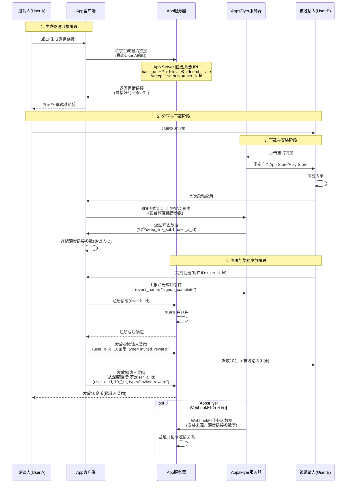
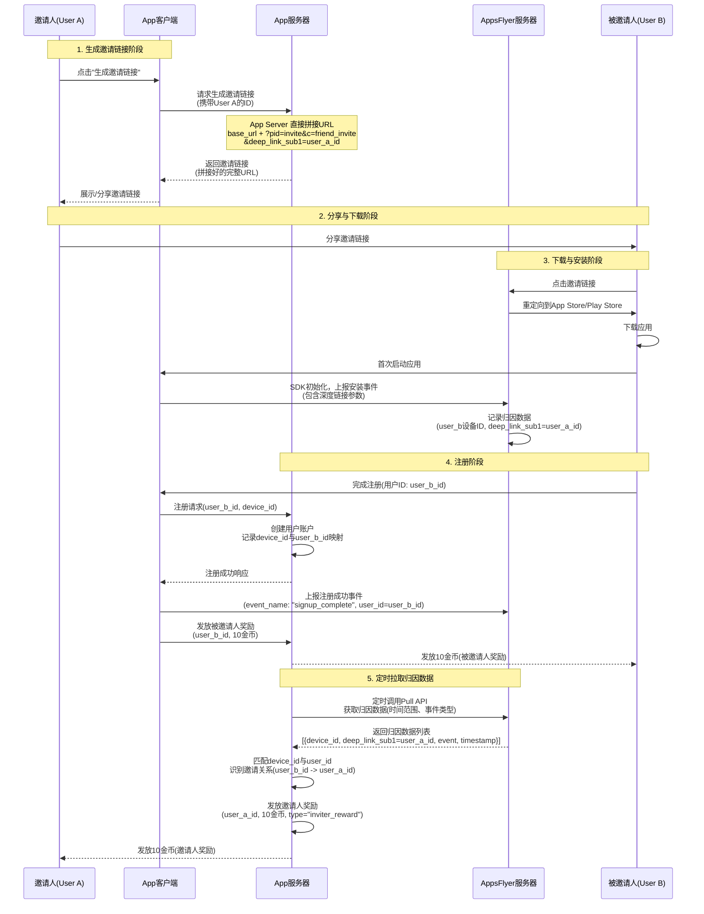

# AppsFlyer 邀请好友注册奖励方案

## 快速回答

### 生成邀请链接的方式

**推荐方式：App → App Server → 直接拼接 URL**

1. **App 请求 App Server**：携带邀请人的用户ID
2. **App Server 直接拼接 URL**：不需要调用 AppsFlyer API，直接在配置好的 OneLink 基础 URL 后添加查询参数即可
3. **返回邀请链接**：App Server 返回完整的邀请链接给 App

### 需要传递的参数

| 参数名 | 说明 | 示例值 | 是否必需 | 备注 |
|--------|------|--------|----------|------|
| `pid` | 媒体来源（渠道标识） | `invite` | ✅ 必需 | **固定值，表示邀请来源**（生成链接时还不知道具体分享渠道） |
| `c` | 活动名称（Campaign） | `friend_invite` | ✅ 必需 | 用于区分不同的邀请活动 |
| `deep_link_sub1` | 邀请人用户ID | `user_12345` | ✅ **必需（核心参数）** | **用于识别邀请关系** |

**完整链接示例：**
```
https://yourapp.onelink.me/abc123?pid=invite&c=friend_invite&deep_link_sub1=user_12345
```

**注意：**
- 不需要调用 AppsFlyer API 生成链接
- 在 AppsFlyer 后台配置 OneLink 模板后，会得到一个固定的基础 URL
- App Server 只需在该 URL 后拼接参数即可

**关于 `pid`（媒体来源）的说明：**
- `pid` 通常用于标识推广渠道（如 Facebook、Google Ads 等）
- 但在邀请场景中，**生成链接时还不知道用户会通过什么渠道分享**（微信、短信、邮件等）
- **解决方案**：将所有邀请链接的 `pid` 设置为固定值 `invite`，表示这是邀请来源
- 如果后续需要区分具体分享渠道，可以在 AppsFlyer 报表中通过其他维度分析，或者使用 `deep_link_sub2` 等参数传递分享渠道信息

---

## 可行性分析

**结论：可以实现**

AppsFlyer 支持用户邀请归因（User Invite Attribution）功能，可以通过 OneLink 深度链接功能实现邀请关系的追踪和奖励发放。

---

## 需要借助的 AppsFlyer 功能

### 1. **OneLink 深度链接**
- 用于生成包含邀请人信息的唯一邀请链接
- 支持自定义参数传递（如邀请人ID）
- 可在 iOS、Android、Web 平台统一追踪

### 2. **深度链接参数传递**
- 使用 `deep_link_sub1` 或 `custom_parameters` 传递邀请人唯一标识符（用户ID）
- 示例链接格式：`https://yourapp.onelink.me/xxx?deep_link_sub1=inviter_user_id_123`

### 3. **归因数据回传（Postback/Webhook）**
- AppsFlyer 服务器可以将归因数据实时/定时推送到应用服务器
- 包含安装来源、深度链接参数、用户标识等信息
- 用于识别邀请关系并触发奖励发放

### 4. **应用内事件上报**
- SDK 上报注册成功等关键事件
- 与归因数据关联，确定用户的完整行为路径

---

## 实现方案

### 方案一：实时归因回传（推荐）

1. **生成邀请链接**
   - 邀请人请求生成邀请链接
   - **推荐方式**：App 请求 App Server，App Server 生成 OneLink 链接并返回
   - **备选方式**：App 直接使用 SDK 生成（需要提前配置模板）
   - 在链接中添加 `deep_link_sub1=邀请人用户ID`

2. **被邀请人流程**
   - 被邀请人点击邀请链接
   - 下载并安装应用
   - AppsFlyer 捕获深度链接参数并建立归因关系

3. **注册事件触发**
   - 被邀请人首次打开应用并完成注册
   - App 通过 SDK 上报注册成功事件
   - 同时读取深度链接参数获取邀请人ID

4. **奖励发放**
   - **奖励被邀请人**：App 或 App Server 直接发放 10 金币（注册事件触发）
   - **奖励邀请人**：
     - 方式A：App 读取深度链接参数，直接调用 App Server 发放邀请人奖励
     - 方式B：App Server 通过 AppsFlyer Webhook/Postback 获取归因数据，识别邀请关系后发放

### 方案二：定时拉取归因数据

1. **生成邀请链接**（同上）
2. **被邀请人流程**（同上）
3. **定时数据拉取**
   - App Server 定时调用 AppsFlyer API 拉取归因数据
   - 匹配注册用户列表，识别邀请关系
   - 批量发放邀请人和被邀请人奖励

---

## 时序图

### 方案一：实时归因回传（App 直接读取深度链接参数）



### 方案二：服务器端拉取归因数据



---

## 生成邀请链接详解

### 生成方式对比

#### 方式一：App Server 生成（推荐）⭐

**流程：**
1. App 向 App Server 发送请求，携带邀请人的用户ID
2. App Server 根据预先配置的 OneLink 模板 URL，拼接参数生成完整链接
3. App Server 返回邀请链接给 App
4. App 展示或分享链接给用户

**优势：**
- ✅ 安全性高：API Token 等敏感信息不会暴露在客户端
- ✅ 便于管理：统一在服务端控制链接格式和参数
- ✅ 易于审计：所有链接生成记录在服务端
- ✅ 灵活扩展：可以添加业务逻辑验证、防作弊等

**技术实现：**
- 不需要调用 AppsFlyer API
- 在 AppsFlyer 后台配置 OneLink 模板后，会得到一个基础 URL
- App Server 直接通过 URL 拼接参数即可

#### 方式二：App 直接生成

**流程：**
1. App 通过 AppsFlyer SDK 或直接拼接 URL 生成邀请链接
2. App 展示或分享链接给用户

**适用场景：**
- 简单的业务场景
- 不需要服务端验证的情况

**劣势：**
- ⚠️ 安全性较低：如果使用 API Token，会暴露在客户端
- ⚠️ 难以管理和审计

---

### 生成邀请链接所需参数

#### 必需参数

| 参数名 | 说明 | 示例值 | 用途 | 注意事项 |
|--------|------|--------|------|----------|
| **`pid`** | 媒体来源（Partner Identifier） | `invite` | 标识邀请活动的来源渠道 | **设置为固定值 `invite`**，因为生成链接时还不知道具体分享渠道 |
| **`c`** | 活动名称（Campaign） | `friend_invite` | 区分不同的邀请活动 | 可用于区分不同的邀请活动类型 |
| **`deep_link_sub1`** | 自定义参数1 | `user_12345` | **传递邀请人的用户ID**（核心参数） | **这是识别邀请关系的核心参数** |

**关于 `pid` 参数的详细说明：**

- **`pid` 的含义**：Partner Identifier，在 AppsFlyer 中通常用于标识推广渠道（如 `facebook`、`google_ads` 等）
- **邀请场景的特殊性**：
  - 生成邀请链接时，用户还没有选择分享渠道（微信、短信、邮件、复制链接等）
  - 即使知道了分享渠道，一个用户可能会通过多个渠道分享同一个链接
  - **因此，将所有邀请链接统一使用 `pid=invite` 即可**

- **如果需要区分分享渠道（可选）**：
  - 方案A：不在链接中区分，统一使用 `pid=invite`
  - 方案B：在分享时记录渠道信息到数据库（链接 + 分享渠道 + 时间）
  - 方案C：如果需要统计，可以使用 `deep_link_sub2` 传递分享渠道，但需要在分享时动态修改链接

#### 可选参数

| 参数名 | 说明 | 示例值 |
|--------|------|--------|
| `deep_link_sub2` | 自定义参数2 | 可用于传递其他业务信息 |
| `deep_link_sub3` | 自定义参数3 | 可用于传递其他业务信息 |
| `deep_link_sub4` | 自定义参数4 | 可用于传递其他业务信息 |
| `deep_link_sub5` | 自定义参数5 | 可用于传递其他业务信息 |
| `af_dp` | 深度链接目标 | 应用内页面路径 |
| `af_sub1` ~ `af_sub5` | AppsFlyer 统计参数 | 用于报表统计的维度 |

#### 链接格式示例

**基础格式：**
```
https://{onelink_domain}/onelink/{onelink_id}?pid={pid}&c={campaign}&deep_link_sub1={inviter_user_id}
```

**完整示例：**
```
https://yourapp.onelink.me/abc123?pid=invite&c=friend_invite&deep_link_sub1=user_12345
```

**带更多参数的示例：**
```
https://yourapp.onelink.me/abc123?pid=invite&c=friend_invite&deep_link_sub1=user_12345&deep_link_sub2=20250101&af_sub1=ios
```

---

### App Server 生成链接的接口示例

#### 请求

```http
POST /api/v1/invite/generate-link
Content-Type: application/json
Authorization: Bearer {user_token}

{
  "user_id": "user_12345"
}
```

#### 响应

```json
{
  "code": 200,
  "message": "success",
  "data": {
    "invite_link": "https://yourapp.onelink.me/abc123?pid=invite&c=friend_invite&deep_link_sub1=user_12345",
    "qr_code_url": "https://api.qrcode.com/...",
    "expires_at": "2025-12-31T23:59:59Z"
  }
}
```

#### 服务端实现伪代码

```python
# Python 示例
def generate_invite_link(inviter_user_id: str) -> str:
    """
    生成邀请链接
    
    Args:
        inviter_user_id: 邀请人的用户ID
        
    Returns:
        完整的邀请链接URL
    """
    # 在 AppsFlyer 后台配置 OneLink 后获得的基础URL
    base_url = "https://yourapp.onelink.me/abc123"
    
    # 构建参数
    params = {
        "pid": "invite",                    # 媒体来源：固定值，表示邀请来源
                                            # 注意：生成链接时还不知道具体分享渠道（微信/短信/邮件等）
        "c": "friend_invite",               # 活动名称：用于区分不同的邀请活动
        "deep_link_sub1": inviter_user_id   # 邀请人ID：核心参数，用于识别邀请关系
    }
    
    # 拼接URL
    invite_link = f"{base_url}?{urlencode(params)}"
    
    # 可选：记录到数据库，用于后续验证
    # save_invite_link(inviter_user_id, invite_link)
    
    return invite_link
```

**关于 `pid` 的说明：**
- `pid` 设置为固定值 `invite`，因为：
  1. 生成链接时，用户尚未选择分享渠道
  2. 同一个链接可能通过多个渠道分享
  3. 在 AppsFlyer 报表中，所有邀请来源都归类为 `invite`，便于统一分析
- 如果需要区分分享渠道，可以在用户分享时记录到数据库，而不是修改链接参数

---

## 技术实现要点

### 1. OneLink 配置（在 AppsFlyer 后台完成）

**步骤：**
1. 登录 AppsFlyer 控制台
2. 进入 "OneLink" → "创建 OneLink"
3. 填写基础信息：
   - OneLink 名称：如 "用户邀请链接"
   - 默认目标：应用商店链接（iOS App Store URL / Google Play URL）
4. 配置自定义参数映射：
   - 映射 `deep_link_sub1` 到应用内的参数接收字段
5. 保存后获得 OneLink 基础 URL，格式如：`https://yourapp.onelink.me/{onelink_id}`

**注意事项：**
- OneLink 模板配置好后，会生成一个固定的基础 URL
- 后续只需在该 URL 后添加查询参数即可
- **不需要每次都调用 AppsFlyer API 生成新链接**

### 2. SDK 集成

#### 2.1 获取深度链接参数（`deep_link_sub1`）

**答案：是的，App 可以通过 AppsFlyer SDK 获取到 `deep_link_sub1` 参数（邀请者ID）。**

AppsFlyer SDK 提供了深度链接回调方法，可以在应用启动时或收到深度链接时获取自定义参数。

#### iOS 实现示例

**使用 Swift：**

```swift
import AppsFlyerLib

class AppDelegate: UIResponder, UIApplicationDelegate, AppsFlyerLibDelegate {
    
    func application(_ application: UIApplication, didFinishLaunchingWithOptions launchOptions: [UIApplication.LaunchOptionsKey: Any]?) -> Bool {
        
        // 初始化 AppsFlyer SDK
        AppsFlyerLib.shared().appsFlyerDevKey = "YOUR_DEV_KEY"
        AppsFlyerLib.shared().appleAppID = "YOUR_APP_ID"
        AppsFlyerLib.shared().delegate = self
        AppsFlyerLib.shared().isDebug = false
        
        // 启用深度链接
        AppsFlyerLib.shared().enableFacebookDeferredApplinks = true
        
        return true
    }
    
    // 深度链接回调方法
    func onConversionDataSuccess(_ conversionInfo: [AnyHashable : Any]) {
        // 首次安装或非深度链接启动时调用
        // 这里可以获取归因数据，但不包含深度链接参数
    }
    
    func onConversionDataFail(_ error: Error) {
        // 归因数据获取失败
    }
    
    // OneLink 深度链接回调（重要：用于获取 deep_link_sub1）
    func onAppOpenAttribution(_ attributionData: [AnyHashable : Any]) {
        // 通过深度链接打开应用时调用
        if let deepLinkSub1 = attributionData["deep_link_sub1"] as? String {
            print("邀请者ID: \(deepLinkSub1)")
            // 保存邀请者ID
            saveInviterId(deepLinkSub1)
        }
    }
    
    func onAppOpenAttributionFailure(_ error: Error) {
        // 深度链接参数获取失败
    }
    
    // Universal Links / URL Schemes 处理
    func application(_ app: UIApplication, open url: URL, options: [UIApplication.OpenURLOptionsKey : Any] = [:]) -> Bool {
        AppsFlyerLib.shared().handleOpen(url, sourceApplication: nil, withAnnotation: nil)
        return true
    }
    
    func application(_ application: UIApplication, continue userActivity: NSUserActivity, restorationHandler: @escaping ([UIUserActivityRestoring]?) -> Void) -> Bool {
        AppsFlyerLib.shared().continue(userActivity, restorationHandler: nil)
        return true
    }
    
    // 保存邀请者ID到本地存储
    func saveInviterId(_ inviterId: String) {
        UserDefaults.standard.set(inviterId, forKey: "inviter_user_id")
        UserDefaults.standard.synchronize()
    }
    
    // 获取保存的邀请者ID
    func getInviterId() -> String? {
        return UserDefaults.standard.string(forKey: "inviter_user_id")
    }
}
```

**使用 Objective-C：**

```objc
#import "AppsFlyerLib.h"

@interface AppDelegate () <AppsFlyerLibDelegate>
@end

@implementation AppDelegate

- (BOOL)application:(UIApplication *)application didFinishLaunchingWithOptions:(NSDictionary *)launchOptions {
    // 初始化 AppsFlyer SDK
    [AppsFlyerLib shared].appsFlyerDevKey = @"YOUR_DEV_KEY";
    [AppsFlyerLib shared].appleAppID = @"YOUR_APP_ID";
    [AppsFlyerLib shared].delegate = self;
    
    return YES;
}

// OneLink 深度链接回调
- (void)onAppOpenAttribution:(NSDictionary *)attributionData {
    NSString *inviterId = attributionData[@"deep_link_sub1"];
    if (inviterId) {
        NSLog(@"邀请者ID: %@", inviterId);
        // 保存邀请者ID
        [[NSUserDefaults standardUserDefaults] setObject:inviterId forKey:@"inviter_user_id"];
    }
}

// Universal Links 处理
- (BOOL)application:(UIApplication *)app openURL:(NSURL *)url options:(NSDictionary<UIApplicationOpenURLOptionsKey,id> *)options {
    [[AppsFlyerLib shared] handleOpenURL:url sourceApplication:nil withAnnotation:nil];
    return YES;
}

// 继续用户活动（Universal Links）
- (BOOL)application:(UIApplication *)application continueUserActivity:(NSUserActivity *)userActivity restorationHandler:(void (^)(NSArray<id<UIUserActivityRestoring>> * _Nullable))restorationHandler {
    [[AppsFlyerLib shared] continueUserActivity:userActivity restorationHandler:nil];
    return YES;
}

@end
```

#### Android 实现示例

**使用 Kotlin：**

```kotlin
import com.appsflyer.AppsFlyerLib
import com.appsflyer.deeplink.DeepLinkListener
import com.appsflyer.deeplink.DeepLinkResult

class MainApplication : Application(), DeepLinkListener {
    
    override fun onCreate() {
        super.onCreate()
        
        // 初始化 AppsFlyer SDK
        AppsFlyerLib.getInstance().init(
            "YOUR_DEV_KEY",
            null,
            this
        )
        
        // 设置深度链接监听器
        AppsFlyerLib.getInstance().setDeepLinkListener(this)
        
        // 启动 SDK
        AppsFlyerLib.getInstance().start(this)
    }
    
    // 深度链接回调方法
    override fun onDeepLinking(deepLinkResult: DeepLinkResult) {
        when (deepLinkResult.status) {
            DeepLinkResult.Status.FOUND -> {
                // 成功获取深度链接参数
                val deepLinkData = deepLinkResult.deepLink?.deepLinkValue
                
                // 获取邀请者ID
                val inviterId = deepLinkData?.get("deep_link_sub1") as? String
                if (inviterId != null) {
                    Log.d("AppsFlyer", "邀请者ID: $inviterId")
                    // 保存邀请者ID
                    saveInviterId(inviterId)
                }
            }
            DeepLinkResult.Status.NOT_FOUND -> {
                // 未找到深度链接
                Log.d("AppsFlyer", "未找到深度链接")
            }
            DeepLinkResult.Status.ERROR -> {
                // 获取深度链接时出错
                Log.e("AppsFlyer", "深度链接错误: ${deepLinkResult.error}")
            }
        }
    }
    
    // 保存邀请者ID到 SharedPreferences
    private fun saveInviterId(inviterId: String) {
        val prefs = getSharedPreferences("app_prefs", MODE_PRIVATE)
        prefs.edit().putString("inviter_user_id", inviterId).apply()
    }
    
    // 获取保存的邀请者ID
    fun getInviterId(): String? {
        val prefs = getSharedPreferences("app_prefs", MODE_PRIVATE)
        return prefs.getString("inviter_user_id", null)
    }
}
```

**使用 Java：**

```java
import com.appsflyer.AppsFlyerLib;
import com.appsflyer.deeplink.DeepLinkListener;
import com.appsflyer.deeplink.DeepLinkResult;

public class MainApplication extends Application implements DeepLinkListener {
    
    @Override
    public void onCreate() {
        super.onCreate();
        
        // 初始化 AppsFlyer SDK
        AppsFlyerLib.getInstance().init(
            "YOUR_DEV_KEY",
            null,
            this
        );
        
        // 设置深度链接监听器
        AppsFlyerLib.getInstance().setDeepLinkListener(this);
        
        // 启动 SDK
        AppsFlyerLib.getInstance().start(this);
    }
    
    // 深度链接回调方法
    @Override
    public void onDeepLinking(@NonNull DeepLinkResult deepLinkResult) {
        if (deepLinkResult.getStatus() == DeepLinkResult.Status.FOUND) {
            // 成功获取深度链接参数
            Map<String, Object> deepLinkData = deepLinkResult.getDeepLink().getDeepLinkValue();
            
            // 获取邀请者ID
            String inviterId = (String) deepLinkData.get("deep_link_sub1");
            if (inviterId != null) {
                Log.d("AppsFlyer", "邀请者ID: " + inviterId);
                // 保存邀请者ID
                saveInviterId(inviterId);
            }
        } else if (deepLinkResult.getStatus() == DeepLinkResult.Status.NOT_FOUND) {
            Log.d("AppsFlyer", "未找到深度链接");
        } else {
            Log.e("AppsFlyer", "深度链接错误: " + deepLinkResult.getError());
        }
    }
    
    // 保存邀请者ID
    private void saveInviterId(String inviterId) {
        SharedPreferences prefs = getSharedPreferences("app_prefs", MODE_PRIVATE);
        prefs.edit().putString("inviter_user_id", inviterId).apply();
    }
    
    // 获取保存的邀请者ID
    public String getInviterId() {
        SharedPreferences prefs = getSharedPreferences("app_prefs", MODE_PRIVATE);
        return prefs.getString("inviter_user_id", null);
    }
}
```

#### 2.2 在注册时使用邀请者ID

**示例流程：**

```swift
// iOS 示例
func registerUser(username: String, password: String) {
    // 获取邀请者ID
    let inviterId = getInviterId()
    
    // 调用注册接口
    registerAPI(username: username, password: password, inviterId: inviterId) { result in
        if result.success {
            // 注册成功后，发放被邀请人奖励
            self.sendRewardToInvitedUser(userId: result.userId, amount: 10)
            
            // 如果有邀请者ID，发放邀请人奖励
            if let inviterId = inviterId {
                self.sendRewardToInviter(inviterId: inviterId, amount: 10)
            }
        }
    }
}
```

#### 2.3 上报注册成功事件

```swift
// iOS 示例
func reportSignupComplete(userId: String) {
    let eventParams: [String: Any] = [
        "user_id": userId,
        "af_revenue": 0
    ]
    
    AppsFlyerLib.shared().logEvent("signup_complete", withValues: eventParams)
}
```

```kotlin
// Android 示例
fun reportSignupComplete(userId: String) {
    val eventParams = mapOf(
        "user_id" to userId,
        "af_revenue" to 0
    )
    
    AppsFlyerLib.getInstance().logEvent(
        applicationContext,
        "signup_complete",
        eventParams
    )
}
```

#### 注意事项

1. **深度链接参数获取时机**：
   - 首次安装并通过深度链接打开：在 `onAppOpenAttribution`（iOS）或 `onDeepLinking`（Android）回调中获取
   - 已安装应用通过深度链接打开：同样在深度链接回调中获取
   - **建议**：将获取到的邀请者ID保存到本地存储（UserDefaults/SharedPreferences），以便后续使用

2. **参数持久化**：
   - 获取到 `deep_link_sub1` 后，应立即保存到本地存储
   - 在用户注册时读取并传递到服务器
   - 注册成功后，可以清除本地存储的邀请者ID（避免重复使用）

3. **错误处理**：
   - 深度链接可能获取失败，需要处理错误情况
   - 如果首次启动时未获取到邀请者ID，可能是非深度链接安装，属于正常情况

4. **测试建议**：
   - 使用 AppsFlyer 的测试工具验证深度链接参数传递
   - 在真机上测试邀请链接的完整流程

### 3. 服务器端接口
- **生成邀请链接接口**：接收邀请人ID，返回拼接好的邀请链接
- **注册接口**：关联设备ID和用户ID，接收深度链接参数中的邀请人ID
- **奖励发放接口**：发放邀请人和被邀请人奖励
- **Webhook 接收接口**（如使用方案二）：接收 AppsFlyer 归因数据回传

### 4. 防作弊措施
- 验证邀请链接的唯一性
- 防止同一用户重复邀请奖励
- 验证注册时间与安装时间的合理性
- 限制单个邀请人每日奖励次数

---

## AppsFlyer Pull API 服务端拉取接口详解

### API 概述

AppsFlyer Pull API 允许服务器端主动拉取归因数据，适用于**方案二：定时拉取归因数据**的场景。

### API 端点

#### 汇总数据报告（推荐用于邀请奖励场景）

**端点地址：**
```
https://hq1.appsflyer.com/api/aggregated-data/v5/apps/{app_id}/report
```

**请求方法：** `GET`

#### 原始数据报告（详细数据，数据量大）

**端点地址：**
```
https://hq1.appsflyer.com/api/raw-data/v6/export/{app_id}/in_app_events_report
```

**请求方法：** `GET`

### 认证方式

**使用 API Token 进行认证：**

1. 在 AppsFlyer 控制台获取 API Token：
   - 登录 AppsFlyer 控制台
   - 进入 **设置（Settings）** → **API 访问（API Access）**
   - 创建或查看现有的 API Token

2. 在请求头中携带 Token：
```http
Authorization: Bearer {api_token}
```

或者使用 URL 参数：
```http
https://...?api_token={api_token}
```

### 汇总数据报告 API 详细说明

#### 请求参数

| 参数名 | 类型 | 必需 | 说明 | 示例值 |
|--------|------|------|------|--------|
| `api_token` | string | ✅ | API 认证 Token | `your_api_token_here` |
| `from` | date | ✅ | 开始日期（YYYY-MM-DD） | `2025-01-01` |
| `to` | date | ✅ | 结束日期（YYYY-MM-DD） | `2025-01-31` |
| `group_by` | string | ✅ | 分组维度，多个用逗号分隔 | `day,media_source,campaign` |
| `additional_fields` | string | ❌ | 额外字段，用逗号分隔 | `install_time,deep_link_sub1` |
| `timezone` | string | ❌ | 时区（默认 UTC） | `UTC` |
| `currency` | string | ❌ | 货币代码（默认 USD） | `USD` |
| `event_name` | string | ❌ | 事件名称（筛选特定事件） | `signup_complete` |

**重要参数说明：**

- **`additional_fields`**: 要包含邀请人ID，需要添加 `deep_link_sub1`
  - 示例：`additional_fields=deep_link_sub1,install_time,device_id`
  
- **`group_by`**: 用于分组统计的维度
  - 常用值：`day`, `media_source`, `campaign`, `af_channel`, `deep_link_sub1`
  - 用于邀请奖励，建议：`group_by=day,media_source,campaign,deep_link_sub1`

#### 请求示例

```http
GET https://hq1.appsflyer.com/api/aggregated-data/v5/apps/your_app_id/report?api_token=your_api_token&from=2025-01-01&to=2025-01-31&group_by=day,media_source,campaign,deep_link_sub1&additional_fields=deep_link_sub1,install_time,device_id&event_name=signup_complete
Authorization: Bearer your_api_token
```

#### 响应格式（CSV）

返回 CSV 格式的数据，包含以下字段：

```
Date,Media Source,Campaign,Installs,deep_link_sub1,Device ID,Install Time
2025-01-15,invite,friend_invite,1,user_12345,device_abc,2025-01-15 10:30:00
2025-01-16,invite,friend_invite,2,user_67890,device_def,2025-01-16 14:20:00
```

### 原始数据报告 API 详细说明

#### 请求参数

| 参数名 | 类型 | 必需 | 说明 | 示例值 |
|--------|------|------|------|--------|
| `api_token` | string | ✅ | API 认证 Token | `your_api_token_here` |
| `from` | datetime | ✅ | 开始时间（ISO 8601） | `2025-01-01T00:00:00` |
| `to` | datetime | ✅ | 结束时间（ISO 8601） | `2025-01-31T23:59:59` |
| `timezone` | string | ❌ | 时区（默认 UTC） | `UTC` |
| `additional_fields` | string | ❌ | 额外字段 | `deep_link_sub1,device_id` |
| `event_name` | string | ❌ | 事件名称过滤 | `signup_complete` |

#### 响应格式

返回 JSON 或 CSV 格式的原始事件数据，包含完整的归因信息和自定义参数。

### 服务端实现示例代码

#### Python 示例

```python
import requests
from datetime import datetime, timedelta
from typing import List, Dict
import csv
import io

class AppsFlyerPullAPI:
    """AppsFlyer Pull API 客户端"""
    
    def __init__(self, app_id: str, api_token: str):
        self.app_id = app_id
        self.api_token = api_token
        self.base_url = "https://hq1.appsflyer.com"
    
    def get_attribution_data(
        self, 
        from_date: str, 
        to_date: str,
        event_name: str = "signup_complete"
    ) -> List[Dict]:
        """
        拉取归因数据
        
        Args:
            from_date: 开始日期 (YYYY-MM-DD)
            to_date: 结束日期 (YYYY-MM-DD)
            event_name: 事件名称，用于筛选注册事件
            
        Returns:
            归因数据列表，每个元素包含邀请关系信息
        """
        # 构建请求URL
        url = f"{self.base_url}/api/aggregated-data/v5/apps/{self.app_id}/report"
        
        # 请求参数
        params = {
            "api_token": self.api_token,
            "from": from_date,
            "to": to_date,
            "group_by": "day,media_source,campaign,deep_link_sub1",
            "additional_fields": "deep_link_sub1,install_time,device_id,event_time",
            "event_name": event_name,
            "timezone": "UTC"
        }
        
        # 发送请求
        headers = {
            "Authorization": f"Bearer {self.api_token}"
        }
        
        response = requests.get(url, params=params, headers=headers)
        response.raise_for_status()
        
        # 解析CSV响应
        csv_data = response.text
        reader = csv.DictReader(io.StringIO(csv_data))
        
        attribution_data = []
        for row in reader:
            attribution_data.append({
                "date": row.get("Date"),
                "media_source": row.get("Media Source"),
                "campaign": row.get("Campaign"),
                "inviter_user_id": row.get("deep_link_sub1"),  # 邀请人ID
                "device_id": row.get("Device ID"),
                "install_time": row.get("Install Time"),
                "event_time": row.get("event_time"),
                "installs": int(row.get("Installs", 0))
            })
        
        return attribution_data
    
    def process_invite_rewards(self, attribution_data: List[Dict]):
        """
        处理邀请奖励
        
        Args:
            attribution_data: 归因数据列表
        """
        for data in attribution_data:
            # 只处理邀请来源的数据
            if data["media_source"] != "invite":
                continue
            
            inviter_user_id = data.get("inviter_user_id")
            if not inviter_user_id:
                continue
            
            # TODO: 通过 device_id 匹配到实际用户ID
            # 需要维护 device_id 与 user_id 的映射关系（在注册时记录）
            device_id = data["device_id"]
            invited_user_id = self.get_user_id_by_device_id(device_id)
            
            if not invited_user_id:
                continue
            
            # 检查是否已经发放过奖励（防重复）
            if self.is_reward_sent(inviter_user_id, invited_user_id):
                continue
            
            # 发放邀请人奖励
            self.send_reward(
                user_id=inviter_user_id,
                amount=10,
                reward_type="inviter_reward",
                reason=f"邀请用户 {invited_user_id} 注册成功"
            )
            
            # 记录奖励发放记录
            self.record_reward_sent(inviter_user_id, invited_user_id)
    
    def get_user_id_by_device_id(self, device_id: str) -> str:
        """根据设备ID获取用户ID（需要实现）"""
        # TODO: 从数据库查询 device_id 与 user_id 的映射关系
        # 这个映射关系应该在用户注册时记录
        pass
    
    def is_reward_sent(self, inviter_user_id: str, invited_user_id: str) -> bool:
        """检查是否已经发放过奖励"""
        # TODO: 查询数据库，检查是否已经发放过该邀请关系的奖励
        pass
    
    def send_reward(self, user_id: str, amount: int, reward_type: str, reason: str):
        """发放奖励"""
        # TODO: 调用奖励发放接口
        pass
    
    def record_reward_sent(self, inviter_user_id: str, invited_user_id: str):
        """记录奖励发放记录"""
        # TODO: 保存到数据库
        pass


# 使用示例
def sync_invite_rewards():
    """定时任务：同步邀请奖励"""
    api = AppsFlyerPullAPI(
        app_id="your_app_id",
        api_token="your_api_token"
    )
    
    # 拉取昨天的数据
    yesterday = (datetime.now() - timedelta(days=1)).strftime("%Y-%m-%d")
    today = datetime.now().strftime("%Y-%m-%d")
    
    # 拉取归因数据
    attribution_data = api.get_attribution_data(
        from_date=yesterday,
        to_date=today,
        event_name="signup_complete"
    )
    
    # 处理邀请奖励
    api.process_invite_rewards(attribution_data)
```

#### Node.js 示例

```javascript
const axios = require('axios');
const csv = require('csv-parser');
const { Readable } = require('stream');

class AppsFlyerPullAPI {
  constructor(appId, apiToken) {
    this.appId = appId;
    this.apiToken = apiToken;
    this.baseUrl = 'https://hq1.appsflyer.com';
  }

  async getAttributionData(fromDate, toDate, eventName = 'signup_complete') {
    const url = `${this.baseUrl}/api/aggregated-data/v5/apps/${this.appId}/report`;
    
    const params = {
      api_token: this.apiToken,
      from: fromDate,
      to: toDate,
      group_by: 'day,media_source,campaign,deep_link_sub1',
      additional_fields: 'deep_link_sub1,install_time,device_id,event_time',
      event_name: eventName,
      timezone: 'UTC'
    };

    const headers = {
      Authorization: `Bearer ${this.apiToken}`
    };

    try {
      const response = await axios.get(url, { params, headers });
      
      // 解析CSV响应
      const results = [];
      const stream = Readable.from([response.data]);
      
      return new Promise((resolve, reject) => {
        stream
          .pipe(csv())
          .on('data', (row) => {
            if (row['Media Source'] === 'invite' && row['deep_link_sub1']) {
              results.push({
                date: row['Date'],
                mediaSource: row['Media Source'],
                campaign: row['Campaign'],
                inviterUserId: row['deep_link_sub1'],
                deviceId: row['Device ID'],
                installTime: row['Install Time'],
                eventTime: row['event_time'],
                installs: parseInt(row['Installs'] || 0)
              });
            }
          })
          .on('end', () => resolve(results))
          .on('error', reject);
      });
    } catch (error) {
      console.error('拉取归因数据失败:', error);
      throw error;
    }
  }

  async processInviteRewards(attributionData) {
    for (const data of attributionData) {
      // 获取被邀请人用户ID
      const invitedUserId = await this.getUserIdByDeviceId(data.deviceId);
      if (!invitedUserId) continue;

      // 检查是否已发放奖励
      const isRewardSent = await this.isRewardSent(data.inviterUserId, invitedUserId);
      if (isRewardSent) continue;

      // 发放邀请人奖励
      await this.sendReward({
        userId: data.inviterUserId,
        amount: 10,
        rewardType: 'inviter_reward',
        reason: `邀请用户 ${invitedUserId} 注册成功`
      });

      // 记录奖励发放
      await this.recordRewardSent(data.inviterUserId, invitedUserId);
    }
  }

  async getUserIdByDeviceId(deviceId) {
    // TODO: 从数据库查询
  }

  async isRewardSent(inviterUserId, invitedUserId) {
    // TODO: 检查数据库
  }

  async sendReward({ userId, amount, rewardType, reason }) {
    // TODO: 调用奖励发放接口
  }

  async recordRewardSent(inviterUserId, invitedUserId) {
    // TODO: 保存到数据库
  }
}

// 使用示例
async function syncInviteRewards() {
  const api = new AppsFlyerPullAPI('your_app_id', 'your_api_token');
  
  const yesterday = new Date();
  yesterday.setDate(yesterday.getDate() - 1);
  const today = new Date();

  const attributionData = await api.getAttributionData(
    yesterday.toISOString().split('T')[0],
    today.toISOString().split('T')[0],
    'signup_complete'
  );

  await api.processInviteRewards(attributionData);
}
```

### 定时任务配置

#### 使用 Cron 定时拉取数据

```python
# 每天凌晨2点拉取前一天的数据
# crontab 配置
# 0 2 * * * /usr/bin/python3 /path/to/sync_invite_rewards.py
```

或者使用任务调度框架：

```python
from apscheduler.schedulers.blocking import BlockingScheduler

scheduler = BlockingScheduler()

@scheduler.scheduled_job('cron', hour=2, minute=0)
def sync_rewards():
    sync_invite_rewards()

scheduler.start()
```

### 注意事项

1. **API 限流**：
   - AppsFlyer Pull API 有请求频率限制
   - 建议每次拉取至少间隔 1 小时
   - 不要频繁调用，建议每天拉取 1-2 次

2. **数据延迟**：
   - 归因数据通常有 1-2 小时的延迟
   - 建议在次日凌晨拉取前一天的数据

3. **设备ID 与用户ID 映射**：
   - 需要在用户注册时记录 `device_id` 与 `user_id` 的映射关系
   - 用于在拉取数据后，通过 `device_id` 找到实际的用户

4. **防重复奖励**：
   - 需要记录已发放的邀请关系，防止重复发放
   - 建议使用数据库唯一索引：`(inviter_user_id, invited_user_id)`

5. **错误处理**：
   - API 调用可能失败，需要实现重试机制
   - 记录失败日志，便于排查问题

### API 文档链接

- **汇总数据 Pull API**：https://support.appsflyer.com/hc/zh-cn/articles/207034346-Pull-API%E6%B1%87%E6%80%BB%E6%95%B0%E6%8D%AE
- **原始数据 Pull API**：https://support.appsflyer.com/hc/zh-cn/articles/360007530258-Pull-API%E5%8E%9F%E5%A7%8B%E6%95%B0%E6%8D%AE%E6%8A%A5%E5%91%8A
- **官方 API 文档**：https://dev.appsflyer.com/hc/docs/pull-api

---

## 推荐方案

**推荐使用方案一（实时归因回传）**

**优势：**
- 奖励发放及时，用户体验好
- 实现相对简单，不依赖定时任务
- 减少服务器压力

**注意事项：**
- 需要确保深度链接参数在 App 中正确读取和存储
- 建议增加 AppsFlyer Webhook 作为数据校验和备份

---

## 参考资料

- [AppsFlyer 用户邀请归因文档](https://support.appsflyer.com/hc/zh-cn/articles/115004480866-%E7%94%A8%E6%88%B7%E9%82%80%E8%AF%B7%E5%BD%92%E5%9B%A0)
- [AppsFlyer OneLink 创建指南](https://support.appsflyer.com/hc/zh-cn/articles/208874366)
- [AppsFlyer Pull API 文档](https://dev.appsflyer.com/hc/docs/pull-api)

