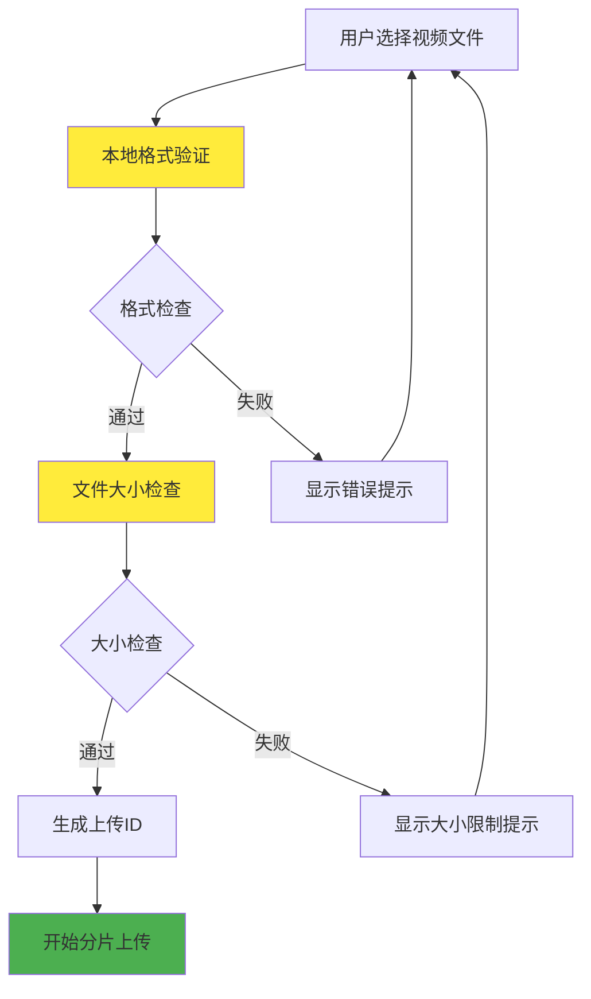
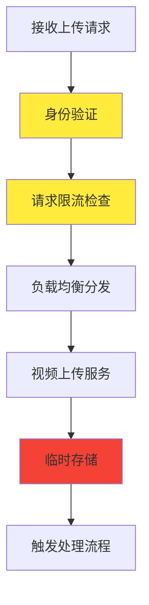
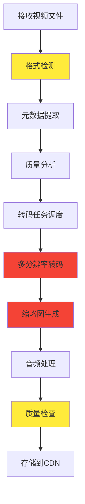
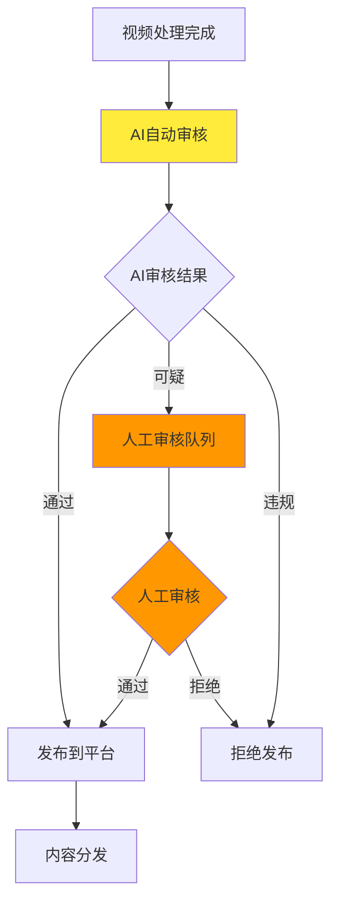
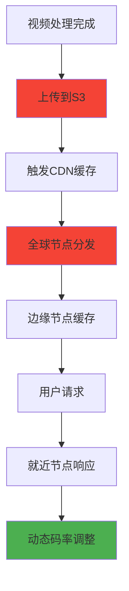
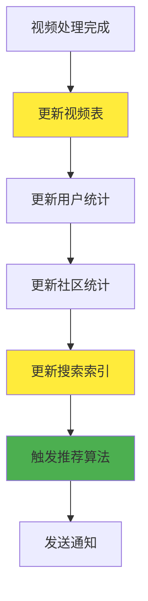
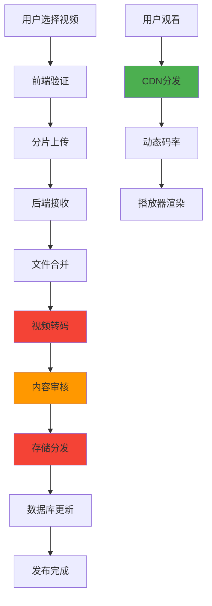
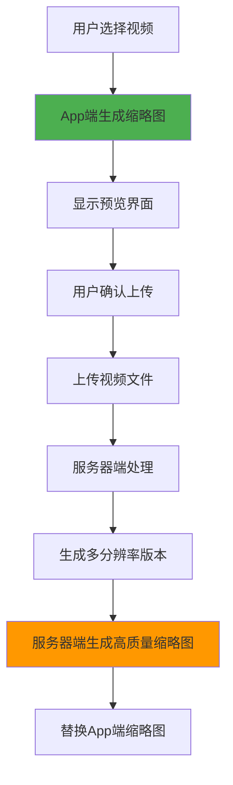

# Reddit视频处理流程分析

## 概述

本文档详细分析了Reddit处理视频贴的完整流程，从用户在移动端App上传视频开始，到后端系统完成处理并发布的全过程。Reddit作为全球最大的社交平台之一，其视频处理系统需要处理海量的视频内容，确保高质量的用户体验。

## 系统架构概览

Reddit采用现代化的微服务架构，主要组件包括：

- **前端应用层**: iOS/Android App, Web客户端
- **API网关**: 统一入口，负载均衡
- **视频处理服务**: 转码、压缩、格式转换
- **存储层**: AWS S3, CDN分发网络
- **内容审核**: AI + 人工审核系统
- **数据库**: 元数据存储和用户信息管理

## 详细流程分析

### 1. 前端上传流程

#### 1.1 用户交互层



#### 1.2 前端处理步骤

1. **文件选择与验证**
   - 支持格式: MP4, MOV, AVI, WebM
   - 大小限制: 最大1GB
   - 时长限制: 最长15分钟
   - 分辨率限制: 最大4K

2. **本地预处理**
   - 生成文件MD5哈希值作为唯一标识
   - 计算文件分片数量（每片5MB）
   - 压缩缩略图预览

3. **分片上传策略**
   - 并发上传3-5个分片
   - 失败重试机制（最多3次）
   - 断点续传支持

#### 1.3 前端耗时分析

| 操作 | 耗时 | 说明 |
|------|------|------|
| 文件选择 | 1-3秒 | 用户操作时间 |
| 格式验证 | 50-200ms | 本地检查 |
| 文件分析 | 100-500ms | 获取元数据 |
| 分片准备 | 200-1000ms | 计算分片信息 |
| 上传进度 | 取决于文件大小 | 网络传输时间 |

### 2. 后端接收流程

#### 2.1 API网关层



#### 2.2 后端处理步骤

1. **请求验证**
   - JWT Token验证
   - 用户权限检查
   - 上传配额限制（每日30个视频）

2. **分片接收**
   - 验证分片完整性
   - 临时存储到Redis
   - 记录上传进度

3. **文件合并**
   - 检查所有分片完整性
   - 合并为完整文件
   - 存储到临时目录

#### 2.3 后端耗时分析

| 操作 | 耗时 | 说明 |
|------|------|------|
| 身份验证 | 10-50ms | JWT验证 |
| 限流检查 | 5-20ms | Redis查询 |
| 分片验证 | 20-100ms | 哈希校验 |
| 文件合并 | 1-10秒 | 取决于文件大小 |
| 临时存储 | 500ms-5秒 | I/O操作 |

### 3. 视频处理流程

#### 3.1 转码处理管道



#### 3.2 转码处理步骤

1. **视频分析**
   - 使用FFprobe分析视频属性
   - 检测编码格式、分辨率、帧率
   - 评估转码复杂度

2. **多分辨率转码**
   - 生成多种分辨率版本：
     - 240p (移动端低带宽)
     - 480p (移动端标准)
     - 720p (桌面端标准)
     - 1080p (高清)
     - 4K (超高清，可选)

3. **编码优化**
   - H.264编码（兼容性最佳）
   - H.265编码（压缩率更高）
   - 自适应码率（ABR）

4. **缩略图生成**
   - 提取关键帧
   - 生成多种尺寸缩略图
   - 支持GIF预览

#### 3.3 转码耗时分析

| 视频规格 | 转码耗时 | 说明 |
|----------|----------|------|
| 1分钟720p | 30-60秒 | 标准质量 |
| 5分钟1080p | 2-5分钟 | 高清质量 |
| 10分钟4K | 10-30分钟 | 超高清质量 |
| 复杂特效视频 | 2-3倍标准时间 | 特殊处理 |

### 4. 内容审核流程

#### 4.1 多层审核架构



#### 4.2 审核处理步骤

1. **AI自动审核**
   - 图像识别：检测暴力、色情、血腥内容
   - 音频分析：识别不当音频内容
   - 文本识别：OCR识别视频中的文字
   - 版权检测：识别受版权保护的内容

2. **人工审核**
   - 可疑内容人工复审
   - 用户举报处理
   - 社区准则执行

3. **审核决策**
   - 自动通过：内容安全
   - 人工审核：需要人工判断
   - 拒绝发布：明确违规

#### 4.3 审核耗时分析

| 审核类型 | 耗时 | 说明 |
|----------|------|------|
| AI自动审核 | 10-30秒 | 机器学习模型 |
| 人工审核 | 5-30分钟 | 人工处理时间 |
| 版权检测 | 1-5分钟 | 数据库比对 |
| 用户举报 | 1-24小时 | 响应时间 |

### 5. 存储与分发流程

#### 5.1 CDN分发架构



#### 5.2 存储策略

1. **多级存储**
   - 热存储：SSD，访问频繁的内容
   - 温存储：标准存储，中等访问频率
   - 冷存储：归档存储，低访问频率

2. **CDN配置**
   - 全球200+节点
   - 智能路由选择
   - 缓存策略优化

3. **备份策略**
   - 多区域备份
   - 版本控制
   - 灾难恢复

#### 5.3 分发耗时分析

| 操作 | 耗时 | 说明 |
|------|------|------|
| S3上传 | 1-10秒 | 取决于文件大小 |
| CDN缓存 | 30秒-5分钟 | 全球节点同步 |
| 边缘缓存 | 即时 | 本地节点命中 |
| 用户访问 | 100-500ms | 网络延迟 |

### 6. 数据库更新流程

#### 6.1 元数据管理



#### 6.2 数据库操作

1. **视频元数据**
   - 文件信息：大小、时长、格式
   - 处理状态：转码进度、审核状态
   - 访问统计：播放次数、点赞数

2. **用户数据**
   - 上传历史
   - 存储配额使用
   - 社区贡献统计

3. **搜索索引**
   - 视频标题和描述
   - 标签和分类
   - 内容特征向量

#### 6.3 数据库耗时分析

| 操作 | 耗时 | 说明 |
|------|------|------|
| 视频表更新 | 10-50ms | 主数据库写入 |
| 统计更新 | 20-100ms | 聚合计算 |
| 搜索索引 | 100-500ms | 全文索引更新 |
| 推荐计算 | 1-5秒 | 算法计算 |

## 完整端到端流程

### 总体流程图



### 端到端耗时分析

| 阶段 | 典型耗时 | 影响因素 |
|------|----------|----------|
| 前端上传 | 30秒-10分钟 | 文件大小、网络速度 |
| 后端处理 | 1-5分钟 | 文件大小、服务器负载 |
| 视频转码 | 2-30分钟 | 视频长度、分辨率、复杂度 |
| 内容审核 | 10秒-30分钟 | AI处理、人工审核 |
| 存储分发 | 1-10分钟 | CDN同步、全球分发 |
| 数据库更新 | 1-10秒 | 数据量、索引更新 |
| **总计** | **5-60分钟** | **综合因素** |

## 性能优化策略

### 1. 前端优化

#### 1.1 上传优化
```javascript
// 并发分片上传
const uploadChunks = async (file, uploadId) => {
    const chunks = createChunks(file, 5 * 1024 * 1024); // 5MB chunks
    const concurrency = 3;
    
    for (let i = 0; i < chunks.length; i += concurrency) {
        const batch = chunks.slice(i, i + concurrency);
        await Promise.all(batch.map((chunk, index) => 
            uploadChunk(chunk, uploadId, i + index)
        ));
    }
};
```

#### 1.2 断点续传
```javascript
// 断点续传实现
const resumeUpload = async (file, uploadId) => {
    const uploadedParts = await getUploadedParts(uploadId);
    const remainingParts = getRemainingParts(file, uploadedParts);
    return uploadParts(remainingParts, uploadId);
};
```

### 2. 后端优化

#### 2.1 异步处理
```python
# 异步视频处理
@celery.task
def process_video_async(video_id):
    video = Video.objects.get(id=video_id)
    
    # 转码处理
    transcode_result = transcode_video(video.file_path)
    
    # 生成缩略图
    thumbnail_result = generate_thumbnail(video.file_path)
    
    # 更新状态
    video.status = 'processed'
    video.save()
    
    return transcode_result, thumbnail_result
```

#### 2.2 分布式转码
```python
# 分布式转码调度
class VideoTranscodeScheduler:
    def __init__(self):
        self.worker_pool = WorkerPool()
    
    def schedule_transcode(self, video_id, priority='normal'):
        task = TranscodeTask(
            video_id=video_id,
            priority=priority,
            estimated_duration=self.estimate_duration(video_id)
        )
        return self.worker_pool.submit(task)
```

### 3. 存储优化

#### 3.1 智能缓存
```python
# CDN缓存策略
class CDNCacheStrategy:
    def __init__(self):
        self.cache_rules = {
            'hot_content': {'ttl': 86400, 'priority': 'high'},
            'normal_content': {'ttl': 3600, 'priority': 'medium'},
            'cold_content': {'ttl': 300, 'priority': 'low'}
        }
    
    def get_cache_config(self, video_id):
        popularity = self.get_video_popularity(video_id)
        return self.cache_rules.get(popularity, self.cache_rules['normal_content'])
```

#### 3.2 多级存储
```python
# 存储层级管理
class StorageTierManager:
    def __init__(self):
        self.tiers = {
            'hot': 'ssd_storage',
            'warm': 'standard_storage', 
            'cold': 'archive_storage'
        }
    
    def migrate_content(self, video_id, target_tier):
        current_tier = self.get_current_tier(video_id)
        if current_tier != target_tier:
            self.move_content(video_id, current_tier, target_tier)
```

### 4. 监控与告警

#### 4.1 性能监控
```python
# 性能指标收集
class VideoProcessingMetrics:
    def __init__(self):
        self.metrics = {
            'upload_time': Histogram('video_upload_duration_seconds'),
            'transcode_time': Histogram('video_transcode_duration_seconds'),
            'error_rate': Counter('video_processing_errors_total')
        }
    
    def record_upload_time(self, duration):
        self.metrics['upload_time'].observe(duration)
    
    def record_transcode_time(self, duration):
        self.metrics['transcode_time'].observe(duration)
```

#### 4.2 告警机制
```python
# 告警规则配置
ALERT_RULES = {
    'high_error_rate': {
        'condition': 'error_rate > 0.05',
        'duration': '5m',
        'severity': 'critical'
    },
    'slow_processing': {
        'condition': 'avg_transcode_time > 1800',
        'duration': '10m', 
        'severity': 'warning'
    }
}
```

## 技术栈分析

### 1. 前端技术
- **移动端**: React Native, Swift, Kotlin
- **Web端**: React, TypeScript
- **上传库**: tus.js, resumable.js
- **视频处理**: WebAssembly FFmpeg

### 2. 后端技术
- **API网关**: Kong, Envoy
- **微服务**: Go, Python, Node.js
- **消息队列**: Apache Kafka, RabbitMQ
- **任务调度**: Celery, Apache Airflow

### 3. 存储技术
- **对象存储**: AWS S3, Google Cloud Storage
- **CDN**: CloudFlare, AWS CloudFront
- **数据库**: PostgreSQL, Redis, Elasticsearch
- **缓存**: Redis, Memcached

### 4. 视频处理
- **转码引擎**: FFmpeg, GStreamer
- **AI审核**: TensorFlow, PyTorch
- **容器化**: Docker, Kubernetes
- **监控**: Prometheus, Grafana

## 总结与建议

### 关键性能指标

1. **上传成功率**: >99.5%
2. **转码完成时间**: <30分钟（95%分位）
3. **CDN命中率**: >95%
4. **用户播放延迟**: <2秒
5. **系统可用性**: >99.9%

### 优化建议优先级

#### 高优先级
1. **实现断点续传** - 提升用户体验
2. **优化转码算法** - 减少处理时间
3. **增强CDN缓存** - 提升播放性能

#### 中优先级
1. **分布式转码** - 提升处理能力
2. **智能存储分层** - 降低成本
3. **AI审核优化** - 减少人工成本

#### 低优先级
1. **边缘计算** - 就近处理
2. **预测性缓存** - 智能预加载
3. **自适应码率** - 动态质量调整

### 未来发展方向

1. **实时视频处理** - 支持直播功能
2. **AI内容生成** - 自动生成缩略图和摘要
3. **沉浸式体验** - VR/AR视频支持
4. **区块链版权** - 内容版权保护

通过系统性的优化，Reddit的视频处理系统能够更好地支持海量用户和内容，提供流畅、高质量的视频体验。

## 18. Reddit视频截图实现分析

### 18.1 Reddit截图策略

#### 18.1.1 截图位置：App端截图

**Reddit采用App端截图策略**：
```
截图实现位置: 移动端App
截图时机: 用户选择视频后，上传前
截图用途: 视频预览、缩略图生成
```

#### 18.1.2 截图实现方式

**iOS实现**:
```swift
import AVFoundation
import UIKit

class RedditVideoThumbnailGenerator {
    func generateThumbnail(from videoURL: URL) -> UIImage? {
        let asset = AVAsset(url: videoURL)
        let imageGenerator = AVAssetImageGenerator(asset: asset)
        
        // 配置生成器
        imageGenerator.appliesPreferredTrackTransform = true
        imageGenerator.requestedTimeToleranceAfter = .zero
        imageGenerator.requestedTimeToleranceBefore = .zero
        
        // 生成缩略图（视频中间位置）
        let duration = asset.duration
        let time = CMTime(seconds: CMTimeGetSeconds(duration) / 2, preferredTimescale: 600)
        
        do {
            let cgImage = try imageGenerator.copyCGImage(at: time, actualTime: nil)
            return UIImage(cgImage: cgImage)
        } catch {
            print("Error generating thumbnail: \(error)")
            return nil
        }
    }
    
    // 生成多个缩略图用于预览
    func generateMultipleThumbnails(from videoURL: URL, count: Int = 5) -> [UIImage] {
        let asset = AVAsset(url: videoURL)
        let imageGenerator = AVAssetImageGenerator(asset: asset)
        imageGenerator.appliesPreferredTrackTransform = true
        
        let duration = asset.duration
        let durationSeconds = CMTimeGetSeconds(duration)
        let interval = durationSeconds / Double(count)
        
        var thumbnails: [UIImage] = []
        
        for i in 0..<count {
            let time = CMTime(seconds: Double(i) * interval, preferredTimescale: 600)
            
            do {
                let cgImage = try imageGenerator.copyCGImage(at: time, actualTime: nil)
                if let image = UIImage(cgImage: cgImage) {
                    thumbnails.append(image)
                }
            } catch {
                continue
            }
        }
        
        return thumbnails
    }
}
```

**Android实现**:
```kotlin
import android.media.MediaMetadataRetriever
import android.graphics.Bitmap
import android.graphics.BitmapFactory

class RedditVideoThumbnailGenerator {
    
    fun generateThumbnail(videoPath: String): Bitmap? {
        val retriever = MediaMetadataRetriever()
        return try {
            retriever.setDataSource(videoPath)
            
            // 获取视频时长
            val duration = retriever.extractMetadata(MediaMetadataRetriever.METADATA_KEY_DURATION)?.toLong() ?: 0
            
            // 在视频中间位置生成缩略图
            val timeMs = duration / 2
            retriever.getFrameAtTime(timeMs * 1000, MediaMetadataRetriever.OPTION_CLOSEST_SYNC)
        } catch (e: Exception) {
            null
        } finally {
            retriever.release()
        }
    }
    
    // 生成多个缩略图
    fun generateMultipleThumbnails(videoPath: String, count: Int = 5): List<Bitmap> {
        val retriever = MediaMetadataRetriever()
        val thumbnails = mutableListOf<Bitmap>()
        
        try {
            retriever.setDataSource(videoPath)
            val duration = retriever.extractMetadata(MediaMetadataRetriever.METADATA_KEY_DURATION)?.toLong() ?: 0
            val interval = duration / count
            
            for (i in 0 until count) {
                val timeMs = i * interval
                val bitmap = retriever.getFrameAtTime(timeMs * 1000, MediaMetadataRetriever.OPTION_CLOSEST_SYNC)
                bitmap?.let { thumbnails.add(it) }
            }
        } catch (e: Exception) {
            // 处理异常
        } finally {
            retriever.release()
        }
        
        return thumbnails
    }
}
```

### 18.2 Reddit使用的技术栈

#### 18.2.1 移动端技术

**iOS技术栈**:
```
核心框架: AVFoundation
截图API: AVAssetImageGenerator
图像处理: Core Graphics, UIKit
视频处理: AVPlayer, AVAsset
```

**Android技术栈**:
```
核心API: MediaMetadataRetriever
图像处理: Bitmap, Canvas
视频处理: MediaPlayer, ExoPlayer
```

#### 18.2.2 第三方库使用

**Reddit可能使用的库**:

1. **React Native Video** (如果使用RN):
```javascript
import Video from 'react-native-video';

const generateThumbnail = async (videoUri) => {
  return new Promise((resolve, reject) => {
    Video.getThumbnail({
      url: videoUri,
      timeStamp: 10000, // 10秒位置
      width: 300,
      height: 200,
      format: 'jpeg',
      quality: 0.8
    }).then(thumbnail => {
      resolve(thumbnail);
    }).catch(error => {
      reject(error);
    });
  });
};
```

2. **ExoPlayer** (Android):
```kotlin
// 使用ExoPlayer生成缩略图
class ExoPlayerThumbnailGenerator {
    fun generateThumbnail(videoUri: Uri): Bitmap? {
        val player = ExoPlayer.Builder(context).build()
        val mediaItem = MediaItem.fromUri(videoUri)
        
        player.setMediaItem(mediaItem)
        player.prepare()
        
        // 在指定时间点生成缩略图
        player.seekTo(10000) // 10秒位置
        
        // 获取当前帧作为缩略图
        return player.videoFormat?.let { format ->
            // 生成缩略图逻辑
        }
    }
}
```

### 18.3 Reddit截图优化策略

#### 18.3.1 性能优化

**缓存策略**:
```swift
class ThumbnailCache {
    private let cache = NSCache<NSString, UIImage>()
    
    func getThumbnail(for videoURL: URL) -> UIImage? {
        let key = videoURL.absoluteString as NSString
        return cache.object(forKey: key)
    }
    
    func setThumbnail(_ image: UIImage, for videoURL: URL) {
        let key = videoURL.absoluteString as NSString
        cache.setObject(image, forKey: key)
    }
}
```

**异步生成**:
```swift
class AsyncThumbnailGenerator {
    func generateThumbnailAsync(from videoURL: URL, completion: @escaping (UIImage?) -> Void) {
        DispatchQueue.global(qos: .userInitiated).async {
            let thumbnail = self.generateThumbnail(from: videoURL)
            
            DispatchQueue.main.async {
                completion(thumbnail)
            }
        }
    }
}
```

#### 18.3.2 质量优化

**多分辨率缩略图**:
```swift
struct ThumbnailSizes {
    static let small = CGSize(width: 150, height: 100)
    static let medium = CGSize(width: 300, height: 200)
    static let large = CGSize(width: 600, height: 400)
}

func generateThumbnail(at size: CGSize, from videoURL: URL) -> UIImage? {
    let asset = AVAsset(url: videoURL)
    let imageGenerator = AVAssetImageGenerator(asset: asset)
    imageGenerator.maximumSize = size
    imageGenerator.appliesPreferredTrackTransform = true
    
    // 生成缩略图逻辑
}
```

### 18.4 与服务器端截图的对比

#### 18.4.1 App端截图优势

```
优势:
├─ 减少服务器负载
├─ 降低网络传输
├─ 提升用户体验
├─ 实时预览
└─ 减少存储成本
```

#### 18.4.2 服务器端截图优势

```
优势:
├─ 统一的质量控制
├─ 更复杂的处理逻辑
├─ 支持更多格式
├─ 批量处理能力
└─ 更好的错误处理
```

### 18.5 Reddit截图流程

#### 18.5.1 完整截图流程



#### 18.5.2 截图时机

```
App端截图时机:
├─ 用户选择视频后立即生成
├─ 用于上传前的预览
├─ 提供即时反馈
└─ 减少用户等待时间

服务器端截图时机:
├─ 视频上传完成后
├─ 转码处理过程中
├─ 生成最终缩略图
└─ 替换临时缩略图
```

### 18.6 技术实现细节

#### 18.6.1 缩略图生成参数

**iOS参数配置**:
```swift
let imageGenerator = AVAssetImageGenerator(asset: asset)
imageGenerator.appliesPreferredTrackTransform = true
imageGenerator.requestedTimeToleranceAfter = CMTime(seconds: 1, preferredTimescale: 600)
imageGenerator.requestedTimeToleranceBefore = CMTime(seconds: 1, preferredTimescale: 600)
imageGenerator.maximumSize = CGSize(width: 300, height: 200)
```

**Android参数配置**:
```kotlin
val options = BitmapFactory.Options().apply {
    inSampleSize = 2 // 降低分辨率
    inPreferredConfig = Bitmap.Config.RGB_565 // 减少内存使用
}
```

#### 18.6.2 错误处理

**iOS错误处理**:
```swift
do {
    let cgImage = try imageGenerator.copyCGImage(at: time, actualTime: nil)
    return UIImage(cgImage: cgImage)
} catch let error as NSError {
    switch error.code {
    case AVError.unknown.rawValue:
        // 处理未知错误
    case AVError.invalidVideoComposition.rawValue:
        // 处理无效视频组合
    default:
        // 处理其他错误
    }
    return nil
}
```

### 18.7 总结

**Reddit截图实现总结**:

1. **截图位置**: App端截图为主，服务器端补充
2. **使用技术**: 
   - iOS: AVFoundation + AVAssetImageGenerator
   - Android: MediaMetadataRetriever
3. **截图时机**: 用户选择视频后立即生成
4. **优化策略**: 缓存、异步处理、多分辨率
5. **质量保证**: App端快速预览 + 服务器端高质量处理

**关键优势**:
- 减少服务器负载
- 提升用户体验
- 降低网络传输
- 实时预览功能

这种混合策略既保证了用户体验，又确保了最终的质量和性能。