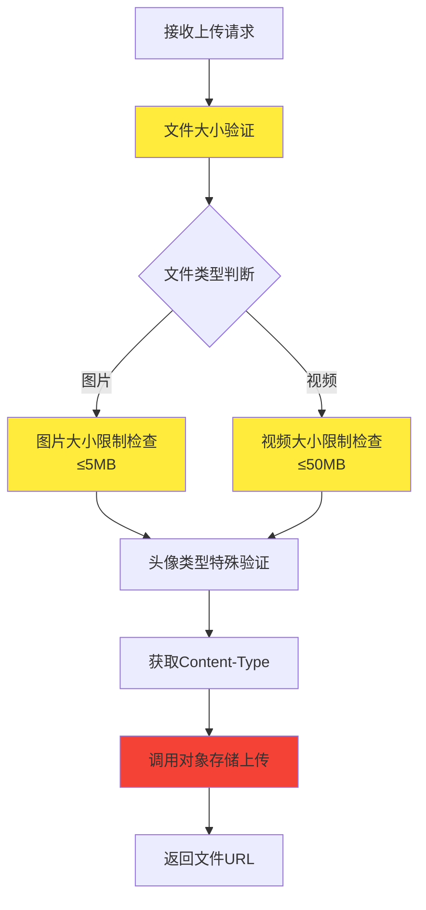
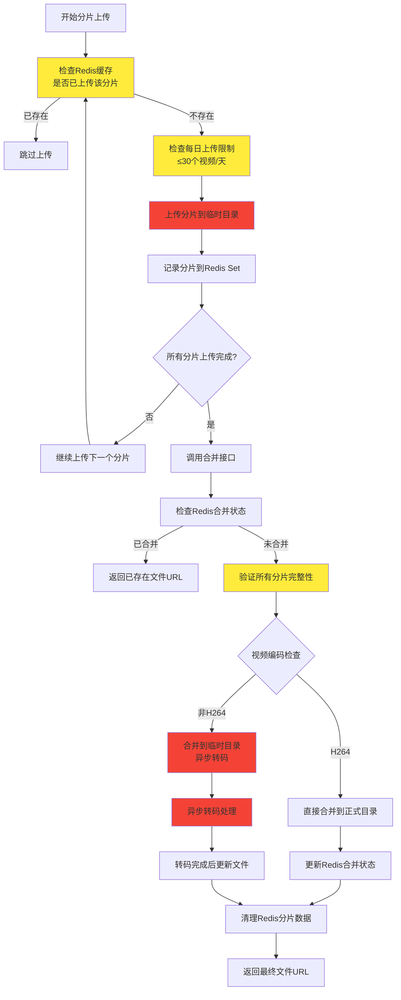
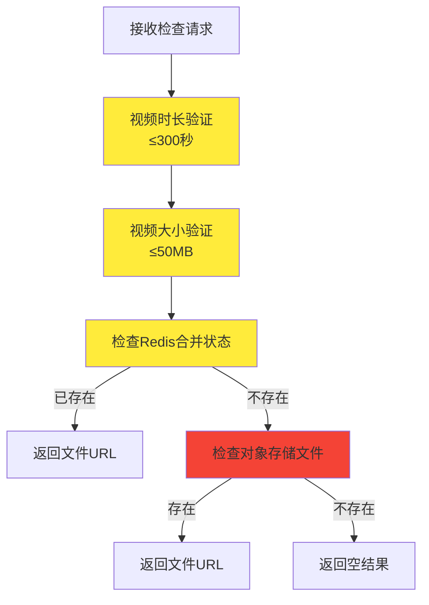

# 社区文件上传逻辑分析报告

## 概述

本文档详细分析了社区文件上传系统的逻辑流程，包括普通文件上传和分片上传两种方式，并提供了性能优化建议。

## 上传方式

系统支持两种上传方式：

1. **普通文件上传** (`/uploadFile`) - 适用于小文件（图片、小视频）
2. **分片上传** (`/uploadPart` + `/completeMultipartUpload`) - 适用于大视频文件

## 详细流程分析

### 1. 普通文件上传流程

#### 1.1 接口入口
- **接口**: `POST /v1/api/community/article/uploadFile`
- **参数**: `MultipartFile file`, `BusinessFileTypeEnum businessFileType`
- **返回**: 文件访问URL

#### 1.2 处理步骤



#### 1.3 耗时分析
- **文件大小验证**: ~1-5ms
- **Content-Type处理**: ~1-2ms
- **对象存储上传**: **主要耗时** - 取决于文件大小和网络状况
  - 小图片(1MB): 100-500ms
  - 大图片(5MB): 500-2000ms
  - 视频(50MB): 5-30秒

### 2. 分片上传流程

#### 2.1 分片上传接口
- **接口**: `POST /v1/api/community/article/uploadPart`
- **参数**: `MultipartFile file`, `String uploadId`, `Integer partNumber`

#### 2.2 合并上传接口
- **接口**: `POST /v1/api/community/article/completeMultipartUpload`
- **参数**: `AggCompleteMultipartFileDTO` (包含uploadId, totalPartCount, videoCodec)

#### 2.3 完整分片上传流程



#### 2.4 分片上传耗时分析

| 操作 | 耗时 | 说明 |
|------|------|------|
| Redis缓存检查 | 1-5ms | 检查分片是否已上传 |
| 每日限制检查 | 2-10ms | Redis计数器查询 |
| 单分片上传 | 100-2000ms | 取决于分片大小和网络 |
| Redis记录分片 | 1-3ms | Set操作 |
| 分片完整性验证 | 5-20ms | Redis Set大小检查 |
| 文件合并 | **主要耗时** | 取决于总文件大小 |
| 视频转码 | **最耗时** | 异步处理，不阻塞响应 |

### 3. 文件去重检查流程

#### 3.1 接口
- **接口**: `POST /v1/api/community/article/checkIstUpload`
- **参数**: `AggCheckIstUploadDTO` (uploadId, businessFileType, videoDuration, videoSize)

#### 3.2 检查流程



## 性能瓶颈分析

### 1. 主要耗时操作

1. **对象存储上传** (最耗时)
   - 网络I/O是主要瓶颈
   - 大文件上传时间与文件大小成正比

2. **视频转码** (异步，但资源消耗大)
   - FFmpeg转码CPU密集
   - 大视频转码可能需要几分钟

3. **文件合并**
   - 需要读取所有分片
   - 大文件合并耗时较长

### 2. Redis操作耗时

| 操作类型 | 平均耗时 | 说明 |
|----------|----------|------|
| Set成员检查 | 1-3ms | 检查分片是否已上传 |
| Set添加操作 | 1-3ms | 记录分片上传状态 |
| Value获取 | 1-2ms | 检查合并状态 |
| Value设置 | 1-2ms | 更新合并状态 |

### 3. 网络传输耗时

| 文件大小 | 上传耗时(估算) | 影响因素 |
|----------|----------------|----------|
| 1MB | 100-500ms | 网络带宽、延迟 |
| 10MB | 1-5秒 | 网络稳定性 |
| 50MB | 5-30秒 | 网络质量、服务器负载 |

## 优化建议

### 1. 短期优化 (立即可实施)

#### 1.1 Redis优化
```java
// 使用Pipeline批量操作减少网络往返
List<Object> results = redisTemplate.executePipelined((RedisCallback<Object>) connection -> {
    for (Integer partNumber : partNumbers) {
        connection.sIsMember(RedisKey.COMMUNITY_FILE_PART.getBytes(), partNumber.toString().getBytes());
    }
    return null;
});
```

#### 1.2 并发上传优化
```java
// 使用线程池并发上传分片
@Async("uploadTaskExecutor")
public CompletableFuture<Void> uploadPartAsync(MultipartFile file, String uploadId, Integer partNumber) {
    // 异步上传逻辑
}
```

#### 1.3 缓存预热
```java
// 预检查文件是否存在，避免重复上传
public boolean preCheckFileExists(String uploadId) {
    String fileName = ARTICLE_PATH + uploadId + MP4_EXTENSION;
    return objectStorageHelper.checkFile(bucketName, fileName);
}
```

### 2. 中期优化 (需要架构调整)

#### 2.1 分片大小优化
- **当前**: 固定分片大小
- **建议**: 动态分片大小
  - 小文件(<10MB): 1MB分片
  - 中等文件(10-100MB): 5MB分片  
  - 大文件(>100MB): 10MB分片

#### 2.2 断点续传优化
```java
// 记录上传进度，支持断点续传
public class UploadProgress {
    private String uploadId;
    private Set<Integer> completedParts;
    private Set<Integer> failedParts;
    private long lastUpdateTime;
}
```

#### 2.3 压缩优化
```java
// 上传前压缩图片
public MultipartFile compressImage(MultipartFile file) {
    if (isImage(file) && file.getSize() > 1024 * 1024) { // >1MB
        return imageCompressionService.compress(file);
    }
    return file;
}
```

### 3. 长期优化 (需要重大架构调整)

#### 3.1 CDN加速
- 使用CDN节点就近上传
- 减少网络延迟和带宽消耗

#### 3.2 分布式转码
```java
// 使用消息队列分发转码任务
@Component
public class VideoTranscodeProducer {
    @Autowired
    private RabbitTemplate rabbitTemplate;
    
    public void sendTranscodeTask(String uploadId, String videoCodec) {
        TranscodeTask task = new TranscodeTask(uploadId, videoCodec);
        rabbitTemplate.convertAndSend("transcode.queue", task);
    }
}
```

#### 3.3 智能存储策略
- 热文件存储到SSD
- 冷文件存储到普通硬盘
- 根据访问频率自动迁移

### 4. 监控和告警

#### 4.1 性能监控
```java
@Component
public class UploadMetrics {
    private final MeterRegistry meterRegistry;
    
    public void recordUploadTime(String fileType, long duration) {
        Timer.Sample sample = Timer.start(meterRegistry);
        sample.stop(Timer.builder("upload.duration")
            .tag("file.type", fileType)
            .register(meterRegistry));
    }
}
```

#### 4.2 异常告警
- 上传失败率超过5%时告警
- 转码失败率超过10%时告警
- 平均上传时间超过阈值时告警

## 总结

当前上传系统已经具备了基本的分片上传、去重检查、异步转码等功能，但在性能优化方面还有很大提升空间。建议优先实施短期优化措施，然后逐步推进中期和长期优化，以提升用户体验和系统性能。

### 关键优化点优先级

1. **高优先级**: Redis Pipeline优化、并发上传
2. **中优先级**: 分片大小优化、压缩优化  
3. **低优先级**: CDN加速、分布式转码

通过系统性的优化，预计可以将上传性能提升30-50%，用户体验得到显著改善。
